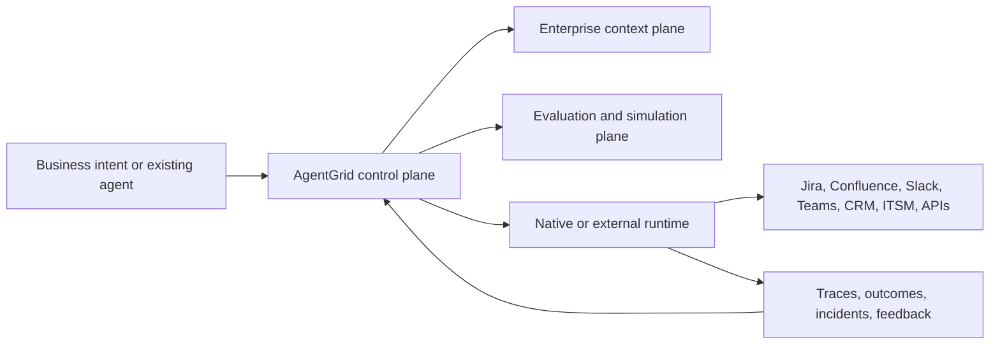

# AgentGrid End-to-End Product Operating Model

**Purpose:** Define exactly where AgentGrid starts, where it ends, how agents enter the system, how business and developer workflows meet, how integrations and knowledge work, and how the product should be implemented one vertical workflow at a time.

## 1. Product boundary

AgentGrid is a **control plane and engineering lifecycle for enterprise agents built anywhere**.

It is responsible for:

- Agent and agent-service registration
- Business intent, requirements, ownership, and outcome contracts
- Portable specifications and version lineage
- Knowledge, tool, action, model, policy, and runtime bindings
- Test data, scenarios, evaluation suites, and release evidence
- Release decisions and rollout policies
- Cross-runtime observability and incident learning
- Agent catalog, business portfolio, governance, and value measurement

It does not need to own every runtime, enterprise search index, source system, or workflow engine.



## 2. Where the system starts and ends

### Start path A — business intent

The user has a business problem, repeatable process, unmet outcome, or proposed automation.

```text
Describe intent
  → establish outcome and users
  → model workflow and authority
  → select or generate an agent design
  → connect context and actions
  → implement
  → test
  → release
```

### Start path B — existing agent

The organization already has an agent built in code or on another platform.

```text
Register repository/runtime/platform agent
  → discover components and dependencies
  → confirm purpose, owner, users, and outcome
  → classify data and action authority
  → establish baseline tests from traces
  → certify and add to catalog
```

### End of one delivery cycle

A cycle ends when a version is released or deliberately rejected with recorded evidence. The product lifecycle does not truly end until the agent is retired and its authority, integrations, and data retention are closed.

```text
Release → observe → learn → change → retest → release ... → retire
```

## 3. Canonical hierarchy

The product must show this hierarchy everywhere it matters:

```text
Organization
  └── Business domain
      └── Capability
          └── Process / journey
              └── Agent-enabled service
                  ├── Agent(s)
                  ├── Deterministic workflow components
                  ├── Human decisions
                  ├── Knowledge and data contracts
                  ├── Tools and action contracts
                  └── Implementation(s)
                      ├── Repository / package / manifest
                      ├── Runtime and framework
                      ├── Version and environment
                      └── Deployment and endpoint
```

Definitions:

- **Agent catalog:** concrete agents and agent-enabled services available to build, run, reuse, or govern.
- **Portfolio:** roll-up of those services by business capability, outcomes, investment, duplication, dependency, and risk.
- **Architecture map:** dependencies among a selected service, its components, knowledge, models, tools, runtimes, and related services.
- **Repository map:** implementation lineage for a selected agent or component; it is not the same as the portfolio architecture map.

## 4. Corrected global information architecture

The destinations below are stable orientation anchors, not a menu-led product structure. Work should continue through selected objects and causal transitions. `AGENTGRID_EXPERIENCE_STRATEGY.md` is the authority for how these contexts behave.

Use the original, understandable four destinations:

| Global destination | Primary user question | Default representation |
|---|---|---|
| **Home** | What requires my attention, and where do I continue? | Work queue, recent agents, create/import entry |
| **Agents** | Which agents exist, what do they do, and how do I enter one? | Searchable catalog with lifecycle and trust state |
| **Operations** | What is happening in production? | Outcomes, incidents, failure clusters, cost, reliability |
| **Control** | Which agents are risky, unowned, uncertified, or over-authorized? | Exceptions, approvals, controls, certifications, audit |

Inside **Agents**, expose lenses without making them global menus:

- Catalog — default
- Business portfolio
- Architecture and dependencies
- Lifecycle and ownership
- Risk and authority

Opening an agent enters the contextual Agent Workspace:

```text
Overview → Define → Build → Test → Release → Improve
```

These are lifecycle modes, not separate CRUD applications.

## 5. Entry-point contract for each major use case

| Use case | Primary entry | Secondary entry | Completion state |
|---|---|---|---|
| Create agent from intent | Home “Create agent” | Agents catalog, opportunity recommendation | Draft specification with owner and outcome |
| Import existing agent | Agents “Import” | Developer API/CLI, detected runtime | Registered implementation and baseline dossier |
| Discover agent | Agents catalog | Global search, Home recent work | Agent overview or run session |
| Run an agent | Catalog card/detail | Slack, Teams, embed, API, business application | User-visible result and recorded run |
| Refine requirements | Agent → Define | Assigned clarification | Versioned specification with acceptance criteria |
| Configure behavior | Agent → Build | Failure-to-component link | Executable or externally bound design version |
| Connect knowledge/actions | Contextual “Add” in Build | Admin-approved integration catalog | Permission-checked binding contract |
| Test a draft | Agent → Test | Build preview, CI link | Evidence linked to version and requirement |
| Review/release | Home assignment | Agent → Release, Control exception | Recorded decision and rollout state |
| Investigate incident | Operations, alert, Home | Agent → Improve | Root cause, mitigation, regression coverage |
| Govern estate | Control exceptions | Agent overview, Catalog risk lens | Reassign/restrict/certify/pause/retire decision |

## 6. Create-from-intent workflow

### 6.1 Opening experience

The create modal offers three paths:

1. **Describe with AI** — recommended for business and implementation users
2. **Use a template** — approved patterns and evaluation packs
3. **Import existing agent** — repository, endpoint, framework, or external platform

### 6.2 Definition chat

The chat is a guided requirements conversation, not an empty prompt box. The left side contains the conversation; the right side shows the live structured specification and gaps.

The Definition Agent asks only what is material:

- What outcome should change?
- Who invokes or benefits from the service?
- What event or request starts it?
- What evidence or company knowledge is needed?
- What decisions must be made?
- What systems may it read or change?
- What must remain human-controlled?
- What does success mean and what must never happen?
- Who owns the business result, technical behavior, and risk?

The generated Agent Service Specification includes:

- Mission and business outcome contract
- Intended users, channels, cohorts, and jurisdictions
- Trigger and input contract
- Expected outputs and completion state
- Candidate workflow and agent responsibilities
- Knowledge and data needs
- Tools and action authority
- Human checkpoints and exception paths
- Functional, quality, safety, cost, latency, and operational requirements
- Ownership and decision rights
- Initial test strategy and missing decisions

The user reviews and accepts structured changes. Chat never silently makes an authority or data-access decision.

## 7. Platform-native assistive agents

These agents help build and operate the platform. They are separate from customer agents being registered.

| Native assistive agent | Responsibility | Inputs | Output | Human control |
|---|---|---|---|---|
| **Definition Agent** | Convert intent into a structured service and requirement specification | Conversation, template, source documents | Draft specification and unresolved questions | User accepts each material contract |
| **Architecture Agent** | Propose workflow, agent boundaries, deterministic steps, and human decisions | Approved specification, reference patterns | Blueprint proposal and alternatives | Technical owner selects architecture |
| **Integration Scout** | Match knowledge needs and actions to approved connectors, APIs, MCP tools, and owners | Data/tool needs, integration catalog | Binding options, permission/freshness gaps | Admin/data/tool owners authorize connections |
| **Test Designer** | Generate coverage from requirements, risks, cohorts, and traces | Requirements, blueprint, incidents | Scenario proposals, evaluators, test-data needs | Domain/test owners approve golden expectations |
| **Release Evidence Agent** | Assemble a candidate’s material change, evidence, risks, and rollout options | Version diff, evaluation runs, approvals | Release case | Release authority decides |
| **Operations Triage Agent** | Cluster failures and propose impacted components or cohorts | Traces, SLOs, feedback, dependencies | Failure cluster and investigation candidates | Operator confirms incident and mitigation |
| **Governance Agent** | Map specifications and changes to policy/control obligations | Data, authority, jurisdiction, risks | Applicable controls, required reviewers | Control owners decide policy and exceptions |

These agents should be transparent: every proposal shows source, confidence, affected contract, and required human decision.

## 8. Agent Workspace

### Overview

- Purpose, users, owner, lifecycle, active version, runtime, and environment
- Outcome and SLO summary
- Trust/evidence state
- Knowledge and action authority summary
- Open changes, incidents, reviews, and next action

### Define

- Definition chat
- Structured requirements and outcome contract
- Business process and user-journey context
- Decision-right assignments
- Acceptance criteria and unresolved questions
- Jira/Confluence requirement synchronization

### Build

- Visual blueprint: triggers, steps, branches, loops, agents, humans, recovery
- Instructions, model, memory, input/output schema
- Knowledge and retrieval contracts
- Tools, actions, identities, approvals, retries, compensation
- Native implementation or external-runtime binding
- Component inspector and version diff

### Test

- Playground/chat or form trigger
- Test identity, cohort, environment, and data
- Source/tool/policy/trace inspection
- Saved scenario and dataset management
- Evaluation suite runs and version comparison
- Security, permission, red-team, cost, latency, and resilience results
- Failure-to-Build navigation

### Release

- Human-readable change summary
- Materiality and affected-contract analysis
- Requirement and risk coverage
- New permissions/authority
- Approval assignments
- Sandbox/shadow/canary/production rollout
- Thresholds, pause, rollback, and restoration rules

### Improve

- Outcome and task success
- Adoption and user feedback
- Cost, latency, reliability, and authority usage
- Knowledge gaps and dependency drift
- Failure clusters and traces
- Create regression scenario, propose fix, or open new version

## 9. Agent catalog design

The catalog default is not a grid of decorative cards. It is a useful inventory with clear continuations.

### Required catalog fields

- Agent/service name and purpose
- Business capability and process
- Consumer/channel
- Owner and owning team
- Native/imported/external implementation type
- Runtime/framework and active version
- Lifecycle and deployment state
- Trust/certification state
- Data sensitivity and action authority
- Health, adoption, task success, and cost
- Last change and next required review

### Catalog views

- **Available to me:** launchable agents, favorites, recommended agents
- **My work:** owned, drafted, reviewing, or recently used agents
- **Organization:** permission-aware estate inventory
- **Templates:** approved starting designs and evaluation packs
- **External agents:** imported and observed agents by platform/runtime

### Catalog actions

- Run
- Open workspace
- Create from template
- Import
- Request access
- Compare duplicates
- View evidence
- Pause or retire when authorized

## 10. Developer portal mode

Developer mode is not another global application. It is a technical facet of the Agent Workspace and an API/documentation surface.

### Registration and import

- Repository URL, branch, package, code owner, and deployment pipeline
- Runtime endpoint and environment
- Framework adapter or instrumentation package
- Agent manifest and version fingerprint
- Model, instructions, tools, schemas, and policy bindings
- Trace correlation and business-process identifiers

### Developer interfaces

- REST/GraphQL management APIs
- SDKs for Python, TypeScript, Java, and Go over time
- CLI for login, manifest validation, register, test, evaluate, and release proposal
- OpenTelemetry trace ingestion
- Webhooks for version, deployment, incident, and evaluation events
- MCP/OpenAPI action registration
- A2A agent-card import/export
- CI examples for GitHub Actions, GitLab CI, Jenkins, and Azure DevOps

### Repository contract

An `agentgrid.yaml` manifest should capture portable metadata without forcing runtime ownership:

```yaml
apiVersion: agentgrid.io/v1
kind: AgentService
metadata:
  key: customer-escalation
  owner: customer-operations-ai
spec:
  purpose: Resolve eligible customer escalations
  runtime:
    framework: external
    endpointRef: customer-escalation-prod
  requirementsRef: requirements/customer-escalation.yaml
  toolsRef: tools/customer-actions.yaml
  evaluationsRef: evals/customer-escalation.yaml
  telemetry:
    protocol: opentelemetry
```

The control plane calculates a version fingerprint from instructions, models, policies, knowledge bindings, tool versions, runtime, and environment.

## 11. Knowledge and context architecture

### Connectors versus actions

- **Connector:** continuously indexes or synchronizes searchable content, identity, permissions, metadata, freshness, and lineage.
- **Action:** performs a live read or write against an application/API during execution.

One application may provide both. Confluence can be an indexed knowledge source and also expose create/update-page actions.

### Knowledge binding contract

Every agent knowledge binding records:

- Source and datasource instance
- Allowed object types and scope
- Retrieval purpose
- Identity and permission resolution
- Jurisdiction and residency
- Freshness and effective-date policy
- Authority/verification state
- Citation requirement
- Conflict and missing-evidence behavior
- Quality/SLO owner
- Snapshot or live-query semantics

### Knowledge lifecycle

```text
Connect → crawl/synchronize → permission map → classify → verify
  → bind to agent purpose → test retrieval → monitor freshness/conflict
  → re-evaluate affected agents after material source change
```

AgentGrid should initially integrate with an existing enterprise search/context provider or a small number of sources. Rebuilding Glean’s connector and knowledge-graph footprint is not the initial wedge.

## 12. Integration model

| Integration | Context use | Action use | Product lifecycle use |
|---|---|---|---|
| Jira | Requirements, issues, incidents, release epics | Create/update issue, comment, transition | Sync acceptance criteria, test failures, release and incident work |
| Confluence | Policies, procedures, architecture, product documentation | Create/update evidence or release page | Requirements and authoritative knowledge |
| Slack | Messages and channel context when permitted | Trigger agent, notify, request approval, post result | Adoption, review, incident, and run channel |
| Microsoft Teams | Meetings/chats/files through Microsoft graph and permissions | Run agent, notify, approve, post result | Enterprise execution channel |
| GitHub/GitLab | Repositories, code, PRs, ownership | Open PR/issue, comment, status check | Import, version lineage, CI evaluation gates |
| ServiceNow | Knowledge, incidents, requests, configuration | Read/write records and workflow actions | IT/business workflow execution and incident correlation |
| Salesforce/Zendesk | Customer/account/case context | Update cases, tasks, comments, records | Customer-service and sales agent execution |
| SharePoint/Drive | Enterprise documents and permissions | Create/update files where authorized | Knowledge and generated deliverables |
| Okta/Entra | Users, groups, service identities | Authentication and delegated execution | SSO, ownership, permission simulation, audit identity |
| Snowflake/Databricks | Structured metrics and semantic models | Governed queries | Outcome, evaluation, cost, and business-value evidence |
| Datadog/Splunk/Sentry | Logs, traces, incidents, alerts | Create/annotate incident | Production observability and failure learning |
| OpenAPI/MCP | Custom tool description and invocation | Read/write enterprise APIs | Extensible action and tool ecosystem |

### Authentication modes

- Delegated user OAuth for interactive actions
- Service identity for approved background agents
- Per-run human confirmation for consequential writes
- Admin-enabled action pack plus agent-level allowlist
- Test/sandbox credential isolation
- Full audit of invoking user, runtime identity, tool identity, and target resource

## 13. Test data model

CSV can be an import/export format, but it cannot be the long-term test architecture.

### Test case contract

```text
Test case
  ├── scenario and requirement IDs
  ├── risk and business cohort
  ├── input and conversation turns
  ├── invoking identity and permissions
  ├── environment and integration fixtures
  ├── knowledge snapshot / effective date
  ├── expected outcome constraints
  ├── expected and forbidden tool trajectory
  ├── expected citations / evidence
  ├── deterministic assertions
  ├── rubric and model-based evaluators
  ├── owner, reviewer, provenance, sensitivity
  └── validity window and maintenance trigger
```

### Test-data sources

- Domain-expert authored golden scenarios
- Sanitized or tokenized production traces
- Synthetic boundary and rare-cohort scenarios
- Red-team and prompt-injection generators
- Connector/API contract fixtures
- Policy and permission matrices
- Historical incidents and user feedback
- Shadow-production samples

### Environments

- Local/deterministic component tests
- Integration sandbox
- Full end-to-end test tenant
- Production shadow
- Canary/controlled cohort
- Production continuous evaluation

No test may write to a production system unless the test explicitly targets a controlled production experiment with approved authority.

## 14. Test strategy

| Layer | What it proves | Example |
|---|---|---|
| 1. Schema and deterministic contracts | Inputs, outputs, policies, branch conditions, idempotency | Effective date is required before policy ranking |
| 2. Knowledge/retrieval | Correct source, permission, freshness, citation, conflict handling | Canadian policy outranks global policy |
| 3. Component quality | Classification, extraction, reasoning, response constraints | Resolution recommendation meets rubric |
| 4. Tool/action contract | Correct tool, arguments, authorization, retry, compensation | Credit action cannot run without current approval |
| 5. Orchestration trajectory | Correct sequence, branching, sub-agent handoff, stopping | Retrieve → decide policy → recommend → approve → execute |
| 6. End-to-end business scenario | Task completion and outcome constraints | Eligible case resolved without unauthorized action |
| 7. Security/adversarial | Prompt injection, exfiltration, privilege, unsafe action | Case content cannot override policy/tool allowlists |
| 8. Nonfunctional | Latency, load, resilience, cost, availability | P95 recommendation latency under threshold |
| 9. Shadow/canary | Real distribution and dependency behavior | 10% Canadian specialist cohort |
| 10. Continuous production evaluation | Drift, regressions, new failure modes | Sampled policy accuracy and human modification |

### Evaluation method

Use an evaluator ensemble:

- Deterministic assertions wherever possible
- Domain-expert labels for authoritative business behavior
- Model-based judges only for calibrated qualitative dimensions
- Human review for high-risk or disputed evidence
- Statistical confidence and cohort minimums for release claims

### Change-based test selection

Material-change analysis selects required suites:

- Instruction/model change → quality, safety, cost, regression suites
- Knowledge binding or freshness change → retrieval, permissions, conflict cohorts
- Tool/action change → contract, authority, trajectory, compensation, sandbox tests
- Workflow change → branch, handoff, end-to-end, resilience tests
- Consumer/jurisdiction change → cohort and policy coverage
- Runtime/infrastructure change → performance, reliability, trace-integrity tests

### Maintenance

- Every production incident proposes one or more regression scenarios.
- Every requirement or policy change identifies affected cases.
- Every knowledge-source change checks freshness and expected citations.
- Dataset owners review stale expectations on a defined cadence.
- Duplicate, low-value, and flaky tests are identified rather than silently ignored.
- Golden data changes require domain review and version history.

## 15. Workflow-by-workflow implementation plan

### Increment 0 — Registry and lifecycle foundation

**Goal:** Establish actual agent identities before more dashboards.

Build:

- Agent service, agent component, implementation, version, environment, deployment, owner, runtime, requirement, and binding records
- Lifecycle and trust states
- Persistent database
- Audit events and stable IDs
- Migration of the customer-escalation fixture

Acceptance:

- Customer Escalation appears as a registered service with one explicit agent component and one external/native implementation.
- Every current assurance, run, incident, and control record resolves to that implementation/version.

### Increment 1 — Agents catalog and clear entry

**Goal:** Answer “Which agents exist and where do I start?”

Build:

- Restore global `Agents` destination
- Catalog search, ownership, lifecycle, runtime, trust, and business context
- `Create agent` and `Import agent` entry points
- Agent Overview
- Portfolio and architecture as secondary lenses

Acceptance:

- A first-time user can find Customer Escalation, understand what it does, who owns it, how it runs, and enter the appropriate lifecycle stage without explanation.

### Increment 2 — Definition and import vertical slice

**Goal:** Make an agent enter the system through the product.

Build:

- Definition chat plus live structured specification
- Template selection
- Repository/endpoint/manifest import
- Ownership, outcome, consumers, trigger, authority, and success criteria
- Jira/Confluence requirement linking
- Draft persistence and version lineage

Acceptance:

- A user can recreate the Customer Escalation dossier from intent or import rather than editing JSON.

### Increment 3 — Build and integration vertical slice

**Goal:** Convert the specification into an executable or bound architecture.

Build:

- Editable blueprint with contextual inspector
- Knowledge binding for Confluence/policy documents
- Jira/case read action and controlled case/credit write actions
- Model/instruction/memory configuration
- Human approval and failure/recovery contracts
- Integration Scout recommendations

Acceptance:

- The Canadian policy-selection component is configured through the UI, including authoritative-source precedence and write authority.

### Increment 4 — Test workbench and data lifecycle

**Goal:** Generate assurance evidence rather than displaying static evidence.

Build:

- Playground with chat/form trigger
- Identity, cohort, environment, and data selection
- Trace/source/tool/policy inspector
- Save run as test
- Dataset and scenario editor/import
- Evaluation suite runner and version comparison
- Initial deterministic, retrieval, trajectory, permission, quality, cost, and latency evaluators
- CI endpoint/CLI

Acceptance:

- The Canadian effective-date conflict can be run, inspected, saved, rerun against v1.8 and v1.9, and reflected in requirement coverage.

### Increment 5 — Release and assurance convergence

**Goal:** Turn test evidence into an accountable release decision.

Build:

- Material-change diff
- Impacted requirement and test selection
- Evidence completeness and counter-evidence
- Approval routing
- Sandbox/shadow/canary rollout adapter
- Pause/rollback rules

Acceptance:

- v1.9 cannot enter the Canadian canary until the domain-reviewed cohort passes and accountable approvals exist.

### Increment 6 — Runtime integration and closed-loop operations

**Goal:** Populate the existing Live/Operations/Incident experiences with real telemetry.

Build:

- OpenTelemetry/runtime adapter
- Run, span, model, retrieval, tool, policy, and outcome events
- Failure clustering
- Incident integration
- Production trace replay in sandbox
- Regression proposal linking to Test

Acceptance:

- A real or simulated production failure traverses Operations → Incident → Trace → Regression Test → Build correction → Evaluation.

### Increment 7 — Enterprise control and portfolio intelligence

**Goal:** Scale from one service to an estate.

Build:

- Agent discovery across external platforms
- Ownership, duplication, lifecycle, certification, and authority exceptions
- Policy and control authoring
- Restrict, pause, recertify, retire
- Business outcome, cost, adoption, and reuse portfolio lenses
- Audit exports and evidence packages

Acceptance:

- An enterprise owner can identify an unowned, duplicated, high-authority, underperforming agent and complete the corrective workflow in context.

## 16. Immediate experience sequence for the next prototype iteration

Do not implement a procession of traditional screens. Design and validate the missing golden path as connected experience episodes:

1. **Resume or begin work** — understand why the user arrived and preserve a Work Thread.
2. **Frame intent or adopt an existing agent** — conversation materializes a Living Specification and unresolved decisions.
3. **Compose the service** — the specification becomes an inspectable service narrative of agents, rules, knowledge, actions, humans, and outcomes.
4. **Bind context and authority** — sources and actions are inserted as governed contracts in the component where they are needed.
5. **Rehearse behavior** — conversation/task, execution journey, and evidence remain synchronized.
6. **Establish fitness and bound release** — comparison and evidence become an accountable scoped decision.
7. **Understand live outcome and learn** — production behavior resolves into failure, contract, regression, and correction without breaking causality.
8. **Govern estate exceptions** — cross-agent portfolio representations appear only when an enterprise decision requires them.

The first design increment is **Intent → Trusted Draft**, not a Catalog page. Agent discovery remains necessary, but it should be designed as part of beginning, resuming, reusing, and adopting work—not as an isolated inventory UI.

## 17. Product completion test

The revised prototype is coherent only if a user can complete this uninterrupted journey:

> Start with “reduce support escalation time without unauthorized credits,” create or import the Customer Escalation agent service, configure the Canadian policy source and Jira/case actions, define the human approval boundary, author and run the Canadian effective-date test cohort, review the generated release case, release v1.9 to a controlled cohort, observe the outcome, investigate a failure, and turn that failure into a passing regression test for the next version.

If a screen does not help this journey or a cross-agent control decision, it should not be built yet.
