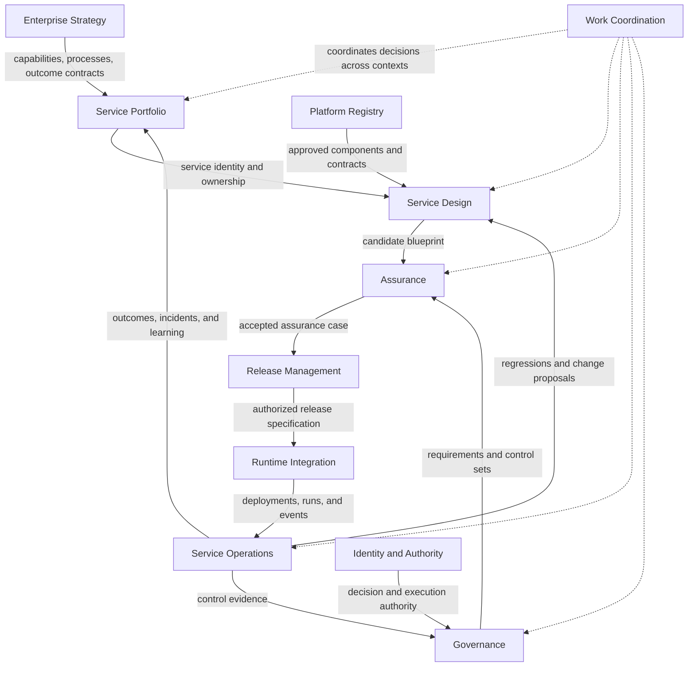
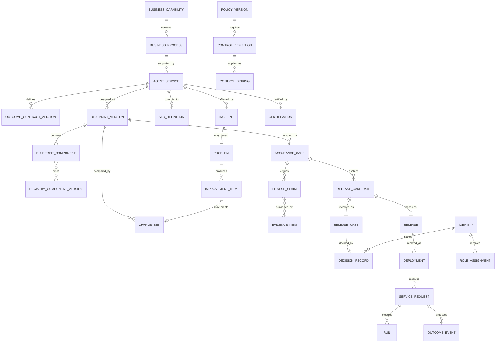
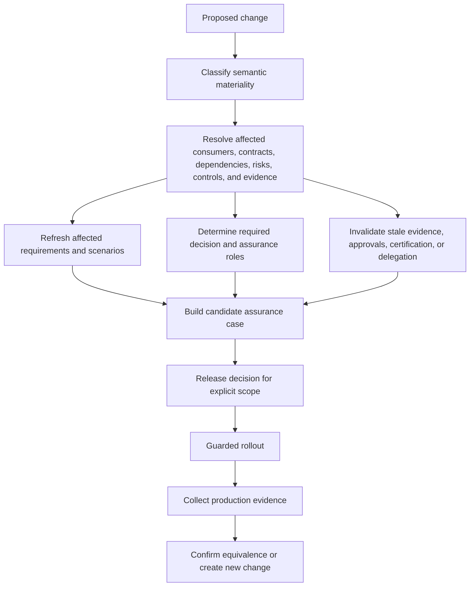

# AgentGrid Canonical Domain Model

**Status:** Foundational enterprise architecture artifact
**Purpose:** Define the bounded contexts, ubiquitous language, aggregates, entities, relationships, invariants, events, ownership, and traceability required by the AgentGrid product.

---

## 1. Modeling position

AgentGrid is not fundamentally an agent-record database. It is an enterprise system of record and control plane for agent-enabled business services.

The model therefore begins with business intent and ends with production evidence:

```text
Business intent
→ Agent-enabled service
→ Versioned service blueprint
→ Assurance case
→ Release decision
→ Deployment and execution
→ Business outcome and operational evidence
→ Improvement or governance action
```

Agents, prompts, models, tools, data sources, tests, deployments, and traces are important components, but none is independently the product's central object.

---

## 2. Modeling principles

1. **Business context precedes technical configuration.**
2. **Stable service identity is separate from changing implementation versions.**
3. **Intent, architecture, evidence, and production state are independently versioned.**
4. **Every consequential relationship has an owner, scope, and effective period.**
5. **Decisions reference immutable evidence snapshots.**
6. **Runtime observations never silently mutate design intent.**
7. **Material changes explicitly invalidate affected assurance and approvals.**
8. **Lifecycle, health, risk, evidence, and control are separate dimensions.**
9. **Cross-context views are composed for use cases; aggregate boundaries are not navigation boundaries.**
10. **External agents and platforms are represented as first-class services and components.**
11. **Append-only records are used for decisions, actions, evidence, and audit lineage.**
12. **Deletion is rare; retirement, revocation, expiration, and supersession preserve history.**

---

## 3. Bounded-context map



### Context responsibility

| Context | Owns | Does not own |
|---|---|---|
| Enterprise Strategy | Business domains, capabilities, processes, strategic objectives | Technical service design |
| Service Portfolio | Agent-enabled service identity, mission, portfolio placement, outcome accountability, ownership | Component implementation details |
| Service Design | Versioned blueprints, component relationships, contracts, failure paths | Production deployment state |
| Platform Registry | Reusable models, tools, data products, runtimes, patterns, evaluator definitions | Service-specific use decisions |
| Assurance | Requirements, risks, scenarios, evidence, fitness claims, waivers within a candidate case | Organizational risk policy |
| Governance | Policies, control objectives, control sets, exceptions, certification rules | Individual test execution |
| Identity and Authority | Identities, roles, delegations, decision rights, authority envelopes | Business service ownership |
| Release Management | Release candidates, release decisions, rollout policies, environment promotion | Runtime execution telemetry |
| Runtime Integration | External deployment references, execution correlation, runtime adapters | Business outcome interpretation |
| Service Operations | SLO observations, outcome events, incidents, problems, mitigations, improvements | Design intent |
| Work Coordination | Responsibility queues, assignments, handoffs, due states | Source-of-truth domain decisions |

---

## 4. Ubiquitous language

### Agent-enabled business service

A stable enterprise service that uses one or more agents, deterministic components, people, data products, models, and tools to produce a defined business outcome for identified consumers.

### Service dossier

The current human-readable contract of the service: mission, business context, consumers, ownership, outcome contract, scope, risk envelope, and current lifecycle state.

### Service blueprint

A versioned architecture describing how a service receives demand, uses context, reasons, invokes actions, involves people, handles failure, and emits outcomes.

### Blueprint component

A typed part of the service architecture such as trigger, validation, agent, deterministic rule, context lookup, tool action, human decision, output, or recovery step.

### Component binding

The service-specific use of a registry component, including configuration, scope, version constraint, owner approval, and effective period.

### Outcome contract

A versioned definition of intended business results, baselines, targets, attribution, observation windows, counter-metrics, and accountable ownership.

### Authority envelope

The bounded conditions under which a service or identity may perform an action, based on operation, consequence, population, geography, confidence, evidence, environment, certification, time, and incident state.

### Requirement

A testable statement the service or change must satisfy.

### Risk

A defined uncertainty that could cause business, customer, operational, security, privacy, compliance, or architectural harm.

### Control

A preventive, detective, or responsive mechanism designed to reduce a defined risk or satisfy a policy objective.

### Assurance case

The versioned argument and evidence that a specific candidate is fit to operate within a defined scope.

### Fitness claim

A precise assertion within an assurance case, linked to requirements, risks, evidence, and residual uncertainty.

### Evidence item

An immutable result, review, trace sample, evaluation, test, attestation, or operational observation used to support or challenge a fitness claim.

### Release candidate

A fully resolved candidate blueprint and component set proposed for a defined deployment and consumer scope.

### Release case

The decision context combining candidate, assurance, governance, operational readiness, rollout policy, and accountable participants.

### Release decision

An immutable accountable judgment authorizing, constraining, rejecting, or requesting changes to a release case.

### Deployment

A runtime-specific realization of an authorized release in an environment.

### Service request

One invocation of an agent-enabled service, correlated to a business-process instance and runtime execution.

### Run

A runtime execution of one or more blueprint components for a service request.

### Outcome event

An observation about business or service result, with attribution and observation window.

### Incident

A coordinated response to service behavior causing or threatening material impact.

### Problem

An enduring root cause, systemic weakness, or recurring failure requiring correction beyond incident restoration.

### Improvement item

A traceable proposal to modify design, evidence, control, operations, or contract based on production learning.

### Decision record

An immutable statement of who decided what, under which authority, based on which evidence, for what scope, with what conditions and expiration.

---

## 5. Enterprise Strategy context

### BusinessDomain aggregate

**Root:** `BusinessDomain`

Represents a stable area of organizational responsibility such as Customer Operations, Finance, People, or Technology.

**Fields:**

- `domainId`
- `name`
- `description`
- `executiveOwnerIdentityId`
- `status`
- `effectivePeriod`

**Contains:** references to business capabilities.

### BusinessCapability aggregate

**Root:** `BusinessCapability`

Represents what the organization must be able to do independent of current organization or technology.

**Fields:**

- `capabilityId`
- `domainId`
- `name`
- `description`
- `criticality`
- `capabilityOwnerIdentityId`
- `maturityTarget`
- `effectivePeriod`

### BusinessProcess aggregate

**Root:** `BusinessProcess`

Represents an end-to-end operational process or customer journey.

**Fields:**

- `processId`
- `capabilityId`
- `name`
- `purpose`
- `processOwnerIdentityId`
- `consumerSegments`
- `jurisdictions`
- `criticality`
- `upstreamProcessIds`
- `downstreamProcessIds`

### StrategicObjective aggregate

**Root:** `StrategicObjective`

Represents a time-bound enterprise objective and its accepted measures.

**Fields:**

- `objectiveId`
- `ownerIdentityId`
- `statement`
- `measurementRefs`
- `startAt`
- `targetAt`
- `status`

---

## 6. Service Portfolio context

### AgentService aggregate

**Root:** `AgentService`

The stable identity of an agent-enabled business service.

**Identity:** `serviceId` never changes across versions, releases, deployments, or ownership transfers.

**Fields:**

- `serviceId`
- `serviceKey`
- `name`
- `mission`
- `capabilityId`
- `processId`
- `serviceBoundary`
- `nonGoals`
- `consumerSegments`
- `channels`
- `jurisdictions`
- `criticality`
- `lifecycleState`
- `businessOwnerIdentityId`
- `technicalOwnerIdentityId`
- `riskOwnerIdentityId`
- `operatingTeamId`
- `currentOutcomeContractVersionId`
- `currentBaselineBlueprintVersionId`
- `currentProductionReleaseId`
- `riskProfileId`
- `certificationRefs`
- `reviewSchedule`

**Invariants:**

- Exactly one accountable business owner is active.
- Exactly one accountable technical owner is active.
- A released service references a current outcome contract and baselined blueprint.
- Lifecycle retirement does not delete historical releases, decisions, or outcomes.
- Consumer and jurisdiction expansion is material.

### OutcomeContract aggregate

**Root:** `OutcomeContractVersion`

**Fields:**

- `outcomeContractVersionId`
- `serviceId`
- `version`
- `status`
- `effectivePeriod`
- `approvedByDecisionRecordId`
- `measures[]`
- `attributionMethod`
- `observationWindows[]`
- `counterMetrics[]`
- `ownerIdentityId`

### OutcomeMeasure value object

- `measureKey`
- `name`
- `definition`
- `unit`
- `baselineReference`
- `target`
- `direction`
- `eligibilityPopulation`
- `dataSourceRefs`
- `observationWindow`
- `counterMetricRefs`

### ServiceOwnership aggregate

Ownership is temporal and role-specific.

**Fields:**

- `ownershipId`
- `serviceId`
- `roleType`
- `identityId`
- `effectiveFrom`
- `effectiveTo`
- `assignmentDecisionRecordId`
- `delegationId`

---

## 7. Service Design context

### BlueprintVersion aggregate

**Root:** `BlueprintVersion`

**Fields:**

- `blueprintVersionId`
- `serviceId`
- `version`
- `status`
- `basedOnBlueprintVersionId`
- `createdByIdentityId`
- `createdAt`
- `missionSnapshot`
- `outcomeContractVersionId`
- `componentIds[]`
- `relationshipIds[]`
- `failureModeIds[]`
- `changeSetId`
- `contentHash`

**Invariants:**

- Baselined versions are immutable.
- Every component is reachable from at least one trigger or declared reusable subflow.
- Every consequential action has an authority envelope and failure path.
- Every human decision identifies a decision-right requirement.
- Every output traces to a service request and outcome or downstream event.
- Referenced registry components resolve to an exact version or approved version range.

### BlueprintComponent entity

**Component types:**

- `trigger`
- `input_contract`
- `validation`
- `agent`
- `deterministic_rule`
- `context_lookup`
- `model_call`
- `tool_action`
- `human_decision`
- `output_contract`
- `outcome_emitter`
- `exception_route`
- `compensation`
- `subservice_call`

**Fields:**

- `componentId`
- `blueprintVersionId`
- `componentType`
- `name`
- `purpose`
- `ownerIdentityId`
- `inputContractRefs[]`
- `outputContractRefs[]`
- `registryBindingRefs[]`
- `policyBindingRefs[]`
- `authorityEnvelopeRef`
- `SLOContribution`
- `failureBehavior`
- `configurationRef`

### ComponentRelationship entity

**Relationship types:**

- `invokes`
- `precedes`
- `branches_to`
- `retrieves_from`
- `writes_to`
- `requires_decision_from`
- `emits`
- `compensates`
- `depends_on`
- `constrains`

**Fields:**

- `relationshipId`
- `fromComponentId`
- `toComponentId`
- `relationshipType`
- `condition`
- `contractRef`
- `ownerIdentityId`

### ChangeSet aggregate

Represents a semantically classified difference between two baselines.

**Fields:**

- `changeSetId`
- `serviceId`
- `baseBlueprintVersionId`
- `candidateBlueprintVersionId`
- `changes[]`
- `materialityClassification`
- `affectedRequirementIds[]`
- `affectedRiskIds[]`
- `affectedControlIds[]`
- `affectedConsumerSegments[]`
- `affectedJurisdictions[]`
- `affectedRegistryComponentIds[]`
- `requiredParticipantRoles[]`

### FailureMode entity

- `failureModeId`
- `blueprintVersionId`
- `componentId`
- `condition`
- `effect`
- `detectability`
- `businessImpact`
- `immediateBehavior`
- `recoveryPathComponentId`
- `riskId`
- `requirementIds[]`

---

## 8. Platform Registry context

### RegistryComponent aggregate

One abstraction with typed variants:

- Model
- Model gateway
- Agent runtime
- Data product
- Knowledge source
- Tool
- Action
- Evaluator
- Prompt or instruction pattern
- Blueprint pattern
- Policy pack
- Evaluation pack
- Human-decision service

**Fields:**

- `registryComponentId`
- `componentType`
- `name`
- `description`
- `ownerIdentityId`
- `provider`
- `classification`
- `lifecycleState`
- `approvedUseScopes[]`
- `versionIds[]`
- `dependencyIds[]`
- `deprecationPolicy`

### RegistryComponentVersion entity

- `registryComponentVersionId`
- `registryComponentId`
- `version`
- `contract`
- `capabilities`
- `limits`
- `dataHandling`
- `regions`
- `securityAttestations[]`
- `effectivePeriod`
- `status`
- `successorVersionId`

### ComponentBinding aggregate

Represents a service's governed use of a registry component.

- `bindingId`
- `serviceId`
- `blueprintVersionId`
- `componentId`
- `registryComponentVersionId`
- `configurationSnapshot`
- `approvedScope`
- `ownerDecisionRecordIds[]`
- `policyBindingIds[]`

---

## 9. Governance context

### Policy aggregate

**Root:** `PolicyVersion`

- `policyVersionId`
- `policyId`
- `name`
- `statement`
- `ownerIdentityId`
- `scopeExpression`
- `effectivePeriod`
- `status`
- `controlObjectiveIds[]`
- `exceptionRules`

### ControlObjective aggregate

- `controlObjectiveId`
- `policyVersionId`
- `statement`
- `riskIds[]`
- `requiredEvidenceTypes[]`
- `ownerIdentityId`

### ControlDefinition aggregate

- `controlId`
- `controlObjectiveId`
- `type`: preventive, detective, responsive
- `mechanism`
- `scopeExpression`
- `implementationRefs[]`
- `testDefinitionRefs[]`
- `evidenceProducerRefs[]`
- `failureResponse`
- `ownerIdentityId`

### ControlBinding entity

Applies a control to a service, component, environment, population, data product, action, or lifecycle transition.

- `controlBindingId`
- `controlId`
- `subjectType`
- `subjectId`
- `scope`
- `effectivePeriod`
- `configurationSnapshot`

### Exception aggregate

- `exceptionId`
- `policyVersionId`
- `controlId`
- `subjectRefs[]`
- `rationale`
- `riskAssessmentId`
- `compensatingControlIds[]`
- `decisionRecordId`
- `effectivePeriod`
- `monitoringRequirement`
- `exitPlan`
- `state`

### Certification aggregate

- `certificationId`
- `serviceId`
- `scope`
- `riskTier`
- `assuranceCaseId`
- `decisionRecordId`
- `effectivePeriod`
- `invalidationRules[]`
- `state`

---

## 10. Identity and Authority context

### Identity aggregate

Supports people, teams, service identities, and external principals.

- `identityId`
- `identityType`
- `displayName`
- `organizationUnit`
- `externalProviderRef`
- `status`
- `attributes`

### RoleDefinition aggregate

- `roleDefinitionId`
- `name`
- `decisionTypes[]`
- `capabilityRequirements[]`
- `incompatibleRoleIds[]`
- `delegationRules`

### RoleAssignment aggregate

- `roleAssignmentId`
- `identityId`
- `roleDefinitionId`
- `scope`
- `effectivePeriod`
- `assignmentDecisionRecordId`

### Delegation aggregate

- `delegationId`
- `delegatorIdentityId`
- `delegateIdentityId`
- `decisionType`
- `scope`
- `authorityLimit`
- `conditions[]`
- `effectivePeriod`
- `furtherDelegationAllowed`
- `revocationRules`
- `decisionRecordId`

### AuthorityEnvelope aggregate

- `authorityEnvelopeId`
- `subjectType`: service, identity, role, component
- `subjectId`
- `actionContractId`
- `operation`
- `consequenceLimits`
- `populationScope`
- `jurisdictions`
- `evidenceConditions`
- `confidenceConditions`
- `environmentScope`
- `certificationConditions`
- `incidentRestrictions`
- `effectivePeriod`
- `decisionRecordId`

### DecisionRecord aggregate

- `decisionRecordId`
- `decisionType`
- `decisionOwnerIdentityId`
- `authorityBasisRefs[]`
- `subjectRefs[]`
- `scope`
- `evidenceSnapshotId`
- `participantRecords[]`
- `decision`
- `conditions[]`
- `rationale`
- `effectivePeriod`
- `invalidationRules[]`
- `resultingTransitionRef`
- `recordedAt`

**Invariant:** decision records are immutable; corrections append a superseding record.

---

## 11. Assurance context

### AssuranceCase aggregate

**Root:** `AssuranceCase`

- `assuranceCaseId`
- `serviceId`
- `candidateBlueprintVersionId`
- `changeSetId`
- `proposedScope`
- `state`
- `fitnessClaimIds[]`
- `requirementIds[]`
- `riskAssessmentId`
- `scenarioSuiteIds[]`
- `evidenceItemIds[]`
- `waiverIds[]`
- `residualRiskSummary`
- `requiredParticipantRoles[]`
- `evidenceSnapshotId`
- `validityConditions[]`

### FitnessClaim entity

- `fitnessClaimId`
- `assuranceCaseId`
- `statement`
- `scope`
- `requirementIds[]`
- `riskIds[]`
- `evidenceItemIds[]`
- `counterEvidenceItemIds[]`
- `state`

### Requirement aggregate

- `requirementId`
- `serviceId`
- `category`
- `statement`
- `source`
- `scope`
- `acceptanceDefinition`
- `ownerIdentityId`
- `criticality`

### RiskAssessment aggregate

- `riskAssessmentId`
- `serviceId`
- `candidateBlueprintVersionId`
- `riskItems[]`
- `overallClassification`
- `assessmentOwnerIdentityId`
- `reviewedAt`

### RiskItem entity

- `riskId`
- `category`
- `scenario`
- `cause`
- `consequence`
- `affectedSubjects[]`
- `likelihoodBand`
- `impactBand`
- `controlIds[]`
- `residualRisk`
- `ownerIdentityId`

### ScenarioSuite aggregate

- `scenarioSuiteId`
- `serviceId`
- `name`
- `purpose`
- `cohortDimensions[]`
- `scenarioIds[]`
- `requirementCoverage[]`
- `riskCoverage[]`
- `ownerIdentityId`

### EvidenceItem aggregate

- `evidenceItemId`
- `evidenceType`
- `producer`
- `subjectVersionRefs[]`
- `scenarioRefs[]`
- `requirementRefs[]`
- `riskRefs[]`
- `controlRefs[]`
- `result`
- `measurement`
- `confidence`
- `reviewerIdentityIds[]`
- `createdAt`
- `contentHash`
- `retentionClass`

### EvidenceSnapshot aggregate

An immutable manifest of exact evidence used for a decision.

- `evidenceSnapshotId`
- `assuranceCaseId`
- `evidenceItemRefs[]`
- `subjectVersionRefs[]`
- `createdAt`
- `contentHash`

---

## 12. Release Management context

### ReleaseCandidate aggregate

- `releaseCandidateId`
- `serviceId`
- `candidateBlueprintVersionId`
- `assuranceCaseId`
- `targetEnvironmentId`
- `proposedConsumerScope`
- `rolloutPolicyId`
- `operationalReadinessRef`
- `state`

### ReleaseCase aggregate

- `releaseCaseId`
- `releaseCandidateId`
- `changeSetId`
- `assuranceCaseId`
- `governanceAssessmentRefs[]`
- `operationalReadinessRef`
- `requiredDecisionRoles[]`
- `participantDecisionRefs[]`
- `finalDecisionRecordId`
- `state`

### RolloutPolicy aggregate

- `rolloutPolicyId`
- `stages[]`
- `entryConditions[]`
- `continueConditions[]`
- `pauseConditions[]`
- `rollbackConditions[]`
- `observationWindows[]`
- `authorizedMitigations[]`

### Release aggregate

- `releaseId`
- `serviceId`
- `releaseCandidateId`
- `decisionRecordId`
- `releaseVersion`
- `authorizedScope`
- `effectiveAt`
- `supersedesReleaseId`
- `state`

---

## 13. Runtime Integration context

### Environment aggregate

- `environmentId`
- `name`
- `environmentType`
- `region`
- `dataResidency`
- `runtimeProviderRefs[]`
- `policyBindingIds[]`
- `ownerIdentityId`

### Deployment aggregate

- `deploymentId`
- `serviceId`
- `releaseId`
- `environmentId`
- `runtimeProviderRef`
- `externalDeploymentRef`
- `consumerScope`
- `configurationSnapshotRef`
- `startedAt`
- `endedAt`
- `operatingState`
- `healthState`

### ServiceRequest aggregate

- `serviceRequestId`
- `serviceId`
- `releaseId`
- `deploymentId`
- `businessProcessInstanceRef`
- `invokingIdentityRef`
- `consumerSegment`
- `jurisdiction`
- `receivedAt`
- `eligibilityResult`
- `currentState`
- `runIds[]`
- `decisionRecordIds[]`
- `actionReceiptIds[]`
- `outcomeEventIds[]`

### Run aggregate

- `runId`
- `serviceRequestId`
- `deploymentId`
- `releaseId`
- `startedAt`
- `endedAt`
- `status`
- `traceRef`
- `costMeasurement`
- `componentExecutionRefs[]`
- `policyDecisionRefs[]`
- `errorRefs[]`

### ActionReceipt aggregate

- `actionReceiptId`
- `serviceRequestId`
- `runId`
- `componentId`
- `actionContractId`
- `authorityEnvelopeId`
- `approvalDecisionRecordId`
- `idempotencyKey`
- `beforeStateRef`
- `afterStateRef`
- `externalReceiptRef`
- `status`
- `compensationRef`

---

## 14. Service Operations context

### SLODefinition aggregate

- `sloDefinitionId`
- `serviceId`
- `name`
- `serviceLevelIndicator`
- `eligibilityPopulation`
- `objective`
- `window`
- `errorBudgetPolicy`
- `ownerIdentityId`

### SLOObservation aggregate

- `sloObservationId`
- `sloDefinitionId`
- `window`
- `measurement`
- `budgetState`
- `cohortBreakdownRefs[]`
- `sourceRefs[]`

### OutcomeEvent aggregate

- `outcomeEventId`
- `serviceId`
- `serviceRequestId`
- `outcomeMeasureKey`
- `observedAt`
- `observationWindow`
- `value`
- `eligibility`
- `attribution`
- `cohortDimensions`
- `sourceRefs[]`

### OperationalEvent aggregate

- `operationalEventId`
- `serviceId`
- `eventType`
- `severity`
- `subjectRefs[]`
- `detectedAt`
- `measurement`
- `policyOrSLORef`
- `correlationRefs[]`

### Incident aggregate

- `incidentId`
- `serviceIds[]`
- `state`
- `severity`
- `commanderIdentityId`
- `businessImpactAssessmentId`
- `affectedConsumers`
- `affectedCapabilities[]`
- `timelineEventIds[]`
- `relatedReleaseIds[]`
- `relatedDependencyIds[]`
- `mitigationIds[]`
- `problemId`
- `restorationDecisionRecordId`

### Problem aggregate

- `problemId`
- `serviceIds[]`
- `statement`
- `rootCauses[]`
- `contributingFactors[]`
- `knownError`
- `workaround`
- `improvementItemIds[]`
- `ownerIdentityId`
- `state`

### ImprovementItem aggregate

- `improvementItemId`
- `serviceId`
- `sourceType`: incident, run, outcome, feedback, control, architecture
- `sourceRefs[]`
- `statement`
- `proposedChangeType`
- `targetContext`
- `ownerIdentityId`
- `priorityBasis`
- `state`
- `resultingChangeSetId`
- `regressionEvidenceRefs[]`

---

## 15. Work Coordination context

### WorkItem aggregate

Work items are projections of domain responsibilities, not the source of truth for decisions.

- `workItemId`
- `workType`
- `subjectRefs[]`
- `responsibleIdentityId`
- `responsibleRole`
- `reasonForResponsibility`
- `triggerEventRef`
- `businessConsequence`
- `requiredDecisionType`
- `requiredEvidenceRefs[]`
- `missingEvidenceRefs[]`
- `dueAt`
- `priorityFactors`
- `state`
- `continuationRef`

### HandoffRecord entity

- `handoffId`
- `workItemId`
- `fromIdentityId`
- `toIdentityId`
- `stateSnapshotRef`
- `decisionRefs[]`
- `openQuestions[]`
- `conditions[]`
- `dueAt`
- `recordedAt`

---

## 16. Cross-context relationship model



---

## 17. Cardinality and ownership rules

| Relationship | Rule |
|---|---|
| Capability to process | A capability contains many processes; a process has one primary capability and may reference supporting capabilities |
| Process to service | A process may use many services; a service has one primary process and may contribute to additional processes |
| Service to outcome contract | Many versions; exactly one current approved version for a released service |
| Service to blueprint | Many versions; zero or one current baseline; multiple drafts may exist |
| Blueprint to component | Component exists within one blueprint version; registry component is reused through bindings |
| Candidate to assurance case | One candidate has one primary assurance case per proposed scope; evidence may be reused by reference |
| Assurance case to evidence | Many evidence items; each item can support multiple claims but remains immutable |
| Release case to decision | One final accountable decision; multiple participant decisions and assurances may precede it |
| Release to deployment | One authorized release may have many deployments across environments or regions |
| Service request to release | Exactly one resolved release at request receipt; later evidence preserves that reference |
| Service request to outcome | Zero to many outcome events across observation windows |
| Incident to service | Many-to-many; one service is designated primary when needed |
| Control to subject | Many-to-many through temporal control bindings |
| Identity to decision | One accountable decision owner; multiple participants |

---

## 18. Global invariants

### Traceability invariants

- Every production run resolves to service, release, blueprint, deployment, and environment.
- Every consequential action resolves to authority envelope, executing identity, and approval or standing delegation.
- Every release resolves to an assurance case and immutable release decision.
- Every outcome event resolves to a service request and attribution method.
- Every waiver resolves to policy, risk owner, scope, expiration, and compensating control.

### Lifecycle invariants

- A candidate cannot release without an accepted assurance case for the proposed scope.
- A deployment cannot expand beyond the release's authorized scope.
- Material change creates or updates a change set and invalidates affected evidence or certification as defined.
- A retired service cannot receive new production releases.
- A paused service may retain data and evidence but cannot accept disallowed demand.

### Authority invariants

- High-consequence decisions have one accountable decision owner.
- Incompatible role combinations are rejected before decision completion.
- Expired or invalidated decisions cannot authorize action.
- Emergency authority is time-bound and creates retrospective obligations.
- An agent cannot be the accountable decision owner for organizational risk acceptance.

### Evidence invariants

- Evidence items are immutable and content-addressed.
- Aggregate scores retain the underlying scenario and cohort results.
- Counter-evidence remains visible in the assurance case.
- A release decision references an exact evidence snapshot.
- Production observations do not retroactively alter prior evidence snapshots.

### Data invariants

- Sensitive trace content follows retention and viewer entitlements.
- Policy interpretation references an immutable policy version.
- Registry bindings resolve exact versions used by a release.
- Data and action contracts are versioned independently of the blueprint.

---

## 19. Temporal and versioning model

### Stable identity versus version

Stable identity objects:

- AgentService
- BusinessCapability
- BusinessProcess
- RegistryComponent
- Policy
- ControlDefinition
- SLODefinition

Versioned objects:

- OutcomeContractVersion
- BlueprintVersion
- RegistryComponentVersion
- PolicyVersion
- AssuranceCase evidence snapshot
- ReleaseCandidate
- Release

Event or observation objects:

- ServiceRequest
- Run
- ActionReceipt
- OutcomeEvent
- SLOObservation
- OperationalEvent
- DecisionRecord

### Effective time

Objects with governance or contract meaning carry:

- Recorded time
- Effective-from time
- Effective-to time
- Superseding reference

This supports questions such as:

- Which policy was effective when the decision was made?
- Which release served this request?
- Which authority envelope applied when the action executed?
- Which ownership assignment was active during the incident?

---

## 20. Material-change propagation



### Material-change rules

| Change | Propagation |
|---|---|
| Outcome contract | Business-owner decision; requirements, SLOs, and attribution reassessed |
| Consumer or jurisdiction | Eligibility, privacy, policy, cohort evidence, and authority reassessed |
| Model version | Behavior, cost, latency, safety, and provider controls reassessed based on equivalence policy |
| Data product | Permission, quality, freshness, lineage, privacy, and retrieval evidence reassessed |
| Tool/action | Contract, authority, failure, compensation, security, and operational readiness reassessed |
| Authority expansion | Risk assessment, controls, separation of duties, certification, and release decision refreshed |
| Runtime/region | Security, residency, reliability, operations, and deployment evidence refreshed |
| Policy/control | Affected services and releases identified; certification may become constrained or invalid |
| Dependency deprecation | Portfolio impact, migration obligations, assurance reuse, and release planning triggered |

---

## 21. Domain event catalog

### Strategy and portfolio events

- `BusinessCapabilityCreated`
- `BusinessProcessChanged`
- `AgentServiceProposed`
- `AgentServiceOwnershipAssigned`
- `OutcomeContractApproved`
- `ServiceLifecycleChanged`
- `ServiceRetired`

### Design events

- `BlueprintDraftCreated`
- `BlueprintComponentBound`
- `BlueprintCandidateBaselined`
- `ChangeSetClassified`
- `MaterialChangeDetected`
- `FailureModeAdded`

### Registry events

- `RegistryComponentApproved`
- `RegistryComponentVersionReleased`
- `RegistryComponentDeprecated`
- `RegistryContractChanged`

### Assurance and governance events

- `AssuranceCaseOpened`
- `EvidenceRecorded`
- `FitnessClaimChallenged`
- `EvidenceGapDetected`
- `WaiverGranted`
- `WaiverExpired`
- `CertificationGranted`
- `CertificationInvalidated`
- `ControlFailed`

### Release events

- `ReleaseCaseSubmitted`
- `ReleaseDecisionRecorded`
- `RolloutStarted`
- `RolloutPaused`
- `ReleaseRolledBack`
- `ReleaseExpanded`

### Runtime and operations events

- `ServiceRequestReceived`
- `ServiceRequestTransferred`
- `ActionProposed`
- `HumanDecisionRequested`
- `ActionExecuted`
- `ActionCompensationStarted`
- `OutcomeObserved`
- `SLOBudgetBurned`
- `IncidentDeclared`
- `ServiceConstrained`
- `ServiceRestored`
- `ProblemIdentified`
- `ImprovementProposed`
- `RegressionEvidenceCreated`

### Work events

- `WorkItemAssigned`
- `EvidenceRequested`
- `DecisionDueSoon`
- `WorkHandedOff`
- `DecisionCompleted`

---

## 22. Projection model for portal workspaces

The portal reads projections assembled from multiple contexts.

### Mission Control projection

Combines:

- WorkItem
- AgentService dossier summary
- Decision rights
- Required and missing evidence
- Business consequence
- Deadline and priority factors
- Continuation route

### Portfolio projection

Combines:

- Capability and process hierarchy
- AgentService identity and ownership
- Outcome performance
- Lifecycle and certification
- Architecture dependencies
- Cost and risk exposure

### Service Studio Blueprint projection

Combines:

- Service dossier
- Outcome contract
- Blueprint version and change set
- Registry bindings
- Data/action contracts
- Authority envelopes
- Failure modes and applied controls

### Service Studio Assurance projection

Combines:

- Candidate and change impact
- Requirements, risks, and controls
- Scenario coverage
- Evidence and counter-evidence
- Waivers and residual risk
- Participant and release readiness

### Service Studio Live projection

Combines:

- Current release and deployments
- Outcome and SLO observations
- Demand and eligibility funnel
- Dependency state
- Incidents, problems, and improvements
- Trace and action evidence

### Governance projection

Combines:

- Policy and control hierarchy
- Control bindings and evidence
- Authority exposure
- Exceptions and certification
- Decision lineage
- Affected services and dependencies

---

## 23. Identifier strategy

Use opaque, stable identifiers and separate human-readable keys.

Examples:

- `svc_...` — agent-enabled service
- `bpr_...` — blueprint version
- `cmp_...` — blueprint component
- `reg_...` — registry component
- `asc_...` — assurance case
- `evi_...` — evidence item
- `rlc_...` — release case
- `rel_...` — release
- `dep_...` — deployment
- `srq_...` — service request
- `run_...` — run
- `inc_...` — incident
- `dec_...` — decision record
- `ctl_...` — control
- `exc_...` — exception

Human-readable keys such as `customer-escalation` may change only through explicit rename behavior and do not serve as cross-system immutable identity.

---

## 24. Multi-tenancy and security boundaries

### Organization boundary

All enterprise-owned aggregates are scoped to an organization.

### Workspace or domain boundary

Workspaces may partition visibility and operational ownership but cannot silently duplicate shared registry identity.

### Access enforcement

Access is evaluated using:

- Identity and role
- Organization and workspace
- Business domain
- Service responsibility
- Data classification
- Environment
- Decision type
- Trace-content sensitivity
- Purpose of use

### Cross-tenant rule

No evidence, trace content, registry configuration, or decision record crosses organization boundaries without an explicit, separately governed exchange contract.

---

## 25. What is intentionally not an aggregate root

The following are not automatically independent roots:

- Prompt
- Chat conversation
- Dashboard card
- Status badge
- Connector installation
- Evaluation score
- Trace span
- Approval-row item
- Workflow node

They belong to a service, blueprint, assurance case, deployment, run, decision, or registry component. Promoting them to roots without a real lifecycle creates CRUD-oriented product architecture.

---

## 26. Domain-model validation questions

1. Can every production action be traced to service, release, blueprint component, authority, identity, and decision?
2. Can a data or tool owner identify every service affected by a contract change?
3. Can a release reviewer see exactly which evidence became stale after a material change?
4. Can an operator connect an incident to business capability and affected outcome?
5. Can an auditor reproduce the evidence and effective policy behind a decision?
6. Can the organization retire a service without deleting its operating history?
7. Can an imported external agent participate without being rebuilt in AgentGrid?
8. Can one reusable component upgrade without losing service-specific approval scope?
9. Can business owners understand agent contribution without misattributing human work?
10. Can the portal compose complete decision contexts without exposing aggregate boundaries as menus?

The model is ready for implementation planning only when these questions can be answered through explicit relationships and invariants.
