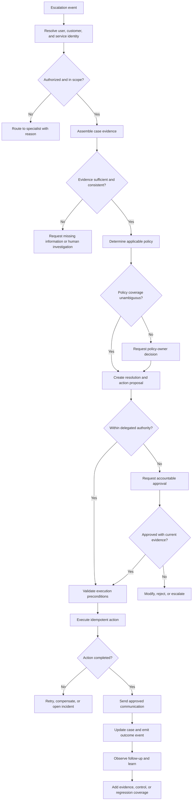
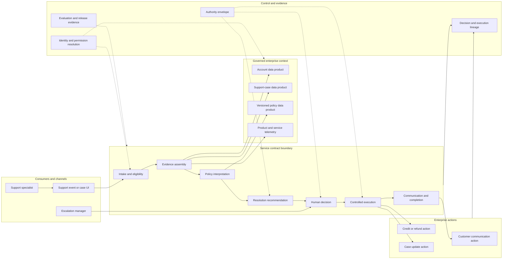
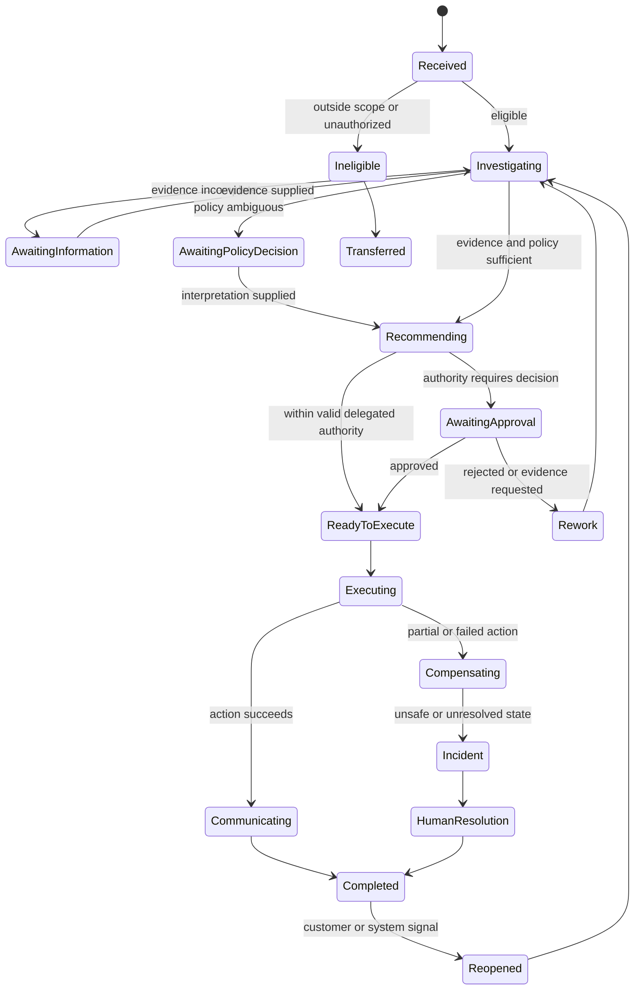

# Customer Escalation Service Blueprint

**Status:** Foundational product-planning artifact
**Service type:** Agent-enabled business service
**Purpose:** Define the operating model, service contract, architecture, controls, evidence, failure paths, and portal contexts for the primary AgentGrid demonstration scenario.

---

## 1. Service definition

### Service mission

> Resolve eligible customer escalations accurately and quickly while protecting customer trust, financial controls, data rights, and appropriate human judgment.

### Business capability

Customer issue resolution and service recovery.

### Supported process

Escalated support-case investigation, resolution recommendation, approval, customer communication, and case completion.

### Intended consumers

- Support specialists
- Escalation managers
- Customer operations leaders
- Finance approvers for credits and refunds
- Customers receiving the resulting communication

### Service boundary

The service may:

- Interpret an eligible support case
- Retrieve authorized account, product, billing, and policy information
- Identify missing evidence
- Recommend a policy-compliant resolution
- Draft customer communication
- Propose a refund or service credit
- Request human approval when required
- Execute explicitly authorized, reversible actions
- Update the support case and emit outcome evidence

### Explicit non-goals

The service may not:

- Make legal determinations
- Alter contractual terms
- Issue credits above delegated policy limits without approval
- Access account data outside the invoking user's entitlement
- Resolve suspected fraud or account compromise autonomously
- Override policy based only on customer sentiment
- Send an unreviewed message when confidence or policy coverage is insufficient
- Delete case, billing, approval, or audit evidence

---

## 2. Outcome contract

The service is accountable for a balanced outcome, not a single productivity metric.

| Dimension | Definition | Baseline | Initial target | Counter-metric or guardrail | Owner |
|---|---|---:|---:|---|---|
| Eligible-case resolution | Eligible escalations resolved without further specialist transfer | To be established | Improve against baseline | Repeat contact within 14 days | Business owner |
| Resolution cycle time | Time from escalation entry to approved resolution | To be established | Reduce against baseline | Do not reduce investigation completeness | Service owner |
| Policy accuracy | Resolutions conforming to applicable policy version and jurisdiction | To be established | ≥ 98% sampled accuracy | No unauthorized exception | Policy owner |
| Customer recovery | Post-resolution satisfaction or recovery signal | To be established | Improve against matched baseline | Complaint and churn signal | Customer operations |
| Financial control | Credits and refunds executed within delegated authority | To be established | 100% control compliance | Approval bypass count must remain zero | Finance control owner |
| Human intervention | Cases requiring specialist or approver handling | To be established | Reduce only for eligible cohorts | High-risk cohorts must retain review | Service owner |
| Cost efficiency | Total operating cost per successfully resolved eligible case | To be established | Improve after quality gates pass | Quality and recovery cannot degrade | Product owner |

### Attribution method

The service must distinguish:

- Agent-recommended outcomes
- Human-modified recommendations
- Human-originated resolutions
- Fully agent-executed actions within delegated authority
- Cases transferred out of scope

Outcome reporting must not attribute all downstream resolution to the agent.

### Observation windows

- Immediate: action success, policy compliance, case completion
- Seven days: reopen, escalation, customer response
- Fourteen days: repeat contact and service recovery
- Quarterly: operational cost, policy exception rate, and cohort fairness

---

## 3. Eligibility and demand model

### Eligible demand

- Product or subscription issue
- Billing error with verified account ownership
- Service disruption with known remediation policy
- Cancellation, renewal, or refund request covered by published policy
- Delivery or fulfillment issue with sufficient order evidence

### Conditionally eligible demand

- Regional policy ambiguity
- Multiple linked accounts
- Enterprise contract variation
- Vulnerable-customer indicator
- High-value customer exception
- Credit request above autonomous authority
- Prior fraud or security flag

These cases may be investigated by the service but require a specified human decision.

### Ineligible demand

- Suspected fraud or identity compromise
- Legal threat or litigation hold
- Safety issue
- Regulatory complaint
- Missing account authorization
- Unsupported jurisdiction
- Policy conflict with no designated authority

The service must route these cases to the appropriate specialist workflow.

---

## 4. End-to-end service journey

| Stage | Customer or channel | Support specialist | Agent-enabled service | Data and systems | Control and evidence |
|---|---|---|---|---|---|
| 1. Escalation entry | Customer issue reaches escalation channel | Confirms case is actionable | Receives escalation event and invoking identity | Support platform provides case and channel metadata | Record trigger, identity, consent, and initial eligibility |
| 2. Contract validation | — | Sees missing prerequisites | Validates scope, required inputs, jurisdiction, and authority | Identity, account, and case systems | Fail closed when authorization or required data is missing |
| 3. Investigation | — | Can inspect gathered facts | Classifies issue and builds evidence set | Account history, product telemetry, billing events, prior cases | Record source lineage, freshness, permission decision, and conflicts |
| 4. Policy interpretation | — | Can challenge applicability | Retrieves applicable policy by product, region, plan, date, and customer context | Governed policy data product | Record policy version, applicability factors, and confidence |
| 5. Resolution proposal | — | Reviews recommendation when required | Produces resolution, rationale, action proposal, and customer draft | Rules, model, and calculation service | Validate amount, reason, reversibility, and delegated authority |
| 6. Human decision | Receives no premature commitment | Approves, modifies, rejects, or escalates | Pauses with complete decision context | Approval service and finance policy | Bind decision to identity, evidence, conditions, and expiration |
| 7. Execution | Receives approved outcome | Monitors consequential action | Executes approved credit/refund and updates case | Billing, CRM, support, messaging | Idempotency, precondition check, compensation path, action receipt |
| 8. Communication | Receives clear response | May edit when policy requires | Sends or drafts evidence-backed explanation | Approved messaging channel | Disclosure, tone, citation, and sensitive-data rules |
| 9. Completion | May respond or reopen | Handles residual exception | Records resolution and outcome event | Support and analytics systems | Complete audit lineage and begin follow-up window |
| 10. Learning | Follow-up behavior becomes outcome evidence | Reviews failures and feedback | Clusters outcomes, failures, and knowledge gaps | Telemetry, feedback, evaluation system | Production evidence becomes improvement and regression coverage |

---

## 5. Service event flow



---

## 6. Service architecture



---

## 7. Component contracts

### 7.1 Intake and eligibility

**Responsibility:** Determine whether the service may handle the escalation and what level of human involvement is required.

**Inputs:**

- Case identifier and version
- Invoking user and channel
- Customer and account identifiers
- Issue category
- Region and jurisdiction
- Existing security, fraud, legal, or vulnerability flags

**Outputs:**

- Eligibility decision
- Required evidence checklist
- Required human roles
- Applicable risk tier
- Explicit routing reason when ineligible

**Controls:**

- Identity resolution
- Permission check
- Purpose-of-use validation
- Required-field validation
- Unsupported-jurisdiction rule
- Specialist-routing rule

### 7.2 Evidence assembly

**Responsibility:** Build the minimum sufficient, current, permission-valid evidence set.

**Inputs:**

- Eligibility result
- Case and customer references
- Evidence requirements for the issue category

**Outputs:**

- Structured evidence set
- Source lineage
- Freshness and quality indicators
- Conflicts and missing evidence
- Retrieval rationale

**Controls:**

- Source allowlist
- Row- and object-level permissions
- Freshness requirements
- Data minimization
- Sensitive-field masking
- Conflict detection

### 7.3 Policy interpretation

**Responsibility:** Identify the authoritative policy applicable to the specific facts.

**Applicability factors:**

- Policy effective date
- Customer region
- Product and plan
- Contract class
- Issue category
- Transaction date
- Prior exception or concession

**Outputs:**

- Applicable policy version
- Relevant rule and remedy range
- Ambiguity or conflict flag
- Interpretation confidence
- Required policy-owner decision

### 7.4 Resolution recommendation

**Responsibility:** Propose an outcome that satisfies policy, customer recovery, and operational constraints.

**Outputs:**

- Proposed resolution
- Rationale linked to evidence
- Proposed action and amount
- Customer communication draft
- Confidence and unresolved uncertainty
- Authority classification
- Human decision requirement

### 7.5 Human decision

**Responsibility:** Obtain accountable judgment when authority, ambiguity, risk, or policy requires it.

**Decision options:**

- Approve as proposed
- Approve with modification
- Reject
- Request evidence
- Escalate to another authority
- Grant a time-bound exception

**Decision record:**

- Decision identity and role
- Evidence snapshot
- Proposed and approved action
- Conditions
- Rationale
- Expiration
- Separation-of-duty validation

### 7.6 Controlled execution

**Responsibility:** Execute only the approved, current, and valid action.

**Preconditions:**

- Case version is current
- Approval is valid and unexpired
- Customer/account state has not materially changed
- Amount and currency match approval
- Action has not already executed
- Downstream tool is healthy enough for safe execution

**Outputs:**

- Action receipt
- Downstream record identifiers
- Before/after state
- Partial-failure details
- Compensation status

### 7.7 Communication and completion

**Responsibility:** Communicate the approved resolution and close or transfer the case with complete evidence.

**Outputs:**

- Approved customer message
- Case update
- Outcome event
- Follow-up observation schedule
- Residual work or exception

---

## 8. Data contracts

| Data product | Minimum fields | Quality and freshness | Permission model | Owner |
|---|---|---|---|---|
| Support case | Case ID, category, narrative, status, assigned team, events, attachments, version | Current at decision time | Invoking specialist or service identity within assigned scope | Support platform owner |
| Customer account | Account ID, product, plan, region, status, verified contact relationship | Current within defined SLA | Attribute- and account-level entitlement | Customer data owner |
| Billing events | Transaction ID, amount, currency, type, timestamp, payment status, correction state | Strong consistency for action decisions | Financial-data entitlement and purpose limitation | Billing data owner |
| Policy | Policy ID, version, jurisdiction, product, effective range, rule, remedy, owner | Published and effective; no expired draft | Broad read for eligible operations; restricted edit | Policy owner |
| Product telemetry | Service event, timestamp, impact, affected plan, region | Fresh enough for incident-related remedies | Operational entitlement | Product operations owner |
| Approval | Decision ID, proposal hash, approver, role, conditions, validity | Immutable after decision | Authorized approvers and auditors | Approval service owner |
| Action receipt | Action ID, idempotency key, before/after, downstream reference, status | Transactional | Service owner, tool owner, audit | Tool owner |
| Outcome event | Service, case, resolution, attribution, timestamps, follow-up state | Complete and append-only | Operations, analytics, audit | Service owner |

### Data invariants

- A policy decision must reference an immutable policy version.
- An executed financial action must reference a valid decision or documented delegated authority.
- A customer communication must reference the approved resolution state.
- Outcome attribution must identify agent, human, and system contribution.
- Trace retention must follow data classification and jurisdiction.

---

## 9. Action and authority contracts

| Action | Default authority | Preconditions | Approval | Reversibility | Failure handling |
|---|---|---|---|---|---|
| Read case | Read | Invoker entitled to case | None | Not applicable | Fail closed and route |
| Read account | Read | Purpose and account entitlement valid | None | Not applicable | Mask unavailable fields |
| Draft response | Recommend | Evidence and policy identified | Specialist review for specified cohorts | Fully editable | Preserve draft and evidence |
| Update internal case note | Limited write | Current case version | None within service boundary | Reversible through append-only correction | Retry with idempotency |
| Send customer message | Consequential write | Approved resolution and channel permission | Required for low-confidence or designated cohorts | Follow-up correction, not true reversal | Prevent send on partial failure |
| Issue service credit | Financial write | Eligible account, approved amount, valid reason | By threshold and cohort | Compensating debit subject to policy | Stop, reconcile, and open incident |
| Issue refund | Financial write | Verified charge, eligible policy, payment state | Finance approval unless explicitly delegated | Payment-system dependent | Reconcile and notify finance |
| Close case | State transition | Communication and actions complete | None when completion contract satisfied | Reopen supported | Keep case open on uncertainty |

### Authority envelope

Authority must be defined by the intersection of:

- Action type
- Amount or business impact
- Customer cohort
- Product or plan
- Jurisdiction
- Confidence
- Evidence completeness
- Runtime environment
- Current service certification
- Incident or degraded-mode status

A single numeric threshold is insufficient.

---

## 10. Decision policy examples

| Condition | Service behavior | Required decision |
|---|---|---|
| Clear policy, complete evidence, draft only | Produce cited draft | Specialist accepts or edits according to team policy |
| Credit ≤ delegated limit, eligible cohort, high confidence | Execute only if service certification permits autonomous action | No additional approval; record delegated-authority basis |
| Credit above delegated limit | Pause with proposal and evidence | Authorized financial approver |
| Policy conflict or unclear jurisdiction | Do not infer a favorable rule | Policy owner or escalation manager |
| Enterprise contract variation | Use contract-specific rule only when authoritative source exists | Account owner when exception is requested |
| Vulnerable-customer indicator | Increase human involvement and communication care | Designated specialist |
| Suspected fraud or security flag | Stop financial and messaging actions | Fraud/security workflow |
| Evidence changed after approval | Invalidate approval | Re-review against new evidence |
| Downstream tool degraded | Do not execute consequential write | Operator mitigation or human completion |
| Service certification expired | Restrict to recommendation mode | Risk owner re-certification |

---

## 11. Service state model



### State invariant

The state must explain why the service is waiting and which role or event can advance it.

---

## 12. Failure-mode and recovery model

| Failure mode | Detection | Immediate behavior | Recovery | Required evidence |
|---|---|---|---|---|
| Identity or entitlement cannot be resolved | Permission resolver failure | Stop access and action | Route to specialist or retry trusted identity service | Permission decision and retry history |
| Required case evidence is missing | Contract validation | Request information; do not guess | Resume when evidence arrives | Missing-field list and source |
| Conflicting policies | Applicability check | Pause recommendation | Policy-owner interpretation | Conflicting versions and factors |
| Stale regional policy retrieved | Freshness and version control | Reject evidence and constrain service | Use authoritative source; add regression case | Source version and affected cohort |
| Model produces unsupported resolution | Evidence-grounding evaluator | Block proposal | Re-run constrained path or human review | Unsupported claim and evaluator result |
| Tool schema changes | Contract validation | Do not call tool | Use compatible version or operator mitigation | Schema diff and affected deployments |
| Approval expires | Preflight check | Prevent execution | Request new approval | Original decision and changed context |
| Duplicate action request | Idempotency check | Return original receipt | Reconcile downstream state | Idempotency key and receipt |
| Partial financial action | Transaction result mismatch | Stop communication and closure | Compensate or open incident | Before/after state and tool response |
| Messaging succeeds but case update fails | Cross-action consistency check | Preserve evidence and retry update | Reconcile case state | Message receipt and retry state |
| Outcome quality degrades by cohort | Production evaluation | Constrain affected cohort | Diagnose data, policy, or model issue | Cohort comparison and release history |
| Cost or latency spikes | Budget and SLO monitoring | Reduce rollout or use fallback | Diagnose dependency or model | Trace and cost breakdown |

---

## 13. Service-level objectives

The following are proposed categories. Numeric targets require baseline measurement and business approval.

### Reliability

- Intake acknowledgment latency
- Investigation completion latency by cohort
- Action execution success
- End-to-end successful resolution
- Availability of recommendation-only degraded mode

### Quality

- Policy accuracy
- Evidence completeness
- Unsupported-claim rate
- Correct human-escalation rate
- Action-trajectory accuracy
- Customer communication acceptance or edit rate

### Control

- Unauthorized action count
- Expired approval use
- Permission leakage
- Policy-version mismatch
- Untraceable decision or action

### Business outcome

- Eligible resolution
- Reopen and repeat-contact rate
- Cycle time
- Customer recovery
- Cost per successful outcome

### Error-budget policy

The service should consume separate budgets for:

- Technical reliability
- Quality regression
- Control violation

A control violation involving unauthorized financial action should not be averaged into a general availability percentage.

---

## 14. Observability and evidence model

### Correlation chain

Every run must link:

```text
Business process instance
→ Service request
→ Service and release version
→ Invoking identity and authority
→ Blueprint component execution
→ Data and policy versions
→ Model and tool calls
→ Human decisions
→ Action receipts
→ Customer communication
→ Outcome event
→ Follow-up evidence
```

### Required operational views

- Outcome and SLO state
- Demand and eligibility funnel
- Human-decision queue and aging
- Authority usage
- Failure modes by component and cohort
- Data and policy freshness
- Tool and dependency health
- Cost per successful outcome
- Change and release correlation
- Regression coverage created from production

### Trace privacy

- Mask sensitive fields by viewer role
- Separate content retention from aggregate telemetry
- Record access to sensitive trace content
- Preserve hashes or references when full content cannot be retained
- Apply jurisdiction and data-retention policy

---

## 15. Assurance model

### Requirement families

- Functional resolution behavior
- Scope and eligibility
- Evidence and grounding
- Policy applicability
- Permission isolation
- Delegated authority
- Human approval
- Action safety and idempotency
- Communication quality
- Reliability and degraded mode
- Cost and latency
- Cohort consistency
- Audit and lineage

### Scenario dimensions

- Issue category
- Product and plan
- Region and jurisdiction
- Customer segment
- Account state
- Transaction type and amount
- Evidence completeness
- Policy clarity
- Confidence
- Tool state
- Approval state
- Prior case history
- Vulnerability, fraud, legal, and security flags

### Evidence types

- Deterministic contract tests
- Tool-trajectory tests
- Retrieval and policy-applicability tests
- Permission-boundary tests
- Human domain review
- Model-based quality evaluation calibrated to human review
- Load and resilience tests
- Red-team and prompt-injection tests
- Production shadow evaluation
- Canary rollout evidence

### Release claim

> Candidate v1.9 improves regional-policy selection and reduces redundant processing without expanding data access or action authority, while maintaining required outcome, quality, reliability, and control thresholds for the proposed support-specialist cohort.

Every phrase in this claim must link to evidence.

---

## 16. Material-change model

A change is material when it affects one or more of:

- Business outcome or supported process
- Consumer population
- Data source or permission model
- Policy interpretation
- Model or orchestration behavior
- Tool or action authority
- Human decision boundary
- Runtime, region, or retention
- SLO or outcome threshold
- External dependency

Material changes determine which evidence and approvals must be refreshed.

---

## 17. Incident example: stale regional policy

### Detection

Two Canadian refund cases are escalated because the retrieved policy article is outdated.

### Business impact

- Affected cohort: Canadian trial-cancellation cases
- Potential consequence: incorrect refund recommendation and customer dissatisfaction
- Financial exposure: limited if action approval remains enforced
- Control exposure: policy-version mismatch

### Immediate mitigation

- Constrain affected cohort to recommendation-only mode
- Require specialist confirmation of regional policy
- Remove stale source version from eligible retrieval

### Diagnosis

- A global article outranked the authoritative regional policy
- Freshness metadata existed but was not part of the ranking contract
- Evaluation coverage included region but not conflicting effective dates

### Corrective change

- Add jurisdiction and effective-date precedence to the policy data contract
- Update retrieval ranking
- Add conflict-detection behavior

### Regression evidence

- Canadian trial cancellation before and after policy effective date
- Conflicting global and regional articles
- Missing regional policy
- Policy version changes after approval

### Release approach

- Shadow evaluation on recent eligible cases
- Domain-owner review
- 10% specialist cohort
- Monitor policy accuracy, cycle time, and human modification
- Expand only after defined evidence window

---

## 18. Portal contexts derived from the service blueprint

These are decision contexts, not proposed screens.

### Mission Control contexts

- Evidence requested from a specialist
- Financial approval required
- Policy-owner interpretation required
- Production incident requires mitigation
- Domain evaluation assigned
- Service ownership or control review due

### Portfolio contexts

- Customer-resolution capability and supported services
- Outcome performance and investment
- Shared dependencies across support services
- Policy data-product concentration
- Financial-action authority exposure

### Blueprint contexts

- Service mission and outcome contract
- Journey and execution architecture
- Component contracts
- Data and action contracts
- Human decision boundaries
- Failure and recovery paths
- Applied controls

### Assurance contexts

- Requirement and risk coverage
- Scenario cohort matrix
- Candidate change impact
- Evaluation evidence and failure analysis
- Waivers and residual risk
- Release case and decision

### Live Service contexts

- Outcome and SLO state
- Deployment and dependency state
- Demand and eligibility funnel
- Human intervention
- Incident and trace investigation
- Improvement and regression coverage

### Governance contexts

- Authority-envelope policy
- Policy-data freshness control
- Permission coverage
- Separation of duties
- Release and certification evidence
- Exceptions and expiring waivers

---

## 19. Product questions exposed by the blueprint

1. Is AgentGrid the runtime for human approvals or an orchestrator of existing approval systems?
2. How are enterprise data products registered and governed?
3. How does the platform express authority beyond simple monetary thresholds?
4. Which trace content can the platform store versus reference?
5. How does a human decision invalidate when underlying evidence changes?
6. How are business outcomes attributed across agent and human work?
7. Which control violations automatically constrain or pause a service?
8. How are multi-system partial failures reconciled?
9. What qualifies an external agent for AgentGrid certification?
10. How does the platform handle policy conflicts across jurisdictions and contracts?

These questions must be resolved at the product-policy and architecture level before detailed UI design.
