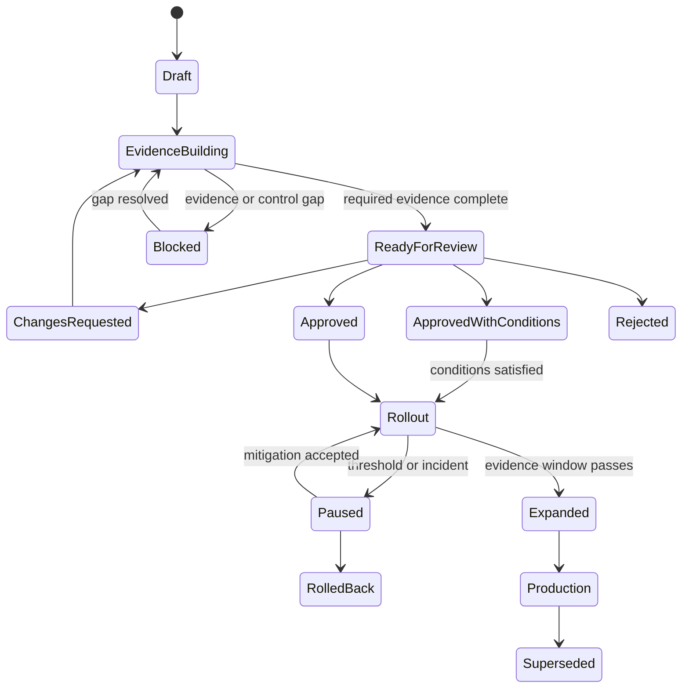
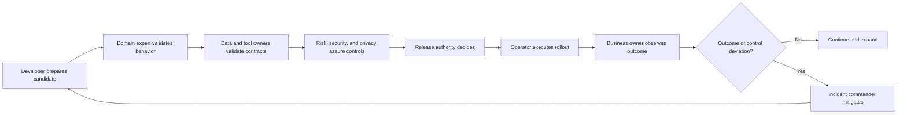

# AgentGrid Decision Rights Model

**Status:** Foundational product-planning artifact
**Purpose:** Define enterprise roles, accountable decisions, execution responsibilities, assurance responsibilities, separation of duties, delegation, escalation, and portal handoffs.

---

## 1. Why decision rights are a product concern

Enterprise agent platforms do not merely manage access to screens. They coordinate decisions that change:

- Business services
- Data access
- Delegated authority
- Production state
- Financial and customer outcomes
- Risk acceptance
- Incident response

Role-based access control alone cannot answer who should decide, what evidence they need, when authority expires, or whether two responsibilities must remain separated.

AgentGrid must model both:

1. **Permission:** What an identity is technically allowed to do.
2. **Decision right:** What an identity is organizationally accountable and competent to decide.

---

## 2. Decision notation

This model uses five participation types.

| Code | Meaning | Responsibility |
|---|---|---|
| **D** | Decision owner | Makes the accountable judgment and accepts the consequence |
| **E** | Executor | Performs the approved work or system action |
| **A** | Assurance | Independently verifies required evidence, controls, or standards |
| **C** | Consulted | Supplies expertise or affected-party input before the decision |
| **I** | Informed | Receives the decision and relevant consequence |

Every consequential decision has exactly one primary **D**, even when multiple approvals or assurances are required.

---

## 3. Enterprise roles

### Business service owner

Accountable for the service mission, consumers, outcome contract, operating scope, and continued business value.

### Product or capability owner

Accountable for the broader business capability, portfolio investment, prioritization, and relationship among services.

### Technical service owner

Accountable for architecture, engineering quality, technical SLOs, dependencies, and maintainability.

### Agent developer

Designs and implements agent behavior, orchestration, tools, tests, and instrumentation.

### Domain expert

Defines correct domain behavior, reviews complex outputs, resolves semantic ambiguity, and calibrates evaluation standards.

### Data product owner or steward

Accountable for source meaning, quality, freshness, lineage, classification, access policy, and acceptable use.

### Tool or application owner

Accountable for action contracts, availability, schema, transactional behavior, limits, and downstream integrity.

### Risk or control owner

Defines risk appetite, required controls, exception rules, and evidence standards.

### Security and privacy reviewer

Assures identity, access, data handling, threat controls, retention, residency, and privacy requirements.

### Release authority

Makes the accountable production-release decision within a defined service and risk scope.

### Service operator

Operates deployments, monitors objectives, executes approved mitigations, and maintains operational evidence.

### Incident commander

Owns time-bound incident coordination, impact assessment, mitigation decisions, and restoration.

### Financial approver

Makes delegated decisions for credits, refunds, or other financial consequences within defined limits.

### Platform owner

Accountable for AgentGrid platform reliability, shared capabilities, tenancy, organization-wide configuration, and platform controls.

### Enterprise architect

Assures alignment with enterprise capabilities, target architecture, reuse, dependency strategy, and lifecycle standards.

### Auditor or independent assessor

Examines evidence and decision lineage without participating in the original decision.

### End user or invoking specialist

Initiates service work, supplies required context, reviews outputs where assigned, and remains accountable for professional judgment within their role.

---

## 4. Decision-rights principles

1. The person who builds a material change cannot be its only release authority.
2. The person requesting expanded authority cannot be the only approver of that authority.
3. Data access approval belongs to the accountable data owner, not the agent developer.
4. Business outcome changes belong to the business service owner.
5. Technical implementation decisions belong to the technical service owner within approved boundaries.
6. Risk acceptance belongs to the designated risk owner, not the assurance reviewer.
7. Assurance verifies evidence; it does not silently inherit accountability for the business decision.
8. Incident authority is time-bound and scoped to restoration and harm reduction.
9. Delegated authority must have scope, limit, conditions, evidence, and expiration.
10. Emergency action must generate retrospective review obligations.
11. Material evidence changes can invalidate prior decisions.
12. Agents may execute decisions but cannot serve as the accountable human authority for high-consequence organizational judgment.

---

## 5. Lifecycle decision matrix

| Decision | Business owner | Product owner | Technical owner | Developer | Domain expert | Data owner | Tool owner | Risk owner | Security/privacy | Release authority | Operator | Enterprise architect |
|---|---|---|---|---|---|---|---|---|---|---|---|---|
| Approve service mission and outcome contract | D | C | C | I | C | I | I | C | I | I | I | C |
| Add service to capability portfolio | C | D | C | I | I | I | I | C | I | I | I | A |
| Approve service architecture | C | C | D | E | C | C | C | A | A | I | C | A |
| Implement agent behavior | I | I | D | E | C | C | C | I | I | I | I | I |
| Approve data-product use | C | I | C | E | C | D | I | A | A | I | I | C |
| Approve new action contract | C | I | C | E | C | I | D | A | A | I | C | C |
| Expand autonomous authority | C | I | C | E | C | I | C | D | A | I | C | C |
| Define domain evaluation standard | C | I | C | E | D | C | C | A | I | I | I | I |
| Accept residual risk or waiver | C | I | C | I | C | C | C | D | A | I | I | I |
| Approve production release | C | I | C | I | A | A | A | A | A | D | E | C |
| Change rollout or pause service | C | I | C | I | I | I | I | C | C | D | E | I |
| Declare incident | I | I | C | I | I | I | C | I | I | I | E | I |
| Coordinate incident response | I | I | C | C | C | C | C | C | C | I | E | I |
| Accept service restoration | D | I | A | I | C | I | I | C | I | I | E | I |
| Change outcome or SLO commitment | D | C | C | I | C | I | I | C | I | I | C | C |
| Retire service | D | A | C | I | I | C | C | C | C | I | E | A |

### Matrix interpretation

The matrix establishes the default pattern. Risk tier, jurisdiction, business criticality, and organization policy may add participation but should not create multiple ambiguous decision owners.

---

## 6. Customer-escalation operating decisions

| Operational decision | Primary decision owner | Executor | Assurance | Consulted | Evidence required |
|---|---|---|---|---|---|
| Case is eligible for agent-assisted handling | Customer operations policy owner | Agent service | Risk/control owner | Support specialist | Eligibility factors, identity, flags, service scope |
| Missing evidence is sufficient to pause | Support specialist for case-specific judgment | Agent service | Service policy | Domain expert when ambiguous | Missing-evidence checklist and source status |
| Regional policy interpretation | Policy owner | Agent service records outcome | Risk owner | Domain expert, legal when designated | Policy versions, jurisdiction, facts, conflict |
| Credit within delegated authority | Delegated business policy | Agent service | Financial control | Support specialist informed | Amount, reason, account state, policy, authority basis |
| Credit above delegated authority | Financial approver | Agent service after approval | Financial control | Support specialist | Proposal, evidence, account state, amount, prior concessions |
| Vulnerable-customer treatment | Designated customer-care specialist | Support team | Risk owner | Domain expert | Customer indicator, requested action, communication plan |
| Fraud or security transfer | Fraud/security owner | Support or security workflow | Security assurance | Service owner | Flag, current exposure, actions prevented |
| Customer communication is ready to send | Support specialist or delegated communication policy | Agent service or specialist | Quality control | Domain expert for sensitive cohorts | Approved resolution, message, evidence, disclosures |
| Case may close | Customer operations policy | Agent service | Service control | Support specialist | Action receipts, communication receipt, residual work |
| Service should be constrained during policy incident | Incident commander | Operator | Risk owner | Business owner, policy owner | Affected cohort, exposure, mitigation effect |

---

## 7. Release decision model

### Release authority is scoped

A release authority is designated by:

- Service or service family
- Environment
- Risk tier
- Consumer scope
- Data classification
- Maximum action authority
- Jurisdiction
- Change category
- Time period

### Change categories

| Change | Default classification | Required decision pattern |
|---|---|---|
| Copy, layout, or non-behavioral description | Non-material | Technical owner may approve under policy |
| Prompt or instruction affecting behavior | Material behavior | Domain assurance and release authority |
| Model version within certified equivalence set | Conditionally material | Automated evidence plus technical/release authority |
| New model provider | Material architecture and data | Security, privacy, architecture, risk, release authority |
| New knowledge source | Material data | Data owner, security/privacy, domain assurance, release authority |
| Retrieval-ranking change | Material behavior and data | Domain assurance, data owner when contract changes, release authority |
| New read tool | Material dependency | Tool owner, technical owner, security as required, release authority |
| New write action | High materiality | Tool owner, risk, security, business owner, release authority |
| Expanded autonomous authority | High materiality | Risk decision owner, business owner, control assurance, release authority |
| New consumer population or jurisdiction | Material scope | Business owner, risk, privacy, domain assurance, release authority |
| SLO or outcome-threshold change | Material contract | Business owner, technical owner, risk consultation |
| Emergency mitigation | Time-bound exception | Incident commander within emergency authority; retrospective approval required |

### Release decision states

---

## 8. Data and tool decision rights

### Data use

The data owner decides:

- Whether the use aligns with the data product's purpose
- Which fields and populations are in scope
- Required freshness and quality
- Permission resolution
- Retention and lineage expectations
- Whether agent outputs may reproduce or transform sensitive content

Security and privacy assure the implementation against organizational obligations.

The business service owner cannot independently grant data access.

### Action authority

The tool owner decides:

- Whether the integration contract is technically valid
- Which operations are supported
- Transaction and idempotency behavior
- Rate and capacity limits
- Failure and compensation semantics

The risk or control owner decides:

- Which service may use which operation
- Under what authority envelope
- Which approvals and monitoring are required
- Which violations constrain or pause service

The business service owner accepts the operational business consequence within that approved envelope.

---

## 9. Incident decision rights

### Incident commander authority

During an active incident, the incident commander may:

- Constrain or pause the affected service
- Reduce rollout
- Route work to humans
- Disable an affected dependency
- Roll back to an approved version
- Activate an approved fallback
- Request emergency access under organizational policy

The incident commander may not permanently expand agent authority, waive legal obligations, or redefine the service outcome contract.

### Incident matrix

| Decision | Incident commander | Operator | Business owner | Technical owner | Risk owner | Data/tool owner | Release authority |
|---|---|---|---|---|---|---|---|
| Declare severity and coordination | D | E | C | C | C | C | I |
| Pause or constrain service | D | E | I | C | C | I | I |
| Roll back approved release | D | E | I | A | C | I | I |
| Disable affected data/tool dependency | D | E | C | C | C | A | I |
| Use manual fallback | D | E | A | C | C | I | I |
| Communicate business impact | C | I | D | C | C | I | I |
| Accept immediate restoration | C | E | D | A | C | C | I |
| Approve permanent corrective release | I | E | C | C | A | A | D |
| Accept residual risk after incident | C | I | C | C | D | C | I |
| Close incident and accept follow-up plan | D | E | A | A | C | C | I |

---

## 10. Separation of duties

### Required separations

- Builder and sole release authority for a material change
- Data-access requester and sole data-access approver
- Authority-expansion requester and risk-acceptance owner
- Financial-action executor and approver above delegated threshold
- Incident investigator and independent audit assessor
- Policy author and sole approver of an exception to that policy

### Conditional separations

Depending on risk tier:

- Technical owner and release authority
- Business owner and risk owner
- Tool owner and service operator
- Domain expert and human evaluator

### Platform enforcement

AgentGrid should prevent invalid combinations before final decision, not merely record them afterward.

---

## 11. Delegation model

Every delegation must specify:

- Delegator
- Delegate role or identity
- Decision type
- Service or portfolio scope
- Maximum consequence or authority
- Conditions
- Effective and expiration time
- Further-delegation rule
- Evidence required
- Revocation behavior

### Example

> Customer Operations delegates approval of service credits up to $100 for eligible North American consumer accounts to on-duty escalation managers, excluding fraud-flagged, vulnerable-customer, enterprise-contract, and active-incident cases. Delegation expires quarterly and is suspended when the financial-control service is degraded.

This cannot be represented accurately by a simple “approver” field.

---

## 12. Exception and waiver model

### Required structure

- Policy or control being excepted
- Business rationale
- Scope
- Risk assessment
- Compensating controls
- Accountable risk owner
- Start and expiration
- Monitoring requirement
- Exit plan
- Affected services and releases

### Rules

- Waivers cannot be indefinite by default.
- Material service changes can invalidate a waiver.
- Expired waivers automatically block dependent transitions unless an approved contingency exists.
- Emergency exceptions create retrospective review tasks.
- A waiver is not evidence that the underlying requirement passed.

---

## 13. Portal responsibility queues

Mission Control should derive work from decision rights.

### Business service owner

- Outcome variance requiring judgment
- Release case requiring business acceptance
- Ownership or scope review
- Incident impact and restoration acceptance
- Retirement or investment decision

### Technical service owner

- Architecture change review
- Dependency or SLO issue
- Release evidence gap
- Incident corrective action
- Upgrade or deprecation obligation

### Domain expert

- Evaluation calibration
- Ambiguous policy or outcome behavior
- Production failure-cluster review
- Candidate comparison

### Data owner

- New data-use request
- Contract or permission change
- Freshness or quality breach
- Downstream-use review

### Tool owner

- New action use
- Schema or version impact
- Failure and compensation review
- Capacity or reliability issue

### Risk, security, and privacy

- Authority expansion
- Material risk delta
- Control failure
- Waiver or exception
- Certification and review

### Release authority

- Release case with complete evidence
- Conditional approval follow-up
- Rollout threshold decision

### Operator or incident commander

- SLO or policy event
- Incident assignment
- Mitigation and restoration decision
- Follow-up obligation

---

## 14. Decision-context contract

Every portal decision context must show:

1. Decision being requested
2. Why this person has the decision right
3. Scope and consequence
4. Current service and release state
5. Required evidence
6. Available evidence and gaps
7. Independent assurance results
8. Relevant policies, authority, and prior decisions
9. Other participants and their status
10. Decision options and conditions
11. Expiration and invalidation rules
12. Resulting workflow transition

### Decision options must be domain-specific

Avoid generic Approve/Reject when the valid outcomes include:

- Approve with conditions
- Constrain scope
- Request evidence
- Delegate within limit
- Grant time-bound exception
- Route to another authority
- Pause pending incident resolution

---

## 15. Handoff model

### Handoff requirement

Each handoff must transfer:

- Current state
- Decision already made
- Evidence snapshot
- Open questions
- Constraints and conditions
- Next accountable role
- Due time

The next participant must not reconstruct the case from raw records.

---

## 16. Governance by risk tier

| Tier | Typical service | Release decision | Assurance | Operations | Review cadence |
|---|---|---|---|---|---|
| 0 | Public information helper | Technical owner under policy | Automated baseline | Basic monitoring | Annual or material change |
| 1 | Internal read-only assistant | Designated release authority | Domain and permission evidence | Quality and access monitoring | Semiannual or material change |
| 2 | Draft or recommendation service | Business-aware release authority | Domain, data, privacy as applicable | Human modification and outcome monitoring | Quarterly or material change |
| 3 | Consequential write with approval | Cross-functional release authority | Full assurance case | SLO, control, action, and incident monitoring | Quarterly plus material change |
| 4 | Autonomous or regulated consequential action | Executive or formally delegated authority | Independent, continuous assurance | Enhanced operations and rapid constrain capability | Continuous plus scheduled certification |

The tier modifies required evidence and participation; it does not create a separate product.

---

## 17. Decision records and audit lineage

Every material decision record should include:

- Decision ID and type
- Accountable decision owner
- Participants and roles
- Service, candidate, environment, and scope
- Evidence snapshot identifiers
- Policies and controls evaluated
- Decision and conditions
- Rationale
- Delegation or authority basis
- Effective time and expiration
- Invalidation conditions
- Resulting state transition
- Subsequent production state

The platform must answer:

> Who decided that this exact service state could operate for this population with this data and authority, based on which evidence?

---

## 18. Portal implications

### Navigation

Decision rights reinforce the four-workspace model:

- Mission Control for assigned judgment
- Portfolio for ownership and investment
- Operations for service and incident authority
- Governance for policy, control, delegation, and exceptions

### Service Studio

- Blueprint shows owners and contract approvers on the components they govern.
- Assurance shows required participants and evidence by material change.
- Live Service shows operating and incident authority.

### No generic approvals center

Cross-portfolio governance may show open decisions, but final review occurs in a complete decision context with business, architecture, evidence, risk, and consequence.

### No role-specific duplicate applications

Roles receive different responsibility queues and decision controls while sharing the same underlying service, evidence, and operational context.

---

## 19. Open organization-policy decisions

1. Who may serve as release authority for each risk tier?
2. Which decisions require independent assurance?
3. Which actions may operate under standing delegation?
4. What automatically invalidates an approval or certification?
5. Which incident mitigations are pre-authorized?
6. Which waivers require executive or legal review?
7. How are domain experts qualified and assigned?
8. Which decisions may be assisted by AI but require human accountability?
9. How are conflicts among business, risk, data, and architecture owners resolved?
10. What evidence must be retained, where, and for how long?
