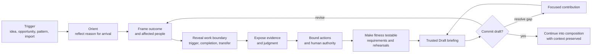
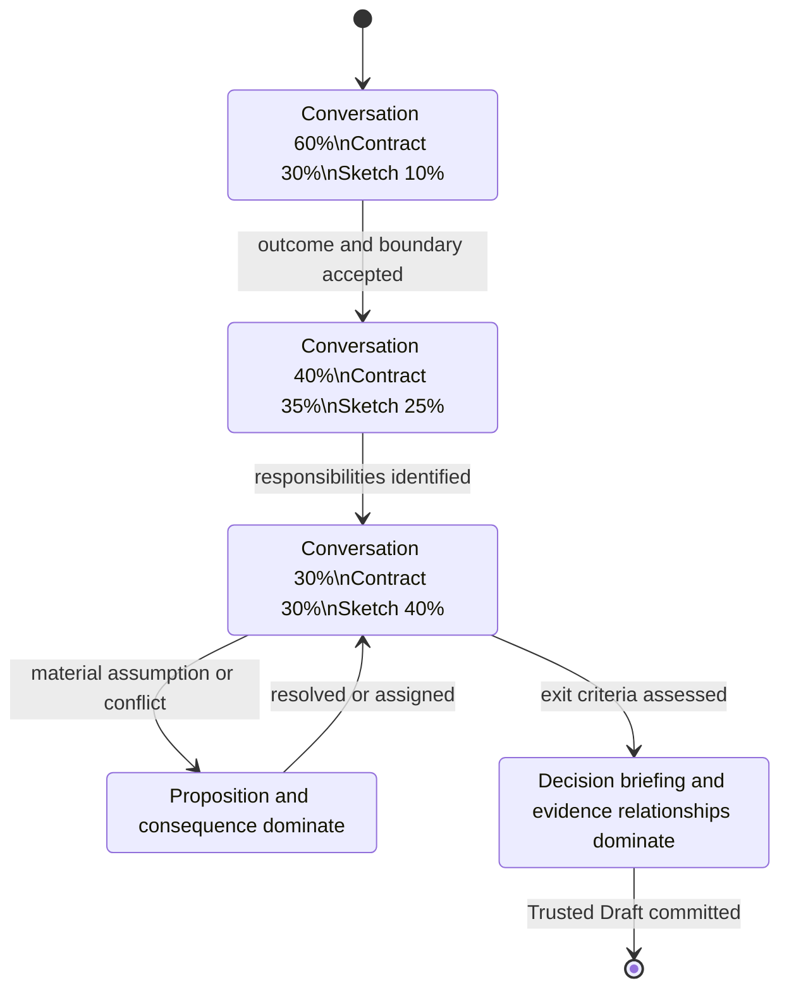
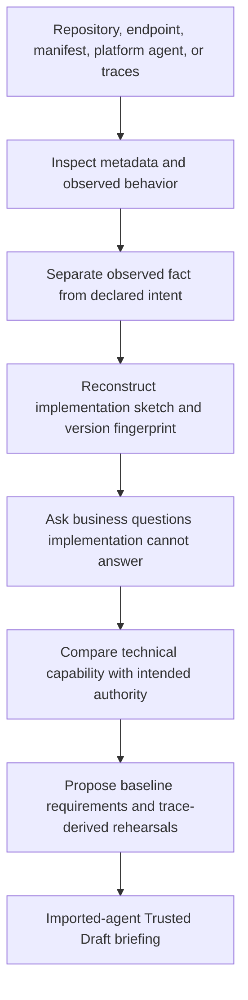
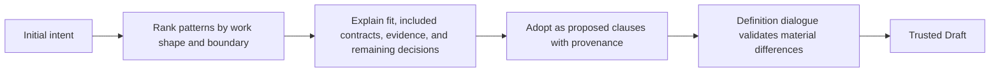
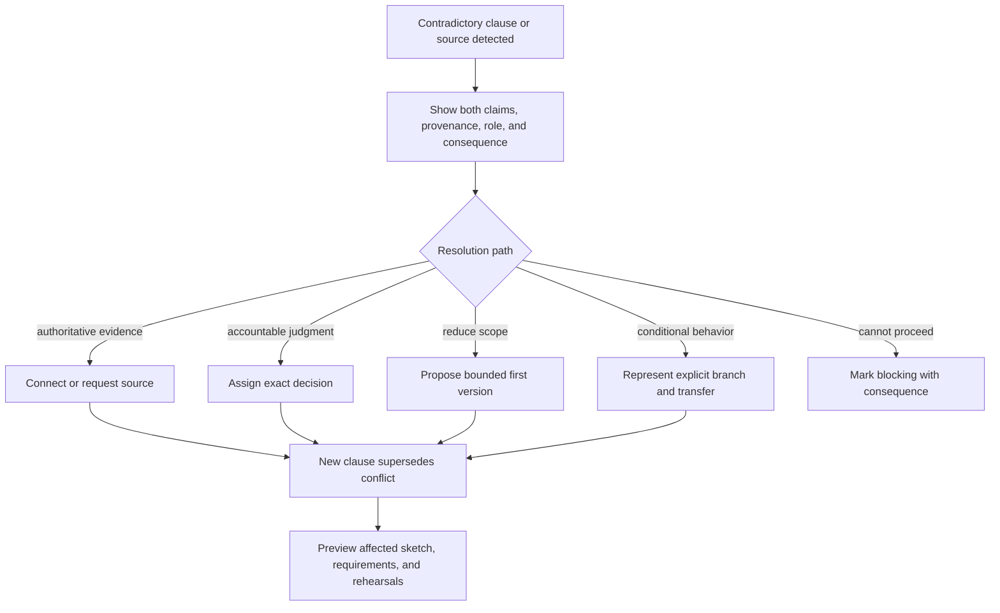
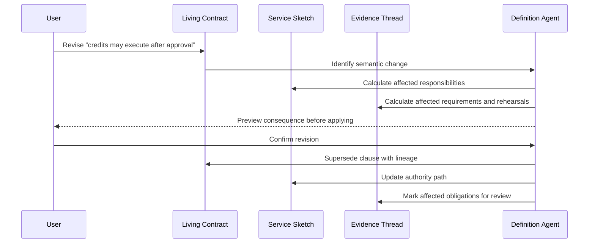

# Intent → Trusted Draft Wireflow

**Experience ID:** AGX-01
**Companion contract:** `INTENT_TO_TRUSTED_DRAFT_EXPERIENCE_CONTRACT.md`
**Purpose:** Describe how one adaptive work surface transforms across intent, evidence, decisions, and collaboration. Frames below are temporal states, not separate screens.

## 1. Experience topology



## 2. One adaptive surface

The experience maintains the same semantic regions while changing their emphasis.

```text
┌─────────────────────────────────────────────────────────────────────────────┐
│ Work Thread: why here · participants · current decision · consequence       │
├───────────────────────────────┬─────────────────────────────────────────────┤
│                               │ Agent Service Spine                          │
│ Conversation / contribution   │ outcome · owner · scope · authority · gaps  │
│                               ├─────────────────────────────────────────────┤
│ One material question,        │                                             │
│ proposition, or response      │ Living Specification                        │
│ at a time                     │ clauses transform as the dialogue advances  │
│                               │                                             │
│                               ├─────────────────────────────────────────────┤
│                               │ Service Sketch                              │
│                               │ responsibility relationships, not code      │
├───────────────────────────────┴─────────────────────────────────────────────┤
│ Decision/Gaps rail: changed now · unresolved · assigned · consequence       │
└─────────────────────────────────────────────────────────────────────────────┘
```

This is not a permanent four-panel dashboard.

- Early in the episode, conversation dominates and the sketch is minimal.
- As clauses stabilize, the Living Specification and sketch gain space.
- During a material proposition, the affected clause and consequence dominate.
- During the Trusted Draft briefing, the conversation compresses into the Work Thread and evidence/decision relationships dominate.

## 3. Spatial transformation



Responsive behavior preserves the semantic order:

```text
Work Thread
→ active conversation/proposition
→ changed clauses and consequence
→ service-sketch narrative
→ gaps and actions
```

On narrow surfaces, the sketch becomes a structured journey narrative rather than a scaled-down diagram.

## 4. Primary path wireflow — describe the work

### Frame A — meaningful beginning

**Trigger:** Maya selects “Begin agent-enabled work” from a relevant opportunity or command.

```text
Why you are here
Support escalations average 27.6 minutes and require repeated policy lookup.

What work should change?
[ Describe the work …                                                   ]

Or
Bring an existing agent · Start from an approved pattern

Related work, shown only when confidently relevant
Customer Operations / Escalation resolution
```

**Primary interaction:** express intent.
**System action:** create Work Thread; do not yet create an agent.
**Trust behavior:** opportunity evidence is linked and labeled; related work is a suggestion.

### Transition A → B

Maya enters:

> “Resolve eligible customer escalations faster and allow the service to issue credits.”

The system extracts candidate concepts but exposes only the most material uncertainty.

### Frame B — reflected intent, first boundary

```text
Definition Agent
You want to reduce escalation resolution time, with possible financial action.
Before proposing behavior, which cases should the service resolve and which
must remain with a specialist?

[ Respond … ]

Living contract — proposed
Outcome       Reduce escalation resolution time              STATED
Action need   Issue account credit                            UNRESOLVED
Scope         Which cases are eligible?                       BLOCKING
Harm          Unauthorized financial action                   INFERRED

Service sketch
Escalated demand ───────────────────────────────────────> Faster resolution
```

**Primary interaction:** answer the boundary question or inspect why it matters.
**Secondary interaction:** revise an extracted clause.
**System action:** propose, never auto-accept, outcome/action/harm clauses.

### Frame C — work boundary becomes visible

Maya answers:

> “Subscription cancellations and refund disputes. Fraud, legal threats, or cases without enough account evidence must transfer.”

```text
Changed now
+ Scope: eligible cancellation and refund disputes             STATED
+ Transfer: fraud, legal, insufficient account evidence        STATED
+ Requirement: determine eligibility before recommendation     INFERRED
+ Rehearsals: fraud · legal · missing evidence                  INFERRED

Definition Agent
What counts as a completed resolution for an eligible case?

Service sketch
Escalation → eligibility ─┬─ eligible ───────────────> resolution outcome
                         └─ transfer required ───────> specialist
```

**Primary interaction:** define completion.
**Transformation:** the sketch changes because responsibility is known, not because the user added nodes.

### Frame D — evidence and judgment

After completion is accepted:

```text
Definition Agent
Which evidence determines the remedy, especially when product or regional
policies differ?

Suggested evidence needs—not connected sources
Case facts      Account history      Applicable policy

Living contract
Trigger        Escalated cancellation/refund case             ACCEPTED DRAFT
Completion     Approved remedy communicated and case updated   ACCEPTED DRAFT
Evidence       Required sources unknown                        BLOCKING
Judgment       Policy applicability and remedy                 PROPOSED
```

Maya answers with the support case, account history, and current resolution policy; regional policy takes precedence.

### Frame E — material policy proposition

```text
Proposed contract boundary
Applicable policy is resolved by jurisdiction and effective date before
global ranking. Ambiguous or conflicting applicability transfers to the
policy owner.

Why this is proposed
• Maya stated that regional policy takes precedence.
• Existing architecture guidance identifies effective-date conflicts.
• Financial remedy depends on correct policy applicability.

Affected if accepted
• Policy judgment responsibility
• Knowledge freshness contract
• Canadian conflict test obligations
• Required domain owner

[Accept as draft] [Revise] [Connect evidence] [Assign decision] [Contest]
```

**Primary interaction:** review material assumption.
**System action:** wait; do not continue as if accepted.
**Audit:** proposition, evidence, actor, and action recorded.

### Frame F — focused collaboration

Maya assigns the policy interpretation to Priya Singh.

```text
Contribution requested from Priya Singh · Domain expert

Question
Should jurisdiction and effective date always precede global policy ranking,
and when must ambiguity transfer to a policy owner?

Why this matters
This determines the Canadian operating boundary and required release evidence.

Available context
Maya's statement · current policy architecture · proposed boundary

Priya may
Confirm · propose revision · attach authoritative evidence · redirect owner
```

Maya can continue clarifying non-dependent aspects while the clause remains assigned.

### Frame G — authority envelope

```text
Definition Agent
The service may recommend a remedy. Under what conditions may it change the
customer account or issue a credit?

Authority envelope — requested, not approved
READ       case · account · policy             invoking specialist identity
RECOMMEND  eligible remedy                     service responsibility
PREPARE    account credit                       no external write
EXECUTE    account credit                       boundary unresolved

Human decisions
Financial approval threshold                   UNKNOWN

[Describe boundary] [Ask Finance owner] [Start recommendation-only]
```

**Primary interaction:** articulate authority or deliberately narrow first release.
**Trust behavior:** requested authority is visually distinct from authorized authority.

### Frame H — fitness made testable

After the human boundary is accepted as a draft:

```text
Initial obligations derived from the contract

Requirement                         Why                         Rehearsal
Determine scope before reasoning    Transfer boundary           fraud/legal/missing evidence
Use applicable regional policy      Remedy correctness          CA/global effective-date conflict
Preserve user permissions           Data boundary               restricted account history
Require current approval            Financial authority         >$50 / expired approval
Prevent duplicate write             Action safety               retry after timeout
Measure real resolution             Outcome contract            14-day repeat contact

[Review obligation] [Add missing cohort] [Assign expectation owner]
```

The user is not in a test-management screen. Rehearsal obligations are shown because the draft is becoming testable.

### Frame I — Trusted Draft briefing

```text
Customer Escalation · Draft v0.1

Purpose
Resolve eligible cancellation and refund escalations faster while protecting
policy accuracy and financial authority.

Accepted as draft
Outcome · consumers · trigger · scope/transfer · completion · evidence needs
human approval boundary · harm constraints · initial requirements

Sourced / stated / inferred
6 sourced     8 stated     4 accepted inferences

Open but non-blocking for composition
• Confirm connector feasibility for policy source — Integration owner
• Establish baseline repeat-contact measure — Business owner

Blocking production authority—not blocking composition
• Finance approval of credit execution envelope
• Domain acceptance of Canadian policy conflict behavior

What composition begins with
Eligibility · evidence assembly · policy judgment · recommendation · approval
execution · communication · outcome observation

[Commit Trusted Draft] [Review material assumptions] [Resolve blocking draft gap]
```

**Consequence of commit:** create Draft v0.1, decision receipt, and preserved Work Thread.
**Continuation:** same surface transforms into service composition with accepted clauses and gaps intact.

## 5. Alternate path — bring an existing agent



### Import frame — evidence before claims

```text
Observed from repository and runtime
Framework       LangGraph                               OBSERVED
Tools           get_case · search_policy · issue_credit OBSERVED
Model           configured via runtime environment      PARTIAL
Owner           CODEOWNERS: Customer Ops AI              INFERRED
Production URL  customer-escalation-prod                 OBSERVED
Purpose         not declared                             UNKNOWN
Authority       issue_credit technically callable       NOT AUTHORIZED

Definition Agent
The implementation can call issue_credit. Is financial execution part of its
intended responsibility, and under whose authority should it occur?
```

The experience never equates technical possibility with permission.

### Import conflict

If declared intent says “recommendation only” but traces show executed credits:

```text
Material conflict
Declared boundary       recommendation only
Observed behavior       14 issue_credit executions in production traces

Potential consequences
• Unregistered authority
• Incorrect service dossier
• Immediate control review

[Open control investigation] [Explain authorized exception] [Constrain runtime]
```

The Trusted Draft cannot hide this conflict. Composition may continue only under an explicitly constrained state.

## 6. Alternate path — approved pattern



Pattern selection happens after enough intent exists to explain relevance.

```text
Recommended pattern
Controlled recommendation with consequential action

Fits because
• Service gathers evidence and recommends a remedy
• External write may have financial consequence
• Human authority is required above a boundary

Includes
Eligibility contract · evidence snapshot · approval receipt · idempotent action
Permission tests · trajectory tests · rollback pattern

Still yours to decide
Consumer cohort · policy authority · financial threshold · outcome measure

[Use as proposed starting contract] [Compare another pattern]
```

## 7. Conflict-resolution wireflow



## 8. Revision-impact wireflow



## 9. Pause-and-resume wireflow

```text
Resume Customer Escalation definition

Where you left it
Draft boundary accepted; policy interpretation assigned to Priya Singh.

Changed while paused
• Priya attached Canada Refund Policy 2026.08.
• The policy source is verified but its connector feasibility is unknown.
• Finance approval threshold remains unresolved.

Recommended continuation
Review Priya's proposed effective-date clause.

[Continue with policy decision] [Review all changes] [Return to work thread]
```

The experience resumes causality, not merely the last scroll position.

## 10. Component interaction contracts

### 10.1 Work Thread header

| Dimension | Contract |
|---|---|
| Purpose | Explain why the user is here and preserve causal continuity |
| Appears | Entire episode, at adaptive density |
| Contains | Origin, service draft, participants, active decision, consequence |
| Primary action | Return to current decision or inspect thread history |
| Never becomes | Generic breadcrumb or notification bar |

### 10.2 Intent composer

| Dimension | Contract |
|---|---|
| Purpose | Capture the user’s own description before imposing structure |
| Input | Text, voice, linked work item, or document |
| Behavior | Accepts incomplete intent; does not validate through a long checklist |
| Result | Creates Work Thread and first material question |
| Empty state | Provides outcome-oriented examples, not agent-type jargon |
| Failure | Preserves input and explains unsupported attachment/source access |

### 10.3 Dialogue moment

| Dimension | Contract |
|---|---|
| Purpose | Focus attention on one material ambiguity, proposition, or contribution |
| Contains | Question/proposition, why it matters, relevant evidence, response mechanism |
| Interaction | Respond, inspect reason, edit affected clause, assign, attach evidence |
| Trust | Labels whether the prompt is based on source, rule, or inference |
| Accessibility | Does not rely on transient chat animation or typing indicators |

### 10.4 Living clause

| Dimension | Contract |
|---|---|
| Purpose | Make structured understanding visible and directly reviewable |
| Contains | Human-readable statement, family, epistemic state, decision state, owner |
| Interaction | Select for provenance/consequence; edit; accept; contest; assign |
| Consequence | Updates sketch, requirements, or gaps only after reviewed transformation |
| Never becomes | A compact field with unexplained status pill |

### 10.5 Material proposition

| Dimension | Contract |
|---|---|
| Purpose | Obtain explicit review of an assistive-agent inference with material effect |
| Contains | Proposed clause, basis, affected contracts, decision owner, alternatives |
| Actions | Accept as draft, revise, evidence, assign, contest, defer |
| Audit | Records proposal and human response |
| Safety | No bulk acceptance for material propositions |

### 10.6 Service sketch

| Dimension | Contract |
|---|---|
| Purpose | Show responsibility and boundary relationships emerging from the contract |
| Evolution | Begins as demand/outcome; gains structure only after relevant clauses exist |
| Interaction | Select responsibility; propose direct edit; inspect linked clauses |
| Alternative | Equivalent structured journey narrative |
| Never becomes | Premature technical flowchart or decorative architecture map |

### 10.7 Gap cue

| Dimension | Contract |
|---|---|
| Purpose | Show an unresolved material question and its consequence |
| Types | Information, evidence, owner, conflict, authority, feasibility, testability |
| Interaction | Answer, evidence, assign, narrow scope, defer with consequence |
| Priority | Materiality and dependency, not arbitrary severity color |
| Completion | Resolves into clause/evidence/decision; not a dismissed notification |

### 10.8 Authority Envelope

| Dimension | Contract |
|---|---|
| Purpose | Distinguish requested, simulated, approved, and active authority |
| Contains | Identity, system, operation, scope, precondition, approval, expiry, recovery |
| Interaction | Define need, narrow scope, request owner decision, inspect evidence |
| Safety | Technical tool capability never displays as authorized action |

### 10.9 Rehearsal obligation

| Dimension | Contract |
|---|---|
| Purpose | Make the draft testable without entering test management |
| Derived from | Outcome, boundary, harm, authority, cohort, evidence contract |
| Contains | Requirement, scenario/cohort, expected/forbidden behavior, expectation owner |
| Interaction | Review, revise, add cohort, assign golden expectation |
| Continuation | Becomes scenario proposal in the Rehearsal episode |

### 10.10 Contribution request

| Dimension | Contract |
|---|---|
| Purpose | Ask the correct person for one exact contribution or decision |
| Contains | Question, role reason, evidence, consequence, due horizon |
| Recipient experience | Opens directly at clause/gap; no general dashboard detour |
| Outcomes | Confirm, revise, evidence, redirect, contest |

### 10.11 Trusted Draft briefing

| Dimension | Contract |
|---|---|
| Purpose | Make commitment informed and explain the transition into composition |
| Contains | Accepted clauses, trust distribution, gaps, authority state, obligations, next work |
| Primary action | Commit Trusted Draft with explicit consequence |
| Secondary | Review material assumptions or resolve a blocking draft gap |
| Receipt | Version, participants, accepted clauses, exceptions, timestamp |

## 11. Non-happy states

### No clear outcome

The Definition Agent uses observed pain or task language to offer outcome alternatives with tradeoffs. It does not fabricate a metric.

### User asks to skip questions

The product permits a rough draft but labels unexamined material dimensions and prevents misleading readiness language.

### Agent suggestion is wrong

The user can correct it in conversation or clause form. The system explains downstream impact and learns only within permitted product behavior; it does not alter organizational policy.

### Required contributor unavailable

The user can redirect to a role/group, narrow scope, retain a blocking gap, or pause. The product does not invent acceptance.

### Evidence access denied

The product shows that evidence exists but is unavailable to the current participant, identifies the appropriate owner or access path, and prevents content leakage.

### Integration unsupported

The draft retains the need and offers manual handoff, custom adapter assessment, or reduced scope. It does not represent a fictional connector.

### Conflicting authoritative sources

The conflict remains visible and blocks the affected behavior unless an accountable interpretation or safe transfer path exists.

## 12. Experience analytics

Measure whether the experience produces understanding and quality, not merely completion.

| Signal | Interpretation |
|---|---|
| Material questions asked versus clauses accepted | Conversation efficiency |
| User revisions to inferred clauses | Where assistive synthesis is weak or valuable |
| Clauses accepted without authoritative evidence | Trust debt |
| Time waiting for role-specific contribution | Organizational decision friction |
| Drafts narrowed before composition | Risk/value framing effectiveness |
| Requirements added after incident versus at definition | Prevention maturity |
| Resumption comprehension success | Work Thread continuity |
| Composition rework caused by definition gaps | Draft quality |

Do not optimize for shortest time-to-draft if it increases hidden assumptions or downstream rework.

## 13. Prototype validation script

### Participants

- Business service owner
- Agent developer
- Domain/policy expert
- Risk/control owner

### Session

1. Give the business owner only the escalation-time problem statement.
2. Observe whether they can begin without knowing agent terminology.
3. Have the developer inspect and directly revise the emerging service sketch.
4. Introduce a regional-policy source conflict.
5. Ask the domain expert to contribute asynchronously to the exact clause.
6. Introduce requested financial action and ask the risk owner to narrow authority.
7. Ask the group to commit a Trusted Draft.
8. Ask each participant to explain outcome, boundary, authority, evidence gaps, and next work.

### Pass conditions

- No participant needs a tour of product navigation.
- Participants recognize which content is sourced, stated, inferred, accepted, or unresolved.
- The group can explain why composition may begin while production authority remains blocked.
- The developer can identify implementation responsibilities without mistaking the sketch for generated code.
- The domain expert reaches the exact policy question without reconstructing context.
- The risk owner can narrow authority without editing unrelated configuration.
- The committed draft retains causal lineage from initial intent to requirements and rehearsal obligations.

## 14. Next design gate

After the wireflow is reviewed, create **one continuous low-fidelity workflow** containing these moments:

1. Meaningful beginning
2. First boundary question
3. Living contract transformation
4. Material policy proposition
5. Focused collaboration request
6. Authority Envelope
7. Trusted Draft briefing

These moments are not routes, wizard pages, or independently completable screens. They are transformations of one Work Thread: every response must update the same Living Specification, Service Sketch, Decision Ledger, Gap Set, provenance, and participant context.

The prototype should test temporal comprehension, interaction consequences, pause/resume continuity, focused contribution, and commitment into the next episode. It should not contain the full portal shell, catalog, operations, or governance dashboards.
