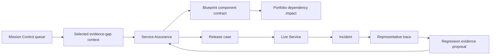

# AgentGrid Interaction Contracts and Wireflows

## 1. Mission Control contract

**User:** Technical service owner
**Trigger:** Required evidence, release condition, incident, or ownership event
**Question:** What requires my judgment, why am I responsible, and what happens if I do nothing?
**Decision:** Open, delegate, request evidence, continue work, or acknowledge consequence
**Inputs:** Service context, responsibility basis, consequence, evidence state, due condition
**Output:** Work advances to its domain context
**Failure path:** Missing authority or evidence is explained and routed

### Wireflow

```text
Global header
Decision queue ───────────── Selected decision context
  Group: Now                  Why you / consequence
  Group: Waiting              Service and scope
  Group: Scheduled            Evidence available/missing
                               Participants
                               Valid actions
                               Continuation
```

No metrics precede the decision queue.

## 2. Portfolio Outcome contract

**User:** Product/capability owner or enterprise architect
**Trigger:** Investment, consolidation, outcome, or opportunity question
**Question:** Which services support the capability, and what value and counter-effects are observed?
**Decision:** Inspect, invest, consolidate, constrain, or retire
**Inputs:** Capability hierarchy, service outcome contracts, cost, lifecycle, ownership
**Output:** Selected service dossier or portfolio action
**Failure path:** Insufficient attribution is shown instead of false precision

### Wireflow

```text
Portfolio header + local lens switch
Capability tree ───────────── Outcome relationship field
  Domain                       Process
  Capability                   Services on shared axis
  Process                      Baseline → current → target
                               Counter-metrics
                               Cost / attribution confidence
Selected relationship summary + open service
```

## 3. Portfolio Architecture contract

**User:** Enterprise architect or technical service owner
**Trigger:** Dependency, deprecation, incident, or change-impact question
**Question:** Which services depend on this component and what is the blast radius?
**Decision:** Inspect service, start migration, constrain dependency, or review incident
**Inputs:** Typed nodes, relationships, contracts, versions, criticality, current findings
**Output:** Affected-service context
**Failure path:** Unknown or uninstrumented relationships are explicitly identified

## 4. Service Dossier contract

**User:** Any authorized service participant
**Trigger:** Opening service from any workspace
**Question:** What is this service, who owns it, what is it accountable for, and what scope is certified?
**Decision:** Choose Blueprint, Assurance, or Live Service in the current context
**Inputs:** Mission, business context, outcome contract, owners, lifecycle, authority, certification
**Output:** Stable context for all studio work

The dossier is a compact persistent strip, not a standalone overview dashboard.

## 5. Blueprint contract

**User:** Technical owner, developer, architect, domain expert
**Trigger:** Design, change impact, evidence gap, or incident investigation
**Question:** How does the service produce the outcome, and what contract governs the selected component?
**Decision:** Inspect or propose a change; view evidence or dependency impact
**Inputs:** Typed architecture, contracts, controls, failures, production evidence
**Output:** Change proposal or connected context

### Wireflow

```text
Service Dossier
Blueprint | Assurance | Live Service

Architecture bands ────────── Component contract
  Consumer / trigger           Purpose and owner
  Intake and validation        Inputs / outputs
  Agent orchestration          Data/tool bindings
  Context + actions            Authority and controls
  Human decision               Failure / compensation
  Outcome                      Production evidence
```

The architecture representation is structured, not a freeform node canvas.

## 6. Assurance contract

**User:** Technical owner, domain expert, risk reviewer, release authority
**Trigger:** Candidate proposed or evidence invalidated
**Question:** What exactly changed, what must be true, and is evidence sufficient for the proposed scope?
**Decision:** Request evidence, record review, correct design, submit release, or accept residual risk if authorized
**Inputs:** Change impact, claims, requirements, risks, coverage, evidence, waivers, participants
**Output:** Updated assurance case or release case

### Wireflow

```text
Service Dossier + candidate comparison
Fitness claims ─────────────── Coverage matrix
  Supported                    Requirement × cohort
  Partial                      Evidence cells
  Challenged                   Missing/counter-evidence

Selected claim ─────────────── Decision context
  Argument and risk            Responsible participants
  Evidence lineage             Valid actions
```

## 7. Live Service contract

**User:** Service owner, operator, business owner
**Trigger:** Routine operation, outcome deviation, SLO burn, or incident
**Question:** Is the service meeting commitments, where is deviation occurring, and what is the consequence?
**Decision:** Inspect cohort, dependency, failure cluster, incident, or improvement
**Inputs:** Outcome/SLO trends, demand funnel, topology, authority use, incidents
**Output:** Investigation, mitigation, or improvement context

### Wireflow

```text
Service Dossier + release/environment/time
Outcome commitments on shared time axis
Demand and eligibility flow
Service topology ───────────── Current findings
Failure clusters              Incident / control / dependency
Improvement and regression coverage
```

## 8. Incident contract

**User:** Incident commander, operator, service owners
**Trigger:** Material impact or credible threat
**Question:** What is affected, why, what is being done, and what decision is next?
**Decision:** Constrain, roll back, route to humans, restore, or assign follow-up
**Inputs:** Business impact, topology, timeline, changes, traces, controls, mitigation
**Output:** Updated incident state and service operating state

### Wireflow

```text
Incident identity + state + commander
Business impact strip
Service topology ───────────── Mitigation and next decision
Timeline                       Current authority
Representative evidence       Restoration conditions
Follow-up / regression
```

## 9. Regression creation contract

**User:** Technical owner or domain expert
**Trigger:** Representative failed run
**Question:** What requirement, risk, cohort, and expected behavior should this failure protect?
**Decision:** Create regression evidence proposal
**Inputs:** Run, release, component, failure mode, cohort, policy/data versions
**Output:** Scenario proposal linked to Assurance coverage
**Failure path:** Missing classification becomes assigned work; a generic test is not silently created

## 10. Cross-context wireflow



## 11. Interaction rules

1. One primary decision per context.
2. One dominant representation per context.
3. Supporting details appear in a stable inspector or selected-context region.
4. Modal dialogs are reserved for compact confirmation or structured creation—not deep review.
5. Consequential actions explain scope, authority, and resulting state before execution.
6. Every transition retains service, version, cohort, environment, and origin.
7. Empty state explains missing enterprise configuration and who can resolve it.
8. Loading and partial-data states preserve layout and context.
9. A URL identifies shareable non-sensitive selection state.
10. Keyboard navigation works across queue, maps, matrices, modes, and inspectors.
