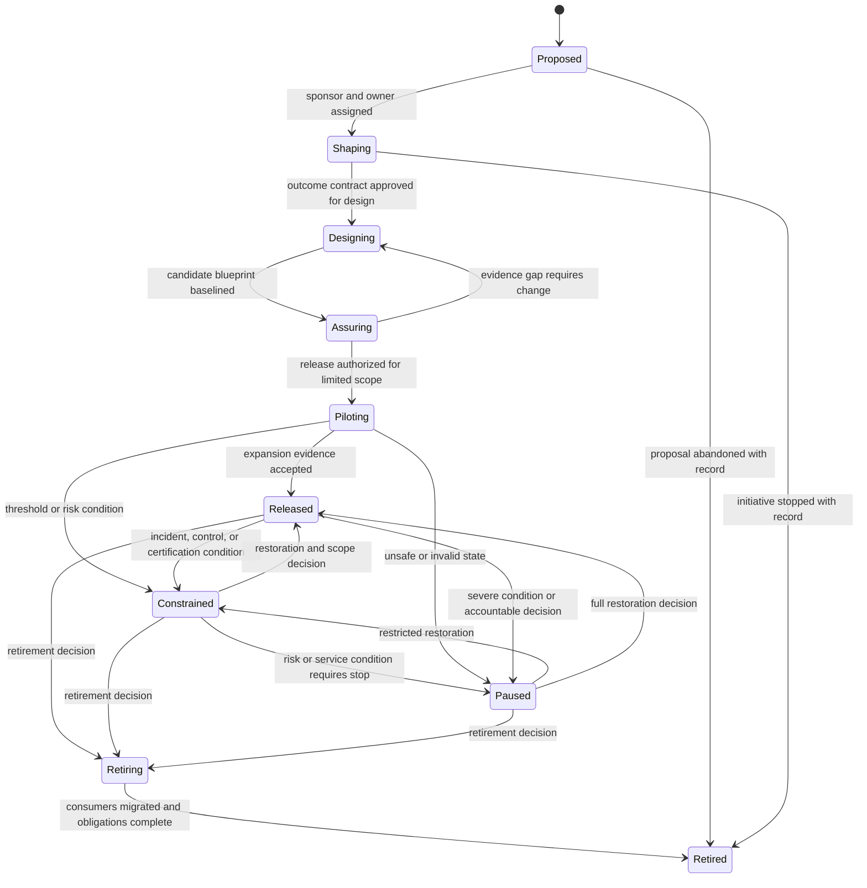
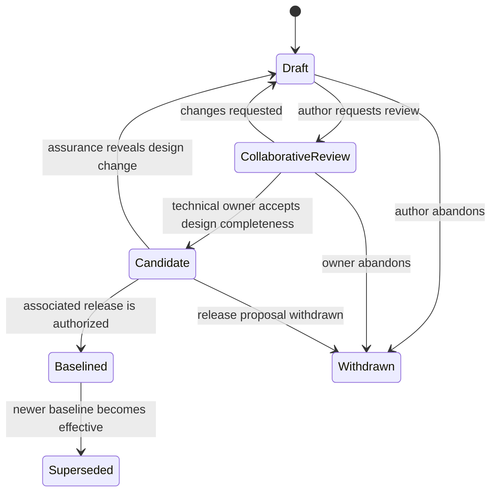
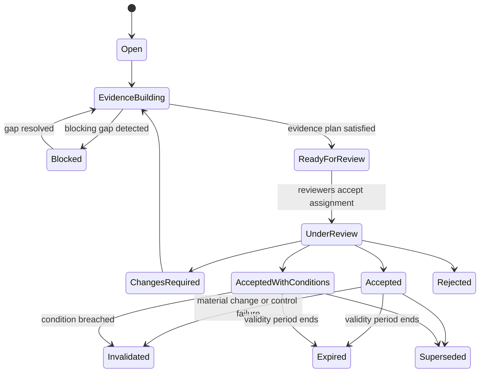
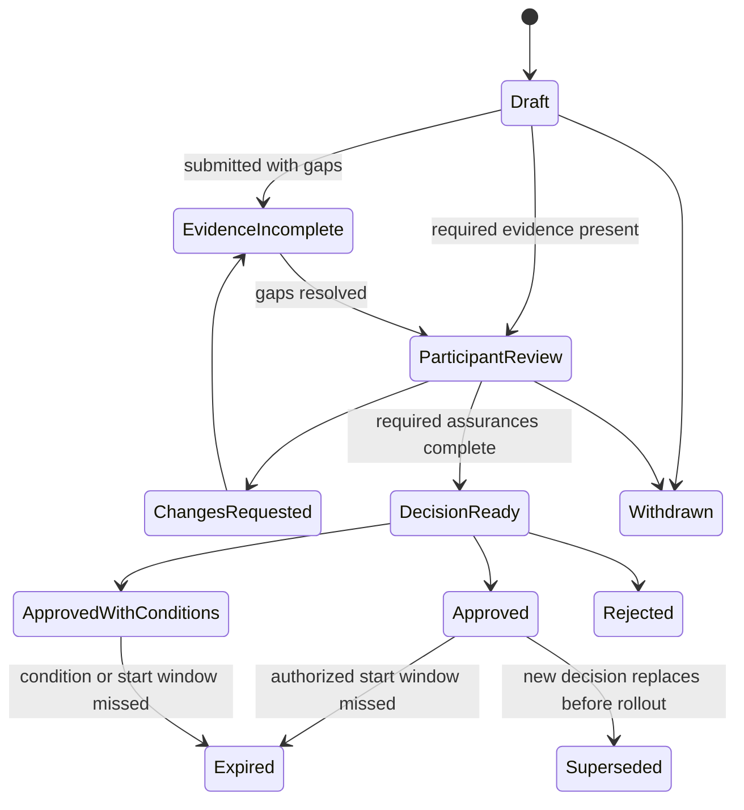
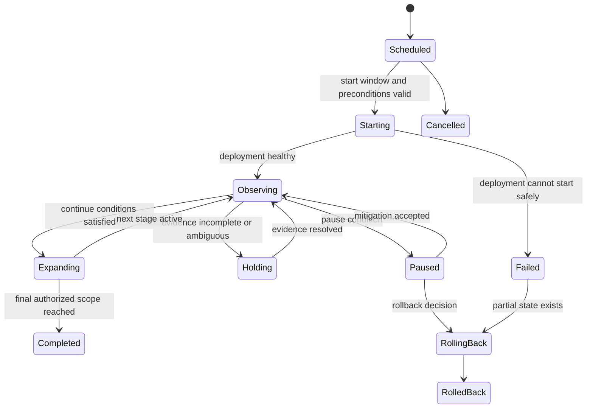
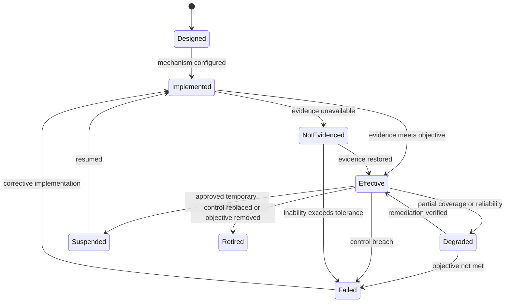
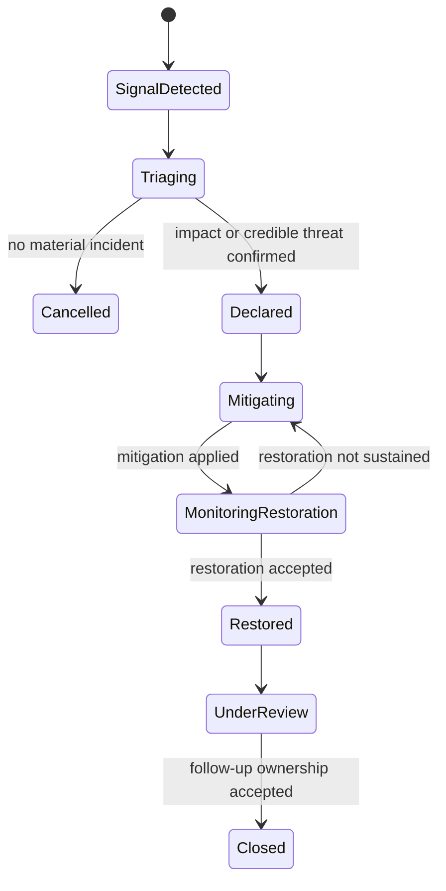
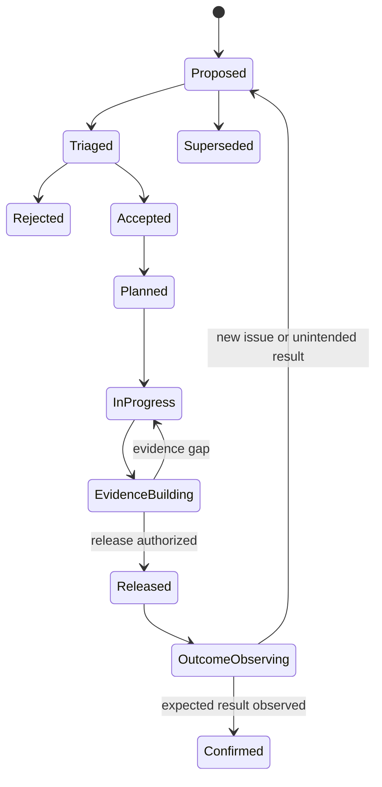

# AgentGrid Lifecycle and State Model

**Status:** Foundational enterprise architecture artifact
**Purpose:** Define orthogonal lifecycle, assurance, release, deployment, operations, incident, certification, exception, and work states with explicit transitions, guards, owners, and invalidation behavior.

---

## 1. State-model principle

The portal must not describe a service with one generic status.

A service can simultaneously be:

- Released in lifecycle
- Healthy in runtime
- At risk on an outcome objective
- Certified for a limited population
- Operating under a temporary exception
- Carrying an open problem
- Preparing a new candidate

These dimensions are orthogonal. Combining them into one red, amber, or green badge destroys meaning and accountability.

---

## 2. State dimensions

| Dimension | Subject | Question answered | Owner |
|---|---|---|---|
| Service lifecycle | Agent-enabled service | Where is the service in its organizational life? | Business service owner |
| Blueprint lifecycle | Blueprint version | Is this architecture a draft, candidate, baseline, or historical version? | Technical service owner |
| Assurance state | Assurance case | Is evidence sufficient for the proposed scope? | Assurance lead or designated coordinator |
| Release-case state | Release case | Is a production transition ready and authorized? | Release authority |
| Rollout state | Release rollout | How far has the authorized change progressed? | Operator under rollout policy |
| Deployment operating state | Deployment | Is this deployment active, constrained, paused, or drained? | Operator |
| Runtime health | Deployment or service | Is runtime behavior technically healthy? | Operator/technical owner |
| Outcome state | Service and cohort | Is the service meeting its business contract? | Business service owner |
| Control state | Control binding | Is the control operating effectively? | Control owner |
| Certification state | Certification | Is the service currently certified for a scope? | Risk/certification authority |
| Exception state | Exception | Is a time-bound policy exception active and valid? | Risk owner |
| Incident state | Incident | Where is coordinated incident response? | Incident commander |
| Problem state | Problem | Where is root-cause correction? | Technical or problem owner |
| Work-item state | Work item | What responsibility is pending and who can advance it? | Assigned role |

---

## 3. Agent service lifecycle

### States

| State | Meaning | Production allowed? |
|---|---|---|
| Proposed | Business opportunity or need has been registered | No |
| Shaping | Mission, consumers, outcome contract, ownership, and scope are being defined | No |
| Designing | A service blueprint is being created or materially redesigned | No new production scope |
| Assuring | A candidate is under evidence-building and fitness review | Existing release may continue |
| Piloting | A release operates for a limited authorized population | Yes, limited |
| Released | Service is generally available within certified scope | Yes |
| Constrained | Service operates with reduced capability, audience, authority, or dependency use | Yes, constrained |
| Paused | Service does not accept ordinary demand | No, except explicit recovery operations |
| Retiring | New investment and expansion stop while consumers migrate | Existing scope only |
| Retired | Service no longer accepts demand | No |

### State machine

### Transition guards

#### Proposed → Shaping

- Sponsor identified
- Preliminary business capability and process mapped
- Initial business owner assigned
- Duplicative portfolio opportunity assessed

#### Shaping → Designing

- Mission and boundary defined
- Outcome contract approved for design
- Consumers and jurisdictions identified
- Business, technical, and risk ownership assigned
- Initial risk tier established

#### Designing → Assuring

- Candidate blueprint baselined
- Material change set classified
- Component contracts resolve
- Failure paths and authority envelopes defined
- Assurance case opened

#### Assuring → Piloting

- Required fitness claims supported
- Blocking risks resolved or valid exception exists
- Release case approved
- Operational readiness complete
- Rollout policy authorized

#### Piloting → Released

- Pilot observation window complete
- Continue conditions satisfied
- Outcome, quality, control, cost, and reliability thresholds satisfied
- Business owner accepts operating outcome
- Release authority authorizes expansion

#### Any operating state → Constrained

- Authority, audience, channel, model, data, tool, or workflow is deliberately restricted
- Constraint scope and reason recorded
- Allowed degraded-mode behavior explicitly defined
- Responsible role and exit condition assigned

#### Any operating state → Paused

- No safe allowed operating scope remains, or accountable owner chooses pause
- Invocations are blocked or routed according to contingency
- Active requests are drained, completed manually, or safely suspended

#### Retiring → Retired

- Consumers and integrations migrated or explicitly accepted
- New demand disabled
- Data retention obligations assigned
- Active incidents and financial reconciliation resolved
- Ownership remains for residual audit obligations

---

## 4. Blueprint version lifecycle

### States

- Draft
- Collaborative review
- Candidate
- Baselined
- Superseded
- Withdrawn

### Invariants

- Draft and review versions are mutable with recorded changes.
- Candidate content is frozen while evidence is generated; modifications create a new candidate revision.
- Baselined versions are immutable.
- Supersession does not remove prior production references.
- Only a baselined blueprint may back a production release.

---

## 5. Assurance case state

### States

| State | Meaning |
|---|---|
| Open | Candidate and scope identified; claims and evidence plan being assembled |
| Evidence building | Evaluations, reviews, tests, and attestations are in progress |
| Blocked | A critical evidence, control, dependency, or ownership gap prevents review |
| Ready for review | Required evidence is complete enough for accountable review |
| Under review | Required participants are reviewing claims, risk, and residual uncertainty |
| Changes required | Review identified required correction or additional evidence |
| Accepted | Fitness claims accepted for explicit scope and validity conditions |
| Accepted with conditions | Scope accepted only under stated constraints or obligations |
| Rejected | Candidate is not fit for proposed scope |
| Expired | Time or evidence-validity period elapsed |
| Invalidated | Material change or external event broke validity conditions |
| Superseded | A newer assurance case governs the candidate or scope |

### State machine

### Accepted is scoped

Acceptance binds:

- Exact candidate blueprint
- Exact registry-component versions or ranges
- Consumer population
- Jurisdictions
- Environment and runtime assumptions
- Data and action authority
- Evidence snapshot
- Conditions and expiration

The portal must never show “approved” without its scope.

---

## 6. Fitness claim state

Each claim has an independent state:

- Proposed
- Unsupported
- Partially supported
- Supported
- Challenged
- Waived
- Not applicable
- Invalidated

### Rules

- Counter-evidence moves a supported claim to challenged until resolved.
- Waived means a requirement is not satisfied but residual risk was accepted; it does not mean passed.
- Not applicable requires accountable rationale and scope.
- Material change invalidates only affected claims when impact is precisely known; otherwise fail closed at the assurance-case level.

---

## 7. Release-case state

### States

- Draft
- Evidence incomplete
- Participant review
- Decision ready
- Changes requested
- Approved
- Approved with conditions
- Rejected
- Withdrawn
- Expired
- Superseded

### Distinction from assurance

Assurance asks whether the candidate is fit for a scope. Release asks whether the organization should transition a specific environment and population now, using a defined rollout policy and operational readiness.

---

## 8. Rollout state

### States

- Scheduled
- Starting
- Observing
- Holding
- Expanding
- Completed
- Paused
- Rolling back
- Rolled back
- Failed
- Cancelled

### Stage model

Each rollout stage defines:

- Population and traffic scope
- Environment and regions
- Observation window
- Required measures
- Continue thresholds
- Hold thresholds
- Pause and rollback thresholds
- Authorized automated and human decisions

### Invariant

Automated rollout may continue only within conditions explicitly authorized by the release decision. Threshold logic cannot expand its own authority.

---

## 9. Deployment operating state

### Operating states

- Provisioning
- Active
- Constrained
- Draining
- Paused
- Stopped
- Failed
- Decommissioned

### Runtime health states

- Healthy
- Degraded
- Unhealthy
- Unreachable
- Unknown

Operating state and health are independent. A deliberately paused deployment may be technically healthy; an active deployment may be degraded.

### Transition rules

| Transition | Guard | Owner |
|---|---|---|
| Provisioning → Active | Runtime ready, release reference verified, policy attached | Operator |
| Active → Constrained | Valid mitigation or policy decision | Operator or incident commander |
| Active → Draining | Replacement, rollback, region evacuation, or retirement | Operator |
| Draining → Stopped | In-flight obligations resolved | Operator |
| Any → Paused | Safe request acceptance disabled | Operator/incident commander |
| Paused → Active | Restoration decision and preflight pass | Authorized operator |
| Failed → Decommissioned | Evidence retained and replacement/retirement complete | Platform owner |

---

## 10. Outcome state

Outcome state is evaluated per measure, population, and observation window.

### States

- Baseline unknown
- Within target
- Trending toward target
- At risk
- Outside target
- Counter-metric breach
- Insufficient evidence
- Not currently observable

### Rules

- A service may meet one outcome and breach a counter-metric.
- Small sample size produces insufficient evidence, not automatically healthy.
- Outcome state is not derived from user adoption alone.
- Attribution confidence is displayed separately from measured result.
- Cohort disparity may create an at-risk state even when portfolio average is within target.

---

## 11. SLO and error-budget state

### States

- No baseline
- Healthy budget
- Elevated burn
- Critical burn
- Exhausted
- Measurement unavailable

### Error-budget dimensions

- Technical reliability
- Behavior quality
- Control compliance
- Business outcome where appropriate

Control violations such as unauthorized action are not averaged into a general technical error budget.

---

## 12. Control operating state

### States

- Designed
- Implemented
- Effective
- Degraded
- Failed
- Not evidenced
- Suspended
- Retired

### Control failure propagation

A failed control can:

- Generate a governance work item
- Constrain or pause affected services
- Invalidate certification
- Invalidate assurance claims
- Block release transitions
- Trigger incident coordination

Propagation is defined by control criticality and binding scope.

---

## 13. Certification state

### States

- Requested
- Assessing
- Granted
- Granted with conditions
- Constrained
- Suspended
- Expired
- Invalidated
- Revoked
- Superseded

### Distinctions

- **Constrained:** certification remains valid for reduced scope.
- **Suspended:** temporarily not usable while evidence or incident is resolved.
- **Invalidated:** an automatic condition broke validity; re-assessment required.
- **Revoked:** accountable authority explicitly removes certification.
- **Expired:** scheduled validity elapsed.

---

## 14. Exception and waiver state

### States

- Draft
- Under review
- Granted
- Active
- Breached
- Expiring
- Expired
- Revoked
- Closed

### Rules

- Granted becomes Active only when compensating controls and monitoring are in place.
- Material change can return Active to Under review or Breached.
- Breach can constrain affected services automatically.
- Expiration does not silently renew.
- Closed preserves history and exit evidence.

---

## 15. Incident state

### States

- Signal detected
- Triaging
- Declared
- Mitigating
- Monitoring restoration
- Restored
- Under review
- Closed
- Cancelled as incident

### Severity is separate from state

Severity can change during response. It is derived from:

- Business impact
- Consumer harm
- Financial exposure
- Data or authority exposure
- Service criticality
- Duration and spread
- Reversibility
- Control breach

### Restoration versus closure

Restoration returns service to an accepted operating state. Closure requires accepted follow-up, evidence preservation, and problem ownership where needed.

---

## 16. Problem state

### States

- Suspected
- Confirmed
- Diagnosing
- Known error
- Corrective work planned
- Corrective work in progress
- Validation
- Resolved
- Accepted residual condition
- Closed

### Relationship to incident

Multiple incidents can link to one problem. An incident can close while a problem remains active.

---

## 17. Improvement-item state

### States

- Proposed
- Triaged
- Accepted
- Planned
- In progress
- Evidence building
- Released
- Outcome observing
- Confirmed
- Rejected
- Superseded

### Improvement loop

An improvement is not complete when code ships. It completes when expected production evidence is observed or an accountable owner accepts a different result.

---

## 18. Service request state

The customer-escalation request model provides the reference implementation.

### States

- Received
- Ineligible
- Investigating
- Awaiting information
- Awaiting policy decision
- Recommending
- Awaiting approval
- Rework
- Ready to execute
- Executing
- Compensating
- Incident
- Communicating
- Completed
- Reopened
- Transferred
- Human resolution
- Cancelled

### Invariants

- Waiting states identify the required role or event.
- Ready to execute references valid authority and current evidence.
- Completed references action and communication receipts or a documented no-action resolution.
- Reopened preserves prior completion history.
- Compensation never erases the original action receipt.

---

## 19. Work-item state

### States

- Created
- Assigned
- Acknowledged
- In progress
- Waiting for evidence
- Waiting for participant
- Decision ready
- Completed
- Declined
- Reassigned
- Cancelled
- Expired

### Rules

- WorkItem is a coordination projection, not the authoritative decision.
- Completed references the resulting domain event or DecisionRecord.
- Reassignment preserves handoff history.
- Expired triggers policy-defined escalation; it does not assume rejection or approval.
- Waiting states state exactly what is missing and who owns it.

---

## 20. Material-change invalidation matrix

| Change | Blueprint | Assurance | Release case | Certification | Deployment | Operations |
|---|---|---|---|---|---|---|
| Mission/outcome contract | New candidate | Reopen affected claims | New review | Reassess | Existing scope may continue by decision | Outcome baseline/targets versioned |
| Consumer population | New candidate or scope | Add cohort evidence | New scope decision | Expand/reassess | Rollout required | Cohort monitoring added |
| Jurisdiction | New candidate | Policy/privacy evidence | New decision | Reassess | Region-specific deployment | Jurisdiction outcomes and incidents |
| Model equivalent version | Binding update | Reuse or refresh per equivalence policy | May be streamlined | Usually remains if conditions hold | Controlled rollout | Behavior/cost monitoring |
| Model provider | Architecture change | Full affected evidence | Material review | Reassess | New runtime/provider binding | Provider topology and incident plan |
| Data source | Contract change | Data, privacy, retrieval evidence | Material review | Reassess | Binding rollout | Freshness and quality SLO |
| Retrieval logic | Behavior change | Cohort and grounding evidence | Material review | Depends on scope | Controlled rollout | Retrieval-quality monitoring |
| Read tool | Dependency change | Contract/security/reliability evidence | Material review | Depends on risk | Binding rollout | Tool health monitoring |
| Write action | Authority change | Action, risk, control evidence | High-materiality review | Reassess | Guarded rollout | Action and compensation monitoring |
| Authority expansion | Contract/control change | Full affected assurance | New accountable decision | Reassess or new scope | Guarded rollout | Authority-use monitoring |
| SLO change | Contract version | Operational evidence | Business-owner decision | Usually unaffected | No runtime change necessarily | New observation version |
| Control failure | No design change necessarily | Claims challenged | Blocks pending release | Constrain/suspend/invalid | May constrain or pause | Event or incident |

---

## 21. Cross-state transition guards

### Production release guard

All must be true:

- Service lifecycle permits release
- Candidate blueprint is baselined
- Assurance case is Accepted or Accepted with conditions
- Certification is valid for proposed scope
- Required exceptions are Active and unbreached
- Required controls are Effective or accepted under explicit exception
- Release case is Approved or Approved with conditions
- Deployment environment is eligible
- Decision authority and separation of duties are valid

### Autonomous-action guard

All must be true at action time:

- Service operating state allows the operation
- Deployment is Active or explicitly Constrained with operation allowed
- Certification covers the action and population
- Authority envelope is active
- Required evidence is current
- Approval or standing delegation is valid
- Control state permits execution
- No incident restriction applies
- Action preconditions and idempotency pass

### Restoration guard

- Immediate harmful condition mitigated
- Required controls restored or explicit constrained mode defined
- Affected dependencies sufficiently healthy
- Rollback or mitigation state reconciled
- Business owner accepts business-service restoration where required
- Operator records monitoring window and follow-up

---

## 22. State-derived portal behavior

### Mission Control

Shows transitions requiring the current user's decision or evidence, not generic state labels.

Examples:

- Assurance case is Blocked because domain evaluation is missing.
- Rollout is Holding because cohort evidence is insufficient.
- Certification becomes Expiring in fourteen days.
- Incident is Monitoring restoration and needs business acceptance.

### Portfolio

Allows lenses over distinct state dimensions:

- Lifecycle
- Assurance maturity
- Certification
- Runtime health
- Outcome performance
- Control effectiveness

### Service Studio

- Blueprint mode uses blueprint lifecycle and material-change state.
- Assurance mode uses claim, evidence, assurance, and release-case states.
- Live Service mode uses rollout, deployment, SLO, outcome, incident, problem, and improvement states.

### Governance

Uses control, certification, exception, delegation, and decision states.

---

## 23. State presentation rules

1. Always label the subject: “Deployment degraded,” not simply “Degraded.”
2. Explain why the state exists.
3. Show who or what can advance it.
4. Show entry time and relevant deadline.
5. Show scope: cohort, environment, region, authority, or component.
6. Show conditions and invalidation rules.
7. Preserve state history and decision references.
8. Avoid color as the only differentiator.
9. Do not display internal enum text without domain language.
10. When states conflict, show the independent dimensions rather than calculating an unexplained composite.

---

## 24. State history model

Every transition records:

- Transition ID
- Subject type and ID
- From and to state
- Trigger event
- Decision record when required
- Acting identity or system
- Authority basis
- Evidence snapshot
- Scope
- Conditions
- Timestamp
- Resulting work items or events

State history is append-only. Administrative correction creates a correction event with reason and authority.

---

## 25. State-model validation scenarios

### Scenario A: safe candidate release

1. Blueprint moves Draft → Candidate.
2. Assurance moves Open → Evidence building → Accepted.
3. Release case moves Draft → Participant review → Approved.
4. Rollout moves Scheduled → Observing → Expanding → Completed.
5. Service moves Assuring → Piloting → Released.

### Scenario B: stale policy during production

1. Control moves Effective → Failed.
2. Outcome or quality state moves At risk.
3. Incident moves Signal detected → Declared → Mitigating.
4. Service moves Released → Constrained.
5. Certification moves Granted → Constrained.
6. Improvement item moves Proposed → Accepted.
7. New candidate and assurance case begin.
8. After corrective release and observation, service returns Constrained → Released.

### Scenario C: approval evidence changes

1. Human decision is recorded for a proposed credit.
2. Account or policy evidence changes materially.
3. Decision invalidation rule fires.
4. Service request returns Awaiting approval.
5. Action guard rejects the expired decision.

### Scenario D: tool schema deprecation

1. Registry component version becomes Deprecated.
2. Portfolio impact identifies bound services.
3. Work items assign migration responsibility.
4. Existing releases remain allowed only until deprecation deadline.
5. New release cases using the version are blocked.
6. Candidate upgrade follows assurance and controlled rollout.

### Scenario E: outcome appears good but control fails

1. Resolution rate remains Within target.
2. Financial-action control becomes Failed.
3. Service moves Released → Constrained or Paused according to policy.
4. Portal does not show a composite “healthy” state.

---

## 26. Open state-policy decisions

1. Which control failures automatically constrain versus pause a service?
2. Which changes may reuse assurance under an equivalence policy?
3. How long may a release decision remain unused before expiring?
4. Which service states allow background completion of existing requests?
5. Which roles may accept restoration at each risk tier?
6. When does a production outcome change invalidate certification?
7. Which exceptions may allow release despite a degraded control?
8. What is the maximum duration of constrained mode?
9. How are externally managed runtime states reconciled with AgentGrid state?
10. Which state transitions require synchronized decisions across multiple organizations or vendors?
