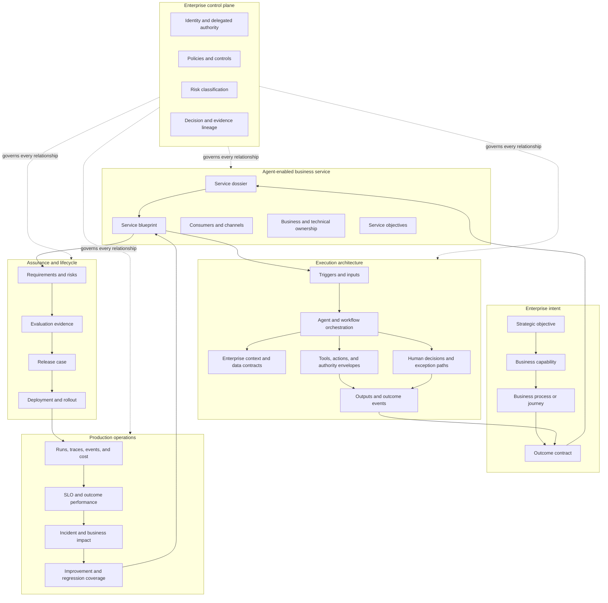
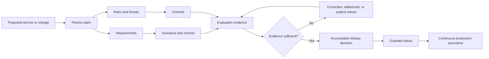

# AgentGrid Portal Architecture Plan

**Status:** Approved architecture, implemented as the coherent prototype slice
**Companion documents:** `PRODUCT_CONCEPT.md`, `CUSTOMER_ESCALATION_SERVICE_BLUEPRINT.md`, `DECISION_RIGHTS_MODEL.md`, `CANONICAL_DOMAIN_MODEL.md`, `LIFECYCLE_STATE_MODEL.md`, and `API_AGGREGATE_CONTRACTS.md`
**Implementation status:** The original card-and-CRUD prototype described in the assessment below has been replaced. The current portal implements the short global navigation, contextual Service Studio, stable Service Dossier, consequence-driven Mission Control, portfolio lenses, assurance matrix, live-service view, incident learning loop, and governance coverage defined here.

---

## 1. Executive verdict

The original portal proved that a browser could load JSON and CSV data through a REST API, but did not prove the intended enterprise product. This section is retained as the design diagnosis that drove the implemented reset.

Its principal weakness is not visual styling. The product map describes an enterprise operating system for agents, while the portal represents that system as a familiar small-SaaS pattern:

- Dashboard cards
- Agent cards
- Linear workflow cards
- Chat playground
- Approval list
- Generic charts
- Shallow lifecycle tabs

This makes the interface easy to recognize but intellectually thin. It hides the relationships that enterprise buyers need to understand:

- Business outcome to business process
- Business process to agent service
- Agent service to data, tools, models, identities, and controls
- Proposed change to affected architecture and risk
- Evaluation evidence to release decision
- Production incident to business impact
- Production failure to regression coverage
- Portfolio investment to measurable value

The portal must be redesigned from the operating model outward. Screens should be the final expression of that model—not the starting point.

---

## 2. Current portal versus product map

| Product-map intention | Current representation | Why it feels novice | Required correction |
|---|---|---|---|
| Personalized command center | Generic KPI row and mixed attention list | Metrics and work items lack a prioritization model, decision context, and role-specific consequence | Introduce a decision queue organized by consequence, responsibility, deadline, business impact, and required evidence |
| Enterprise agent portfolio | Two-column agent card grid | Cards show objects but not the business capabilities, processes, dependencies, owners, investments, or risks they support | Make the portfolio a map of business capabilities and agent services with selectable outcome, architecture, lifecycle, and risk lenses |
| Agent as an enterprise service | Name, owner, status, health, and version | The representation lacks a service contract, consumers, SLOs, boundary, authority, dependencies, and outcome accountability | Define an Agent Service Dossier and keep it visible in every agent context |
| Integrated agent design | Linear list of five steps | The sequence looks like a checklist rather than an executable service architecture | Model triggers, inputs, decisions, context, tools, human controls, outputs, failure handling, and outcome contracts as typed components and relationships |
| Enterprise context | Knowledge-source rows in an inspector | Sources appear as attachments, not governed data products with lineage, permission resolution, freshness, quality, and jurisdiction | Represent context as data contracts and retrieval policies connected to specific workflow decisions |
| Tool and action governance | Tool names and approval labels | It does not show action scope, delegated authority, identity, reversibility, blast radius, or compensation | Add authority envelopes and action contracts to every consequential operation |
| Evaluation and assurance | Chat demo and percentage bars | Aggregate scores do not explain coverage, uncertainty, failure modes, affected cohorts, or release fitness | Build an evidence matrix linking requirements, risks, scenarios, evaluators, failures, waivers, and release gates |
| Release management | Change descriptions and three gates | The release decision lacks architectural impact, affected consumers, control changes, rollout policy, owner sign-offs, and rollback criteria | Create a release case that assembles change impact, evidence, authority deltas, operational readiness, rollout, and accountable decisions |
| Production learning | Recent run table and one trace | It treats observability as log viewing rather than service management and causal learning | Connect SLOs, business outcomes, dependency topology, incidents, cohorts, traces, fixes, and regression coverage |
| Portfolio operations | Two generic charts and incident rows | There is no operating topology, business-service impact, SLO model, dependency failure, or coordinated incident workflow | Build an agent-service operations model with topology, objectives, events, incidents, and prevention work |
| Enterprise governance | Approval rows and a risk count | Governance becomes inbox processing rather than policy design, control coverage, accountability, exceptions, and continuous assurance | Represent organizational policies as controls applied to data, actions, identities, environments, and lifecycle transitions |
| Reuse and platform leverage | “Insert from library” button | Reuse is mentioned but not modeled | Define reusable patterns, components, evidence packs, controls, and ownership with dependency and upgrade relationships |
| Business value | “Cases resolved” metric | Value is isolated from baseline, attribution, target, cost, quality, and risk | Introduce an Outcome Contract with baseline, target, attribution method, observation window, owner, and counter-metrics |

### Conclusion

The existing app mirrors the headings of the product concept but not its underlying enterprise relationships. The next version must not be a richer collection of cards. It must make the operating model visible and actionable.

---

## 3. Reframed product thesis

> AgentGrid is the enterprise system of record and control plane for agent-enabled business services.

The phrase **agent-enabled business service** is important. Enterprises do not ultimately operate prompts, chats, or agent records. They operate services that produce business outcomes for defined consumers under explicit operational and governance constraints.

An agent may be one component of that service. Other components include:

- Human decision makers
- Business rules
- Enterprise data products
- Models
- Tools and application APIs
- Runtime infrastructure
- Policies and controls
- Evaluation evidence
- Operational objectives

The portal must help an organization answer five questions:

1. **Intent:** What business outcome is this service accountable for?
2. **Architecture:** How does it work, and what does it depend on?
3. **Assurance:** What evidence shows that it is fit to operate?
4. **Operations:** What is happening in production, and what is the impact?
5. **Control:** Who has authority, which policies apply, and who is accountable?

---

## 4. Enterprise product map



### What this map changes

The primary object is no longer an isolated agent. It is an agent-enabled business service with a lifecycle, contract, architecture, evidence, runtime, and accountable owners.

---

## 5. Canonical domain hierarchy

```text
Enterprise
└── Business domain
    └── Business capability
        └── Process or customer journey
            └── Outcome contract
                └── Agent-enabled business service
                    ├── Service blueprint
                    │   ├── Triggers and inputs
                    │   ├── Agent or workflow components
                    │   ├── Context and data contracts
                    │   ├── Tools and action contracts
                    │   ├── Human decision points
                    │   └── Outputs and outcome events
                    ├── Assurance case
                    │   ├── Requirements
                    │   ├── Risks and threats
                    │   ├── Evaluation coverage
                    │   ├── Evidence and waivers
                    │   └── Release decision
                    ├── Runtime service
                    │   ├── Environments and deployments
                    │   ├── SLOs and budgets
                    │   ├── Telemetry and traces
                    │   ├── Incidents and problems
                    │   └── Improvements
                    └── Governance envelope
                        ├── Ownership
                        ├── Identities
                        ├── Policies and controls
                        ├── Authority and access
                        └── Decision lineage
```

This hierarchy is a domain model, not a navigation tree.

---

## 6. Portal operating model

The portal has four enterprise workspaces and one contextual service studio.

| Workspace | Purpose | Primary users | Core decision |
|---|---|---|---|
| **Mission Control** | Coordinate the work requiring attention | Everyone, personalized by responsibility | What requires my judgment or action now? |
| **Portfolio** | Understand agent-enabled services in business and architecture context | Product leaders, enterprise architects, platform teams, executives | Where do we invest, consolidate, control, or retire? |
| **Operations** | Operate live services and resolve impact | Service owners, operations, engineering | What is happening, why, and how do we restore or improve service? |
| **Governance** | Define policy and continuously assure the portfolio | Risk, security, architecture, compliance | Is authority appropriate, are controls effective, and is evidence sufficient? |
| **Service Studio** | Define, prove, release, and improve one service | Builders, developers, domain experts, service owners | Is this service correctly designed and fit to operate? |

### Navigation implication

The persistent navigation can remain short:

1. Mission Control
2. Portfolio
3. Operations
4. Governance

Service Studio opens in context from any of these workspaces. Reusable components, connections, policies, evaluations, versions, environments, traces, and approvals do not become top-level menus.

---

## 7. Mission Control

### Product purpose

Mission Control is a responsibility-aware coordination surface. It is not a homepage dashboard.

### Required decision model

Every work item must explain:

- What happened or changed
- Why the current user is responsible
- Business consequence
- Risk and urgency
- Decision or action required
- Evidence already available
- Missing evidence
- Deadline or service window
- Who else is involved
- What happens after the decision

### Work streams

- Continue active design or investigation work
- Review a release case
- Resolve a production incident
- Provide domain-expert evaluation
- Address an expired or failing control
- Accept or transfer ownership
- Review a business-outcome variance
- Reassess a dependency or model change

### Prioritization logic

Priority should not be a hand-authored High/Medium/Low badge. It should be derived from:

- Business impact
- Service criticality
- Risk tier
- Time sensitivity
- Affected consumers
- Control breach
- Current ownership
- Reversibility
- Confidence in the diagnosis

### Continuity

Opening an item must enter the exact decision context—not a generic agent overview.

---

## 8. Portfolio workspace

### Product purpose

Portfolio is the enterprise map of agent-enabled business services. It must support strategic, architectural, financial, and risk decisions.

### Four local lenses

These are views over one portfolio—not separate navigation sections.

#### Outcome lens

Shows:

- Business domains and capabilities
- Processes or journeys supported
- Outcome contracts and performance
- Agent contribution and attribution
- Adoption and underserved areas
- Investment and operating cost

Answers:

- Where are agents creating material value?
- Where is automation duplicative or missing?
- Which services should be expanded, redesigned, or stopped?

#### Architecture lens

Shows:

- Agent services and dependencies
- Shared data products
- Shared tools and application systems
- Models and runtimes
- Multi-agent relationships
- Concentration and single points of failure

Answers:

- What will be affected by a model, connector, policy, or data change?
- Where are dependencies duplicated or fragile?
- Which components should become managed platform capabilities?

#### Lifecycle lens

Shows:

- Proposed, experimental, piloting, released, constrained, paused, and retired services
- Release velocity
- Evidence maturity
- Ownership and review dates
- Upgrade and deprecation obligations

Answers:

- What is moving toward production?
- What is stuck or obsolete?
- Which services lack sufficient evidence or ownership?

#### Exposure lens

Shows:

- Data sensitivity
- Action authority
- Affected populations
- Control coverage
- Open exceptions
- Incident history
- Vendor and model concentration

Answers:

- Where is organizational exposure concentrated?
- Which high-authority services are weakly controlled?
- Which controls reduce multiple risks across the portfolio?

### Agent inventory

A searchable inventory remains available, but it is a supporting representation. It should behave like an enterprise service catalog, not a gallery of product cards.

---

## 9. Agent Service Dossier

The dossier is the stable identity and contract of one agent-enabled business service. It remains visible throughout Service Studio.

### Dossier content

#### Mission

- Business outcome
- Supported capability and process
- Intended consumers
- Service boundary
- Explicit non-goals

#### Accountability

- Business owner
- Technical owner
- Risk owner
- Operating team
- Domain experts
- Escalation path

#### Contract

- Inputs and preconditions
- Outputs and commitments
- Success definition
- SLOs
- Cost budget
- Quality thresholds
- Counter-metrics

#### Operating envelope

- Data sensitivity
- Delegated action authority
- Human decision requirements
- Supported channels and populations
- Jurisdictions
- Runtime and residency

#### State

- Lifecycle state
- Current release
- Active environments
- Trust or certification state
- Open incidents, waivers, and reviews

### Why it matters

Without the dossier, the portal treats agents as software artifacts. The dossier connects the artifact to an accountable enterprise service.

---

## 10. Service Studio

Service Studio should have three durable work modes rather than five shallow pages.

### 10.1 Blueprint

**Question:** How is this service intended to produce the outcome?

The blueprint combines business and technical architecture:

- Outcome and service contract
- Trigger and consumer journey
- Inputs and validation
- Orchestration and agent responsibilities
- Enterprise context and data contracts
- Tools and action contracts
- Human decisions and exception paths
- Outputs and outcome events
- Failure modes and recovery paths
- Applied controls

The dominant representation is a typed service blueprint—not an undifferentiated node canvas and not a vertical list.

Suggested architectural bands:

```text
Consumer / event
      ↓
Intake and contract validation
      ↓
Agent reasoning and orchestration
      ↙               ↘
Enterprise context    Tools and action authority
      ↘               ↙
Human control and exception handling
      ↓
Outcome, evidence, and downstream events
```

Selecting any component reveals its contract, owner, controls, evidence, dependencies, and production behavior.

### 10.2 Assurance

**Question:** What evidence shows that the proposed service or change is fit to operate?

Assurance replaces the simplistic separation among playground, evaluations, and release.

It contains:

- Requirements and expected behaviors
- Risk and threat model
- Scenario and cohort coverage
- Deterministic tests
- Model-based and human evaluations
- Tool-trajectory validation
- Permission and isolation validation
- Outcome simulations
- Cost, latency, resilience, and load evidence
- Failure analysis
- Waivers and residual risk
- Version and architecture change impact
- Release readiness and accountable sign-offs

The playground is one evidence-generation tool inside Assurance—not the main product.

### 10.3 Live Service

**Question:** Is the service meeting its commitments, and what should change?

It contains:

- Business-outcome performance
- Consumer and cohort behavior
- SLOs and error budgets
- Current deployments and rollout state
- Dependency health
- Run and trace exploration
- Incidents and known problems
- Human-intervention patterns
- Cost and capacity
- Production evaluation
- Feedback and failure clusters
- Improvement backlog and regression coverage

Release is a governed transition from an Assurance case into Live Service. It is not a permanent tab.

---

## 11. Assurance case model

The release decision should be built around an assurance case.



### Evidence must be traceable

Every release claim should trace to:

- Requirement
- Risk or failure mode
- Scenario and population
- Evaluator
- Result
- Relevant version and dependency state
- Reviewer or automated gate
- Waiver when applicable

Aggregate scores may summarize this model but cannot replace it.

---

## 12. Operations workspace

### Product purpose

Operations is an enterprise service-operations environment for agentic systems. It is not a collection of telemetry charts.

### Operating hierarchy

```text
Business outcome
└── Agent-enabled service
    ├── Consumer channel
    ├── Deployment
    ├── Agent or workflow components
    ├── Model provider
    ├── Data and retrieval services
    ├── Tool and application dependencies
    └── Human decision service
```

### Core workflows

#### Detect

- SLO or outcome deviation
- Error-budget burn
- Cost anomaly
- Quality regression
- Policy violation
- Dependency degradation
- Human-escalation spike
- New failure cluster

#### Assess impact

- Affected business process
- Affected consumers and cohorts
- Financial or operational consequence
- Data and action exposure
- Blast radius across dependent services

#### Diagnose

- Deployment or configuration change
- Model behavior
- Retrieval or data quality
- Tool contract
- Identity and permission resolution
- Policy decision
- Orchestration logic
- External dependency

#### Mitigate

- Pause or constrain authority
- Roll back
- Route to human operation
- Disable dependency
- Shift model or runtime
- Apply temporary policy
- Reduce rollout or audience

#### Prevent recurrence

- Create regression scenario
- Change blueprint
- Add control
- Update data contract
- Improve dependency resilience
- Adjust SLO or outcome contract with accountable approval

### Incident workspace

An incident should connect:

- Business impact
- Service topology
- Timeline
- Related changes
- Representative traces
- Control and policy events
- Current mitigation
- Ownership and communication
- Root cause and contributing factors
- Follow-up work and regression evidence

---

## 13. Governance workspace

### Product purpose

Governance translates organizational obligations into enforceable controls and continuous evidence.

### Governance model

```text
Obligation or principle
└── Policy
    ├── Scope
    ├── Control objective
    ├── Preventive controls
    ├── Detective controls
    ├── Required evidence
    ├── Exception process
    ├── Accountable owner
    └── Review cadence
```

### Governance lenses

#### Authority

- Which identities can build, approve, operate, or invoke services?
- Which agents can read, recommend, write, or act autonomously?
- What is the maximum blast radius of delegated authority?

#### Data

- Which services access sensitive or regulated information?
- How are source permissions resolved at runtime?
- Where does data move, persist, or appear in telemetry?

#### Lifecycle

- Which evidence is required at each risk tier?
- Who can authorize each transition?
- Which certifications, waivers, or ownership reviews expire?

#### Control coverage

- Which risks have preventive, detective, and response controls?
- Which controls are shared across services?
- Where are controls absent, failing, or manually operated?

#### Decision lineage

- Who approved what, based on which evidence?
- What changed after approval?
- Which production state resulted from that decision?

### Approvals

Approvals remain important, but an approval is the conclusion of a review case—not a row with Approve and Reject buttons.

---

## 14. End-to-end use-case coverage

### Strategy and portfolio

1. Map agent services to business capabilities and processes.
2. Identify duplicated agents and overlapping outcomes.
3. Find business processes with unmet automation opportunities.
4. Compare value, cost, risk, adoption, and maturity.
5. Assess concentration in a model, vendor, data product, or connector.
6. Plan consolidation, investment, migration, and retirement.

### Service definition

7. Define a new agent-enabled business service from an outcome contract.
8. Import an existing agent and reconstruct its service dossier.
9. Assign business, technical, risk, and operating ownership.
10. Define consumers, service boundaries, non-goals, and SLOs.
11. Create the execution blueprint.
12. Reuse approved patterns and components.

### Context and action architecture

13. Add a governed enterprise data product.
14. Define retrieval, freshness, lineage, and permission requirements.
15. Add a read or write action contract.
16. Set delegated authority, validation, reversibility, and approval rules.
17. Assess downstream and cross-service impact.

### Assurance and release

18. Define functional, quality, safety, and operational requirements.
19. Build scenario coverage across consumers and edge cases.
20. Compare model, prompt, tool, data, or orchestration changes.
21. Conduct human domain review.
22. Resolve failures or document residual risk.
23. Assemble and review an assurance case.
24. Approve a release with separation of duties.
25. Roll out through controlled populations and thresholds.
26. Roll back, pause, or constrain a release.

### Production operations

27. Monitor business outcomes and SLOs.
28. Detect quality, latency, cost, policy, and dependency anomalies.
29. Assess incident business impact and blast radius.
30. Diagnose a run through service topology and trace evidence.
31. Apply safe mitigations.
32. Convert failures into regression coverage.
33. Manage known problems and improvement work.

### Governance and audit

34. Define risk tiers and required control sets.
35. Review access and delegated authority.
36. Track control coverage and effectiveness.
37. Manage exceptions and expiring waivers.
38. Re-certify services after material changes.
39. Produce evidence for audit or regulatory review.
40. Transfer ownership, constrain, pause, or retire a service.

### Platform and ecosystem

41. Register models, runtimes, tools, data products, and reusable patterns.
42. Understand where a shared component is used.
43. Assess upgrade or deprecation impact.
44. Enforce organization-wide policies without duplicating configuration.
45. Support agents built on external platforms as first-class services.

---

## 15. Visual representation strategy

The portal needs a coherent visual grammar tied to the domain.

### Use maps for relationships

- Business capability map
- Service and dependency topology
- Blueprint architecture
- Control coverage map
- Change-impact graph

### Use matrices for coverage

- Requirement × scenario
- Risk × control
- Service × authority
- Cohort × outcome
- Dependency × affected service

### Use timelines for change and causality

- Release history
- Incident chronology
- Policy and permission changes
- Evaluation and approval decisions

### Use tables for comparison and triage

- Enterprise service inventory
- Decision queue
- Failure clusters
- Exceptions and waivers
- Component usage

### Use charts for measured behavior

- SLO and error-budget trend
- Outcome versus baseline and target
- Cost per successful outcome
- Quality by cohort
- Failure-mode trend
- Human intervention and recovery

### Avoid “card soup”

Cards should group a coherent decision context, not serve as the default container for every metric and object. One dominant representation should organize each workspace.

### Status semantics

Never collapse these into one badge:

- Lifecycle state
- Runtime health
- Evidence maturity
- Risk exposure
- Control effectiveness
- Business-outcome performance
- Certification state

Each describes a different dimension and must have a clear owner and derivation.

---

## 16. Navigation and context rules

1. Keep four persistent enterprise workspaces.
2. Open Service Studio contextually; do not add it as another portfolio-wide destination.
3. Keep the Service Dossier visible throughout Service Studio.
4. Use three studio modes: Blueprint, Assurance, Live Service.
5. Represent release as a transition from Assurance to Live Service.
6. Open incidents, approvals, traces, and evaluations in their decision context.
7. Preserve the selected service, version, environment, cohort, time window, and evidence scope during transitions.
8. Provide direct links to every evidence object without promoting it to global navigation.
9. Use universal search and command execution for expert access.
10. Return users to the precise originating context.
11. Do not create a global CRUD area unless cross-service administration is a frequent, legitimate job.
12. When cross-service administration is necessary, reach it through Portfolio, Operations, Governance, or organization settings according to the decision being made.

---

## 17. Screen-independent interaction contracts

Before designing any surface, define its contract.

### Required fields

- **User and responsibility:** Who is acting, and why are they responsible?
- **Trigger:** What caused them to enter this context?
- **Question:** What must they understand?
- **Decision:** What judgment or action must they make?
- **Inputs:** Which data and evidence are required?
- **Relationships:** Which business, architecture, risk, or lifecycle context matters?
- **Consequences:** What changes when they act?
- **Continuation:** Where does the workflow proceed?
- **Audit:** What decision and evidence lineage must be preserved?
- **Failure path:** What happens if evidence is missing or the action fails?

### Example: release review contract

- **User:** Accountable business owner and risk reviewer
- **Trigger:** A candidate version has passed automated gates
- **Question:** Is this change fit to operate for the proposed audience and authority?
- **Decision:** Approve, reject, constrain, request evidence, or authorize a staged rollout
- **Inputs:** Architecture diff, requirement coverage, risk delta, evaluation evidence, operational readiness, rollback plan
- **Relationships:** Consumers, data products, tools, policies, dependencies, prior incidents
- **Consequences:** A production state may change
- **Continuation:** Rollout monitoring or correction work
- **Audit:** Decision, evidence snapshot, conditions, accountable identities
- **Failure path:** Preserve draft, assign missing work, and prevent unauthorized release

No screen should be designed until its interaction contract is explicit.

---

## 18. Data and API implications

The current JSON/CSV API proves transport, but the revised product requires relationship-oriented contracts.

### Core resources

- Business domains
- Business capabilities
- Processes and journeys
- Outcome contracts
- Agent-enabled services
- Service blueprints
- Blueprint components and relationships
- Data contracts
- Action contracts and authority envelopes
- Requirements and risks
- Scenarios, cohorts, evaluators, and evidence
- Assurance and release cases
- Environments, deployments, and rollout policies
- SLOs, budgets, events, traces, incidents, and problems
- Policies, controls, exceptions, and decision records
- Reusable components and dependency relationships

### API design direction

Prefer use-case aggregates over raw entity endpoints.

Examples:

- `GET /api/mission-control/decisions`
- `GET /api/portfolio?lens=outcomes`
- `GET /api/portfolio?lens=architecture`
- `GET /api/services/:id/dossier`
- `GET /api/services/:id/blueprint`
- `GET /api/services/:id/assurance-case?candidate=:version`
- `GET /api/services/:id/live-service?environment=production`
- `GET /api/incidents/:id/impact-and-topology`
- `GET /api/governance/control-coverage`

The API can still be seeded from JSON and CSV for the prototype, but the payloads must model relationships and decision context.

### Prototype data strategy

- JSON for structured domain objects and relationships
- CSV for time-series events, run samples, and bulk portfolio facts
- Server-side normalization into use-case aggregates
- Stable identifiers across business, architecture, evidence, operations, and governance data
- Versioned snapshots for release and audit evidence

---

## 19. Product maturity model

### Level 1 — Inventory

- Agents are registered
- Ownership and purpose are visible
- Basic runs and status are collected

### Level 2 — Managed lifecycle

- Versions, environments, evaluations, and release decisions are connected
- Production failures become tracked improvement work

### Level 3 — Enterprise service management

- Agents map to business capabilities, outcome contracts, SLOs, dependencies, and operating ownership
- Operations and incidents understand business impact

### Level 4 — Continuous assurance

- Policies, controls, evidence, and production behavior remain continuously linked
- Material changes trigger appropriate reassessment

### Level 5 — Portfolio intelligence

- The organization can optimize investment, reuse, architecture, risk, and outcomes across the agent estate

The next prototype should convincingly demonstrate Levels 2 and 3 while showing the architecture for Levels 4 and 5.

---

## 20. Revised prototype narrative

The customer-escalation example remains suitable, but it should be treated as a business service rather than an agent demo.

### Service mission

Resolve eligible customer escalations accurately and quickly while preserving customer trust and financial-control requirements.

### Outcome contract

- Increase eligible case resolution
- Reduce resolution cycle time
- Maintain policy accuracy
- Prevent unauthorized credits
- Preserve appropriate human judgment
- Avoid increasing repeat contacts

### Architecture

- Support case event
- Customer and account context
- Product and regional policy data products
- Recommendation logic
- Credit action contract
- Human approval above delegated threshold
- Case update and customer communication
- Outcome event and audit evidence

### Assurance story

- Coverage across region, plan, customer segment, credit amount, and policy edge cases
- Permission and data-isolation checks
- Action-trajectory checks
- Human-review calibration
- Latency, cost, and resilience thresholds
- Change-impact comparison for v1.9

### Live-service story

- SLO and outcome state
- Regional policy dependency issue
- Affected cohort and cases
- Trace and policy decision
- Temporary mitigation
- Blueprint correction
- Regression coverage
- Guarded release

This one scenario can demonstrate portfolio, architecture, assurance, operations, governance, and learning without creating disconnected screens.

---

## 21. Planning artifacts required before screens

The following artifacts must be completed in sequence:

1. **Domain model** — entities, relationships, ownership, invariants, events, and cross-context projections — completed in `CANONICAL_DOMAIN_MODEL.md`
2. **Role and responsibility model** — personas, decision rights, separation of duties, and handoffs — completed in `DECISION_RIGHTS_MODEL.md`
3. **Service blueprint** — end-to-end customer-escalation operating model — completed in `CUSTOMER_ESCALATION_SERVICE_BLUEPRINT.md`
4. **Use-case map** — trigger, decision, evidence, consequence, continuation
5. **State model** — service, candidate, assurance, release, deployment, incident, control, and exception states — completed in `LIFECYCLE_STATE_MODEL.md`
6. **Information hierarchy** — portfolio, service, evidence, operations, and governance scopes
7. **Interaction contracts** — one for every major workflow surface
8. **Representation grammar** — when to use topology, matrix, timeline, table, chart, inspector, or focused review
9. **Content model** — terminology, labels, summaries, evidence language, and decision language
10. **Low-fidelity wireflows** — layout only after the preceding models are stable

High-fidelity visual design and implementation should follow these artifacts.

---

## 22. Design gates

No proposed screen should proceed unless it passes all gates.

### Workflow gate

- Does it support a complete job rather than entity administration?
- Is the entry trigger clear?
- Is the next action clear?
- Does the workflow continue without forcing users to reconstruct context?

### Enterprise-context gate

- Is the relevant business process visible?
- Are ownership and decision rights clear?
- Are dependencies and affected consumers visible?
- Are policy and authority implications explained?

### Evidence gate

- Can the user understand why the system reached its conclusion?
- Can evidence be traced to version, source, control, and decision?
- Are uncertainty and missing evidence visible?

### Representation gate

- Is there one dominant representation?
- Does the representation match the relationship being explained?
- Has card-based layout been used only where grouping is genuinely useful?
- Are status dimensions semantically distinct?

### Action gate

- Does the action describe its business consequence?
- Are irreversible or high-authority effects explicit?
- Is failure or partial completion handled?
- Is the action recorded with accountable identity and evidence?

---

## 23. What should not be built next

- More dashboard cards
- A larger sidebar
- Separate CRUD pages for every resource
- A generic drag-and-drop node editor
- A connector marketplace before component governance is modeled
- Additional status badges without state semantics
- More charts without decisions and drill-down workflows
- A “smart” assistant that compensates for unclear information architecture
- High-fidelity visual polish on the existing portal structure
- Production database infrastructure before the aggregate and relationship model is validated

---

## 24. Recommended next step

The detailed **customer-escalation service blueprint** and **role/decision-rights model** are now complete. They ground the service contract, architecture, evidence, operating states, authority, separation of duties, and portal handoffs.

The **canonical domain model**, **lifecycle state model**, and **use-case API aggregates** are now complete. They define bounded contexts, aggregate ownership, relationships, invariants, material-change propagation, state guards, portal projections, and the REST contract direction.

The next step is to create the **use-case map, information hierarchy, and screen-independent interaction contracts** for the coherent prototype slice. These artifacts will turn the domain architecture into low-fidelity wireflows without prematurely introducing visual styling.

Only after those are accepted should the work proceed to low-fidelity wireflows for:

1. Mission Control decision context
2. Portfolio outcome and architecture lenses
3. Service Dossier and Blueprint
4. Assurance case and release decision
5. Live Service and incident investigation
6. Governance control coverage and exception review

---

## 25. Reference direction

- Glean Agents: https://www.glean.com/ai-agents
- Microsoft agent governance: https://learn.microsoft.com/en-us/microsoft-copilot-studio/guidance/sec-gov-intro
- Microsoft zoned governance: https://learn.microsoft.com/en-us/microsoft-copilot-studio/guidance/sec-gov-phase2
- LangSmith agent engineering platform: https://www.langchain.com/langsmith-platform
- Salesforce Agentforce platform: https://www.salesforce.com/platform/agentforce-platform/

These references confirm the importance of agent construction, evaluation, deployment, observability, and governance. AgentGrid should differentiate by connecting these lifecycle functions to business capabilities, outcome contracts, service architecture, authority, and enterprise decision lineage.
