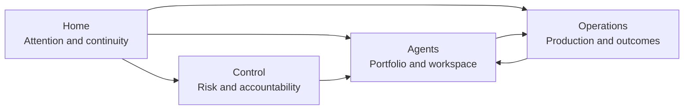
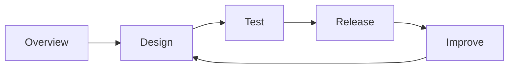
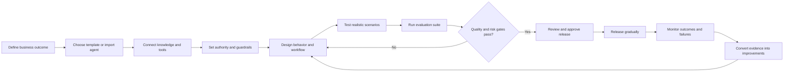
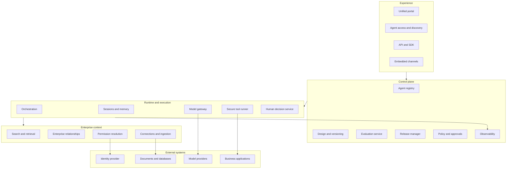

# Enterprise Agent Platform — Product Concept

**Status:** Concept blueprint
**Working name:** AgentGrid (placeholder)
**Purpose of this document:** Establish the product thesis, experience architecture, workflows, feature model, visual strategy, governance model, prototype scope, and product roadmap before any implementation begins.

> **Architecture update:** `PORTAL_ARCHITECTURE_PLAN.md` supersedes the earlier portal layout assumptions in this document. It reframes the primary product object as an agent-enabled business service and defines the deeper portfolio, assurance, operations, and governance model that must precede further screen design.

---

## 1. Non-negotiable experience requirement

> The product must be workflow-driven, not a collection of CRUD screens. It must use short navigation, preserve context, reveal complexity progressively, and connect every capability into an end-to-end user journey.

This requirement governs every design decision in this document.

### What the product must avoid

- Long global navigation with a destination for every entity
- Separate management screens for connectors, policies, tests, datasets, deployments, versions, and approvals when those objects belong inside a workflow
- Dashboards filled with metrics that do not lead to decisions
- Different, duplicated products for business users, developers, operators, and administrators
- Multi-page forms that force users to assemble an agent from disconnected records
- Losing the current agent, version, environment, or investigation context during navigation
- Exposing database concepts and implementation structure as the user's mental model

### What the experience must provide

- Four primary global destinations
- One coherent workspace for each agent
- Complete lifecycle journeys: define, design, test, release, operate, learn
- Contextual creation and editing
- Progressive disclosure of advanced options
- Role-aware starting points within a shared information architecture
- Exception-driven operations and governance
- Traceable transitions between production failures, tests, fixes, and releases
- Clear next actions rather than passive reporting

---

## 2. Product thesis

### One-line proposition

> Build reliable enterprise agents using company context, deploy them into real workflows, and govern their full lifecycle from one control plane.

### The problem

Organizations are accumulating agents built by different teams, frameworks, and vendors. These agents often have:

- Duplicated purposes
- Inconsistent access to enterprise information
- Unclear ownership
- Uncontrolled tools and action authority
- Little systematic testing
- Weak release discipline
- Fragmented observability
- No common definition of business success

The opportunity is not merely to provide another agent builder. The product can become the operating and governance layer for an organization's entire agent portfolio.

### Recommended initial wedge

> Register, test, release, govern, and observe agents built anywhere.

This is a narrower and more defensible starting point than simultaneously attempting to build enterprise search, hundreds of connectors, a general no-code workflow engine, a new agent runtime, and a marketplace.

### Differentiation

1. **Framework independence** — import and manage agents built with different SDKs and runtimes.
2. **Evidence-based trust** — connect every output and action to sources, tests, traces, policies, and versions.
3. **Business-outcome observability** — measure completed work and operational value, not only conversations.
4. **Progressive governance** — apply controls according to data sensitivity and action authority.
5. **Portable specifications** — version instructions, models, knowledge, tools, policies, and evaluations as separate but connected assets.
6. **Closed-loop improvement** — turn production failures into regression tests and verified releases.

---

## 3. Product mental model

The product has two scopes.

### Portfolio scope

Used to answer cross-agent questions:

- What requires my attention?
- Which agents exist and who owns them?
- What is failing across the organization?
- Which agents create value?
- Where is the organization exposed to risk?

### Agent scope

Used to complete the lifecycle of one agent:

- What does this agent do?
- What knowledge and authority does it have?
- Does it behave correctly?
- What changed in this version?
- Is it ready for release?
- How is it performing in production?
- What should be improved next?

Users should always know which scope they are in. Moving between scopes must preserve their point of origin.

---

## 4. Global experience architecture

The global navigation has four destinations.

| Destination | User question | Primary content |
|---|---|---|
| **Home** | What requires my attention? | Personalized work queue, recent work, approvals, incidents, recommended next actions |
| **Agents** | What agents exist, and where should I continue? | Portfolio, search, ownership, lifecycle state, agent workspace entry |
| **Operations** | What is happening across production? | Live health, incidents, failure clusters, cost, quality, business outcomes |
| **Control** | Are agents safe, approved, and accountable? | Risk inventory, approvals, violations, certifications, access changes, audit evidence |

### Capabilities that should not become global navigation

- Connectors
- Knowledge sources
- Tools
- Models
- Prompts
- Test cases
- Evaluation datasets
- Versions
- Deployments
- Environments
- Traces
- Policies
- Approvals
- Audit logs
- Templates

These remain searchable and directly addressable, but appear within the workflow where they are used.

### Global utilities

The application shell can contain:

- Organization/workspace switcher
- Universal search
- Command palette
- Notifications and assigned work
- Help and documentation
- User and organization settings

Reusable templates, tools, connectors, policies, and evaluation packs appear through a shared **Insert from library** interaction inside relevant workflows. The library is a capability, not a permanent top-level destination.

---

## 5. The agent workspace

Opening an agent enters one persistent studio rather than a collection of administrative pages.

### Workspace header

Always visible:

- Agent name and purpose
- Lifecycle state
- Active version and environment
- Owner
- Health or open issue indicator
- Primary next action

### Lifecycle stages

The agent workspace uses a lifecycle stepper rather than deep nested navigation:

1. **Overview**
2. **Design**
3. **Test**
4. **Release**
5. **Improve**

The stages are not a forced wizard. Users may move between them while the product preserves draft state and context.

### Overview

The agent's decision-oriented control center:

- Purpose and intended users
- Production status
- Current version
- Health and recent usage
- Business outcome summary
- Evaluation status
- Access and risk summary
- Recent changes
- Open issues
- Recommended next action

### Design

One composition surface containing:

- Instructions and expected behavior
- Knowledge and retrieval
- Tools and actions
- Workflow and branching
- Inputs and outputs
- Memory and session behavior
- Guardrails and approval boundaries

Selecting an element opens a contextual inspector. Advanced configuration is revealed only when relevant.

### Test

One continuous validation environment:

- Interactive playground
- Saved scenarios
- Evaluation suites
- Security and permission tests
- Version comparison
- Tool-trajectory inspection
- Cost and latency budgets

A playground interaction can become a saved test without leaving the page. A failed evaluation can jump directly to the responsible design component.

### Release

A guided decision, not a deployment records table:

- Summarize changes
- Compare the proposed version with production
- Review evaluation results
- Highlight new permissions and actions
- Estimate cost and performance impact
- Select audience and rollout strategy
- Request and record approvals
- Release, monitor, pause, or roll back

### Improve

The production learning environment:

- Run and outcome trends
- Failure clusters
- User feedback
- Cost and latency
- Knowledge gaps
- Trace investigation
- Version impact
- Recommended improvement opportunities

A production trace can be replayed safely, converted into a regression test, assigned to an owner, or connected to a proposed fix.

---

## 6. Primary personas and jobs

### Business builder

**Job:** Turn a repeatable business process into a safe agent without learning an engineering toolchain.

Needs guided templates, plain-language configuration, safe defaults, realistic previews, and clear release readiness.

### Agent developer

**Job:** Build, debug, evaluate, and release reliable agents efficiently.

Needs code integration, detailed traces, version comparisons, structured tests, flexible tools, and reproducible environments.

### Domain expert

**Job:** Define what good performance means and assess whether the agent's work is acceptable.

Needs understandable scenarios, rubrics, side-by-side output review, annotation, and low-friction feedback.

### Operator

**Job:** Detect, understand, and resolve production problems.

Needs prioritized incidents, dependency visibility, trace investigation, impact analysis, and safe mitigation actions.

### Security or governance reviewer

**Job:** Determine whether an agent's access, behavior, and authority are acceptable.

Needs concise change summaries, evidence, risk context, policy decisions, accountability, and auditable approvals.

### Executive sponsor

**Job:** Determine whether the agent portfolio creates sufficient value at acceptable cost and risk.

Needs business outcomes, adoption quality, investment concentration, operational exposure, and accountable ownership.

### Role adaptation principle

All personas use the same product architecture. Home prioritizes different work, while specialized depth appears contextually. The system must not create disconnected role-specific applications.

---

## 7. Golden-path lifecycle

The product's central loop is:

> Design → Test → Release → Observe → Learn → Improve

Every feature must strengthen this loop or remove friction from it.

---

## 8. Workflow specifications

### 8.1 Start a new agent

#### Entry

The user begins from Home, Agents, a business-process recommendation, or a reusable template.

#### Flow

1. Describe the desired business outcome.
2. Identify intended users and operating context.
3. Choose a pattern: answer, analyze, draft, recommend, act, monitor, or orchestrate.
4. Review a generated starting design.
5. Add approved knowledge and tools in context.
6. Set action authority and approval boundaries.
7. Enter the agent workspace at Design with a visible readiness checklist.

#### Experience requirement

Do not begin with a long blank form. Start from intent, progressively generate structure, and let the user refine it.

### 8.2 Build a knowledge agent

1. Define the questions the agent should answer.
2. Insert approved knowledge sources from the contextual library.
3. Preview accessible content using a representative user identity.
4. Define citation and uncertainty behavior.
5. Test retrieval and answer quality together.
6. Identify missing, stale, or conflicting knowledge.
7. Submit the complete version for release review.

Knowledge sources are edited within the agent's Design stage. Organization-wide source administration exists only for administrators and is reached from the relevant source or policy—not through routine builder navigation.

### 8.3 Build an action agent

1. Define the task and its success condition.
2. Add read tools and inspect returned information.
3. Add write actions with explicit authority levels.
4. Define validation, approval, timeout, retry, and compensation behavior.
5. Simulate actions using test data.
6. Evaluate expected tool trajectories.
7. Release to a limited audience.
8. Expand only after production evidence meets thresholds.

### 8.4 Import an existing agent

1. Register an endpoint or add platform instrumentation.
2. Detect model calls, tools, dependencies, and versions.
3. Confirm purpose, owner, users, and business outcome.
4. Assign data sensitivity and action authority.
5. Apply organization policies.
6. Establish baseline tests from representative traces.
7. Add the agent to the portfolio with a visible trust state.

Imported agents are first-class objects. The platform should not require agents to be rebuilt in its own builder.

### 8.5 Test a proposed change

1. Open the draft version from the agent workspace.
2. Run a realistic scenario in the playground.
3. Inspect sources, tool actions, latency, cost, and policy decisions alongside the result.
4. Save useful interactions as tests.
5. Run the relevant evaluation suite.
6. Compare the draft with the production version.
7. Jump directly from a failure to the responsible design element.

### 8.6 Release an agent

1. Review a human-readable change summary.
2. Review quality, safety, cost, and performance evidence.
3. Inspect newly requested knowledge or action authority.
4. Resolve failed gates.
5. Request the appropriate approvals.
6. Choose audience, environment, and rollout strategy.
7. Release gradually.
8. Observe release-specific thresholds.
9. Continue, pause, or roll back.

### 8.7 Investigate a production failure

1. Enter from Home, Operations, an alert, feedback, or the agent's Improve stage.
2. See impact, affected users, agent version, and likely failure category.
3. Inspect the end-to-end trace with sensitive information masked appropriately.
4. Determine whether the cause is knowledge, reasoning, a tool, a policy, a dependency, or configuration.
5. Replay safely against the original version and proposed changes.
6. Save the run as a regression test.
7. Assign or implement the correction.
8. Compare evaluation results.
9. Release or roll back.

The user should never need to copy identifiers among traces, tests, versions, and releases.

### 8.8 Review a risky change

1. Open an assigned review from Home or Control.
2. Read what changed and why the change is requested.
3. Inspect affected users, data, tools, action authority, and policies.
4. Review test and production evidence.
5. See unresolved concerns and compensating controls.
6. Approve, reject, request changes, or approve with conditions.
7. Record the decision and required re-review date.

### 8.9 Govern the agent portfolio

1. Start with exceptions rather than a raw inventory.
2. Investigate high-risk, unowned, duplicated, unused, expired, or noncompliant agents.
3. Review sensitive access and autonomous action authority.
4. Reassign, restrict, recertify, pause, or retire agents in context.
5. Export evidence for audit when required.

---

## 9. Feature placement model

This table prevents features from becoming scattered screens.

| Capability | Primary home | Secondary access |
|---|---|---|
| Instructions | Agent → Design | Version comparison |
| Knowledge sources | Agent → Design | Control when policy exceptions exist |
| Tools and actions | Agent → Design | Operations from a failed tool call; Control for risky authority |
| Models | Agent → Design advanced options | Operations for cost or reliability analysis |
| Memory | Agent → Design advanced options | Trace inspection |
| Test cases | Agent → Test | Created from playground or production trace |
| Evaluation suites | Agent → Test | Release gate evidence |
| Versions | Agent workspace header and Release | Trace lineage |
| Deployments | Agent → Release | Operations during incidents |
| Traces | Agent → Improve | Operations across agents |
| Policies | Control | Explained inline when affecting design, test, or release |
| Approvals | Home work queue and Control | Agent → Release |
| Templates | Contextual insert flow | Start-agent flow |
| Connectors | Contextual insert flow | Organization settings for administrators |
| Audit history | Contextual activity history | Control for cross-agent investigation |

---

## 10. Contextual interaction patterns

### Inspector rather than a new page

Selecting a knowledge source, tool, workflow step, evaluation result, or trace span opens an inspector containing the relevant details and actions. The primary canvas remains visible.

### Focus mode for deep work

Complex tasks such as trace investigation or workflow construction may expand into a focused surface, but the user retains a clear path back to the originating agent and stage.

### Activity as a connected narrative

Changes, tests, approvals, releases, and incidents appear in one agent timeline. Users can understand how a production state came to exist.

### Library as an insertion pattern

Templates and reusable assets appear when users choose to add knowledge, tools, tests, policies, or workflow components. Search and filters adapt to the insertion context.

### Command palette for expert navigation

Experienced users can jump to agents, versions, traces, actions, and commands without expanding the visible navigation.

### Domain language instead of generic CRUD

Use actions such as:

- Connect source
- Grant access
- Require approval
- Save as test
- Release version
- Roll back
- Pause agent
- Transfer ownership
- Retire agent

Avoid generic labels such as create record, edit object, and delete item.

---

## 11. Progressive disclosure

The same product supports different levels of expertise through layers of depth.

### Layer 1 — Outcome

- What the agent does
- Whether it is healthy
- Whether the work succeeded
- What requires attention
- What should happen next

### Layer 2 — Explanation

- Sources used
- Tools called
- Permissions applied
- Evaluation results
- Version changes
- Failure category
- Cost and latency contributors

### Layer 3 — Technical evidence

- Detailed traces and spans
- Raw structured inputs and outputs
- Schemas
- Runtime configuration
- SDK and API information
- Policy evaluation logs
- Model and dependency versions

The interface should never hide important evidence, but it should not force every user to process technical detail before completing a task.

---

## 12. Visual strategy

### Experience character

The product should feel:

- Calm under complexity
- Precise and trustworthy
- Operational rather than theatrical
- Dense only where investigation requires density
- Oriented around evidence and action
- Consistent across building, testing, release, and operations

### Visual hierarchy

1. Current scope and agent identity
2. Current state and primary next action
3. Outcome and risk signals
4. Supporting evidence
5. Technical detail

### Spatial model

Use a consistent three-part working surface where appropriate:

- **Left:** local structure or lifecycle context
- **Center:** primary task canvas
- **Right:** contextual inspector or evidence

Do not show all three regions when they are unnecessary. Simple tasks should remain simple.

### State language

Lifecycle state, health, quality, and risk are different dimensions and must not be collapsed into a single red/yellow/green status.

- **Lifecycle:** draft, in review, released, paused, retired
- **Health:** healthy, degraded, failing, unknown
- **Quality:** evaluation evidence and trend
- **Risk:** data sensitivity and action authority
- **Trust:** experimental, team-approved, organization-certified

### Charts as decision tools

Charts must include a clear investigation or action path. Avoid decorative KPI grids and invented composite scores.

---

## 13. Dashboard and chart system

### Home

Home is primarily a prioritized work queue. At most, include a small number of contextual summaries that help the current user prioritize.

### Operations

| Visualization | Question answered | Available action |
|---|---|---|
| Success and latency trend | Is reliability degrading? | Open affected period and traces |
| Failure-category distribution | What failure should be addressed first? | Open clustered failures |
| Cost by agent and model | Where is spending concentrated? | Inspect cost drivers or budgets |
| Run-volume heat map | When does demand peak? | Inspect capacity or queue behavior |
| Escalation funnel | Where do users or agents hand work off? | Review abandoned and escalated runs |
| Dependency graph | What upstream service caused impact? | Open dependency incidents |

### Agent Improve stage

| Visualization | Question answered | Available action |
|---|---|---|
| Evaluation score by version | Did a change improve behavior? | Compare versions |
| Cost-quality plot | Is additional model cost justified? | Test an alternate configuration |
| Execution waterfall | Which step creates latency? | Open the slow span |
| Retrieval breakdown | Is the agent using suitable knowledge? | Review sources and gaps |
| Tool trajectory | Did the agent follow the expected process? | Save or update a trajectory test |
| Failure clusters | What recurring behavior should be fixed? | Create a regression set |

### Control

| Visualization | Question answered | Available action |
|---|---|---|
| Risk versus certification matrix | Which risky agents lack sufficient review? | Open review workflow |
| Sensitive-access matrix | Which agents can access critical systems? | Inspect or revoke authority |
| Policy-violation trend | Are controls effective? | Inspect violation cluster |
| Ownership and expiration timeline | Which agents need accountable review? | Reassign or request certification |
| Permission-change history | Did a change increase exposure? | Compare and investigate |
| Action-authority distribution | Where can agents perform consequential writes? | Review high-authority agents |

### Executive portfolio view

This view belongs inside Operations or Control depending on the decision, not in a separate executive application.

| Visualization | Question answered |
|---|---|
| Business outcomes by agent | Which agents create measurable value? |
| Value versus operating cost | Where should investment increase or stop? |
| Adoption and task-success trend | Are agents becoming genuinely useful? |
| Risk exposure by business unit | Where is oversight insufficient? |
| Portfolio lifecycle distribution | How much of the portfolio is experimental, certified, or obsolete? |

---

## 14. Metric definitions

- **Task success rate:** successful completed tasks divided by eligible task attempts
- **Escalation rate:** human escalations divided by initiated tasks
- **Grounded response rate:** evaluated responses meeting evidence requirements divided by evaluated responses
- **Action accuracy:** correct action sequences divided by evaluated action runs
- **Cost per successful task:** total operating cost divided by successful tasks
- **Time to production:** approved production date minus initial creation date
- **Regression escape rate:** production regressions divided by released versions
- **Human intervention rate:** runs requiring manual handling divided by total runs
- **Reuse rate:** assets reused across multiple agents or workflows divided by eligible assets

Business value must be configured by workflow. It may represent revenue influenced, cases resolved, cycle-time reduction, fewer errors, improved service level, risk reduction, or another measurable outcome. “Hours saved” is only one possible measure.

---

## 15. Capability model

The capability model is deeper than the visible navigation. It informs the platform without becoming the interface.

### Registry and portfolio

- Agent identity, purpose, owner, team, and intended users
- Lifecycle, health, risk, and trust state
- Version and dependency history
- Search and duplicate detection
- Usage guidance and examples
- Ownership review and retirement

### Design and orchestration

- Natural-language starting point
- Guided patterns
- Visual composition
- Code and SDK integration
- Knowledge, tools, memory, inputs, and outputs
- Conditional and deterministic workflow steps
- Agent delegation
- Human approval steps
- Error, retry, timeout, and compensation behavior

### Enterprise context

- Documents, applications, databases, and APIs
- Semantic and keyword retrieval
- Permissions-aware access
- Source freshness and ownership
- Citations and lineage
- Authority ranking and conflict handling
- Retrieval debugging
- Sensitive-data classification
- Knowledge-gap detection

### Tools and actions

- Read and write distinction
- Standard connectors, APIs, functions, and MCP
- OAuth, service identity, and secret handling
- Typed input and output contracts
- Simulation and test modes
- Rate limits, retries, idempotency, and compensation
- Tool-level policy and approval requirements

### Testing and evaluation

- Playground and saved scenarios
- Golden datasets
- Deterministic assertions
- Model-based rubrics
- Human expert review
- Groundedness, safety, and permission evaluation
- Expected tool trajectories
- Cost and latency budgets
- Regression gates
- Production evidence converted to tests

### Release and runtime

- Immutable versions
- Environments
- Review and approval gates
- Canary releases and traffic splitting
- Pause and rollback
- APIs, embedded experiences, channels, schedules, and events
- Durable execution and human checkpoints
- Multi-runtime and private deployment options

### Operations and learning

- End-to-end traces
- Model, retrieval, tool, and delegation spans
- Cost, latency, quality, and outcome measures
- Failure clustering
- Alerts and incidents
- Feedback and escalation analysis
- Knowledge-gap detection
- Version impact and improvement recommendations

### Governance and security

- Identity and role-based access
- Data and connector policies
- Risk classification
- Action authority
- Approval separation
- Audit lineage
- Retention and residency
- Certification and periodic review
- Emergency pause and revocation
- Policy as code

---

## 16. Risk model

Risk is determined by at least two independent dimensions.

### Data sensitivity

1. Public
2. Internal
3. Confidential
4. Restricted

### Action authority

1. Read only
2. Draft or recommend
3. Write with human approval
4. Autonomous reversible action
5. Autonomous consequential action

### Example control tiers

| Tier | Example | Minimum control |
|---|---|---|
| 0 | Public FAQ | Basic testing and ownership |
| 1 | Internal knowledge assistant | Permission-aware retrieval and traceability |
| 2 | Customer-response drafting | Human review and audit history |
| 3 | CRM or ticket updates | Approval policy, validation, and rollback behavior |
| 4 | Financial, legal, identity, or safety action | Strong isolation, explicit authority, continuous evaluation, and incident controls |

Governance should increase with risk. Low-risk experimentation should remain easy.

---

## 17. Conceptual architecture

### Architectural principle

Separate the control plane from runtime and data planes. This enables centralized management while allowing agents to run in different clouds, private environments, and frameworks.

---

## 18. Core domain entities

The internal data model may include:

- Organization and workspace
- User, team, and service identity
- Agent and agent version
- Model configuration
- Knowledge source
- Tool and action
- Workflow component
- Policy
- Evaluation dataset and test case
- Evaluation run
- Environment and release
- Agent run and trace span
- Approval
- Incident
- Feedback
- Business outcome

These entities must not automatically become screens or navigation items.

Every production run should be traceable to:

> Agent version + model version + instructions + policies + knowledge snapshot + tool versions + environment

---

## 19. Prototype concept

The first prototype should demonstrate a coherent lifecycle rather than a wide collection of incomplete features.

### Prototype objective

Prove that a user can understand, test, release, govern, and improve an enterprise agent from one connected workspace.

### Prototype scenario

**Customer escalation agent**

1. Reads a support case.
2. Retrieves product guidance and account history.
3. Determines the likely issue.
4. Drafts a response with evidence.
5. Proposes a remediation action.
6. Requests approval before issuing an account credit.
7. Updates the support system after approval.
8. Records outcome, cost, latency, evidence, and tool history.

This scenario exercises knowledge, action, human approval, release, observability, governance, and business outcomes.

### Prototype surfaces

1. **Home** — personalized queue with a failed evaluation, release approval, and production incident
2. **Agents** — focused portfolio leading into the selected agent workspace
3. **Agent Overview** — purpose, status, evidence, risk, and next action
4. **Design** — unified workflow with contextual knowledge and tool inspection
5. **Test** — playground, saved scenarios, evaluation results, and version comparison
6. **Release** — change review, evidence, authority change, approval, and rollout
7. **Improve** — outcomes, failure cluster, trace investigation, and create-regression-test action
8. **Operations** — cross-agent incident queue and impact analysis
9. **Control** — high-risk review and portfolio exceptions

These are connected states of one product—not nine independent applications.

### Prototype exclusions

- Hundreds of live connectors
- A production agent runtime
- A complete enterprise graph
- Multi-cloud deployment
- Billing
- A general-purpose workflow automation suite
- Large-scale marketplace commerce
- Complex tenant administration

---

## 20. Roadmap

| Stage | Objective | Evidence of success |
|---|---|---|
| Concept validation | Confirm the buyer, urgent problem, and vocabulary | Repeated pain across interviews and clear willingness to pilot |
| Experience prototype | Demonstrate the connected lifecycle | Users complete key journeys without navigation assistance |
| Developer alpha | Support imported agents, traces, and evaluations | Teams use the portal during real development |
| Controlled beta | Operate a limited number of production agents | Reliable releases, incidents, and measurable outcomes |
| Enterprise release | Establish the organizational control plane | Security, audit, SSO, policy, and private deployment readiness |
| Expansion | Add construction, runtime, ecosystem, and optimization depth | Reuse, portfolio growth, and sustained business value |

---

## 21. Product principles

1. Navigate by user intent, not database entity.
2. Preserve agent, version, environment, and investigation context.
3. Keep the global navigation short.
4. Let capability depth live inside complete workflows.
5. Show the next meaningful action.
6. Make trust visible through evidence.
7. Make every production change testable.
8. Grant no more authority than necessary.
9. Keep high-risk actions interruptible.
10. Treat human review as a first-class capability.
11. Measure completed work and business outcomes, not message volume.
12. Support agents built outside the platform.
13. Turn production failures into regression tests.
14. Scale governance according to risk.
15. Use charts only when they support a decision.
16. Keep technical evidence accessible without forcing it on every user.
17. Prefer contextual inspectors and focused modes over new pages.
18. Treat lifecycle continuity as a core product capability.

---

## 22. Open product decisions

These decisions should be validated before implementation:

1. Which initial buyer has the most urgent pain: agent engineering, enterprise architecture, AI governance, or operations?
2. Is the first product primarily a control plane for existing agents or a builder with control-plane capabilities?
3. Which frameworks and runtimes must the first import path support?
4. Which business outcome should the first demonstration measure?
5. Which risk category should the first production pilot permit?
6. How much trace data may leave the customer's environment?
7. Which integrations are essential to the first end-to-end scenario?
8. What evidence is required before an agent may be labeled organization-certified?
9. Should the first release support runtime execution or integrate with external runtimes only?
10. What is the smallest credible enterprise deployment model?

---

## 23. Competitive references

- Glean Agents: https://www.glean.com/ai-agents
- Microsoft Copilot Studio governance: https://learn.microsoft.com/en-us/microsoft-copilot-studio/guidance/sec-gov-intro
- Microsoft zoned governance: https://learn.microsoft.com/en-us/microsoft-copilot-studio/guidance/sec-gov-phase2
- LangSmith platform: https://www.langchain.com/langsmith-platform
- LangSmith observability: https://www.langchain.com/langsmith/observability
- Salesforce Agentforce platform: https://www.salesforce.com/platform/agentforce-platform/

These references validate demand for enterprise agent building, lifecycle management, governance, evaluation, deployment, and observability. The intended product differentiation remains framework independence, evidence-based trust, progressive governance, and business-outcome observability.
