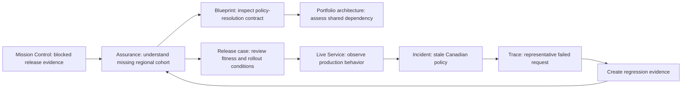

# AgentGrid Use-Case Map and Information Architecture

## 1. Coherent prototype slice

The dashboard will demonstrate one connected narrative:

> A technical service owner sees that a release is blocked by regional-policy evidence, understands the affected business outcome and architecture, inspects the service blueprint, reviews the assurance gap, follows the service into production, investigates the stale-policy incident, and creates regression evidence that returns to the assurance case.

This narrative covers the product loop without requiring separate administration areas.

## 2. Primary users in the slice

| User | Responsibility in the slice |
|---|---|
| Technical service owner | Owns blueprint, evidence plan, dependencies, and technical correction |
| Domain expert | Validates regional-policy behavior and evidence |
| Business service owner | Owns outcome contract and restoration acceptance |
| Release authority | Decides whether v1.9 may enter a controlled rollout |
| Operator/incident commander | Constrains production, investigates impact, and manages restoration |
| Risk/control owner | Assures authority, policy freshness, and control coverage |

## 3. Global information architecture

```text
Mission Control
Portfolio
Operations
Governance

Contextual Service Studio
├── Blueprint
├── Assurance
└── Live Service
```

Service Studio is not a fifth global destination. It opens from the exact service context in any workspace.

## 4. Global workspace contracts

### Mission Control

**Purpose:** Coordinate the viewer's consequential work.

**Dominant representation:** Prioritized decision queue with a selected decision context.

**Contains:**

- Decisions requiring judgment
- Evidence requests
- Incident responsibility
- Continuations from active work
- Recent decisions and their consequences

**Does not contain:** Generic KPI cards, all notifications, or a portfolio inventory.

### Portfolio

**Purpose:** Understand the agent-service estate through business and architecture relationships.

**Dominant representations:**

- Outcome lens: capability/process/service map with measured outcomes
- Architecture lens: service and dependency topology
- Lifecycle lens: service evolution and evidence maturity
- Exposure lens: authority and control coverage

**Prototype implements:** Outcome and Architecture lenses.

### Operations

**Purpose:** Understand current service behavior, impact, topology, incidents, and prevention.

**Dominant representation:** Service-operations topology combined with outcome/SLO trend and incident context.

**Contains:** Fleet-level signals and incident queue, with exact continuation into Live Service or Incident context.

### Governance

**Purpose:** Understand authority, policy, control effectiveness, exceptions, certification, and decision lineage.

**Dominant representation:** Risk-to-control coverage matrix and affected-service relationships.

**Prototype implements:** Policy freshness and financial-authority coverage for Customer Escalation.

## 5. Service Studio hierarchy

### Persistent Service Dossier

Visible across all three studio modes:

- Service mission
- Business capability and process
- Business, technical, and risk owners
- Current lifecycle and release
- Outcome state
- Certified operating scope
- Data sensitivity and action authority
- Open incident or evidence gap

### Blueprint

Primary hierarchy:

1. Outcome contract
2. Service journey
3. Typed architecture bands
4. Component contract
5. Data/action bindings
6. Applied controls
7. Failure and recovery behavior
8. Production evidence linked to the selected component

### Assurance

Primary hierarchy:

1. Candidate and material change
2. Fitness claim
3. Requirements and risks
4. Coverage matrix
5. Evidence and counter-evidence
6. Missing evidence
7. Participants and decision rights
8. Release readiness and rollout conditions

### Live Service

Primary hierarchy:

1. Outcome and SLO commitments
2. Current release and deployment scope
3. Demand/eligibility flow
4. Service dependency topology
5. Failure clusters and incidents
6. Representative request/run evidence
7. Authority usage
8. Improvement and regression coverage

## 6. Primary use-case map



## 7. Use-case inventory for the implemented slice

| ID | Use case | Entry | Decision or action | Continuation |
|---|---|---|---|---|
| UC-01 | Prioritize assigned work | Mission Control | Select the most consequential responsibility | Exact decision context |
| UC-02 | Resolve an evidence gap | Mission Control or Assurance | Assign/request/record missing domain evidence | Updated fitness claim |
| UC-03 | Understand service accountability | Portfolio or any service link | Review mission, ownership, outcome, and operating envelope | Blueprint, Assurance, or Live Service |
| UC-04 | Understand service architecture | Blueprint | Select component or relationship and inspect contract | Evidence or dependency impact |
| UC-05 | Assess shared dependency impact | Portfolio Architecture | Select policy data product | Affected services and active incident |
| UC-06 | Assess candidate fitness | Assurance | Review claims, coverage, counter-evidence, and gaps | Release case or design correction |
| UC-07 | Review release readiness | Assurance | Determine whether conditions permit controlled rollout | Release decision context |
| UC-08 | Observe business service | Live Service | Identify outcome/SLO or dependency deviation | Failure cluster or incident |
| UC-09 | Investigate incident impact | Operations or Live Service | Assess impact and mitigation | Representative trace |
| UC-10 | Create regression evidence | Incident or trace | Convert failure into requirement-linked scenario | Assurance coverage updated |
| UC-11 | Understand control coverage | Governance | Review policy-freshness and authority controls | Affected service or exception |

## 8. Context-preservation contract

Transitions preserve:

- `serviceId`
- Business capability/process
- Selected blueprint or release version
- Environment
- Consumer cohort
- Jurisdiction
- Time window
- Selected component, claim, incident, or run
- Originating work item

The browser URL may encode non-sensitive selection state; the API remains the source of truth.

## 9. Search and command behavior

Global search finds:

- Services
- Business capabilities and processes
- Incidents
- Releases
- Registry dependencies
- Decision records

The command menu supports high-frequency navigation and authorized domain actions. It does not compensate for missing information architecture.

## 10. Explicit exclusions from the prototype

- Generic connectors administration
- Organization settings
- Complete policy-authoring experience
- Full agent builder
- Billing and commercial marketplace
- Multi-agent swarm editor
- Every domain context from the canonical model

The prototype represents their relationships where relevant without building independent screens.
