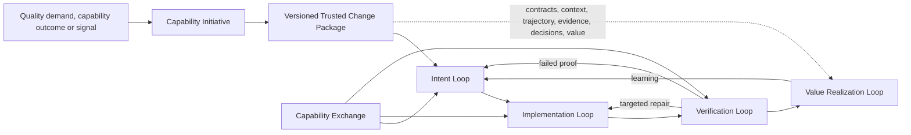
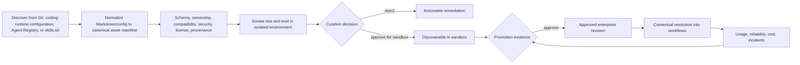

# Feature and Capability Map

## 1. Product boundary

The portal begins with a capability outcome, quality demand, unresolved problem, learning signal, or reusable capability contribution. A story, requirement, incident, repository, support case, design or test need is an input or trigger—not the unit of management. The work remains open until evidence supports a value decision and the learning has been routed back into intent, proof or the reusable system.



## 2. Human actors

The product uses three AI-SDLC experience actors. Organizational job titles map into these hats contextually; approval is a responsibility of the actor accountable for the decision, not a separate portal role.

| Actor | Primary journey | Accountable decisions and outputs |
|---|---|---|
| Intent Owner | Frame the outcome, build or validate journeys and UX concepts, clarify behavior, shape the AI-ready backlog and define value signals | Intent, behavior, UX and value-contract decisions |
| Architect | Define system boundaries, architecture, integrations, data, non-functional constraints, allowed change surface and proof direction | Architecture/context contract and consequential design decisions |
| AI Delivery Steward | Configure and supervise agents, implement, integrate, verify, operate tools and gates, prepare/release bounded changes, observe outcomes and maintain reusable platform assets | Execution posture, candidate change, evidence sufficiency, readiness and operational decisions |

The Intent Owner may be a product owner, analyst or domain lead. The AI Delivery Steward may be called an AI engineer, developer, engineer or delivery steward. QA, security, platform engineering, release and operations are capability lenses performed through specialist agents, skills, deterministic tools and policy under the Steward's accountability—not separate default personas.

Where risk requires human separation, another person can participate under the same Architect or AI Delivery Steward hat. Separation of duties does not require a new navigation persona.

## 3. Native assistive agents

Native agents are provisioned by the platform and visible in the registry. They are not hidden personas. The table below is the minimum delivery baseline, not an exhaustive catalog. The platform separates a small set of control-plane agents—intake, context assembly, orchestration, evidence synthesis, and learning—from extensible specialist agents selected by loop outcome and risk. The complete context, output-contract, agent-family, and runtime model is defined in `09_CONTEXT_CAPABILITY_AND_RUNTIME_COMPATIBILITY.md`.

| Agent | Purpose | Typical tools | Cannot do alone |
|---|---|---|---|
| Intake Agent | Recognize work, normalize source references, and request the required context | Jira, Confluence, Backstage, repository search | Accept business scope or treat search results as approved facts |
| Context Assembly Agent | Compile a governed, task-scoped Context Pack from approved Context Products | Context Fabric, connectors, source authority and freshness rules | Resolve material conflicts or approve context sufficiency |
| Requirements Agent | Turn ambiguity into testable intent | Knowledge search, requirement patterns | Invent policy or approval |
| Architecture Agent | Map impacted components and propose change structure | Backstage graph, repo graph, ADRs | Approve an exception |
| Workflow Composer | Resolve approved agents, skills, hooks, gates, and environments | Capability Exchange | Grant authority |
| Builder Agent | Implement a bounded plan | Repository, shell, package tools | Merge or deploy by default |
| Test Designer | Derive tests/evals from intent and risk | Test packs, fixtures, coverage tools | Waive required coverage |
| Verification Agent | Execute deterministic checks and agent evals | CI, scanners, browser, test runners | Self-certify evidence sufficiency |
| Security Reviewer | Threat-model changes and inspect evidence | SAST, secrets, dependency/SBOM tools | Accept risk on behalf of owner |
| Change Reviewer | Compare change to contract and standards | Diff, code graph, review policies | Approve protected merge without mandate |
| Release Agent | Assemble evidence and coordinate bounded release | CI/CD, deployment, observability | Release beyond assigned envelope |
| Learning Agent | Convert incidents and deviations into regression assets | Telemetry, incident, tests, registry | Change policy without review |

## 4. Entry points

### 4.1 Primary entry — Establish working context

The user lands on **Work**. Returning users may resume an active Trusted Change Package directly. A user starting implementation work first selects or confirms the repository/service where work will occur; a deep link from Jira, GitHub, Backstage, an IDE, or CLI may resolve that scope automatically.

Work then answers, in order:

- Which repository, service, system, or product context am I working in?
- Is the context sufficient and current for this class of work?
- Which ticket, signal, or outcome do I want to move?
- Which named Delivery Harness will perform it?
- What is running, what requires my judgment, and what can continue autonomously?

Primary journey:

```text
Select/infer repository or system
→ establish or verify Repository Delivery Profile
→ select Jira/other work
→ qualify intent and challenge gaps
→ select, extend, or create Delivery Harness
→ review task Execution Blueprint
→ run, decide, verify, release, and learn
```

For non-code Intent work, the first scope may be a product, service, system, or Context Product rather than a repository. The invariant is context before action, not repository selection for every possible activity.

### 4.2 Contextual entry — From Jira, Confluence, GitHub, IDE, or Backstage

Deep links and extensions first resolve work identity, repository/service scope, Repository Delivery Profile, context readiness, effective Delivery Harness, user authority, and any existing Trusted Change Package. They only ask the user to choose when resolution is ambiguous or consequential. Examples:

- `Implement ENG-4521`
- `Turn this Confluence decision into a delivery plan`
- `Fix this failing GitHub check`
- `Use this Backstage component as the affected service`
- `Continue this thread in my IDE`

### 4.3 Repository Delivery Profile and Delivery Harness

A Repository Delivery Profile is the versioned working context and execution posture of a repository. A Delivery Harness is its named reusable composition of Work Patterns, agents, skills, output contracts, Context Products, MCP/tools, hooks, rules, models, permissions, gates, evidence, and recovery behavior.

Workflow Fragments compose into Work Patterns; Work Patterns compose into a Delivery Harness. A ticket plus the selected harness resolves to a task-specific Execution Blueprint. These distinctions and the complete entry journey are defined in `10_REPOSITORY_FIRST_WORK_ENTRY_AND_DELIVERY_HARNESS.md`.

### 4.4 Exchange entry — Discover or contribute a capability

Use when the user's job is to find, compare, publish, certify, deprecate, or provision a reusable asset.

### 4.5 Estate entry — Govern a deployed system

Use when the user's job is cross-agent oversight: ownership gaps, duplicated capabilities, excessive authority, vulnerable dependencies, failed controls, cost concentration, or live outcome deviation.

## 5. Canonical reusable-asset model

The Exchange catalogs more than agents.

| Asset kind | What it contains | Examples |
|---|---|---|
| Agent Definition | Role, instructions, model policy, tools, boundaries, input/output contract | Builder Agent, Security Reviewer |
| Skill | Instructions, scripts, references, assets, compatibility | React migration, API contract testing |
| Workflow Pattern | Graph of agents, humans, gates, environments, and transitions | Standard story delivery, incident repair |
| MCP Server | Connection metadata, exposed tools/resources, auth methods, risk | Atlassian, GitHub, Sentry |
| MCP Tool | Input/output schema, side effects, permission class, owner | `getJiraIssue`, `transitionJiraIssue` |
| Hook | Deterministic lifecycle trigger and enforcement action | Pre-tool deny, post-edit formatter, stop gate |
| Rule / Standard | Advisory or enforceable project instruction | API standards, accessibility, naming |
| Mandate | Non-bypassable organizational control with exception path | No secrets in prompts, protected production writes |
| Test Pack | Scenarios, fixtures, graders, thresholds, coverage model | PCI negative paths, UI accessibility |
| Environment Profile | Runtime, sandbox, network, secret, compute, and data policy | Local worktree, CI sandbox, staging |
| Model Profile | Approved model/provider, region, cost, data, reasoning policy | Secure code review profile |
| Repository Pattern | Skeleton, CI, documentation, ownership, catalog descriptors | TypeScript service, MCP server |
| Knowledge Product | Curated logical context source with freshness, authority, retrieval, storage, citation, and access contract; content may remain in an external provider | Engineering standards, product policy, Bedrock Knowledge Base, Foundry IQ/Azure AI Search knowledge base, Copilot Space |

Every asset revision requires:

- Immutable identity and version
- Publisher and accountable owner
- Source repository and package/runtime location
- Description and semantic capability tags
- Input/output contract
- Compatible runtimes and environments
- Dependencies and transitive risk
- Required credentials and permission scopes
- Data classifications and external egress
- Side-effect and authority class
- Test/eval evidence
- Signature, SBOM, scan state, and provenance
- Lifecycle state and support tier
- Adoption, success, failure, cost, and incident observations
- Deprecation and migration guidance

### 5.1 Base assets, extensions, and repository bindings

Reusable does not mean identical everywhere. The platform supports a controlled specialization chain:

```text
Enterprise base revision
→ organization/team extension
→ repository extension and bindings
→ Loop Work Item parameters
→ resolved Execution Blueprint
```

Examples:

- A base Requirements Clarification Agent defines the question strategy and output contract; a payments repository extension adds PCI terminology, local architecture references, and repository-specific acceptance checks.
- A base Implementation Agent defines safe coding behavior; a Java service extension adds build commands, approved frameworks, package conventions, and test expectations.
- A base delivery pattern defines intent, implementation, verification, and approval nodes; a team extension inserts its architecture review and deployment gate.

Extensions reference a pinned base revision using `extends`; they store only intentional differences rather than copying the complete base asset. Repository-specific connections use `bindings` for local paths, tools, environment profiles, owners, test commands, and knowledge sources. Run-specific values use parameters and do not create a new catalog revision.

Customization rules:

- An extension may add instructions, skills, tests, knowledge, hooks, workflow nodes, or stricter permissions.
- It may replace an extensible default only where the base contract declares an extension point.
- It may narrow tool, data, model, network, or environment authority, but cannot broaden it without a separate approval.
- Enterprise mandates and required gates cannot be removed or weakened by team or repository extensions; a governed exception is required.
- Input/output contracts, node ports, and runtime compatibility are revalidated after composition.
- Every resolved blueprint records the full lineage, effective values, conflicts, and source revisions.

Repository extensions live with the repository and change through its normal pull-request process. The Exchange shows them as related variants of the base asset—not as unrelated duplicates. When a base revision changes, maintainers receive a semantic diff, compatibility result, affected-repository list, and an explicit adopt, defer, or migrate workflow. Existing pinned repositories do not change silently.

## 6. Catalog construction workflow

Catalog construction is one coordinated **Prepare enterprise catalog** journey. It starts from required delivery coverage for a pilot, not from empty CRUD screens. The Steward defines the Catalog Charter, discovers existing supply, classifies the correct reusable primitive, normalizes canonical contracts, consolidates extension families, performs trust and kind-specific evaluation, curates a coherent enterprise seed catalog, publishes immutable revisions, binds them to repositories, and learns from real runs.

The complete entry, stages, decision surfaces, evaluation lanes, seed family, failure behavior, and delivery slices are defined in `11_ENTERPRISE_CAPABILITY_CATALOG_PREPARATION_JOURNEY.md`.



Catalog ingestion modes:

1. **Git-managed** — manifests live with source and update through reviewed pull requests.
2. **Developer-agent registry synchronization** — index approved Git revisions through Agent Registry and discover candidates from sources such as `skills.sh`; external discovery never grants approval or execution authority.
3. **Runtime/repository discovery** — observe Codex, Claude Code, Copilot, Kiro, Cursor, and similar repository configurations and flag unregistered or divergent assets.
4. **Template publication** — approved scaffolding or workflow creation registers outputs automatically.
5. **Manual proposal** — UI or CLI creates a draft manifest and pull request; it never directly creates an approved asset.

All external assets move through candidate discovery, isolated quarantine, normalization, security and instruction validation, sandbox evaluation, approval, and promotion into an enterprise-controlled immutable registry or Git mirror. Repositories reference the approved internal revision and store only their extensions and bindings.

PyPI, npm, OCI, Kubernetes, A2A, and cloud agent registries are not part of the initial Markdown/config asset path. They are conditional providers for executable packages or independently deployed agents in later use cases.

Catalog states:

```text
Discovered → Draft → Validating → Sandbox approved → Enterprise approved
          ↘ Rejected        ↘ Constrained          ↘ Deprecated → Retired
```

## 7. Feature domains

### 7.1 Work intake and context

- Universal start/resume command
- Jira story search, pull, assignment, and transition
- Confluence requirement and decision ingestion
- Repository, PR, commit, build, design, incident, and service selection
- Source deduplication and freshness
- Federated connection to existing Bedrock Knowledge Bases, Foundry IQ/Azure AI Search, Copilot Spaces, and internal search/vector providers
- Provider capability discovery and normalized retrieval with citations, ACL behavior, health, latency, cost, and audit receipts
- Federated, governed-cache, and managed-mirror storage modes with explicit residency, retention, and replay policy
- Context authority ranking, conflict resolution, instruction-safety scanning, access isolation, and context-budget management
- Requirement extraction and ambiguity detection
- Stakeholder and decision-right resolution
- Acceptance criteria and non-goals
- Risk/materiality classification
- Affected-system graph
- Capability Initiative and Trusted Change Package creation, pause, resume, branch, and handoff
- Change impact when sources update

### 7.2 Capability Exchange

- Unified search across all asset kinds
- Natural-language and structured capability discovery
- Contextual recommendations from story, repository, risk, and environment
- Compare revisions by capability, permissions, evidence, compatibility, support, and cost
- Asset dossier and dependency graph
- Provenance, publisher, signature, SBOM, scan, license, and vulnerability visibility
- Certification, promotion, deprecation, migration, and retirement workflows
- Install/provision into repository, runtime, team, or workflow
- Contribution wizard that generates source-controlled manifest and review
- Duplicate detection and “reuse versus create” decision
- Adoption, reliability, outcome, cost, and incident scoring

### 7.3 Agent and workflow composition

- Conversation-to-blueprint generation
- Visual workflow graph with agent, human, tool, skill, hook, gate, environment, and outcome nodes
- Source/manifest representation of the same graph
- Contextual asset insertion from Exchange
- Agent responsibilities, prompts/instructions, inputs, outputs, and stop conditions
- Runtime-local delegation between configured developer agents
- Deferred extension: A2A binding only for independently deployed remote agents
- Per-agent skill and tool scopes
- MCP server/tool binding with delegated identity
- Data lineage and authority overlays
- Parallel and sequential orchestration
- Retry, compensation, timeout, escalation, and fallback paths
- Human approval/reject/request-changes nodes
- Simulation using realistic task data
- Pattern extraction from successful workflows

### 7.4 Provisioning and execution

- Runtime selection: Codex, Claude Code, Kiro, GitHub Copilot, ADK, custom
- Canonical definition compiler to runtime-specific files/configuration
- Repository/worktree/branch provisioning
- Environment and dependency bootstrap
- Ephemeral credentials and on-behalf-of identity
- Network, filesystem, command, data, and tool permission envelope
- Secrets references without exposing secret values
- Deterministic plan and execution checkpoints
- Live agent tree, tool-call journey, diff, logs, cost, and token/resource telemetry
- Pause, steer, cancel, retry, resume, and handoff
- Artifact retention and cleanup

### 7.5 Rules, skills, hooks, mandates, and guardrails

The portal must not present these as equivalent toggles.

| Mechanism | Nature | Selection | Enforcement |
|---|---|---|---|
| Instruction / standard | Guidance applied to relevant work | Context or repository | Agent compliance, later verified |
| Skill | Reusable procedure with resources/scripts | User, recommender, or agent | Loaded when relevant |
| Tool permission | Ability to invoke an operation | Policy resolution | Runtime allow/deny |
| Hook | Deterministic lifecycle action | Workflow or mandate | Executes at configured event |
| Gate | Evidence-based transition condition | Workflow pattern | Blocks state transition |
| Mandate | Organization control | Centrally assigned | Cannot be removed locally; exception required |
| Human decision | Accountable judgment | Decision-right model | Signed approve/reject/constrain |

Required guardrail features:

- Scope hierarchy: enterprise → business unit → platform → repository → workflow → run
- Base-to-extension lineage and repository-owned overlay resolution
- Conflict detection and precedence explanation
- Preview of effective controls before execution
- Policy-as-code evaluation
- Pre-tool approval/deny hooks
- Post-edit formatting/scanning hooks
- Stop hooks that require evidence before completion
- Required test/eval/scan gates
- Human approval for material actions
- Exception request, expiry, compensating controls, and recertification
- Runtime receipts proving what was actually enforced

### 7.6 Verification and evidence

- Acceptance criteria → requirement coverage
- Deterministic unit, integration, contract, UI, performance, and security tests
- Agent behavior evals and tool-trajectory evaluation
- Golden and adversarial test cohorts
- Test data sets, generators, synthetic policies, masking, and retention
- Changed-code and changed-behavior coverage
- Baseline versus candidate comparison
- Flaky-test and unreliable-eval handling
- Evidence lineage to story, clause, change, run, asset revision, and environment
- Reviewer annotations and disputed evidence
- Automated remediation loop with bounded attempts
- Signed verification verdict and evidence package export

### 7.7 Human gates and decisions

- Requirements acceptance
- Architecture and implementation-plan review
- Material tool-call confirmation
- Security/risk exception
- Evidence sufficiency review
- Pull-request approval
- Merge authorization
- Release scope approval
- Production action approval
- Rollback/restrict/retire decision

Every decision shows:

- What changed
- Why this person is the decision owner
- Evidence for and against
- Missing evidence
- Consequence of approve, reject, constrain, defer, or request changes
- Scope and expiry
- Audit identity and timestamp

### 7.8 Value realization

- PR creation and linked story update
- Protected merge workflow
- Build/package/SBOM/sign/signature
- Environment promotion
- Bounded release/canary/cohort
- Deployment health and rollback
- Outcome/SLO/cost/adoption observation
- Incident correlation to story, workflow, assets, and decisions
- Production failure → regression scenario
- Asset reliability and workflow-pattern scoring
- Automatic deprecation/review trigger
- Post-implementation summary back to Jira/Confluence

### 7.9 Estate governance

- Deployed agent and workflow inventory
- Ownership, lifecycle, certification, and support status
- Agent/tool/data/environment topology
- Authority and credential exposure
- Unregistered and shadow-agent discovery
- Duplicate agents/skills/MCP servers
- Vulnerability, stale dependency, expired exception, and policy drift
- Cost, adoption, reliability, incident, and outcome lenses
- Restrict, pause, recertify, migrate, deprecate, and retire workflows
- Audit and compliance evidence export

### 7.10 Platform administration

- Organization, team, user, service, and agent identities
- RBAC/ABAC and delegated authority
- Registry providers and synchronization policies
- MCP gateway and provider configuration
- Environment, model, network, data, and secret policies
- Runtime adapters and version compatibility
- Mandate and exception administration
- Retention, residency, audit, and export policies
- Usage quotas, budgets, cost allocation, and chargeback
- Platform health and connector diagnostics

## 8. MVP boundary

The first product increment is one small capability moving through all four loops, not a partial catalog and not merely one story-to-code path.

### MVP scenario

> Start from one quality demand, build a governed context product from Jira, Confluence, Git and support knowledge, create an approved intent backlog with journey, behavior, architecture and proof contracts, implement one bounded repository slice, produce unit plus integration and one risk-relevant non-functional proof, decide UAT/release readiness, observe technical and value signals, and feed one verified learning back into a reusable asset.

### MVP assets

- 4 native agent roles: Coordinator/Requirements, Implementer, Verifier, Reviewer
- 1 four-loop Work Pattern with several loop work items
- 2 MCP integrations: Atlassian and GitHub
- 1 repository runtime adapter, initially Codex or GitHub Copilot
- 3 guardrail types: instructions, deterministic hooks, gates
- 1 human decision model with approve/reject/request changes
- 1 catalog ingestion path from source-controlled manifests
- 1 Backstage component/repository context adapter
- 1 Context Product and versioned Trusted Change Package
- 1 technical and 1 user/business value signal

### Explicitly deferred

- Marketplace commerce
- General-purpose low-code automation
- Multi-cloud deployment orchestration
- Full production agent operations
- Dozens of connectors
- Fully autonomous release
- Arbitrary user-authored code inside the portal
