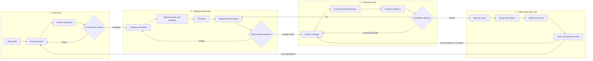
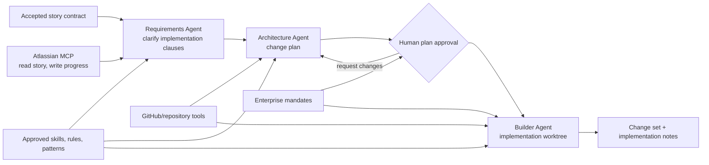
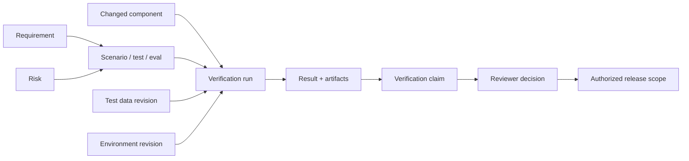

# Four-Loop AI-SDLC Journey

## 1. Durable object: the Trusted Change Package

The entire journey is carried by one versioned Trusted Change Package rather than a ticket, chat session or set of disconnected modules. A Delivery Thread is the active workbench projection used to collaborate on that package.

The Trusted Change Package contains:

- Source work item and linked context
- Intent contract and accepted requirements
- Affected repositories, services, APIs, owners, and environments
- Execution blueprint and resolved reusable-asset revisions
- Effective rules, skills, hooks, mandates, permissions, and exceptions
- Agent runs, human contributions, tool receipts, logs, costs, and change sets
- Verification plan, test data, results, reviews, and evidence graph
- Gate decisions, release scope, deployment, observations, and learning

## 2. The four loops

## 3. Loop 1 — Intent

### Entry triggers

- Jira assignment, selection, URL, or natural-language search
- Confluence requirement or architecture decision
- Backstage component or repository
- GitHub issue, pull request, failing check, or vulnerability
- Incident or runtime finding
- Blank business intent

### Input

- Source text and fields
- Linked documents and design artifacts
- Repository/service ownership and dependencies
- Current release, incidents, and known constraints
- Enterprise mandates and repository instructions
- User identity, role, team, and delegated authority

### Process

1. Intake Agent retrieves the source with the user's scoped identity.
2. The system resolves linked Jira, Confluence, Backstage, repository, build, and incident context.
3. Requirements Agent separates sourced facts, stakeholder statements, inferences, conflicts, and unknowns.
4. The affected-system graph identifies likely repositories, APIs, owners, data, and environments.
5. Material questions appear one at a time in conversation; answers update a visible work contract.
6. Acceptance criteria, non-goals, risk, human decision owners, and required evidence become explicit.
7. A human accepts, rejects, narrows, or defers the intent contract.

### Output — Trusted Work Contract

- Business outcome and user impact
- Functional behavior and non-goals
- Acceptance criteria and negative requirements
- Affected components and owners
- Data and action sensitivity
- Risk/materiality classification
- Accountable decision owners and any risk-triggered human-separation rule
- Assumptions, conflicts, unknowns, owners, and due dates
- Source lineage and freshness

### Gate G1 — Intent accepted

Implementation cannot begin when a material requirement, affected system, or decision owner is hidden. It may begin with assigned nonmaterial gaps if their consequences are explicit.

## 4. Loop 2 — Implementation

### Entry

An accepted work contract.

### Input

- Work contract
- Repository and service context
- Candidate workflow patterns
- Available approved agents, skills, MCP tools, rules, hooks, test packs, and environments
- Runtime preferences and organizational mandates

### Process

#### 4.1 Generate an execution blueprint

Workflow Composer proposes a graph based on capability slice, repository, risk and required evidence. For the illustrative story-triggered slice:

#### 4.2 Resolve reusable assets

The composer resolves exact revisions, not labels:

- Agent revision and runtime adapter
- Required and optional skills
- Repository and enterprise instructions
- Hooks and gate definitions
- MCP server/tool revisions
- Environment and model profile
- Test packs and evidence requirements

If no approved asset fits, the user can:

- Use a constrained sandbox asset
- Request a new asset
- Propose a draft asset and approval workflow
- Implement without an agent capability when safer

#### 4.3 Bind context and authority

Each agent receives only:

- Required repository paths
- Required context sources
- Explicitly permitted tools
- Minimum read/write scopes
- Bounded environment and network access
- Time, cost, and iteration budget
- Human confirmation points

The visual graph overlays capability and authority separately. A connected Jira write tool, for example, remains unusable until an identity and permission policy are bound.

#### 4.4 Provision

Deterministic provisioning creates:

- Branch/worktree or isolated workspace
- Runtime-specific instruction, skill, agent, hook, and MCP configuration
- Dependencies and test environment
- Ephemeral credential references
- Trace, audit, and artifact capture
- Initial story status update

#### 4.5 Execute and steer

The user sees the agent tree and execution journey, not raw chat alone:

- Current objective and active agent
- Plan step and reason
- Tools used and permission boundary
- Files changed and diff trajectory
- Unresolved questions and blocked work
- Tests already executed
- Cost/time and attempt budget
- Pause, steer, reject plan, cancel, or request human help

### Output — Candidate Change Package

- Source changes
- Generated/updated configuration
- Migration or deployment artifacts
- Implementation rationale
- Updated architecture relationships
- Traceable agent and tool receipts
- Known gaps and verification obligations
- Draft pull request

### Gate G2 — Change ready for verification

The change package must satisfy plan scope, repository hygiene, mandatory hooks, and artifact completeness. Passing G2 does not mean the change is correct.

## 5. Loop 3 — Verification

### Entry

Candidate change package plus work contract.

### Input

- Requirements and risks
- Change diff and affected dependency graph
- Test packs, historical failures, and repository test inventory
- Agent/tool trajectory
- Baseline behavior and performance
- Security and policy mandates

### Process

1. Test Designer maps each material requirement and risk to evidence obligations.
2. Verification Agent selects deterministic tests, agent evals, scanners, and review agents.
3. Test data is resolved from governed cohorts, fixtures, generators, or masked samples.
4. Checks execute in an isolated environment with reproducible configuration.
5. Failures route back to the Implementation Agent under AI Delivery Steward supervision with exact requirement and evidence lineage.
6. Bounded repair attempts may run automatically; exhausted attempts require a human decision.
7. Candidate is compared with baseline for behavior, security, performance, cost, and authority.
8. Human reviewers inspect the evidence package and approve, reject, constrain, or request changes.

### Evidence graph

### Human review actions

- **Approve** — evidence is sufficient for the proposed scope.
- **Reject** — change contradicts requirement, standard, or risk tolerance.
- **Request changes** — returns exact findings to the implementation loop.
- **Constrain** — approve only a reduced environment, cohort, authority, duration, or feature flag.
- **Defer** — preserve current state and assign missing evidence.
- **Exception** — invoke a separate accountable policy-exception workflow.

### Output — Verification Evidence Package

- Requirement-to-evidence coverage
- Test/eval/scan/review results
- Baseline-candidate comparison
- Failed and waived checks
- Reviewer comments and disputes
- Tool and environment provenance
- Security, quality, performance, and authority claims
- Signed decision and approved scope

### Gate G3 — Verified for bounded release

Only a decision owner may accept residual material risk. Agents can recommend but cannot sign the gate.

## 6. Loop 4 — Value Realization

### Entry

Verified change, release hypothesis and authorized release scope.

### Input

- Pull request and change artifacts
- Evidence package and approvals
- Deployment pattern and environment policy
- Observability and outcome contract
- Rollback and safe-state definition

### Process

1. Release Agent updates PR, story, documentation, and release notes.
2. Protected merge verifies approval freshness and unchanged commit identity.
3. Build, SBOM, signing, packaging, and deployment execute deterministically.
4. Release enters the approved environment/cohort/feature-flag envelope.
5. Live technical and business outcomes are compared with the intent contract.
6. Deviations can automatically pause or restrict the release under mandate.
7. Incidents, reviewer findings, and real usage become new regression evidence.
8. Workflow patterns and catalog assets accumulate reliability, cost, and support observations.
9. Adoption, support, user behavior and business signals are compared with the value contract.
10. An accountable owner decides to scale, revise, rollback, pause or retire.
11. Jira and Confluence receive a concise outcome-linked implementation record.

### Output

- Merged change and deployment record
- Updated Jira story and linked documentation
- Release decision and environment receipts
- Outcome/SLO/cost observations
- Adoption, business-impact and value-attribution observations
- Regression tests and new verification cohorts
- Asset reliability and compatibility signals
- Improvement, deprecation, or policy-change proposals

### Gate G4 — Outcome accepted or corrective loop opened

The Trusted Change Package closes only when the relevant technical safety, downstream acceptance, value and learning signals are sufficient, or corrective work has an accountable owner and linked package.

## 7. Example capability slice triggered by story ENG-4521

### Step 1 — Start

Maya selects **Payment API** from her recent working contexts, or enters through `ENG-4521` and lets the portal infer Payment API from Jira/Backstage mappings. The portal first checks the repository's approved Repository Delivery Profile and reports whether context is ready, partial, stale, or blocked for this change class.

If Maya is new to the repository or material context is missing, she follows **Establish repository context** before implementation. If the profile is ready, she selects the assignment and says `Implement ENG-4521`.

System retrieves:

- Jira fields, comments, links, acceptance criteria, and workflow state
- Linked Confluence requirement and architecture decision
- Backstage component, owner, repository, APIs, and dependencies
- Repository instructions, supported runtime assets, active incidents, and mandates
- Approved Context Products, context gaps/freshness, and repository Delivery Harnesses

### Step 2 — Clarify

Conversation asks only material questions. The work contract updates beside it. Maya accepts the result and assigns one unresolved policy question to Priya.

### Step 3 — Compose

System recommends the repository's named **Payments Standard Change** Delivery Harness and resolves a task-specific Execution Blueprint. Maya sees:

- Requirements → Plan → Human plan approval → Build → Verify → Human release approval
- Exact agents and revisions
- Skills and repository patterns
- Jira read/write tools and GitHub tools
- Hooks and gates
- Authority and data overlays
- Enterprise, team, repository, and task-specific configuration differences
- Planned human decisions and uncertainty conditions that may create an escalation

She may generate the graph by chat, drag in an approved asset, connect a node, or edit the manifest. All modes change the same definition.

### Step 4 — Provision

The portal compiles the canonical workflow into the chosen runtime format, provisions a worktree, installs required assets, binds short-lived credentials, and verifies hooks before execution.

### Step 5 — Implement

The Implementation Agent executes the approved plan under Maya's AI Delivery Steward supervision. A pre-tool hook blocks an unexpected production command. Maya can inspect the denied action and either keep it denied or start an exception request; she cannot silently disable the mandate.

### Step 6 — Verify

The Test Designer derives coverage from the intent contract. Unit, integration, UI, accessibility, and security checks execute. A failed negative test routes back to the Implementation Agent and AI Delivery Steward, which fix it and rerun affected coverage.

### Step 7 — Decide

Reviewer sees the changed behavior, diff, evidence coverage, unresolved gap, agent/tool trajectory, and consequences. Buttons are Approve, Reject, Request changes, Constrain, and Defer.

### Step 8 — Release and learn

After protected merge and bounded release, outcome signals remain linked. A production edge case becomes a regression scenario and improves the workflow pattern's evidence profile.

## 8. Failure and recovery paths

| Failure | Experience response | Preserved object |
|---|---|---|
| Jira unavailable | Continue with cached source marked stale; block write-back | Trusted Change Package and source revision |
| Requirement conflict | Expose both sources and decision owner | Conflicted clause |
| No suitable agent/skill | Create capability request or constrained draft asset | Execution blueprint gap |
| MCP authentication expires | Pause only affected node and request reauthorization | Run state and completed evidence |
| Tool requests excessive authority | Deny binding and show narrower alternatives | Proposed binding and policy reason |
| Agent stalls or loops | Stop at budget, preserve trace, hand off or change agent | Agent run and attempt history |
| Hook blocks operation | Show deterministic reason and remediation/exception path | Hook receipt |
| Test/eval unreliable | Mark evidence disputed, change cohort/grader, rerun | Evidence lineage |
| Reviewer rejects | Return exact findings to implementation loop | Gate decision |
| Source changes during work | Show impact on requirements, plan, tests, and approval freshness | Revision impact graph |
| Release regresses | Restrict/rollback and create linked corrective thread | Release and observation record |

## 9. Journey success measures

- Time from quality demand/signal intake to accepted intent contract stack
- Reuse rate of approved assets versus one-off definitions
- Percentage of tool bindings with least-privilege identity
- Plan approval changes caught before code generation
- Requirement-to-evidence coverage
- Automated repair success without bypassing gates
- Human review time and decision reversal rate
- Lead time from accepted intent to verified change
- Production escape and rollback rate
- Percentage of incidents converted to regression evidence
- Asset reliability, deprecation, and duplicate-reduction trends
