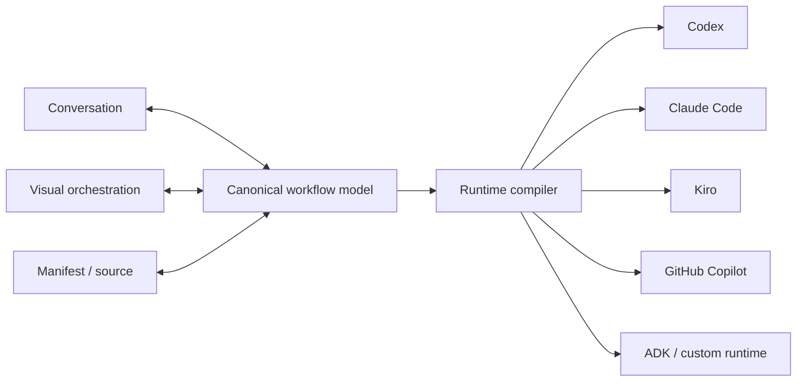
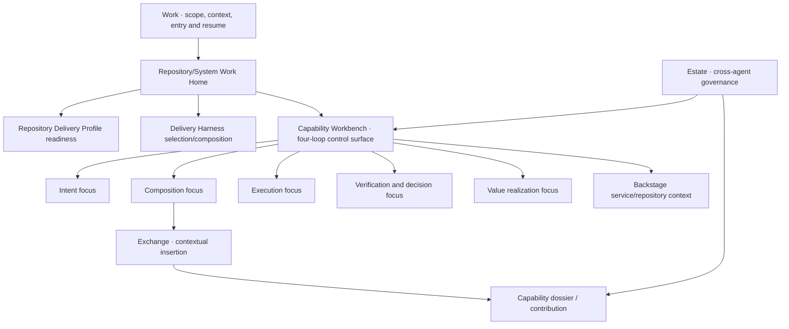

# Experience and Surface Contracts

## 1. Experience strategy

The portal does not ask users to decide whether they are “using chat” or “using a builder.” It maintains one semantic model with three synchronized ways to work:

1. **Conversation** — express intent, resolve ambiguity, ask why, and request changes.
2. **Visual composition** — understand structure, responsibility, sequence, authority, gates, and failure paths.
3. **Source/manifest** — inspect precise configuration, diff revisions, review as code, and automate through Git.



No mode is a lossy export. A chat instruction that adds a security reviewer creates a graph node and manifest change. Dragging a skill onto an agent updates the manifest and produces a conversational explanation. Editing source revalidates the graph and highlights consequences.

## 2. Global orientation

Global navigation remains intentionally small:

| Destination | User question | Dominant representation |
|---|---|---|
| Work | Where am I working, is its context ready, what work am I moving, and what needs my decision? | Working contexts, Repository Delivery Profiles, Delivery Harnesses, Trusted Change Packages and consequence-ranked decisions |
| Exchange | What trusted capability can I reuse or contribute? | Contextual capability field with comparison |
| Estate | What is deployed, exposed, duplicated, failing, or unowned? | Outcome/authority/dependency topology |

There is no global Implementation, Test, Agents, MCP, Rules, Skills, Runs, Approvals, or Settings menu. Those are contextual projections inside Work, Exchange, or Estate.

## 3. Surface topology



The focus states are not separate products or navigation destinations. The Capability Workbench projects the current state of one Trusted Change Package as work moves within and between loops.

## 4. Surface 1 — Work

### Purpose

Provide a meaningful entry and resume point by establishing the user's working context before presenting delivery commands. Do not ask the user to understand the platform taxonomy before starting.

### Input

- Signed-in identity, roles, team, and service ownership
- Recent and accessible repositories, services, systems, products, and active working contexts
- Assigned Jira work and review requests
- Threads the user started, follows, or must approve
- Repository/PR/build/incident events
- Repository Delivery Profile, context readiness, and available Delivery Harnesses
- Due dates, blocked consequences, and runtime notifications

### Process

- Let the user select a repository/service or infer it from Jira, GitHub, Backstage, IDE, or CLI entry
- Resolve the Repository Delivery Profile and determine context readiness for the proposed work class
- Route missing, stale, or blocked context into the guided context-establishment journey
- Once context is sufficient, let the user select a ticket/outcome and choose the applicable Delivery Harness
- Rank active work by user responsibility and consequence
- Group related external events into an existing Capability Initiative and Trusted Change Package
- Distinguish “needs your decision,” “agents working,” “waiting on others,” and “recently changed”

### Output

- A selected or inferred working scope
- An accepted or explicitly limited Repository Delivery Profile
- A selected ticket/outcome and Delivery Harness
- A selected Trusted Change Package with why-now context
- A new source-backed Capability Initiative and package when required
- A resume briefing that explains context, source, harness, run, and decision changes since last visit

### Primary interactions

- Select a recent repository/service
- `Implement ENG-4521`, allowing repository inference
- Paste a Jira/Confluence/GitHub/Backstage URL
- Establish or review repository context
- Select assigned work
- Select, inspect, extend, or create a Delivery Harness
- Describe new work within the selected context
- Resume, hand off, or follow

### Empty state

Lead with **Where are you working?** Show accessible repositories/services and a path to product/system-scoped Intent work. Do not show an empty dashboard, an asset-type menu, or a “Create agent” button.

### Repository work home

Within a selected repository, order the experience as:

1. Context readiness and material gaps
2. Start/select work
3. Effective Delivery Harness
4. Active work and pending decisions

The primary action changes with state: establish context, resolve staleness, select work, choose how to deliver, review and start, supervise, or decide. The complete wireflow is defined in `10_REPOSITORY_FIRST_WORK_ENTRY_AND_DELIVERY_HARNESS.md`.

## 5. Surface 2 — Capability Workbench

### Purpose

Keep intent, implementation, verification, release, decisions, and evidence causally connected.

### Stable spatial regions

```text
┌──────────────────────────────────────────────────────────────────────┐
│ Thread identity · source · affected system · people · current gate  │
├──────────────────────────────────────────────────────────────────────┤
│ Four-loop spine: Intent → Implementation → Verification → Release   │
├───────────────────────────────┬──────────────────────────────────────┤
│ Active work                   │ Living work model                    │
│ Conversation, run, review,    │ Contract, graph, diff, evidence,     │
│ or decision                   │ authority, lineage                   │
├───────────────────────────────┴──────────────────────────────────────┤
│ Changes now · gaps · agent activity · decisions · continuation      │
└──────────────────────────────────────────────────────────────────────┘
```

The emphasis transforms by loop. It is not a permanent dashboard grid.

### Input

- Trusted Change Package aggregate and active loop work items
- Current loop/gate
- Agent and human activity
- Changed source and evidence
- Effective controls and permissions

### Process

- Select the highest-material unresolved decision or active execution event
- Synchronize conversation, graph, source, diff, and evidence
- Preserve all state transitions and provenance
- Brief users based on role and time away

### Output

- A decision
- An updated work contract or execution blueprint
- A bounded agent action
- A contribution request
- A gate transition
- A handoff to the next loop

## 6. Intent focus

### Dominant experience

Conversation materializes a Living Work Contract. The user is not completing a requirement form.

### Input

- Jira/Confluence/story/incident/repository context
- Requirement and policy sources
- Stakeholder and ownership graph

### Process

- Reflect reason for arrival
- Separate source facts, statements, inferences, conflicts, and unknowns
- Ask one material question at a time
- Update requirements, non-goals, acceptance, affected systems, risk, and decisions
- Show what each answer changes downstream

### Output

- Trusted Work Contract
- Assigned gaps and contributions
- Intent acceptance decision

### Required components

- Source-aware intent composer
- Clause with provenance and decision state
- Affected-system sketch
- Material proposition
- Focused contribution request
- Intent decision briefing

## 7. Composition focus

### Dominant experience

An executable responsibility graph created through chat, direct manipulation, or source editing.

### Input

- Trusted Work Contract
- Affected repository/service
- Workflow-pattern recommendations
- Contextual Exchange search results
- Enterprise mandates and runtime compatibility

### Process

- Generate candidate workflow from intent/risk/repository
- Resolve exact approved asset revisions
- Validate inputs, outputs, authority, data, identity, compatibility, and missing failure paths
- Simulate the workflow with representative story data
- Request plan/architecture approval

### Output

- Versioned Execution Blueprint
- Runtime-resolved asset set
- Provisioning plan
- Plan approval decision

### Visual grammar

Node types have semantic shapes and labels, not decorative colors alone:

- Agent — bounded reasoning responsibility
- Human — accountable contribution or decision
- Skill — procedure attached to an agent
- MCP tool/server — contextual data or action binding
- Hook — deterministic event interceptor
- Gate — evidence/decision boundary
- Environment — execution boundary
- Outcome — expected state or artifact

Edges encode:

- Sequence/control
- Data/context
- Delegation
- Authority/identity
- Evidence
- Failure/escalation

### Drag-and-drop contract

Drag-and-drop is an accelerator, not the definition model.

Dragging an asset onto the canvas must:

1. Resolve an exact revision.
2. Show compatible insertion points.
3. Explain required inputs, credentials, authority, and new risks before insertion.
4. Create semantic bindings, not just a visual edge.
5. Validate graph completeness locally.
6. Produce a manifest diff and decision-ledger event.
7. Offer undo with downstream-impact explanation.

The user may also type: “Add the approved accessibility verification skill after UI implementation and block review if it fails.” The same graph change occurs.

## 8. Exchange contextual drawer

### Purpose

Help the user reuse the right capability without abandoning the Capability Workbench.

### Input

- Selected graph node or unmet capability
- Work intent, repository, risk, runtime, environment, and mandates
- Catalog inventory and evidence

### Process

- Search semantically and structurally
- Filter by compatibility and authority before ranking
- Compare evidence, ownership, support, cost, incidents, and required credentials
- Explain why each asset fits or does not fit

### Output

- Insert approved asset revision
- Request access
- Request a new asset
- Open full dossier
- Record reuse-versus-create decision

### Representation

Use a ranked comparison field, not a generic card grid. Show the few attributes that drive the current decision.

## 9. Capability dossier and contribution

### Purpose

Answer whether an asset can be trusted, used, changed, provisioned, promoted, or retired.

### Input

- Asset manifest and revisions
- Source, publisher, package, signatures, SBOM, scans
- Tests/evals, deployments, usage, cost, incidents, compatibility
- Approval and lifecycle decisions

### Process

- Reconcile source and registry state
- Evaluate promotion policy
- Compare revisions and downstream consumers
- Start contribution/promotion/deprecation workflow

### Output

- Provisioned asset binding
- Draft manifest pull request
- Promotion decision
- Deprecation/migration plan
- Certification evidence

### Dossier lenses

- Contract — purpose, inputs, outputs, limits
- Composition — skills, tools, agents, dependencies
- Trust — owner, provenance, signature, evidence, support
- Authority — identity, data, permissions, side effects
- Operations — usage, reliability, cost, incidents
- Change — versions, consumers, migration, deprecation

The dossier also shows an **extension family**: the selected base revision, team and repository variants, declared extension points, effective differences, downstream repositories, and available base upgrades. A user can choose **Use as-is**, **Extend for this repository**, or **Propose a new base revision**. Extending opens a focused semantic-diff experience; it does not duplicate the full asset into a generic edit form.

For a repository extension, the workbench must show:

- what is inherited from the base;
- what the repository adds, narrows, replaces, or binds;
- which changes are blocked by mandates or base contracts;
- the resulting runtime configuration and effective authority;
- where the extension is stored in Git and who reviews it; and
- how a newer base revision would affect this repository.

These are coordinated views of one asset, not CRUD tabs.

## 10. Execution focus

### Purpose

Let the user supervise a governed implementation without reading an undifferentiated terminal transcript.

### Input

- Approved Execution Blueprint
- Provisioned runtime environment
- Active agent, subagent, tool, and hook events
- Diff and artifact stream

### Process

- Correlate events to plan steps and requirements
- Highlight deviations, denied operations, questions, budget, and blocked nodes
- Keep graph state, conversation, diff, and tool journey synchronized
- Support pause, steer, retry, cancel, or human takeover

### Output

- Candidate change package
- Updated plan and decisions
- Agent/tool/hook receipts
- Escalated question or exception
- Verification handoff

### Representation

The dominant view is a live execution journey over the workflow graph. Terminal/log detail is available on demand. Chat remains available for steering but does not conceal actions.

## 11. Verification and decision focus

### Purpose

Make fitness and residual risk comprehensible before approve/reject actions.

### Input

- Requirements, change impact, test plan, test data
- Test/eval/scan/review results
- Baseline and candidate observations
- Failed hooks, exceptions, and unresolved gaps

### Process

- Map requirements and risks to evidence
- Compare baseline/candidate
- Identify unsupported claims and unreliable evidence
- Route failures to implementation
- Assemble role-specific decision briefing

### Output

- Approve, reject, request changes, constrain, defer, or exception decision
- Signed evidence package
- Exact repair work
- Authorized release scope

### Decision component

The action row may contain Approve, Reject, Request changes, Constrain, and Defer only when the current user owns that decision. Each action previews its consequence and downstream state transition.

## 12. Value realization focus

### Purpose

Connect merge and deployment to the original intent and feed live evidence back into reusable assets.

### Input

- Verified change, approvals, release policy
- PR/build/package/deployment status
- Business and technical outcome observations
- Incident and support signals

### Process

- Enforce approval/commit freshness
- Coordinate bounded release and rollback
- Compare live outcomes with contract
- Turn deviations into corrective threads and regressions
- Update asset/workflow reliability evidence

### Output

- Release record
- Outcome acceptance or corrective thread
- Jira/Confluence update
- Regression/test-pack contribution
- Catalog score and lifecycle triggers

## 13. Estate

### Purpose

Support cross-agent decisions that cannot be answered inside one Capability Workbench.

### Input

- Deployed/runtime-discovered agents and MCP servers
- Registry inventory and ownership
- Bindings, identities, permissions, data, environments
- Outcomes, incidents, cost, usage, vulnerabilities, certification

### Process

- Join catalog truth with runtime truth
- Identify unregistered, unowned, duplicated, over-authorized, stale, vulnerable, underperforming, or unused assets
- Rank exceptions by business consequence

### Output

- Restrict/pause/recertify/migrate/deprecate/retire thread
- Owner assignment
- Mandate or pattern improvement proposal
- Audit evidence package

## 14. Cross-surface interaction rules

### 14.1 Describe → materialize

Natural language must produce an inspectable structured change, never hidden prompt state.

### 14.2 Select → reveal consequence

Selecting an agent, skill, MCP tool, rule, or gate reveals fit, dependencies, authority, evidence, and downstream impact.

### 14.3 Compose → validate locally

Invalid connections are prevented or explained where they occur. Validation should not wait for a final submit.

### 14.4 Execute → expose action

Every tool call and code-changing action is attributable to agent, task, permission, environment, and requirement.

### 14.5 Compare → decide

Approval surfaces lead with changed behavior, evidence, gaps, and consequences—not raw logs.

### 14.6 Decide → bind accountability

Human decisions record identity, scope, expiry, evidence, and resulting authority.

### 14.7 Trace → learn

Users can move from story to requirement to graph node to tool call to diff to test to decision to deployment to incident without losing context.

## 15. Accessibility and inclusive behavior

- Every graph has an equivalent ordered narrative and keyboard editing model.
- Drag-and-drop has command, search, and keyboard alternatives.
- Status never depends on color alone.
- Live run updates use controlled announcements and can be paused.
- Decision actions are explicit text, not icon-only controls.
- Source, inference, uncertainty, conflict, and approval states have persistent labels.
- Dense technical details use progressive disclosure without hiding material consequences.
- Focus returns to the changed semantic object after a command.

## 16. Experience validation scenarios

1. Developer pulls a Jira story and reaches an accepted intent without knowing catalog terminology.
2. Architect generates a workflow by chat, then corrects it on the canvas.
3. Keyboard-only user inserts a skill, binds a Jira read tool, and submits plan approval.
4. Security owner distinguishes MCP capability from granted authority.
5. Developer sees a hook deny an operation and follows the correct exception path.
6. QA traces one acceptance criterion into test data, run, result, and reviewer decision.
7. The AI Delivery Steward rejects agent output and the exact finding returns to the responsible implementation step.
8. User edits the manifest in Git and sees synchronized graph and conversation consequences.
9. Platform engineer publishes a skill revision and sees affected consumers before promotion.
10. Estate owner finds an unregistered high-authority agent and starts a restriction workflow.
