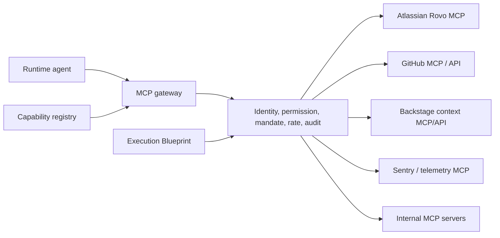
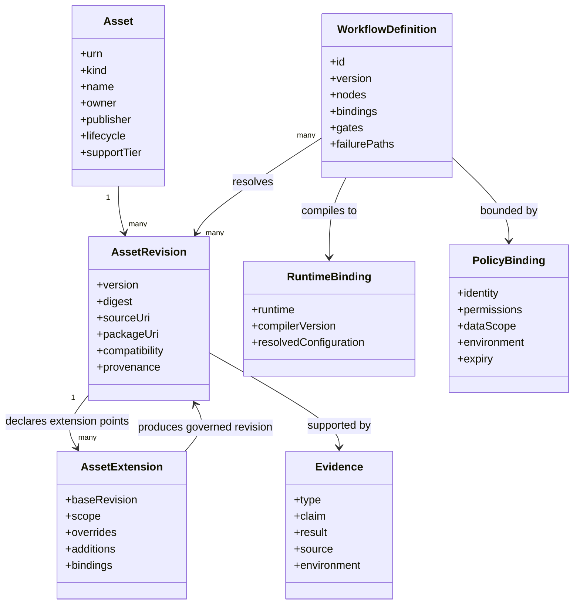
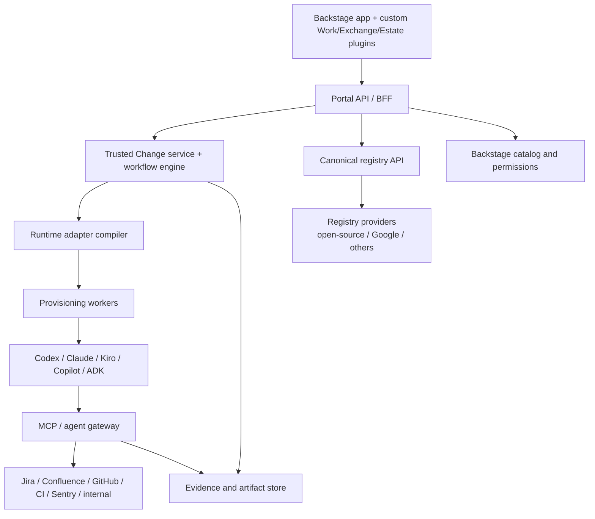

# Platform and Open-Source Adoption Architecture

## 1. Recommendation

Build the product as a **custom workflow and evidence experience on top of proven platform services**, not as a greenfield developer portal and not as a direct fork of one registry.

Recommended boundaries:

- **Backstage:** adopt as the enterprise portal substrate for identity, organization, software ownership, repository/service catalog, templates, plugin integration, and permission integration.
- **Custom Trusted Change service:** own Capability Initiatives, Trusted Change Packages, four-loop work, decisions, evidence graph, orchestration definition, and experience.
- **Registry abstraction:** define a canonical asset API. Run an architecture spike against `agentregistry-dev/agentregistry`; support Google Agent Registry and other providers through adapters.
- **MCP gateway/control plane:** mediate discovery, authentication, tool policy, delegated identity, audit, and observability. Do not connect every browser/client directly to every MCP server.
- **A2A adapter:** support external agent cards, discovery, and task interoperability without making A2A the internal workflow model.
- **Runtime adapter compiler:** translate canonical assets and workflows into Codex, Claude Code, Kiro, GitHub Copilot, Google ADK, or custom runtime configuration.
- **Backstage Scaffolder:** use for deterministic provisioning steps; do not use it as the entire conversational/agent workflow engine.
- **Durable workflow engine:** use a resumable orchestration service for long-running agent/human loops, retries, timers, callbacks, and compensation.

For the first release, the registry supply path is Git-native Markdown/configuration indexed through Agent Registry. A2A, Google/cloud registries, PyPI/npm/OCI packaging, Kubernetes agent deployment, and remote agent services are optional later providers, not prerequisites.

## 2. Why not restart from Backstage alone?

Backstage is strong at source-controlled catalog metadata, software templates, ownership, plugin integration, and permission extension. The Software Catalog expects metadata in source control and software produced through templates can be automatically registered. [Backstage catalog](https://backstage.io/docs/features/software-catalog/) [component templates](https://backstage.io/docs/getting-started/create-a-component/)

Backstage does not by itself provide:

- A canonical model for agents, skills, hooks, mandates, test packs, and MCP tool authority
- Conversation/canvas/source synchronization
- Durable multi-agent and human-gate execution
- Requirement-to-evidence lineage
- Runtime compilation across coding-agent products
- Agent behavior verification and learning loops

Therefore:

```text
Backstage = enterprise portal substrate
Trusted Change service = product workflow and evidence core
Agent Registry = reusable capability supply chain
MCP/A2A/runtime adapters = execution interoperability
```

## 3. Backstage adoption decision

### Adopt

- User and group entities
- Component, system, domain, API, resource, repository, and ownership relationships
- Authentication and SCM integrations
- Permission framework
- Software Templates/Scaffolder for deterministic repository and infrastructure creation
- TechDocs and existing engineering documentation
- Search and plugin extension points
- Existing service health, CI/CD, Kubernetes, cost, and observability plugins where appropriate

Backstage's permission framework can integrate RBAC, ABAC, custom code, or external authorization and allows plugins to declare protected resources/actions. [Backstage permissions](https://backstage.io/docs/permissions/overview/)

### Extend with custom entities or annotations

Backstage should contain enterprise-significant objects:

- `AgentService` — business-facing deployed agent service
- `AgentRuntime` — deployment/runtime component
- `DeliveryPattern` — approved delivery workflow template
- Links to registry asset URNs and active Capability Initiatives/Trusted Change Packages

Do not make every skill revision, hook, test case, or MCP tool a Backstage entity. That would overload the software catalog and create a poor catalog experience. Those live in the capability registry and appear contextually in the custom plugin.

### Build custom Backstage plugins

1. **Work plugin** — Capability Workbench, loop catalog and Trusted Change experience
2. **Exchange plugin** — capability discovery, dossier, contribution, promotion
3. **Estate plugin** — agent/runtime topology and exception workflows
4. **Context cards** — active work, agents, evidence, and authority on a Backstage component page
5. **Backend modules** — catalog resolver, Jira/Confluence connector, registry provider, runtime provider

### Do not fork Backstage initially

Create a normal Backstage application and custom plugins using supported extension systems. Forking makes upgrades and security maintenance harder. Fork only if a proven, unavoidable core change cannot be delivered through plugins or upstream contribution.

## 4. Open-source Agent Registry decision

The Apache-2.0 `agentregistry-dev/agentregistry` project already provides a registry for MCP servers, agents, skills, and prompts; CLI, REST API, and web discovery; curation; deployment workflows; Kubernetes support; and gateway integration. [Repository](https://github.com/agentregistry-dev/agentregistry)

### Reuse candidates

- Artifact packaging and publisher model
- Registry API and storage
- CLI-based publication and discovery
- Package sources: npm, PyPI, Docker/OCI, and remote endpoints
- MCP/agent/skill catalog semantics
- Local-to-Kubernetes deployment path
- Gateway configuration pattern
- Existing web UI as an administrator/reference surface

For the first spike, prioritize its agent, `SKILL.md`, prompt, MCP-definition, API, CLI, versioning, curation, and developer-client configuration capabilities. Do not require its container packaging, Kubernetes deployment, or gateway workflows to justify the portal architecture.

### Product gaps to validate

- Canonical support for hooks, mandates, rules, workflow patterns, test packs, environment/model profiles, and evidence
- Fine-grained organization/team tenancy and policy
- Promotion and exception workflows
- Immutable provenance, signing, SBOM, and supply-chain evidence
- Compatibility and runtime-adapter metadata
- Usage/reliability/outcome observations
- Backstage identity and permission integration
- Data residency, retention, audit, and enterprise scale
- API stability, migration, upgrade, and support model

### Decision

Do not fork it now. Define the portal's registry provider interface, then run a two-week compatibility spike:

1. Publish one agent, skill, MCP server, hook bundle, and workflow pattern.
2. Resolve exact revisions into an Execution Blueprint.
3. Provision locally and into a sandbox cluster.
4. Integrate Backstage identity/ownership.
5. Attach promotion evidence and query it contextually.
6. Measure gaps that require upstream contribution, an extension service, or replacement.

Fork only after the spike demonstrates that the registry is the correct strategic core and extension/upstream options cannot satisfy required semantics.

## 5. Google Agent Registry fit

Google Cloud Agent Registry is a managed inventory/governance provider. Its useful concepts include:

- Agent, MCP server, endpoint, skill, skill revision, and publisher resources
- Automatic and manual registration
- Immutable agent/MCP identifiers versus physical runtime URI
- Agent principals and workload identity
- Bindings between agents, MCP servers, endpoints, and authentication providers
- Search/discovery based on capabilities, tags, and skills
- Versioned skill revisions and lifecycle/default pointers

These concepts are documented by Google and should influence the canonical model. [Google Agent Registry concepts](https://docs.cloud.google.com/agent-registry/concepts)

### Adopt conceptually

- Stable logical identity separate from runtime location
- Immutable asset revisions
- Publisher ownership and trust
- Explicit bindings
- Agent workload identity
- Consumer-side discovery projections
- Provider synchronization

### Do not couple the product to

- Google-specific URN formats
- Google-only IAM principals
- Google-only runtime types
- Google-specific lifecycle or preview semantics

### Integration

Implement a `GoogleAgentRegistryProvider` that synchronizes provider resources into the canonical registry and can provision approved bindings when the customer chooses Google Cloud.

## 6. A2A fit

A2A is an interoperability protocol for independent agents to discover capabilities, negotiate modalities, manage collaborative tasks, and exchange information without exposing internal state. [A2A specification](https://github.com/a2aproject/A2A/blob/main/docs/specification.md)

Use A2A for:

- External agent cards and capability discovery
- Delegating tasks to independently operated agents
- Streaming task status and artifacts
- Cross-vendor agent communication
- Authentication/security metadata

This is a deferred integration boundary. Repository-native Markdown agents running through a selected coding runtime do not require A2A.

Do not use A2A as:

- The internal Trusted Change Package and loop-work database
- The visual workflow definition
- The catalog approval model
- The evidence graph
- The human decision model

The portal wraps A2A tasks as observable workflow-node executions with local policy, evidence, and authority.

## 7. MCP and enterprise-tool integration

### Federated knowledge providers

MCP is one useful access mechanism, but it is not the required transport for every enterprise knowledge base. The Context Fabric uses provider adapters over the provider's supported API, SDK, or MCP surface and normalizes retrieval into cited passages plus an auditable receipt.

Initial provider targets:

- Amazon Bedrock Knowledge Bases through retrieval APIs
- Microsoft Foundry IQ/Azure AI Search through knowledge-base or search APIs
- GitHub Copilot Spaces through supported GitHub APIs/MCP access
- Internal enterprise search/vector services through a canonical adapter or controlled MCP wrapper

The portal stores the governed logical reference, binding, retrieval policy, citations, and task-time evidence. External corpora remain external by default. Full mirroring or re-embedding requires an explicit managed-mirror policy and data-owner approval. The complete provider and Context Product contract is defined in `09_CONTEXT_CAPABILITY_AND_RUNTIME_COMPATIBILITY.md`.

### MCP role

MCP standardizes tools and contextual resources. The portal registers MCP servers and tools as capabilities, but runtime access is mediated through identity, policy, and gateway layers.

### Connection architecture



### Jira and Confluence

Atlassian's Rovo MCP server can securely expose Jira, Confluence, and Compass operations. OAuth 2.1 can preserve user permissions, while API-token/service modes support noninteractive workflows; organization controls and IP allowlists still apply. [Rovo MCP security and access](https://support.atlassian.com/security-and-access-policies/docs/understand-atlassian-rovo-mcp-server/)

The supported tool set includes Jira issue retrieval/search/edit/transition, Confluence access, and cross-product context through Teamwork Graph. [Supported tools](https://support.atlassian.com/atlassian-rovo-mcp-server/docs/supported-tools/)

Recommended use:

- User-delegated OAuth for story selection, requirement reading, comments, and transitions
- Service identity only for clearly bounded automation and callback operations
- Separate read, search, and write tool groups
- Human confirmation or mandate for material writes/transitions
- Store references and receipts; do not duplicate entire Jira/Confluence content unnecessarily
- Detect source changes and mark affected approvals stale

### GitHub

Use GitHub integration for repository discovery, branches/worktrees, PRs, checks, reviews, protected merge, packages, signatures, and audit. Keep repository identity aligned with Backstage ownership and the Trusted Change Package.

## 8. Canonical asset and workflow schema



Required canonical entities:

- `DeliveryThread`
- `SourceArtifact`
- `IntentContract` and `RequirementClause`
- `WorkflowDefinition` and `WorkflowRevision`
- `WorkflowRun`, `NodeRun`, `AgentRun`, `ToolCall`
- `Asset`, `AssetRevision`, `Publisher`, `ProviderReference`
- `AssetExtension`, `ExtensionPoint`, `RepositoryBinding`, `ResolutionTrace`
- `AgentDefinition`, `Skill`, `McpServer`, `McpTool`, `Hook`, `Instruction`, `Mandate`, `GateDefinition`, `TestPack`, `EnvironmentProfile`, `ModelProfile`
- `Binding`, `Identity`, `PermissionEnvelope`, `CredentialReference`
- `ChangeSet`, `TestDataRevision`, `EvidenceItem`, `VerificationClaim`
- `Decision`, `Exception`, `Release`, `Observation`, `Incident`, `Regression`

## 9. Runtime adapter compiler

### Problem

Codex, Claude Code, Kiro, and GitHub Copilot all support overlapping primitives but package and enforce them differently. Current official documentation shows project instructions, subagents/custom agents, skills, MCP, rules/steering, hooks, and permissions across these systems. [Official OpenAI documentation](https://developers.openai.com/) [GitHub Copilot customization](https://docs.github.com/en/copilot/reference/customization-cheat-sheet) [Kiro documentation](https://kiro.dev/docs/) [Claude Code MCP](https://docs.anthropic.com/en/docs/mcp)

### Solution

Store product semantics canonically and compile adapters.

| Canonical primitive | Codex target | Claude Code target | Kiro target | GitHub Copilot target |
|---|---|---|---|---|
| Project instructions | `AGENTS.md` / config | project instructions | steering / `AGENTS.md` | custom instructions |
| Agent definition | subagent profile | subagent definition | agent configuration | custom agent profile |
| Skill | skill package | skill/command package | skill package | agent skill |
| MCP binding | MCP config | `.mcp.json` / MCP config | MCP server config | repository/agent MCP config |
| Hook | hook config | hook config | hook config | `.github/hooks/*.json` |
| Rule/permission | rules/sandbox/approval | allowed/disallowed tools | steering + hook policy | tool scopes + hooks |
| Workflow execution | SDK/app server/task | SDK/CLI session | CLI/IDE/spec workflow | SDK/cloud agent/action |

Compilation must produce:

- Generated files and configuration
- Compatibility report
- Unsupported/approximated semantic warnings
- Effective permissions and hooks
- Reproducible digest
- Round-trip diff where runtime configuration changes outside the portal

Mandates are never “compiled away.” If a runtime cannot enforce a required mandate, the workflow cannot use that runtime for the affected environment.

### Repository specialization and resolution

The canonical model uses composition and controlled overlays rather than unconstrained class inheritance or copied templates.

Resolution order:

```text
pinned base revision
→ approved organizational extension
→ team extension
→ repository-owned extension and bindings
→ Loop Work Item parameters
→ mandatory policy overlay
→ validated effective blueprint
```

Later scopes do not automatically win. Each field declares a merge strategy such as immutable, replaceable at an extension point, additive set, ordered append, keyed merge, or narrow-only authority. Mandates and mandatory policy are evaluated against the final result and cannot be shadowed by repository configuration.

A repository stores a small canonical manifest in Git. It references immutable registry revisions and contains repository-owned extensions, bindings, and parameters. The compiler materializes runtime-specific files such as project instructions, agent profiles, skills, hooks, and MCP configuration. Generated files retain provenance markers and are checked for drift; secrets remain external references.

Required lifecycle behavior:

- Pin base and extension revisions for reproducibility.
- Display an effective-definition view and a semantic lineage diff.
- Test the resolved asset in the repository context, not only the base in isolation.
- Detect cycles, incompatible contracts, conflicting hooks, and authority expansion.
- Notify affected owners when a base is deprecated, revoked, vulnerable, or superseded.
- Offer an upgrade pull request with impact evidence; never push a base update silently.
- Allow a valuable repository extension to be proposed upstream as a new base revision without erasing its history.

## 10. Provisioning division of responsibility

| Concern | Recommended owner |
|---|---|
| Repository/service skeleton | Backstage Scaffolder or repository template |
| Asset publication | Git + Agent Registry initially; package/OCI pipeline only for executable artifacts |
| Workflow durability | Trusted Change service/workflow engine |
| Runtime configuration generation | Runtime adapter compiler |
| Agent/MCP deployment | Registry deployer/platform deployer |
| Tool routing and policy | MCP gateway |
| Authentication and identity | Enterprise IdP + workload identity + provider OAuth |
| Secrets | Enterprise secrets manager; references only in portal |
| Tests/evals/scans | Verification execution service and CI |
| Evidence and decisions | Trusted Change and evidence store |
| Service/repository ownership | Backstage catalog |
| Live telemetry | Observability providers and normalized event store |

## 11. Repository and asset acquisition strategy

Do not copy miscellaneous GitHub repositories into the product source tree.

Use a controlled adoption workflow:

1. Identify the capability gap.
2. Search approved internal and external registries.
3. Verify license, publisher, maintenance, security, compatibility, and provenance.
4. Import by pinned commit, package digest, or OCI digest.
5. Generate SBOM and scan.
6. Wrap in a canonical asset manifest.
7. Run smoke tests/evals in isolation.
8. Approve for sandbox or enterprise use.
9. Track upstream version and vulnerability changes.
10. Contribute extensions upstream where strategically appropriate.

External directories such as `skills.sh` are discovery sources, not production registries or trust providers. An identified asset is fetched into an isolated inbound quarantine, validated and evaluated, then promoted as a new immutable revision into an enterprise-controlled Git mirror, OCI/package registry, or capability registry. Repositories pin that internal revision and maintain source-controlled local extensions; they do not execute directly from a mutable external location.

For Backstage and Agent Registry, maintain separate upstream remotes or package dependencies rather than copying source. Product-specific behavior belongs in plugins, adapters, and extension services.

## 12. Deployment topology



## 13. Architecture decisions still requiring spikes

1. Agent Registry provider viability and extension model
2. Backstage new-frontend plugin and permission integration
3. Durable workflow engine selection
4. MCP gateway selection versus custom policy proxy
5. Canonical manifest and runtime compiler fidelity
6. Evidence storage, immutable receipts, and audit scale
7. Repository sandbox/worktree provisioning across local and cloud execution
8. Secretless delegated identity across Atlassian, GitHub, and runtime agents
9. Graph visualization performance and accessible nonvisual editing

A2A becomes an architecture spike only when a validated use case requires independently deployed remote agents.
