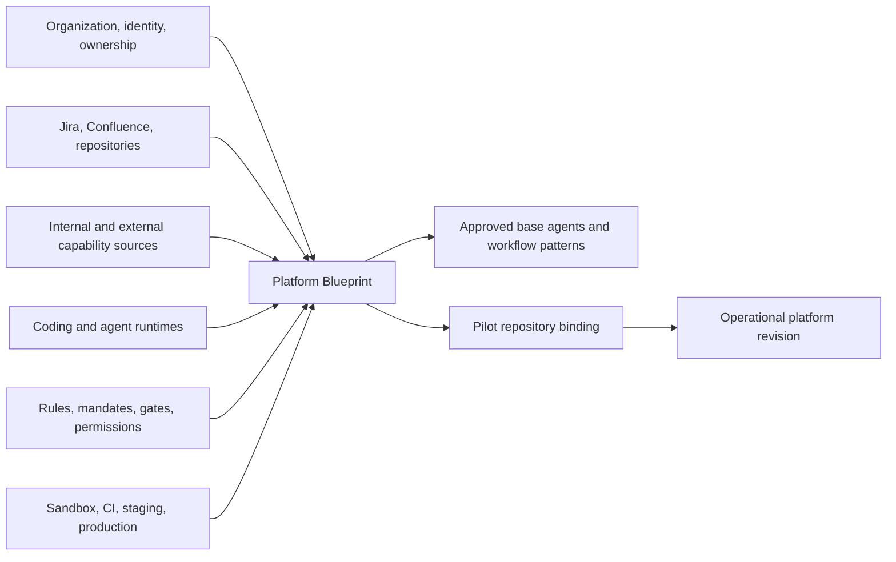
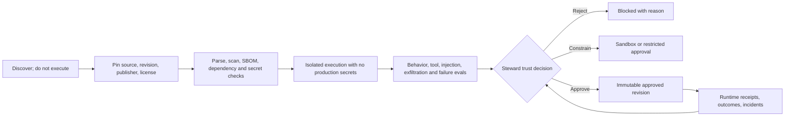

# Platform Establishment Journey

## 1. Product decision

The AI Delivery Steward does not create the platform by visiting independent administration screens for users, agents, skills, tools, policies, and environments. The product provides a guided **Establish your platform** journey that produces a source-controlled, reviewable **Platform Blueprint**.

The journey combines:

- a conversational setup interview for intent and organizational context;
- a visual topology for connections, trust boundaries, runtimes, and environments;
- a structured blueprint/source view for precise review and Git-based change control; and
- live readiness checks that prove the platform can support one end-to-end repository workflow.

Once established, the same object is maintained through **Estate → Platform foundation**. Setup does not become a permanent fourth global navigation destination.

## 2. AI Delivery Steward entry experience

### First visit

The normal global regions remain **Work**, **Exchange**, and **Estate**. If no approved Platform Blueprint exists, the AI Delivery Steward sees a focused entry:

```text
Establish your agent development platform

Connect one source of work, one source repository, and one execution runtime.
Import or create the minimum reusable capabilities needed for a pilot repository.
Prove one governed delivery journey before expanding the platform.

[Begin guided setup]  [Import an existing blueprint]
```

The system should not begin with a blank dashboard or a long menu of configuration objects.

### Returning visit

The steward enters through **Estate → Platform foundation**, which summarizes:

- current approved blueprint revision;
- readiness by workflow and environment;
- integrations requiring attention;
- assets awaiting trust decisions;
- policy, credential, mandate, and exception expiry;
- base-to-repository extension drift; and
- recommended next platform action.

## 3. Durable object: Platform Blueprint

The Platform Blueprint defines what the enterprise platform supports and trusts. It is separate from a Capability Initiative and its Trusted Change Package, which define one outcome and its progressive delivery evidence.



The blueprint contains:

- organizational identity and ownership mappings;
- work, knowledge, source-control, CI, observability, and communication connections;
- supported Git/Agent Registry sources, MCP definitions, and coding-runtime adapters, with optional future remote-agent/package providers;
- approved models, environments, network zones, data classes, and credential strategies;
- asset trust policy and publisher allowlists;
- enterprise mandates, required gates, exception routes, and decision rights;
- base agents, skills, workflow patterns, test packs, and repository patterns;
- repository bindings and extension rules;
- evidence retention, audit, telemetry, cost, and operational ownership; and
- blueprint validation, approval, revision, and rollback history.

## 4. Guided establishment workflow

### Stage 1 — Define platform intent

**Input**

- Target engineering teams and repository types
- Initial use cases
- Data sensitivity and regulatory context
- Existing developer tools and delivery process
- Desired execution locations

**Process**

- The setup conversation proposes a narrow pilot boundary.
- The steward selects the first capability outcome, repository and four-loop Work Pattern.
- The system identifies required integrations, runtime capabilities, policies, and human decisions.

**Output**

- Platform intent, pilot scope, success criteria, non-goals, and accountable owner

### Stage 2 — Connect enterprise context

**Input**

- Identity provider and organization directory
- Backstage or other software catalog
- Jira and Confluence
- GitHub/GitLab/Bitbucket and CI/CD
- Observability, secrets, and notification systems

**Process**

- Use least-privilege, delegated identity where appropriate.
- Separate read, search, write, transition, and administration scopes.
- Test connection, permission, rate-limit, freshness, and revocation behavior.
- Display the connection topology and data movement before approval.

**Output**

- Validated connection bindings, owners, effective scopes, and audit destinations

The platform may use MCP where the provider offers a sufficiently safe identity and tool contract. MCP is an adapter contract, not automatic trust. An ordinary API or purpose-built connector remains valid when it provides stronger control.

### Stage 3 — Select execution runtimes and environments

**Input**

- Codex, Claude Code, Kiro, GitHub Copilot, Google ADK, or custom runtime choices
- Local, managed cloud, CI, Kubernetes, or isolated worker locations
- Approved models and data-processing constraints

**Process**

- Validate runtime support for required agents, skills, instructions, hooks, MCP, permissions, and mandates.
- Define sandbox, CI, staging, and production profiles.
- Prove secretless or short-lived credential delivery.
- Mark semantic gaps as blocking, approximated, or unsupported.

**Output**

- Approved runtime/model/environment profiles and compiler compatibility report

### Stage 4 — Discover reusable assets

Stages 4 through 7 are the platform-establishment projection of the complete **Prepare enterprise catalog** journey. The detailed Catalog Charter, primitive classification, normalization, deduplication, extension-family curation, kind-specific evaluation, catalog release, and lifecycle model are defined in `11_ENTERPRISE_CAPABILITY_CATALOG_PREPARATION_JOURNEY.md`.

**Input**

- Internal Git repositories
- Repository-local `AGENTS.md`, instruction files, skills, hooks, and MCP configuration
- External discovery sources such as [skills.sh](https://skills.sh/) and approved public Git repositories
- Approved public repositories and publisher registries
- Existing coding-runtime and repository configurations

**Process**

1. Discover metadata without executing the asset.
2. Identify format, publisher, source, license, revision, dependencies, and declared capabilities.
3. Normalize the asset into the canonical model.
4. Classify its execution and authority risk.
5. Place it in a quarantined candidate inventory.

**Output**

- Candidate capability inventory with source lineage and required trust work

The initial discovery boundary is Git-hosted Markdown and configuration for developer-agent runtimes. Package registries, OCI images, deployed A2A agents, Kubernetes resources, and cloud agent registries are added only when a chosen capability actually contains executable packaging or operates as a remote service.

`AGENTS.md`, skills discovered through `skills.sh`, and runtime-specific skill packages are supported supply and import/export formats—not the platform database and not trust authorities. Official OpenAI documentation describes `AGENTS.md` as repository-scoped agent guidance and skills as packaged instructions, scripts, references, and assets. The portal preserves compatible formats in Git while normalizing their meaning for discovery, governance, reuse, and cross-runtime compilation. [OpenAI `AGENTS.md`](https://learn.chatgpt.com/docs/agent-configuration/agents-md), [OpenAI skills](https://learn.chatgpt.com/docs/build-skills)

### Stage 5 — Establish the capability trust supply chain

**Input**

- Quarantined candidates
- Enterprise publisher, license, security, data, and authority policy
- Required evaluation profiles

**Process**



**Output**

- Rejected, sandbox-approved, constrained, or enterprise-approved immutable revisions

### 5.1 Inbound capability pipeline and internal custody

Finding or downloading an external asset is not the same as importing it into an executable environment.

```text
External source, including skills.sh or Git
→ metadata-only discovery
→ isolated inbound quarantine
→ canonical normalization
→ instruction, code, dependency, provenance, and license validation
→ credential-free sandbox behavior tests
→ guardrail and authority compatibility checks
→ accountable approval
→ signed/pinned internal registry or Git mirror
→ repository reference and extension
→ runtime materialization with enforced controls
```

The platform maintains three distinct zones:

| Zone | Purpose | Executable in delivery work? |
|---|---|---|
| Candidate index | Search metadata, source link, publisher, and observed version | No |
| Inbound quarantine | Fetch and inspect exact content in isolation | Only in credential-free security/evaluation sandboxes |
| Approved internal supply | Enterprise-controlled immutable revision with evidence and restrictions | Yes, after repository binding and runtime authorization |

Promotion to approved internal supply requires:

- an exact pinned upstream commit or package digest;
- an enterprise-controlled internal identifier and immutable revision;
- retained source, license, publisher, checksums, and upstream provenance;
- schema and packaging validation;
- inspection of all instructions, nested references, scripts, hooks, binaries, dependencies, network destinations, and MCP/tool declarations;
- detection of secrets, obfuscated content, unsafe commands, prompt-injection behavior, credential requests, data-exfiltration paths, and attempts to bypass higher-scope instructions;
- SBOM, dependency and vulnerability results where executable content exists;
- sandbox tests for expected behavior, prohibited behavior, tool misuse, failure handling, and runtime compatibility;
- effective guardrail bindings for commands, filesystem, network, tools, data, models, and environments;
- an accountable approve, constrain, or reject decision with evidence and expiry; and
- an owner, support expectation, monitoring policy, and revocation path.

Validation is proportional to capability. A documentation-only skill is not treated like an executable hook, while an MCP server or skill containing scripts must pass the higher-risk lane.

The approved asset is maintained internally after promotion. The platform:

- watches upstream without automatically accepting upstream changes;
- creates a new candidate revision for every upstream update;
- reruns validation and evaluations before promotion;
- supports internal patches and extensions with explicit divergence from upstream;
- records which repositories consume each revision;
- alerts consumers to vulnerabilities, revocation, deprecation, or replacement;
- provides controlled upgrade pull requests; and
- can quarantine or revoke an approved revision and identify its blast radius.

Repositories should not each copy the entire external agent or skill. A repository stores a lock/reference to the approved internal revision plus its local extension and bindings. Runtime-specific files may be materialized into the repository when required, but their generated provenance and source revision remain traceable.

### Stage 6 — Create the base delivery system

**Input**

- Approved or internally authored candidate assets
- Pilot intent and repository characteristics
- Enterprise mandates and evidence requirements

**Process**

- Create or select the base Requirements Clarification Agent.
- Create or select the base Planner, Implementation, Review, and Verification agents.
- Bind minimum required skills, knowledge, tools, hooks, rules, test packs, and gates.
- Compose the four-loop base workflow.
- Specify declared extension points and narrow-only authority fields.
- Validate the workflow through conversation, canvas, and source views.

**Output**

- Approved base asset family and delivery workflow pattern

Base assets can be authored internally, imported, or extended from trusted external assets. The user should always see provenance and effective behavior; “internal” is not treated as automatically safe, and “external” is not treated as automatically unsafe.

### Stage 7 — Bind and extend for the pilot repository

**Input**

- Approved base pattern
- Repository language, structure, build commands, standards, owners, and knowledge
- Repository-local agent configuration

**Process**

- Create a repository-owned extension referencing pinned base revisions.
- Import compatible local instructions and skills or map conflicts explicitly.
- Add repository knowledge, tests, commands, and stricter controls.
- Resolve the effective blueprint and compile runtime-specific configuration.
- Create a reviewed Git pull request for repository-owned configuration.

**Output**

- Approved repository extension, bindings, runtime configuration, and lineage trace

### Stage 8 — Prove readiness with one complete journey

**Input**

- Pilot quality demand with representative Jira/support signals or fixture
- Platform Blueprint candidate revision
- Pilot repository extension

**Process**

- Run intent clarification, implementation, verification, and a simulated release decision.
- Force at least one permission denial, test failure, human approval, resume, and rollback path.
- Confirm evidence, tool receipts, repository changes, and source-system updates.
- Collect Intent Owner, Architect and AI Delivery Steward feedback.

**Output**

- Readiness dossier, known limitations, remediation actions, and approve/reject decision for the Platform Blueprint

### Stage 9 — Publish and operate

**Input**

- Approved readiness dossier
- Platform owner decision

**Process**

- Publish the Platform Blueprint revision.
- Enable the supported use case for its target cohort.
- Monitor reliability, cost, trust, exceptions, adoption, and business outcome.
- Add repositories and capabilities through the same governed workflows.

**Output**

- Operational platform with a bounded support statement and measurable service health

## 5. Navigation and surface model

The establishment journey is one coordinated workspace, not nine separate wizard pages.

```text
┌──────────────────────────────────────────────────────────────────────┐
│ Establish platform · Draft revision 3              Readiness: 6/9  │
├───────────────────┬──────────────────────────────────────────────────┤
│ Journey           │ Current decision                               │
│ ✓ Intent          │ Connection/topology, asset family, policy, or  │
│ ✓ Context         │ pilot proof relevant to the selected stage     │
│ ● Capabilities    │                                                │
│ ○ Controls        │ Conversation | Topology | Blueprint source     │
│ ○ Base workflow   │                                                │
│ ○ Pilot           │ Evidence, conflicts, impact, and next action   │
│ ○ Publish         │ remain visible in context                      │
└───────────────────┴──────────────────────────────────────────────────┘
```

Interaction rules:

- A stage represents a decision and durable output, not a menu category.
- The user can move backward, but downstream validations become visibly stale.
- Conversation can propose changes; the blueprint diff must be accepted before persistence.
- Topology reveals trust boundaries and data movement, not merely attractive nodes.
- Source view is editable and reviewable in Git.
- “Continue” is disabled only with a specific blocking reason and remediation path.
- The platform never asks for production credentials merely to browse available assets.

## 6. Build versus reuse decision

Use a **controlled hybrid**.

### Build and operate as the trusted control plane

- Canonical asset and workflow model
- Platform Blueprint, Capability Initiative and Trusted Change state
- Identity/authority resolution
- Mandates, decisions, exceptions, and separation of duties
- Provenance, trust status, audit receipts, and evidence graph
- Repository extension resolution
- Runtime compilation and compatibility reporting
- Promotion, revocation, deprecation, and migration workflows

### Reuse through supported adapters

- Backstage identity, ownership, catalog, templates, search, and plugins
- Existing Jira, Confluence, source-control, CI/CD, and observability APIs/MCP servers
- `AGENTS.md`, skill packages, hooks, custom-agent formats, and repository conventions
- `agentregistry-dev/agentregistry` or other registries behind a provider interface
- OCI, package, and source-control supply chains
- A2A for independently operated agent interoperability
- Existing scanners, policy engines, secrets managers, sandboxing, and workflow infrastructure

Backstage should be extended rather than copied or forked initially. The open-source Agent Registry should be evaluated behind a provider boundary rather than installed as the unquestioned system of record. [Backstage Software Catalog](https://backstage.io/docs/features/software-catalog/), [Agent Registry repository](https://github.com/agentregistry-dev/agentregistry)

## 7. External-asset security position

External assets are not merely documentation. Treat them according to what they can cause:

| Asset | Principal risk | Default onboarding lane |
|---|---|---|
| Instructions / `AGENTS.md` | Prompt injection, unsafe guidance, hidden scope effects | Parse and review; no execution during discovery |
| Skill with only references | Poisoned knowledge, license or data leakage | Content/provenance scan plus behavioral review |
| Skill with scripts | Arbitrary code, dependency compromise, exfiltration | High-risk sandbox and dependency/SBOM checks |
| Hook | Deterministic command execution at privileged lifecycle points | High-risk code review, sandbox, explicit events and authority |
| Agent definition | Excessive tools, deceptive behavior, unsafe delegation | Behavior evals and effective-authority review |
| MCP server/tool | Remote code/service trust, data access, side effects, confused deputy | Provider identity, tool schema, delegated scopes, gateway enforcement, receipts |
| Workflow pattern | Hidden privilege accumulation or bypass paths | Whole-graph authority and gate analysis |
| Test pack | Sensitive fixtures, misleading graders, code execution | Data classification, grader validation, isolated execution |

Minimum controls:

- Pin commit, package, or OCI digest; never execute a moving branch or tag in an approved workflow.
- Verify publisher, source, license, signature where available, dependency graph, and provenance.
- Generate or ingest an SBOM and scan for vulnerabilities, secrets, suspicious commands, and network behavior.
- Evaluate in an isolated environment without production secrets or unrestricted egress.
- Require explicit tool, filesystem, command, network, model, data, and environment permissions.
- Place MCP calls behind delegated identity, policy, rate, confirmation, and audit controls.
- Test prompt-injection resistance, data exfiltration, tool misuse, failure behavior, and mandate compliance.
- Record immutable approval scope, restrictions, evidence, expiry, owner, and downstream consumers.
- Continuously observe approved assets and support immediate quarantine, revocation, and impact analysis.

High-security customers may configure an internal-only publisher policy and self-hosted execution. That is a deployment policy, not the default product architecture. Building everything internally would still leave insider, dependency, configuration, and stale-control risks while sacrificing useful standards and ecosystem interoperability.

## 8. Minimum viable platform-establishment journey

The first implementation supports only:

- one identity/ownership source;
- Backstage component and repository context;
- Jira and Confluence intake;
- one source-control provider;
- one execution runtime;
- one sandbox environment;
- one internal Git asset source and one quarantined external source;
- five base agents: intake/requirements, planner, implementation, review, and verification;
- one four-loop workflow pattern;
- one repository extension;
- one human intent decision and one verification decision; and
- one end-to-end pilot capability slice through all four loops.

MVP establishment succeeds when the AI Delivery Steward can explain what is connected, what is trusted, what authority is possible, what remains unsupported, how repository specialization works, and why the pilot journey is safe enough to enable.
