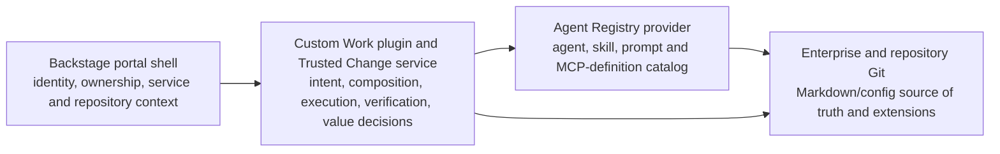

# Starting Architecture Decision

## Decision

Do not start from scratch, do not turn Backstage alone into the agent registry, and do not fork Agent Registry as the complete portal.

Start with four deliberately separated foundations:



The starting implementation is:

1. A standard, supported Backstage application—not a fork.
2. The open-source `agentregistry-dev/agentregistry` running unchanged as a technical spike behind a provider interface.
3. Git as the authoritative source for Markdown/config-based developer-agent assets and repository extensions.
4. A custom Backstage **Work** plugin and Trusted Change service for the four-loop journey that neither Backstage nor Agent Registry provides.

The [Agent Registry project](https://github.com/agentregistry-dev/agentregistry) already provides a web UI, CLI, API, versioned agents, `SKILL.md` packages, prompts, MCP server records, curation, and configuration generation for developer clients. It also supports packaging and deployment paths that are useful in other scenarios but are not required for the first portal slice. Its project website is [aregistry.ai](https://aregistry.ai).

## Why this boundary

### Backstage answers

- Who is the user?
- What team, system, component, repository, and owner are involved?
- What engineering documentation, template, plugin, and permission context exists?
- Where does the enterprise developer portal live?

### Agent Registry answers

- What agents, skills, prompts, and MCP definitions are discoverable?
- Which versions exist?
- What dependencies and client configuration do they declare?
- Which revisions have been curated for use?

### Git answers

- What is the reviewable source of the agent, skill, rule, hook, workflow, or repository extension?
- Who changed it and through which pull request?
- Which base revision does a repository extend?
- What runtime-specific files must remain close to the code?

### The custom Capability Workbench and Trusted Change service answer

- What work are we trying to complete?
- Which reusable assets should be resolved for this repository and loop work item?
- How are requirements, implementation, verification, human decisions, and evidence connected?
- What actually ran, what changed, what was approved, and what is the outcome?

No single open-source project currently owns all four questions.

## First asset boundary

The first release catalogs repository-native developer-agent assets:

| Asset | Typical source |
|---|---|
| Agent definition | Markdown plus front matter or runtime agent file |
| Skill | `SKILL.md` plus optional references, scripts, and assets |
| Instruction / standard | `AGENTS.md`, Markdown, or runtime instruction file |
| Prompt | Markdown/template file |
| Hook | JSON/YAML configuration plus referenced script |
| Rule / permission | Markdown, configuration, or policy file |
| Workflow pattern | Canonical YAML/JSON graph referencing asset revisions |
| MCP definition | JSON/YAML connection and tool metadata; not necessarily a deployed server |
| Test/evaluation pack | YAML/JSON/Markdown cases plus optional fixtures and graders |
| Repository extension | Canonical manifest stored with the repository |

These files may use different runtime conventions. The portal normalizes them into a canonical catalog projection without forcing teams to abandon their native files.

## Source-of-truth rule

For the first release:

```text
Git source revision
→ validation and evidence
→ registry index/revision
→ repository binding and extension
→ runtime-specific materialization
```

- Git owns editable content and pull-request history.
- Agent Registry indexes, versions, searches, curates, and distributes approved definitions.
- The portal owns product workflows, decisions, and effective-definition views.
- A repository pins approved revisions and stores only local extensions and bindings.
- Runtime adapters read or generate Codex, Claude Code, Copilot, Kiro, Cursor, and related formats.

The registry must not become a second, silently divergent editor of source-owned Markdown. Portal edits create a Git branch/pull request, then the registry indexes the approved revision.

## What is not required initially

### A2A

A2A is unnecessary when the “agents” are local developer-agent definitions orchestrated by one workbench/runtime. Add A2A only when the platform delegates work to independently deployed remote agent services owned by different systems or vendors.

### PyPI and npm

These are not primary catalog stores for Markdown agents. They become relevant only when a skill, hook, MCP server, or tool contains Python/Node executable packages. Even then, the portal records a pinned dependency; it does not turn PyPI or npm into the product database.

### OCI, Docker, Kubernetes, and cloud agent registries

These are optional execution/distribution providers for deployed agents, MCP servers, or binary dependencies. They are not necessary to prove the first repository-native developer workflow.

### Agent deployment

The first product provisions definitions into an existing coding-agent runtime. It does not deploy every Markdown agent as a long-running service.

## Initial technical spike

The spike should answer one decision: can Backstage, Agent Registry, Git, and the custom Trusted Change service form a coherent product without forking upstream projects?

### Step 1 — Run upstream components unchanged

- Create or use a standard Backstage application.
- Run the released Agent Registry locally using its documented setup.
- Do not change upstream source code.

### Step 2 — Define the provider contract

Create a thin `CapabilityRegistryProvider` contract supporting:

- discover and search;
- retrieve immutable revision;
- publish candidate from Git revision;
- attach trust/evaluation status;
- resolve dependencies;
- deprecate or revoke; and
- find repository consumers.

Agent Registry is the first adapter. Git-only storage can be a fallback adapter for comparison.

### Step 3 — Import one representative repository

Use a fixture repository containing:

- `AGENTS.md`;
- one Requirements Agent;
- one Implementation Agent;
- one `SKILL.md` package;
- one hook;
- one MCP definition;
- one test/evaluation pack; and
- one repository extension of a base workflow.

Prove discovery, normalization, validation, approval, registry indexing, and effective repository resolution.

### Step 4 — Render in the portal

Build only enough experience to prove:

- the Backstage component identifies the repository and owner;
- Exchange can show the base assets and repository variants;
- Work can resolve those assets into one loop work item and Trusted Change Package;
- conversation, canvas, and source describe the same workflow; and
- a repository change is proposed through Git rather than saved only in a registry database.

### Step 5 — Compile to two developer runtimes

Materialize the resolved definitions for Codex and one contrasting runtime such as Cursor or Claude Code. Compare semantic loss, unsupported hooks/permissions, and repository-file placement.

### Step 6 — Decide, do not assume

At the end of the spike:

- **Adopt unchanged** if Agent Registry covers the required registry contract.
- **Extend beside it** if metadata, evidence, or enterprise workflow gaps can live in a companion service.
- **Contribute upstream** when a generally useful extension fits the project.
- **Fork** only when strategic core changes cannot be delivered through supported extension or upstream paths.
- **Replace** if its packaging/deployment assumptions fight the Git-native developer-agent model.

## Portal navigation after the decision

The user still sees only three global regions:

- **Work** — start or resume a Capability Initiative/Trusted Change Package and orchestrate the four loops.
- **Exchange** — a custom product experience backed by Agent Registry and Git; discover, compare, extend, validate, and promote capabilities.
- **Estate** — platform foundation, integrations, policy health, runtime compatibility, consumers, risk, and lifecycle.

The upstream Agent Registry web UI can remain an expert diagnostic/admin surface during the spike. It should not automatically become the end-user portal navigation.

## Acceptance decision

Proceed with this architecture only if one pilot proves:

1. Markdown/config assets remain naturally editable in Git.
2. Agent Registry adds useful discovery/versioning/curation without forcing unnecessary deployment packaging.
3. Backstage provides coherent repository, service, owner, identity, and portal context.
4. The custom Capability Workbench can resolve registry assets and repository extensions into one understandable loop workflow and Trusted Change Package.
5. Runtime compilation preserves or clearly reports agent, skill, instruction, hook, tool, and permission semantics.
6. External assets cannot become executable merely by being discovered or registered.
