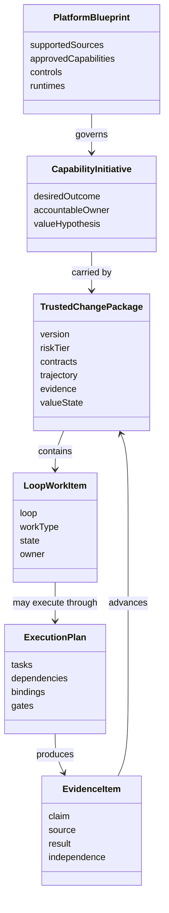
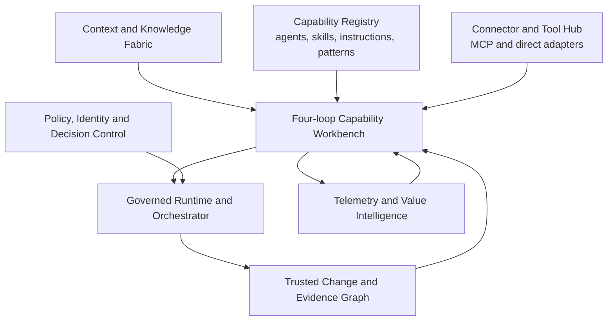

# AI-SDLC Workbench Operating Model

## 1. Product correction

The workbench is not a story-to-code portal with testing and release appended. It is an **AI-SDLC control plane** for moving an enterprise capability from demand to justified value through four concurrent control loops:

```text
Intent → Implementation → Verification → Value Realization
```

The loops are not renamed traditional phases. Each loop contains multiple work types, can reopen another loop, and continuously updates the same versioned **Trusted Change Package**.

The product therefore begins with a desired capability, problem, quality demand, or learning signal. A Jira story, incident, repository, support case, design, policy change, or test need is a source or entry trigger—not the unit of management.

This model is grounded in the local AI-SDLC source set:

- `/Users/firstlink/Documents/AI-SDLC/research/ai-sdlc-executive-white-paper.md`
- `/Users/firstlink/Documents/AI-SDLC/research/ai-sdlc-implementation-playbook.md`
- `/Users/firstlink/Documents/AI-SDLC/research/ai-sdlc-visual-white-paper.md`
- `/Users/firstlink/Documents/AI-SDLC/research/ai-sdlc-visual-exhibit-research.md`
- `/Users/firstlink/Documents/AI-SDLC/research/diagrams/hexaware-marketing-loop-diagram-brief.md`
- `/Users/firstlink/Downloads/AI_SDLC_Agents_Catalog_Final.xlsx`

## 2. Work-object hierarchy



### Platform Blueprint

Defines the approved enterprise delivery system: context sources, connectors, assets, runtimes, rules, mandates, tools, evidence requirements, and extension policy.

### Capability Initiative

Names the outcome the organization is trying to create or improve. It may contain multiple repositories, stories, experiments, defects, releases, and teams.

### Trusted Change Package

The progressive, versioned control and evidence manifest. It links:

- outcome and intent contracts;
- behavior, UX, architecture, context, delegation, proof, release, and value contracts;
- work sources and approved context versions;
- repositories, code, configuration, designs, tests, documentation, and deployment artifacts;
- agents, instructions, skills, tools, models, permissions, and trajectories used;
- automated proof, human decisions, exceptions, and residual risk;
- release posture, rollback, telemetry, production validation, adoption, and value signals.

It is not a generated document handed between loops. It is queryable shared state assembled from linked systems and decisions.

### Loop Work Item

A bounded activity inside one loop, such as mapping a user journey, building a knowledge product, generating test data, implementing an API, running JMeter performance tests, or evaluating value adoption.

### Execution Plan

The resolved agent/human/tool task graph for one Loop Work Item. It binds reusable capabilities to the current repository, context, risk, and control boundary.

## 3. Primary entry experience

The Work front door first establishes **where the user is working and whether its context is ready**. It does not begin with a product-control menu.

```text
Where are you working?

[Resume active work]
[Select a recent repository or service]
[Search or paste repository / Jira / Backstage / GitHub URL]
[Start product/system-scoped Intent work]
```

For the primary implementation journey:

```text
Select or infer repository/service
→ establish or verify repository context
→ select the ticket or outcome
→ qualify intent
→ select, extend, or create a named Delivery Harness
→ resolve and approve the task Execution Blueprint
→ execute the four loops
```

The **Move work forward** choices remain available after working context has been resolved. A returning user with active work resumes directly at the current decision or run. A Jira, GitHub, Backstage, IDE, or CLI deep link may resolve repository and ticket automatically. Non-code Intent work may use a product, system, service, or Context Product as its initial scope.

### Repository Delivery Profile

The Repository Delivery Profile records repository identity, ownership, architecture, Context Product bindings, build/test behavior, runtime assets, capabilities, tools, authority, verification baseline, operations, freshness, and gaps. Readiness is evaluated against the proposed work class; a repository can be ready for documentation changes and blocked for a production data migration.

### Delivery Harness

A named Delivery Harness is the repository-bound composition of Workflow Fragments, Work Patterns, agents, skills, output contracts, context, MCP/tools, hooks, rules, mandates, models, permissions, gates, evidence, and recovery behavior. The ticket, current Context Pack, and task risk resolve the harness into an immutable Execution Blueprint.

The complete entry, builder, execution, human-touchpoint, and learning journey is defined in `10_REPOSITORY_FIRST_WORK_ENTRY_AND_DELIVERY_HARNESS.md`.

### Define a new capability or outcome

Starts with quality demand, problem framing, opportunity, customer need, operating issue, or strategic outcome. The workbench creates a Capability Initiative and the first Trusted Change Package version.

### Resume a Trusted Change Package

Returns the user to the current decision, failed proof, missing context, active execution, or value signal—not to a generic overview page.

### Run a loop work item

Lets the user start a meaningful activity such as:

- build a knowledge base;
- create a journey map;
- prepare an AI-ready backlog;
- create an architecture design;
- generate test data or automation scripts;
- run accessibility or performance proof;
- prepare release readiness; or
- analyze production adoption.

If no Capability Initiative exists, the workbench asks what outcome this activity supports. A work item may start independently, but its output becomes valuable when attached to a Trusted Change Package or promoted as a reusable capability.

### Start from an external signal

Accepts Jira, Confluence, support case, incident, repository, pull request, telemetry event, design artifact, policy finding, or natural-language input. The system classifies the signal and recommends the responsible loop and work type.

## 4. Front-of-portal loop work catalog

The portal exposes a curated catalog of **work outcomes**, not a grid of 144 agent names or dozens of tool configuration screens.

Each entry answers:

- What can I accomplish?
- In which loop does it primarily operate?
- What must already exist?
- What agents, skills, knowledge, tools, and controls will be used?
- What output and evidence will be produced?
- Which decision can this output advance?
- Where does failure return?

### 4.1 Intent Loop work types

Purpose: transform quality demand and fragmented signals into executable, approved intent.

| Work type | Representative inputs | Capability composition | Durable output |
|---|---|---|---|
| Problem framing and discovery | Strategy, support, research, analytics, incidents | Discovery agent, domain skill, signal connectors | Qualified change and problem statement |
| Knowledge/context product | Jira, Confluence, support, repository, ADRs, policies, telemetry | Context curator, source connectors, classification and freshness rules | Governed context product and context manifest |
| User research and personas | Research, feedback, analytics, support evidence | Research and synthesis agents, privacy rules | Evidence-linked personas and needs |
| User journey mapping | Personas, workflows, support cases, system touchpoints | Journey mapper, domain knowledge, visualization skill | Journey map, pain points, opportunity and success signals |
| UX concept and prototype | Journey, design system, accessibility rules | UX strategist, interaction designer, prototype skill | Behavior contract and validated prototype evidence |
| Backlog preparation | Outcome, journey, architecture and proof direction | Story architect, scenario expansion, acceptance-criteria skills | AI-ready backlog slices |
| Requirements clarification | PRD, story, regulations, domain rules | Requirements, ambiguity, boundary and rule agents | Behavioral contract and decision log |
| Architecture and integration design | System graph, ADRs, API/event/data contracts | Architecture, impact and trade-off agents | ADRs, architecture/context contract, integration constraints |
| Verification design | Intended behavior, risk and architecture | Test strategist, security and NFR specialists | Proof contract and initial verification matrix |
| Stakeholder intent decision | Complete contract stack and unresolved choices | Evidence summarizer and decision workflow | Approved, narrowed, deferred or rejected intent |

The Intent Loop output is not merely a list of stories. It is an approved, versioned intent backlog plus the behavior, design, architecture, context, proof, release, and value contracts needed for bounded delegation.

### 4.2 Implementation Loop work types

Purpose: turn approved intent into small, bounded candidate changes and unit/component proof.

| Work type | Representative tools and capabilities | Durable output |
|---|---|---|
| Context assembly and impact analysis | Git, code graph, Backstage, ADRs, incidents | Scoped context pack and change-surface map |
| Plan and task-graph design | Planner/coordinator agents, repository pattern, dependency rules | Reviewed execution DAG and delegation contract |
| Repository/environment preparation | Git worktree, build tools, secrets broker, sandbox | Reproducible isolated workspace |
| API/service implementation | Implementation agent, API skill, framework rules | Code, contract changes, unit proof |
| UI implementation | UI agent, design-system skill, accessibility rules | Components, behavior evidence, unit/component proof |
| Data/schema/integration change | Schema, event, API and migration skills | Bounded integration artifacts and compatibility proof |
| Unit and component test creation | Unit-test, mutation, property and fixture skills | Tests mapped to intent claims and coverage change |
| Fix, refactor and integrate | Reviewer, debugger, RCA, refactor and merge skills | Repaired/integrated candidate with rationale |
| Static quality and policy checks | SonarQube/SonarCloud, linters, architecture rules | Quality evidence and targeted rework |
| Secure implementation checks | Checkmarx or other SAST, SCA, secrets and license tools | Security findings, fixes and implementation evidence |
| CI execution and package proof | CI provider, build, SBOM, signing where applicable | Reproducible build and supply-chain receipts |
| Documentation and comprehension | Documentation skill, domain glossary, change explainer | Maintainable rationale and human comprehension evidence |

The Implementation Loop can call quality and security tools continuously. Their presence does not automatically move the work into the Verification Loop; the distinction is the decision being supported. Implementation checks create and repair the candidate. Verification independently establishes whether the candidate can be trusted at system and release boundaries.

### 4.3 Verification Loop work types

Purpose: convert candidate change and implementation evidence into sufficiently independent system proof and UAT readiness.

| Work type | Representative tools and capabilities | Durable output |
|---|---|---|
| Verification plan finalization | Proof contract, risk classifier, change inventory | Risk-calibrated verification plan |
| Test data design and provisioning | Synthetic data, masked fixtures, generators, retention rules | Versioned test-data package and provenance |
| Test scenario and script generation | Behavioral contract, BDD, automation skills | Traceable scenarios and executable tests |
| API/contract/integration proof | Postman/Newman, Pact, service virtualization, environment manager | Contract and integration evidence |
| End-to-end journey proof | Playwright, Selenium, Cypress, browser automation | Journey replay, screenshots, logs and findings |
| Performance and scalability proof | JMeter, k6, load environment, baseline/SLO | Load results, bottleneck analysis and threshold decision |
| Security proof | Checkmarx/SAST evidence, DAST, SCA, secrets, threat checks | Independent security evidence and remediation status |
| Accessibility proof | Axe, screen-reader/keyboard checks, design rules | WCAG-oriented evidence and defects |
| Responsive and compatibility proof | Browser/device matrix, visual comparison | Compatibility evidence and deviations |
| Resilience and failure proof | Fault injection, recovery scenarios, dependency simulation | Resilience, rollback and safe-state evidence |
| Evidence sufficiency review | Claim-to-proof graph, independence analysis, exception rules | Verification Dossier and residual-risk decision |
| UAT-readiness declaration | System proof, operational readiness, acceptance prerequisites | Evidence-backed readiness record |

Failed proof returns to the smallest responsible decision: weak intent to Intent; unsafe plan or code to Implementation; invalid test or environment to Verification; release or outcome issue to Value Realization.

### 4.4 Value Realization Loop work types

Purpose: decide release posture, operate safely, prove adoption/outcome, and turn learning back into the system.

| Work type | Representative inputs and tools | Durable output |
|---|---|---|
| Release-readiness decision | Verification Dossier, risk, rollback, support plan | Approve, constrain, defer or reject release |
| Progressive release and rollback | CI/CD, feature flags, deployment platform | Release receipts and bounded exposure |
| Formal UAT and downstream acceptance | UAT scenarios, business owners, operations | Acceptance evidence and disposition |
| Production safety observation | Logs, traces, metrics, incidents, support | Technical outcome and watch-window evidence |
| Adoption and usage analysis | Product analytics, workflow analytics, support | Adoption signals and experience findings |
| Business-impact tracking | Outcome baseline, domain metrics, cost/risk data | Attributed value assessment |
| Incident/RCA and recovery | Observability, incident and support systems | Corrective action and updated risk model |
| Capability optimization | Cost, latency, quality, review burden, agent trajectory | Optimization proposal and experiment |
| Reusable-system learning | Failed proof, incidents, reviewer decisions, production results | New tests, skills, rules, patterns, knowledge or mandates |
| Value decision | Technical and business evidence | Scale, revise, rollback, pause or retire decision |

Release is a decision inside the Value Realization Loop, not the name or endpoint of the fourth loop. The Trusted Change Package remains open until the relevant safety, adoption, business and learning signals are assessed.

## 5. Work-pattern contract

Every work-catalog entry is an executable **Work Pattern** with the same product contract:

| Contract element | Meaning |
|---|---|
| Outcome | User-visible result the pattern promises |
| Primary loop | Control loop whose decision it advances |
| Triggers | Signals or user intents that recommend it |
| Preconditions | Required contracts, sources, permissions and environments |
| Inputs | Structured sources plus their versions, authority and freshness |
| Roles | Intent Owner, Architect and AI Delivery Steward participation and decision ownership |
| Agents | Coordinator, specialist, implementer and verifier definitions |
| Skills/instructions | Procedures and standards loaded for the task |
| Knowledge | Approved context products and retrieval rules |
| Connectors/tools | Read and action capabilities, side effects and identities |
| Runtime | Codex, Claude Code, Cursor, Kiro, Copilot or other adapter |
| Controls | Mandates, permissions, hooks, budgets, stop conditions and gates |
| Outputs | Artifacts created or changed |
| Evidence | Claims, proof sources, independence and sufficiency rules |
| Human decisions | Approve, reject, request change, constrain, waive or escalate |
| Failure routes | Responsible loop/decision and bounded rework behavior |
| Value link | Outcome signal the pattern is intended to improve |

This contract prevents “Run JMeter,” “Create user stories,” or “Implement API” from becoming isolated buttons. The system always knows why the activity is running and what decision its evidence may advance.

## 6. Cross-cutting platform capabilities

The four loops sit on a shared AI delivery harness. These capabilities are not a fifth loop and should not become a long navigation menu.



### 6.1 Context and Knowledge Fabric

Building a knowledge base is a governed work type, not a one-time connector setting or indiscriminate vector upload.

```text
Connect sources
→ discover and classify content
→ establish owner and authority
→ resolve duplication and conflict
→ label sensitivity and instruction safety
→ version, curate and validate
→ define retrieval/loading rules
→ publish a Context Product
→ monitor freshness, access and usage
```

Potential sources include Jira, Confluence, support platforms, service catalogs, repositories, ADRs, design systems, research, telemetry, incident history, policies and domain documents.

Every context item carries source, owner, authority status, version/freshness, relevance, sensitivity/retention, instruction-safety status and load strategy. The product distinguishes authoritative instructions from untrusted data that must not direct an agent.

### 6.2 Capability Registry

Stores or indexes governed base and extended versions of:

- agents and orchestrators;
- skills and reusable procedures;
- instructions, rules, prompts and standards;
- hooks and mandates;
- workflow/work patterns;
- test and evaluation packs;
- context-product definitions;
- runtime and repository adapters; and
- connector/tool definitions.

Repository-native Markdown/configuration stays source-controlled in Git. The registry supplies discovery, lineage, compatibility, evidence, lifecycle and resolution into work patterns.

### 6.3 Connector and Tool Hub

Connectors expose data or actions through MCP where a suitable server exists, or through a controlled native API adapter where that is safer or more capable.

The portal models tools at action level:

- search/read;
- create/update;
- transition/approve;
- execute/scan/test;
- deploy/rollback; and
- observe/query.

Each action declares identity mode, permission scope, side effects, data boundary, environment, confirmation policy and receipt. Connecting Jira does not grant every agent permission to transition an issue; connecting Checkmarx does not grant permission to suppress a finding.

### 6.4 Governed Runtime and Orchestrator

Resolves a Work Pattern into a task graph, selects runtime adapters, binds context and authority, provisions isolated workspaces, captures trajectory, enforces budgets and stop conditions, handles targeted retries, and resumes from durable checkpoints.

### 6.5 Policy, Identity and Decision Control

Applies enterprise mandates, risk tier, delegated identity, least privilege, separation of generation and verification, deterministic gates, exception expiry, and human decision rights across all loops.

### 6.6 Trusted Change and Evidence Graph

Maps each claim to its source intent, change, proof, tool receipt, reviewer decision, release condition and production outcome. Evidence is progressive and becomes stale when upstream contracts change.

### 6.7 Telemetry and Value Intelligence

Combines runtime performance, delivery economics, proof latency, incidents, adoption, product/business outcomes and reusable-asset effectiveness. It supports value decisions rather than presenting AI activity vanity metrics.

## 7. Agent catalog interpretation

The local workbook contains 144 agent/orchestrator entries across traditional labels such as Plan, Design, Code, Test, Govern, Secure, Release/Deploy, Operate and E2E. It is a valuable source inventory but should not be rendered directly as 144 equal catalog cards.

Remap it into the AI-SDLC product model:

| Existing catalog phase | Four-loop interpretation |
|---|---|
| Plan + Design | Intent Loop work patterns and specialist agents |
| Code + implementation-time tests/quality | Implementation Loop and unit/component proof |
| Test + Secure + independent Govern checks | Verification Loop and evidence producers |
| Release/Deploy + Operate | Value Realization Loop |
| E2E + Orchestrate + All | Cross-loop work patterns, coordinators and shared specialists |

Normalize each row into one of these capability roles:

- **Work Pattern / Orchestrator** — promises an outcome and composes a workflow.
- **Agent Role** — provides bounded reasoning or execution responsibility.
- **Skill** — reusable procedure used by one or more agents.
- **Tool Adapter** — exposes an external deterministic system or action.
- **Evidence Producer** — runs a test, scan, comparison or observation.
- **Gate / Decision Pattern** — determines whether evidence is sufficient to advance.

This will expose duplicates and overly narrow “agents” that are better represented as skills or checks. MCP is not mandatory for an agent: the workbook marks only 13 entries as MCP-required. Most agents reason over repository/context inputs and use tools supplied by their containing Work Pattern. MCP belongs at the connector/action binding, not as a checkbox that defines agent maturity.

## 8. Workbench spatial model

Inside Work, a Capability Initiative has one stable workbench:

```text
┌────────────────────────────────────────────────────────────────────────────┐
│ Capability: Crew schedule exception handling    Trust state: Proof open  │
│ Outcome • risk • current decision • value signal • accountable owner      │
├────────────────┬───────────────────────────────────┬───────────────────────┤
│ LOOP MAP       │ ACTIVE WORK                       │ TRUSTED CHANGE PACKAGE│
│ Intent         │ Conversation / artifact / canvas  │ Contract versions     │
│ Implementation │                                   │ Context and trajectory│
│ Verification   │ Recommended work pattern          │ Claim-to-proof graph  │
│ Value          │ Agents, tools and controls         │ Decisions/exceptions  │
│                │ Inputs → process → output          │ Release/value state   │
├────────────────┴───────────────────────────────────┴───────────────────────┤
│ Evidence timeline • failed-proof return • active agents • human decisions │
└────────────────────────────────────────────────────────────────────────────┘
```

The Loop Map is not a sequential stepper. It shows concurrent state, open work, blocked decisions, stale dependencies and feedback paths. Selecting a loop filters the work catalog and Trusted Change Package; it does not navigate to a separate application.

## 9. Actor journeys

### Intent Owner

Starts from a quality demand or signal, frames the desired outcome, directs discovery, creates or validates user journeys and rapid UX prototypes, resolves behavioral ambiguity, shapes the AI-ready backlog, defines value signals and accepts or rejects executable intent.

### Architect

Joins the Intent Loop where system judgment is required. Defines architecture, integration, data and non-functional boundaries; records design decisions; constrains the allowed change surface; defines architecture proof; and accepts, revises or rejects the architecture/context contract.

### AI Delivery Steward

Selects and extends Work Patterns for the repository, configures agents and tools, chooses delegation posture, supervises implementation, runs unit/integration/system and non-functional proof, resolves failures, assesses evidence sufficiency, executes bounded release/rollback and feeds operational learning into reusable assets and context products.

QA, security, platform, release and operations still exist as required work and control capabilities. They appear as specialist agents, skills, scanners, Work Patterns, gates and evidence lenses inside the Steward's journey rather than separate default personas or navigation areas.

At a control point, the accountable actor sees the decision, claim, evidence, residual risk, consequence and failed-proof return path, then approves, rejects, constrains, requests change, waives with expiry or escalates. High-risk policy may require a second human, but that person acts under one of these same three hats.

### Decision ownership

| Decision | Default accountable actor |
|---|---|
| Outcome, user need, journey, behavior, UX direction and value hypothesis | Intent Owner |
| Architecture, integration, data, non-functional boundary and architecture exception | Architect |
| Delegation posture, agent/tool configuration and execution boundary | AI Delivery Steward |
| Implementation acceptance and evidence sufficiency | AI Delivery Steward |
| Security, performance, accessibility and quality disposition | AI Delivery Steward, using policy-bound specialist proof |
| UAT/release readiness, rollout, rollback and operational response | AI Delivery Steward |
| Whether the capability created sufficient value to scale, revise, pause or retire | Intent Owner, using evidence assembled by the AI Delivery Steward |

The same person may hold more than one hat in a small team. The product records which hat and decision responsibility were exercised rather than multiplying job-title roles or navigation experiences.

## 10. Revised first product slice

The first slice is not “implement one Jira story.” It is one small capability moving through all four loops while proving the platform foundations.

### Pilot capability

Start with one real quality demand or feature outcome and:

1. Connect Jira, Confluence, Git and one support/knowledge source.
2. Build a governed Context Product.
3. Run requirements clarification, user-journey/backlog shaping and architecture/proof design.
4. Approve an AI-ready intent backlog and contract stack.
5. Resolve a base coordinator, implementation, review and verification agent set for one repository.
6. Bind repository-specific instructions, skills, hooks and deterministic tools.
7. Implement one bounded slice with unit proof, static quality and security checks.
8. Produce integration plus one risk-relevant non-functional proof.
9. Make an evidence-backed UAT/release-readiness decision.
10. Observe at least one technical and one user/business signal, then propose a reusable improvement.

### MVP platform capabilities

- Capability Initiative and Trusted Change Package
- Four-loop Workbench and work catalog
- Work Pattern definition and orchestration
- Context/Knowledge Product builder
- Git-native agent, skill, instruction and workflow registry
- Jira, Confluence, Git and one knowledge/support connector
- One coding runtime adapter
- One CI/quality tool and one independent verification tool integration
- Claim-to-proof graph and human decision component
- Repository extension and effective-definition resolution
- Basic production/value-signal ingestion

This slice proves the new operating model without trying to implement every agent, tool or test category at once.
