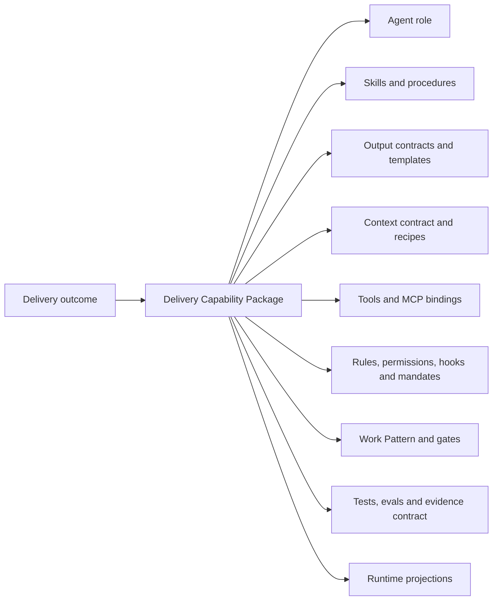
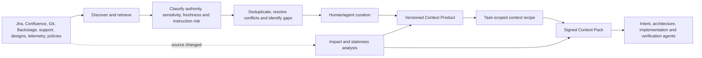
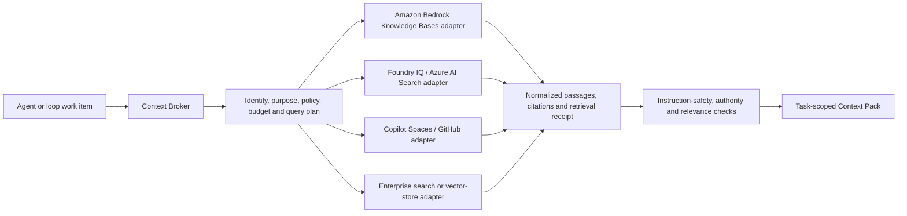
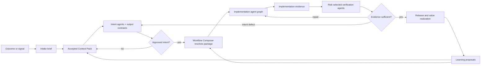

# Context, Capability Authoring, and Runtime Compatibility

## 1. Product decision

The platform must not treat an agent Markdown file as the complete reusable unit. An agent is one role definition inside a larger, governed **Delivery Capability Package**.

The package is the feature unit the portal authors, tests, publishes, extends, compiles, and provisions:



This resolves four recurring ambiguities:

- An **agent** defines responsibility, delegation boundaries, tools, permissions, inputs, outputs, stop conditions, and operating instructions.
- A **skill** is an on-demand procedure with instructions and optionally scripts, references, examples, or assets.
- An **output contract** defines what a valid result must contain, how detailed it must be, and how it is verified. A Markdown template may be one rendering of that contract.
- A **Work Pattern** orchestrates agents, humans, tools, gates, failure paths, and evidence across a delivery outcome.

The canonical package lives in an internally governed Git-backed registry. Runtime-specific files are generated projections, not the system of record.

## 2. Context is a product, not a prompt attachment

The Intake Agent cannot responsibly “build context” by searching several systems and concatenating the results. That creates an untraceable prompt bundle, mixes authoritative and informal sources, and lets stale or malicious instructions enter execution.

The platform needs a **Context Fabric** that produces governed, versioned **Context Products** and task-scoped **Context Packs**.

### 2.1 Three context layers

| Layer | Purpose | Examples | Persistence |
|---|---|---|---|
| Repository operating context | Stable rules and knowledge that apply to work in a repository or path | architecture conventions, test commands, ownership, coding standards, `AGENTS.md`, `CLAUDE.md`, steering | versioned with the repository or approved base package |
| Domain Context Product | Curated reusable knowledge for a product, service, regulation, or engineering domain | product glossary, policy, canonical journeys, system map, approved ADR corpus | governed and independently versioned |
| Task Context Pack | The smallest evidence-backed assembly required for one loop work item | Jira story, affected code, selected decisions, current architecture, unresolved gaps, applicable mandates | pinned to the Trusted Change Package and refreshed by policy |

GitHub Copilot Spaces demonstrates the value of a shareable context container: a Space can include repositories, files, pull requests, issues, notes, transcripts, images, and uploads, and GitHub-hosted sources stay synchronized. The platform should adopt the **curated, shareable, evergreen context product** concept, but add authority ranking, sensitivity, instruction-safety analysis, approval, freshness policy, and requirement-to-source lineage. [GitHub Copilot Spaces](https://docs.github.com/en/copilot/concepts/context/spaces)

Codex and Claude Code already support repository-resident context, but at a different layer. Codex constructs a scoped instruction chain from `AGENTS.md` files; Claude Code loads `CLAUDE.md`, imports, path-scoped rules, and on-demand skills. These are runtime projections of approved repository context, not substitutes for an enterprise Context Fabric. [Codex `AGENTS.md`](https://learn.chatgpt.com/docs/agent-configuration/agents-md) [Claude Code memory](https://code.claude.com/docs/en/memory)

### 2.2 Context Fabric flow



### 2.3 Context Product contract

Every source included in a Context Product records:

- Source URI, provider, owner, and access scope
- Content digest, retrieved revision, observed time, and freshness policy
- Authority class: policy, approved decision, system of record, working note, signal, or inference
- Sensitivity, residency, retention, and redaction policy
- Instruction classification: data, quoted instruction, executable instruction, or prohibited content
- Applicability: organization, product, team, repository, path, environment, loop, and task type
- Conflict and precedence rules
- Citation and lineage requirements
- Retrieval mode: always-on, path-matched, task-selected, or agent-discovered
- Context/token budget and summarization policy
- Approval state and steward

A Context Pack additionally records the task objective, selected sources, excluded sources, unresolved conflicts, missing information, compilation time, expiry, and the exact recipe revision used.

### 2.4 Federated knowledge-provider model

A Context Product is a logical governed product; it does **not** imply that its documents, chunks, vectors, or embeddings are stored inside this platform. Existing knowledge bases may remain in Amazon Bedrock Knowledge Bases, Microsoft Foundry IQ/Azure AI Search, Copilot Spaces, SharePoint, an internal search service, or another approved provider.



Amazon Bedrock Knowledge Bases exposes `Retrieve` for source chunks and `RetrieveAndGenerate` for grounded generation with citations. The portal should normally use retrieval-only mode when it needs to perform its own authority, safety, and synthesis steps. AWS also documents that Bedrock guardrails apply to the query and generated response, not to retrieved references; retrieved passages therefore still require the portal's instruction-safety and data-policy controls. [Bedrock knowledge-base retrieval](https://docs.aws.amazon.com/bedrock/latest/userguide/kb-how-retrieval.html) [Bedrock query considerations](https://docs.aws.amazon.com/bedrock/latest/userguide/kb-test-retrieve.html)

Microsoft Foundry IQ provides multi-source, permission-aware knowledge bases backed by Azure AI Search, supports cited retrieval, and can be called from Foundry agents or custom applications through knowledge-base APIs. It can enforce caller identity and source permissions where configured. The portal should preserve that provider authorization rather than retrieving through a broad service identity and filtering after the fact. [Foundry IQ](https://learn.microsoft.com/en-us/azure/ai-foundry/agents/concepts/what-is-foundry-iq?preserve-view=true&view=foundry) [Azure AI Search RAG](https://learn.microsoft.com/en-us/azure/search/retrieval-augmented-generation-overview)

The provider adapter contract includes:

- Provider, tenant/account/subscription, region, endpoint, and knowledge-base logical identifier
- Authentication modes and delegated-identity support
- Search modes: keyword, vector, hybrid, semantic, or agentic retrieval
- Metadata filtering, document-level ACL behavior, and purpose/scope filters
- Retrieval-only versus provider-generated-answer capability
- Passage text, relevance/rerank signals, canonical source URI, document revision, and citation mapping
- Original-document access behavior and authorization
- Freshness/index status, ingestion lag, and remote-versus-indexed source behavior
- Query limits, token/result budget, latency, cost, throttling, and availability
- Network/private-endpoint, egress, residency, retention, logging, and audit characteristics
- Health check, test query, redaction, error normalization, and revocation behavior
- Provider version and supported feature profile

Canonical entities:

| Entity | Purpose |
|---|---|
| `KnowledgeProvider` | provider adapter type and tested capabilities |
| `KnowledgeBaseReference` | stable logical reference to an externally managed knowledge base/index/space |
| `KnowledgeBinding` | environment, identity, authorization, endpoint, and repository/team applicability |
| `RetrievalPolicy` | query mode, filters, budgets, authority, safety, citation, cache, and failure behavior |
| `ContextProduct` | curated logical composition of one or more local or remote knowledge sources |
| `ContextPack` | immutable task-time retrieval result and decision context pinned to a Trusted Change Package |

### 2.5 Storage and retrieval modes

Each knowledge source declares one of three modes:

| Mode | Behavior | Use when |
|---|---|---|
| Federated | query the provider at task time; retain references, selected passages, receipts, and the minimum evidence required for reproducibility | provider ACLs, residency, freshness, or licensing require content to remain external |
| Governed cache | retain encrypted, access-scoped excerpts for a bounded TTL, then revalidate or expire them | latency or workflow continuity requires a temporary snapshot |
| Managed mirror | ingest an approved copy into an internal index under explicit retention, deletion, and lineage controls | the organization intentionally centralizes content or needs an offline/runtime-independent index |

Federated is the default for an existing Bedrock or Azure knowledge base. The platform must not silently re-embed, copy, or persist the full corpus. The Context Pack may preserve the exact passages used for a decision when policy permits; otherwise it stores immutable citations, provider retrieval IDs, hashes, and a replay recipe, and marks later replay differences visibly.

### 2.6 Connect an existing knowledge base journey

Connecting a knowledge base occurs inside **Build Context Product**, not in an isolated settings CRUD screen:

1. The user states which decisions or agents the knowledge base should support.
2. The platform selects a Bedrock, Foundry IQ/Azure AI Search, Copilot Space, or custom provider adapter.
3. The user binds an existing knowledge base through delegated identity, workload identity, or an approved bounded service identity.
4. The portal introspects provider capabilities without copying the corpus.
5. The user defines source authority, applicability, filters, retrieval mode, freshness, citation, storage, and failure policy.
6. The portal runs representative, negative, cross-tenant, stale-source, and prompt-injection retrieval tests.
7. The user reviews returned passages, citations, access behavior, latency, cost, and gaps.
8. The platform publishes a governed `KnowledgeBaseReference`, `KnowledgeBinding`, and `RetrievalPolicy` as part of the Context Product revision.
9. Context Assembly uses the binding at task time and records a normalized retrieval receipt in the Context Pack.

Provider unavailability, denied identity, missing citations, ACL uncertainty, or stale indexing must produce an explicit degraded or blocked context state. The platform must not silently answer from model memory when a required enterprise source cannot be queried.

### 2.7 Intake and Context Assembly are separate responsibilities

| Capability | Input | Process | Output | Human decision |
|---|---|---|---|---|
| Intake Agent | signal, story, repository, incident, or blank intent | identify work identity, query likely sources, normalize references, detect missing actors and obvious ambiguity | intake brief and context request | Intent Owner confirms the problem boundary |
| Context Assembly Agent | intake brief plus approved Context Products and connectors | apply recipe, rank authority, retrieve current sources, detect conflicts/instruction risk, minimize to budget | versioned Context Pack with citations, gaps, and freshness | Intent Owner/Architect resolves material conflicts and accepts context sufficiency |

The Intake Agent therefore never silently turns search results into accepted facts. It proposes what context is needed. The Context Assembly Agent creates a traceable pack. Agents downstream consume the accepted pack and may request a controlled amendment when they discover a gap.

### 2.8 Knowledge-base construction is a first-class work pattern

**Build Context Product** is an Intent-loop work item with its own journey:

1. Define the decisions or tasks the Context Product must support.
2. Connect existing knowledge bases or raw sources through permission-scoped provider adapters, connectors, or MCP resources.
3. Sample, classify, and map source authority and sensitivity.
4. Define inclusion, exclusion, conflict, freshness, and retrieval rules.
5. Generate a representative context set and adversarial instruction-safety set.
6. Evaluate retrieval relevance, factual grounding, citation coverage, stale-source behavior, and access isolation.
7. Review and publish an immutable Context Product revision.
8. Bind it to teams, repositories, Work Patterns, or agent definitions.
9. Monitor source drift, failed retrieval, missing coverage, and downstream outcome quality.

## 3. Output contracts and templates

The portal must not bury a requirements format inside an agent prompt. The format is a reusable, versioned **Output Contract** that can be selected independently, extended for a team or repository, and tested.

An Output Contract contains:

- Artifact type and schema
- Required and conditional sections
- Detail profile: exploratory, feature, system, regulated, or custom
- Required source citations and decision identifiers
- Allowed assumptions and mandatory unresolved-question behavior
- Completeness, consistency, and traceability checks
- Human decision required for acceptance
- Rendering templates: Markdown, JSON/YAML, Jira fields, Confluence page, ADR, Figma annotation, or portal view
- Example fixtures, anti-examples, graders, and acceptance thresholds
- Compatible agent roles, loops, repositories, and runtimes

### 3.1 Requirements output contract

A default enterprise requirements contract should cover:

1. Outcome, problem, users, and value hypothesis
2. Current and target user journey
3. Behavior rules and workflow states
4. Scope, non-goals, assumptions, and dependencies
5. Requirement clauses with source lineage
6. Acceptance examples and failure behavior
7. Data, privacy, security, accessibility, performance, resilience, and operability needs
8. Architecture and integration constraints
9. UX states, responsive behavior, and prototype references where applicable
10. Proof obligations and required evidence
11. Value signals and observation window
12. Unresolved decisions, decision owner, and due point

The Requirements Agent applies a selected contract. It may draft content, identify gaps, and ask questions; it may not redefine the contract or waive required sections.

### 3.2 Architecture output contract

The architecture contract covers system context, affected boundaries, decisions and alternatives, components, interfaces, data, trust zones, quality attributes, failure modes, deployment, observability, migration, rollback, and proof direction. Its detail profile is risk-based: a local UI copy change should not produce the same artifact as a cross-domain payments integration.

### 3.3 UX output contract

The UX contract covers user/job framing, journey and service touchpoints, behavior contract, information hierarchy, critical interactions, empty/loading/error/permission states, accessibility, responsive behavior, prototype references, research assumptions, and validation evidence. It is not a request to produce a generic wireframe.

### 3.4 Correct primitive for each concern

| Need | Canonical primitive | Why |
|---|---|---|
| Persistent repository conventions | Instruction or standard | Broadly applicable context |
| Detailed procedure used when relevant | Skill | Loaded on demand and may bundle scripts/references |
| Required artifact shape | Output Contract | Independently versioned and deterministically validated |
| Specialized responsibility and authority | Agent Definition | Defines delegation, tools, context, output, and stop boundary |
| Guaranteed lifecycle action | Hook | Deterministic event-bound execution |
| Allowed or forbidden operation | Permission/Rule/Mandate | Enforcement is separate from prose compliance |
| Sequence, parallelism, gates, and recovery | Work Pattern | Coordinates the complete journey |
| External operation or live data | Tool/MCP binding | Capability does not itself grant authority |
| Acceptance of a claim | Gate and Evidence Contract | Evidence, not agent confidence, advances work |

## 4. Native agent system

The platform should ship a small set of **control-plane agents** and a broader, extensible specialist catalog. It should not hard-code a giant organization chart into the product.

### 4.1 Native control-plane agents

| Agent | Platform responsibility |
|---|---|
| Intake Agent | recognize work, normalize entry signals, and request the needed context |
| Context Assembly Agent | compile governed Context Packs and expose gaps, conflicts, and staleness |
| Intent Orchestrator | coordinate discovery, journey, requirements, architecture, proof, and approval work |
| Workflow Composer | resolve approved capabilities and repository extensions into an Execution Blueprint |
| Execution Orchestrator | dispatch bounded implementation tasks and preserve trajectory/state |
| Evidence Synthesizer | map proof to claims, detect missing/stale evidence, and prepare decisions |
| Learning Curator | propose governed updates to context, skills, tests, rules, patterns, and agents |

These agents operate the product. They are not the full delivery workforce.

### 4.2 Specialist catalog by four-loop outcome

| Loop | Example specialist agents |
|---|---|
| Intent | discovery researcher, journey mapper, UX/prototype designer, requirements analyst, backlog shaper, domain modeler, architect, API/data designer, threat modeler, proof designer |
| Implementation | planner, repository scout, implementer, refactoring agent, unit-test agent, integration agent, migration agent, documentation/catalog agent, change reviewer |
| Verification | test-data designer, test automation agent, integration/contract verifier, security verifier, performance verifier, accessibility verifier, responsive-UX verifier, resilience verifier, policy verifier |
| Value Realization | readiness agent, deployment coordinator, observability agent, adoption analyst, value analyst, incident/RCA agent, regression curator |

One AI Delivery Steward supervises these specialist lenses. The catalog does not create separate mandatory human personas.

### 4.3 Agent Definition contract

Every Agent Definition includes:

- Purpose, job boundary, selection description, and non-goals
- Supported loop work items and delegation relationships
- Input contract and required Context Pack classes
- Output Contract references
- Preloaded and discoverable skills
- Tools/MCP servers with read/write/side-effect classes
- File, network, data, model, time, cost, and environment envelope
- Persistent instructions, applicable mandates, and runtime rules
- Hook and gate participation
- Stop, escalate, ask, retry, and handoff conditions
- Evidence and trajectory emitted
- Evals, test fixtures, known failure modes, support owner, and compatibility

An “Implementation Agent” without these fields is merely a prompt persona and should not be promoted into the enterprise catalog.

## 5. Runtime-neutral authoring and native projections

The portal should be compatible with native concepts rather than force every runtime into identical behavior.

| Canonical concern | Codex | Claude Code | GitHub Copilot | Kiro | Cursor | OpenCode |
|---|---|---|---|---|---|---|
| Persistent repository context | `AGENTS.md` hierarchy | `CLAUDE.md`, imports, `.claude/rules/` | `.github/copilot-instructions.md`, path instructions, `AGENTS.md` | steering and `AGENTS.md` | Rules / `AGENTS.md` | `AGENTS.md` / configured instructions |
| On-demand procedure | `.agents/skills/*/SKILL.md` | `.claude/skills/*/SKILL.md` | `.github`, `.claude`, or `.agents` skills | `.kiro/skills/*/SKILL.md` | Skills | `.opencode`, `.claude`, or `.agents` skills |
| Specialized agent | Codex custom agent profile | `.claude/agents/*.md` | `.github/agents/*.md` | `.kiro/agents/*` | Subagents | agent Markdown or config |
| External tools/context | project/user MCP config | `.mcp.json` and scoped MCP config | repository/agent MCP configuration | workspace/user MCP config | MCP | MCP configuration |
| Deterministic lifecycle action | repository/user hooks | settings/plugin/agent/skill hooks | `.github/hooks/*.json` | Agent Hooks | Hooks | plugin/event adapter where native parity differs |
| Command authority | sandbox, approvals, rules, managed policy | permissions and allowed/disallowed tools | agent tool scope, permissions, hooks | agent permissions and tool settings | security/tool policy | per-agent pattern permissions |
| Isolated delegated work | custom subagents | subagents with isolated context/worktrees | custom agents executed as subagents | custom subagents | subagents | primary agents and subagents |

Primary sources: [Codex skills](https://learn.chatgpt.com/docs/build-skills), [Codex hooks](https://learn.chatgpt.com/docs/hooks), [Codex subagents](https://learn.chatgpt.com/docs/agent-configuration/subagents), [Codex MCP](https://learn.chatgpt.com/docs/extend/mcp), [GitHub Copilot customization](https://docs.github.com/en/copilot/reference/customization-cheat-sheet), [Claude Code feature overview](https://code.claude.com/docs/en/features-overview), [Kiro skills](https://kiro.dev/docs/skills/), [Kiro custom agents](https://kiro.dev/docs/custom-agents/), [Cursor customization](https://cursor.com/docs), [OpenCode skills](https://opencode.ai/docs/skills/), [OpenCode agents](https://opencode.ai/docs/agents/).

This table is a compatibility target, not a claim of byte-for-byte equivalence. Runtime features, file locations, loader depth, precedence, hook events, tool names, and unsupported semantics change over time. Each adapter therefore carries a tested version range and a fail-closed compatibility report.

## 6. What GSD Core contributes

[GSD Core](https://github.com/open-gsd/gsd-core) is a strong reference implementation for cross-runtime context engineering and reusable coding-agent assets. It should be used as an accelerator and compatibility fixture, not adopted as the portal's product core.

### 6.1 Patterns to adopt

| GSD pattern | Product implication |
|---|---|
| Canonical content converted by runtime-specific installers | Build a compiler/provisioner; do not hand-copy vendor folders |
| Runtime descriptors and closed adapter vocabularies | Represent supported semantics explicitly and fail closed on unknown gaps |
| Skills, agents, hooks, commands, capability manifests, versions, dependencies, and compatibility | Make a governed Delivery Capability Package the reusable unit |
| Fresh-context subagents | Keep the orchestration context lean and give each delegated task the smallest accepted Context Pack |
| Durable `STATE.md`, `CONTEXT.md`, specs, plans, and verification artifacts | Store trajectory and decisions in versioned artifacts rather than conversation memory |
| Capability locks, provenance, integrity, consent, and trust checks | Pin exact revisions and show instruction/executable surfaces before activation |
| Runtime loader-depth and file-layout tests | Maintain golden projection fixtures per supported runtime/version |
| Existing-repository onboarding | Discover repository assets, normalize them, and propose governed registration without overwriting source |

GSD's own documentation describes its context strategy as fresh-context subagents plus durable specifications and state. Its capability manifest separates feature capabilities from runtime capabilities, declares dependencies and runtime compatibility, and gives runtimes typed artifact layouts and hook surfaces. These are directly relevant architectural precedents. [GSD repository](https://github.com/open-gsd/gsd-core)

### 6.2 What not to inherit as the product boundary

- GSD's Discuss → Plan → Execute → Verify → Ship loop is a coding workflow. Our product owns Intent → Implementation → Verification → Value Realization across product, architecture, UX, code, proof, release, and business outcomes.
- GSD's `.planning` artifacts are valuable runtime state, but they are not the enterprise Trusted Change Package, evidence graph, authority model, or Context Product registry.
- Its runtime installer does not replace Backstage ownership, enterprise identity, approval, delegated authorization, context-source governance, or value realization.
- Its Markdown-first interface should remain available as a generated/source view; the portal also needs conversation, contextual canvas, decision views, and task trajectories over the same model.

### 6.3 Recommended use of GSD

1. Import the repository as a **reference provider**, not as an automatically trusted package.
2. Use representative GSD agents, skills, hooks, capability manifests, and runtime conversions as fixtures for the normalization and quarantine pipeline.
3. Compare its runtime descriptors with current official runtime documentation.
4. Reuse MIT-licensed implementation selectively only after provenance, dependency, security, maintainability, and architectural-fit review.
5. Build a compatibility test that compiles one portal Capability Package to Codex, Claude Code, Copilot, Kiro, Cursor, and OpenCode and compares native behavior—not only generated file existence.
6. Contribute generic runtime fixes upstream when possible instead of maintaining an unnecessary fork.

## 7. Capability authoring journeys

The portal needs one contextual **Create capability** journey, not separate top-level CRUD applications for agents, skills, templates, hooks, and workflows.

### 7.1 Entry

Users can enter from:

- A missing capability during Intent, Implementation, or Verification work
- **Contribute capability** in Exchange
- An existing Git repository or runtime configuration discovered by scan
- An imported package or external catalog such as `skills.sh`
- A successful ad-hoc procedure that the user asks to make reusable

The system asks first: **What delivery outcome should become repeatable?** It then recommends whether the reusable unit is an instruction, skill, output contract, agent, connector, proof pack, or complete Work Pattern.

### 7.2 Authoring flow

```mermaid
flowchart LR
    Outcome["Describe repeatable outcome"] --> Classify["Recommend capability type"]
    Classify --> Compose["Conversation + structured canvas + source"]
    Compose --> Bind["Attach context, output contract, skills, tools and controls"]
    Bind --> Simulate["Run realistic fixture in isolation"]
    Simulate --> Evaluate["Behavior, security, compatibility and output-contract evals"]
    Evaluate --> Review{"Steward review"}
    Review -->|changes| Compose
    Review -->|sandbox| Publish["Publish immutable sandbox revision"]
    Publish --> Promote["Promote with evidence"]
    Promote --> Provision["Compile and provision to repository/runtime"]
    Provision --> Observe["Drift, use, failures, cost and outcomes"]
```



Conversation explains intent and asks questions. The canvas shows composition, delegation, gates, and authority. Source exposes the canonical manifest and generated files. All three edit one definition.

### 7.3 Base, team, and repository specialization

```text
Enterprise base capability revision
  → team extension
    → repository extension and bindings
      → task parameters
        → resolved Execution Blueprint
          → runtime projections and lockfile
```

Repository extensions may add local context sources, skills, examples, test commands, tighter permissions, extra gates, or stricter output requirements. They may not weaken an enterprise mandate or silently broaden authority. The repository stores its overlay, bindings, generated projections, and lockfile. The approved base remains in the internal registry.

## 8. Compiler and provisioning contract

The compiler takes:

- Exact Capability Package revisions
- Extension lineage and repository bindings
- Selected Context Product revisions
- Target runtime and tested version
- Environment/permission/model profiles
- Organization mandates

It produces:

- Native instruction, skill, agent, MCP, hook, permission, and command files
- A compatibility report with native, degraded, emulated, unsupported, and blocked semantics
- A source map from every generated section to its canonical origin
- A lockfile containing revisions, digests, compiler version, runtime version, and policy resolution
- A preview of files and authority before pull-request creation
- Golden-test and smoke-test results

Compiler rules:

1. Never silently drop an unsupported control.
2. Guidance may not be presented as enforcement.
3. A hook emulation must declare where it runs and whether it can block.
4. A runtime projection cannot broaden the canonical tool or data envelope.
5. Secrets are references, never rendered values.
6. Generated files are changed through a repository pull request unless an explicitly authorized local experiment is selected.
7. Drift is detected in both directions: canonical changes awaiting projection and hand-edited runtime files diverging from their source map.

## 9. Context-aware four-loop orchestration



The Workflow Composer does not merely arrange agent names. It resolves the accepted intent, risk, repository, Context Pack, capability lineage, runtime support, permissions, gates, and evidence obligations into a reproducible Execution Blueprint.

## 10. Delivery sequence

### Architecture spike 1 — Context Product

Build one governed context recipe from Jira, Confluence, Backstage, and one repository. Prove authority ranking, citations, access filtering, conflict/gap reporting, staleness, and prompt-injection handling.

### Architecture spike 2 — Output Contracts

Create requirements, architecture, and UX output contracts with Markdown and structured renderings. Run completeness and traceability checks against good, incomplete, conflicting, and adversarial fixtures.

### Architecture spike 3 — Cross-runtime package

Normalize one Requirements Agent, two skills, three output contracts, one Context Product binding, one hook, one MCP binding, and one Intent Work Pattern. Compile first to Codex and Claude Code, then test GitHub Copilot and Kiro. Cursor and OpenCode follow when the compatibility model is stable.

### Architecture spike 4 — GSD compatibility

Import a bounded GSD capability set through quarantine. Compare canonical normalization, generated artifacts, runtime behavior, lock/provenance, and upgrade drift. Decide which converter or descriptor code merits selective reuse.

### Experience slice — Requirement to approved intent

The first complete portal journey should let an Intent Owner:

1. Pull a Jira story or describe an outcome.
2. Review the proposed source map and context gaps.
3. Build/accept the Context Pack.
4. Select or extend requirements, UX, and architecture output contracts.
5. Let specialist agents draft linked artifacts.
6. Resolve questions and decisions in context.
7. Review claim-to-source and claim-to-proof coverage.
8. Approve an AI-ready intent backlog.
9. Hand the approved package to the Workflow Composer.

This slice should be designed and tested before building a general catalog-management UI. It establishes the entry point, context ecosystem, reusable capability composition, human judgment, and durable output that every later loop depends on.

## 11. Acceptance tests for the product model

The design is not ready for screens until a reviewer can answer:

- Which source made this statement, who owns it, and how fresh is it?
- Is this content context, an instruction, a skill, a contract, or an enforceable rule?
- What artifact shape is the Requirements Agent obligated to produce?
- Which agent is responsible, what may it use, and when must it stop?
- Which capabilities came from the enterprise base versus team or repository extensions?
- What did the compiler change for this runtime, and what semantics were degraded or blocked?
- Which deterministic controls actually enforce the boundary?
- How will this capability be evaluated before promotion and monitored after adoption?
- How does failed proof return to the responsible intent, implementation, context, or test decision?

If the product cannot answer these questions from the active work journey, an agent catalog grid or visual workflow editor will still feel disconnected regardless of visual polish.
