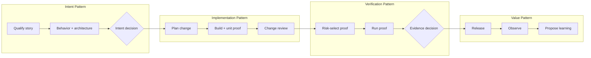

# Repository-First Work Entry and Delivery Harness Journey

## 1. Correction to the entry model

The original **Move work forward** entry was too abstract for the primary AI Delivery Steward journey. It presented product commands before establishing where the work would happen and whether the system understood that environment.

The corrected principle is:

> **Context before command; repository before implementation; ticket before task execution; harness before autonomy.**

For daily delivery work, the default sequence is:

```mermaid
flowchart LR
    Enter["Enter Work"] --> Scope["Select or infer repository/service"]
    Scope --> Readiness{"Context ready?"}
    Readiness -->|no or stale| Establish["Establish repository context"]
    Establish --> Readiness
    Readiness -->|yes| Ticket["Select Jira/other work item"]
    Ticket --> Intent["Challenge and qualify intent"]
    Intent --> Harness["Select, extend or create Delivery Harness"]
    Harness --> Preflight["Resolve task blueprint and authority"]
    Preflight --> Run["Execute four-loop journey"]
    Run --> Human["Human decisions only when planned or needed"]
    Human --> Proof["Verify, release and observe"]
    Proof --> Improve["Improve context and harness"]
```



The system may skip visible steps when context is already known. A deep link from Jira can infer the repository; a returning user can resume an active Trusted Change Package; a repository with an approved Delivery Harness can move from ticket selection to preflight in one interaction. Skipping a screen does not skip the underlying readiness or policy check.

The universal concept is **working context**. Repository is the default scope for implementation, but pure product discovery or architecture work may begin with a product, service, system, or multi-repository scope.

## 2. Product controls are not the work entry

The platform contains controls for managing Context Products, agents, skills, MCP integrations, rules, hooks, output contracts, Work Patterns, models, and policy. Those controls support delivery; they should not confront the user as the first navigation decision.

| User intent | Entry | Product behavior |
|---|---|---|
| Start or continue delivery | Work | establish scope and context, then select work and a Delivery Harness |
| Contribute or govern a reusable capability | Exchange | create/import, test, approve, publish, extend, or retire an asset |
| Govern deployed/runtime state | Estate | inspect ownership, authority, drift, reliability, cost, and outcomes |
| Configure something missing while delivering | Contextual creation from Work | create or extend the missing capability without abandoning the task |

There is no need for global Agents, Skills, MCP, Hooks, Rules, Workflows, Models, or Approvals menus. These appear in the repository context, Delivery Harness composition, capability dossier, or active decision where they matter.

## 3. Core objects introduced by this journey

### Repository Delivery Profile

The versioned statement of what the platform knows about a repository and how work may occur there. It contains:

- Repository, service/system, owner, team, and environment identity
- Repository map, languages, frameworks, build/test commands, dependency and deployment topology
- Domain, product, architecture, policy, and operational Context Product bindings
- Existing runtime instructions, agents, skills, hooks, MCP configuration, rules, and local conventions
- Enterprise base and team capability inheritance
- Runtime, model, environment, network, data, and permission constraints
- Required verification baselines and release controls
- Context readiness, gaps, exceptions, freshness, and approval state

### Workflow Fragment

A small reusable typed sequence with input/output ports, such as:

- retrieve ticket → detect ambiguity → request clarification;
- propose architecture → challenge design → human accept;
- edit code → run unit tests → repair once;
- run security scan → classify finding → block or continue.

### Work Pattern

A reusable orchestration for a meaningful loop outcome, such as **Clarify story**, **Implement bounded change**, **Verify web experience**, or **Release with observation**. A Work Pattern may compose Workflow Fragments.

### Delivery Harness

A named, repository-bound delivery system that selects and configures:

- Four-loop Work Patterns and Workflow Fragments
- Agent roles and delegation topology
- Skills, instructions, output contracts, examples, and repository patterns
- Context Products, Context Recipes, and retrieval policies
- MCP servers/tools, provider adapters, and credentials/identity bindings
- Hooks, deterministic checks, gates, rules, mandates, and human decision policy
- Runtime, model, environment, budget, fallback, and isolation profiles
- Verification strategy, test data, evidence contract, release, and observation behavior

Examples: `Payments Service · Standard Change`, `Web App · Accessibility-Critical`, or `Legacy Java · Modernization`.

### Execution Blueprint

The immutable task-time resolution of a Delivery Harness against one accepted ticket/intent, current repository revision, Context Pack, risk, runtime version, and authority envelope.

```text
Delivery Harness + ticket/intent + current Context Pack + task risk + task parameters
    → resolved Execution Blueprint
    → agent runs, decisions, evidence and change
```

The Delivery Harness is reusable configuration. The Execution Blueprint is the reproducible plan for this piece of work. The Trusted Change Package carries the resulting trajectory and evidence across the four loops.

## 4. Work landing experience

### 4.1 The first question

For a user starting new implementation work, Work asks:

> **Where are you working?**

The user can:

- Select a recent repository or service
- Search repositories/services they can access
- Paste a repository, Backstage, Jira, or pull-request URL
- Select assigned Jira work, allowing the system to infer likely repository scope
- Resume active work, where scope is already resolved
- Choose a product/system scope for pre-repository Intent work

### 4.2 Work landing layout

```text
┌────────────────────────────────────────────────────────────────────┐
│ Work                                             Search or paste…  │
│ Where are you working?                                             │
├────────────────────────────────────────────────────────────────────┤
│ Continue                                                           │
│ Payment API · ENG-4521 · waiting for architecture decision         │
│ Customer Web · ENG-4498 · verification running                     │
├────────────────────────────────────────────────────────────────────┤
│ Recent working contexts                                            │
│ Payment API        Ready · Standard Change harness                 │
│ Customer Web       Context stale · 2 affected sources              │
│ Legacy Billing     Setup incomplete · no verified test baseline    │
├────────────────────────────────────────────────────────────────────┤
│ Assigned work that can establish scope                             │
│ ENG-4521 · Payment API     ENG-4510 · Customer Web                  │
└────────────────────────────────────────────────────────────────────┘
```

This is not a dashboard of KPIs. It is a continuation and scope-resolution surface. The highest-value action is obvious from state.

### 4.3 Deep-link resolution

If the user arrives from Jira, GitHub, Backstage, an IDE, or a CLI, the portal resolves:

1. work-item identity;
2. likely repository/service scope;
3. user authority;
4. Repository Delivery Profile;
5. context freshness;
6. active or recommended Delivery Harness; and
7. whether an existing Trusted Change Package already represents this work.

The user only sees a scope choice when resolution is ambiguous or consequential.

## 5. Repository work home

After selecting a repository, the experience answers four questions in order:

1. **Does the system understand this repository well enough?**
2. **What work do you want to perform here?**
3. **How will this repository perform that work?**
4. **What is currently running or waiting for you?**

```text
┌────────────────────────────────────────────────────────────────────┐
│ Payment API · owner · runtime · current branch policy             │
├────────────────────────────────────────────────────────────────────┤
│ Context readiness                                                  │
│ READY, PARTIAL, STALE, or BLOCKED · material gaps and consequence │
│ [Establish / Review changes]                                       │
├────────────────────────────────────────────────────────────────────┤
│ Start work                                                         │
│ Search/select Jira work · paste work URL · describe work           │
├────────────────────────────────────────────────────────────────────┤
│ Delivery Harness                                                   │
│ Payments Standard Change v3.4 · compatible · 1 local extension     │
│ [Inspect] [Use] [Extend]                                           │
├────────────────────────────────────────────────────────────────────┤
│ Active work and decisions                                          │
│ One execution running · one clarification · one proof decision     │
└────────────────────────────────────────────────────────────────────┘
```

The primary action is state-dependent:

| State | Primary action |
|---|---|
| Repository has no profile | Establish repository context |
| Material context is stale or blocked | Resolve context change |
| Context ready, no work selected | Select work |
| Work selected, no suitable harness | Choose how to deliver |
| Work and harness ready | Review and start |
| Run active | Continue supervision |
| Human decision pending | Review decision |

## 6. Establish repository context

This is a guided activation journey, not a setup checklist disconnected from work.

### 6.1 Discovery

The system reads only authorized sources and proposes a Repository Delivery Profile from:

- Git tree, manifests, build/test configuration, CI, ownership, deployments, and documentation
- Backstage component/system/API relationships
- Jira project/component mappings and Confluence spaces
- Existing Bedrock, Foundry IQ/Azure AI Search, Copilot Spaces, or internal knowledge bindings
- `AGENTS.md`, `CLAUDE.md`, steering, rules, skills, agents, hooks, MCP config, and other runtime artifacts
- Enterprise and team base capabilities
- Recent pull requests, failures, incidents, vulnerabilities, and operational signals

### 6.2 Context readiness is multidimensional

Readiness is not a decorative percentage. Each dimension has status, evidence, materiality, owner, and consequence:

| Dimension | Readiness question |
|---|---|
| Identity and ownership | Is the repository mapped to the correct service/system, team, and decision owners? |
| Product/domain | Are glossary, journeys, requirements sources, policies, and value signals available? |
| Architecture | Are boundaries, dependencies, APIs, data, environments, and consequential ADRs understood? |
| Repository execution | Are build, test, lint, migration, local-run, and deployment behaviors verified? |
| Runtime customization | Are existing instructions, agents, skills, hooks, MCPs, and rules discovered and reconciled? |
| Authority and data | Are identities, secrets references, tool permissions, network, residency, and sensitive paths bounded? |
| Verification | Are deterministic checks, test data, coverage expectations, and non-functional proof baselines known? |
| Operations and value | Are release, rollback, telemetry, incidents, SLOs, adoption, and value signals connected? |

Statuses:

- **Ready** — sufficient and current for the proposed class of work.
- **Partial** — usable with explicit limitations; task preflight determines materiality.
- **Stale** — a source changed and dependent assumptions must be revalidated.
- **Blocked** — required identity, source, control, or execution knowledge is absent or untrusted.
- **Not applicable** — justified for this repository or work class.

Readiness is evaluated against a work class. A repository can be ready for documentation changes but blocked for production data migrations.

### 6.3 Reconcile discovered assets

The platform separates:

- inherited enterprise/team capabilities;
- approved repository extensions;
- unregistered local assets;
- generated runtime projections;
- conflicting or obsolete definitions; and
- external assets requiring quarantine.

The user can adopt, extend, register, quarantine, replace, or ignore-with-rationale. The system does not overwrite repository files simply because a canonical equivalent exists.

### 6.4 Accept profile

The activation output is an approved Repository Delivery Profile plus a repository pull request containing intentional bindings, extensions, projections, and lockfiles. Missing nonmaterial context remains visible with an owner; material gaps block the relevant work class.

## 7. Select and qualify work

Once repository context is sufficient, the user selects a Jira story or another work item and says, in effect, **Implement this**.

The Intent agents then compare the work item with the repository context and applicable Output Contracts. They do not assume that a populated Jira ticket is implementation-ready.

### Intent challenge behavior

Agents may raise a human contribution when:

- business behavior is ambiguous, contradictory, or untestable;
- acceptance criteria omit important negative or state-transition behavior;
- the ticket conflicts with product policy or current repository behavior;
- an affected system, owner, data class, or dependency is unclear;
- the requested architecture is internally inconsistent, unsafe, or incompatible with an accepted ADR;
- UX states, accessibility behavior, or responsive expectations are material but absent;
- proof obligations or value signals cannot be derived; or
- the required decision exceeds agent authority.

The challenge appears as a specific proposition with source evidence, consequence, options, recommendation, and decision owner. It is not a generic “need more information” chat response.

The result is an accepted task Intent Contract and task Context Pack. Only then can autonomous implementation begin.

## 8. Choose, extend, or create a Delivery Harness

### 8.1 Default behavior

The repository profile points to one or more approved Delivery Harnesses. The system recommends a harness based on work type, risk, runtime, affected paths, required proof, and current compatibility.

The user can:

- **Use** the recommended harness unchanged.
- **Tune for this task** using parameters that do not create a reusable revision.
- **Extend for this repository** through a source-controlled semantic overlay.
- **Create a harness** when no suitable pattern exists.
- **Compose from fragments** for a new work class.
- **Request a capability** when an agent, skill, integration, or control is missing.

### 8.2 Continuous configuration stack

The effective delivery behavior is always inspectable as:

```text
Enterprise mandates and base capabilities
  → team standards and extensions
    → Repository Delivery Profile
      → selected Delivery Harness revision
        → task parameters and risk-selected additions
          → run-time decisions and time-bound exceptions
```

The workbench shows what each layer contributes, which layer wins, and why. A local change cannot silently weaken a higher-level mandate or broaden authority.

### 8.3 Model configuration

Model choice is part of the harness, not a remote global settings page. Each agent may resolve a Model Profile containing provider/model, reasoning posture, region, data policy, cost/latency budget, fallback, and availability behavior.

The user can inspect or propose a task override during preflight. The system shows affected agents, cost, compatibility, data handling, and evidence implications before accepting it. Organization restrictions remain non-overridable except through a governed exception.

## 9. Orchestration Builder experience

The builder is entered from a repository and an outcome: **Customize how Payment API implements standard changes**. It does not open as a blank infinite canvas.

### 9.1 Authoring stages

1. **Outcome and boundaries** — choose the work class, entry contract, completion claim, and failure returns.
2. **Start from evidence** — select an approved base harness, Work Pattern, successful prior run, or blank governed skeleton.
3. **Responsibility map** — define agent and human responsibilities before arranging nodes.
4. **Compose flow** — add Work Patterns and Workflow Fragments; expand detail only where needed.
5. **Bind capabilities** — attach agents, skills, output contracts, context, MCP/tools, hooks, rules, environments, and models.
6. **Define autonomy** — declare planned human decisions, uncertainty thresholds, retry budgets, and takeover behavior.
7. **Define proof** — map completion claims to deterministic and agent-produced evidence.
8. **Simulate** — run representative, ambiguous, failing, adversarial, and permission-constrained tickets.
9. **Review effective behavior** — inspect runtime compatibility, authority, context, cost, and human-touchpoint forecast.
10. **Name and publish** — publish a versioned harness to the repository/team/enterprise scope with owner and evidence.

### 9.2 Nested visual grammar

The primary canvas shows high-level Work Patterns across the four loops. A user can open a pattern to see Workflow Fragments and agent/tool detail. This avoids a single unreadable graph containing every hook and skill.



Selecting **Build + unit proof**, for example, reveals its planner/implementer/test-agent responsibilities, skills, tools, hooks, permission envelope, retry loop, and outputs. The parent graph remains legible.

### 9.3 Conversation, canvas, and source

- Conversation: “After architecture analysis, require a human only when the change crosses a trust boundary.”
- Canvas: inserts a conditional decision path and shows its claim/evidence inputs.
- Source: updates the canonical manifest and repository overlay.

All three representations remain synchronized. Dragging an agent is not enough; the builder requires compatible input/output contracts, authority, context, stop behavior, and proof.

### 9.4 Inline creation and extension

If the user cannot find a suitable Requirements Agent or performance skill, the builder offers:

- use an approved base revision;
- extend it for this repository;
- import and quarantine an external asset;
- draft a new capability through conversation;
- continue without it when safe; or
- block publication until the gap is resolved.

Creating an asset opens a focused capability authoring side journey, then returns the approved or sandbox revision to the exact insertion point. It does not send the user to a separate CRUD application.

## 10. Preflight: explain autonomy before starting

Before the user says **Start**, the workbench presents a concise run contract:

- Ticket and accepted intent revision
- Repository, branch/worktree, environment, and Context Pack
- Selected Delivery Harness and task-specific differences
- Planned agent roster and why each agent is present
- Skills, Context Products, MCP/tools, hooks, rules, and Output Contracts resolved per agent
- Model, budget, retry, network, data, and file authority
- Planned human decisions and conditions that can create unplanned escalation
- Required evidence and release boundary
- Unsupported, degraded, stale, missing, or exceptional semantics

The user approves the bounded run, not a vague request for “agent access.”

## 11. Autonomous execution with meaningful human involvement

### 11.1 Human involvement classes

Every human touchpoint has a reason class:

| Class | Example | Automation posture |
|---|---|---|
| Mandatory control | regulated approval, protected release, risk acceptance | cannot be optimized away without policy change |
| Planned risk decision | architecture boundary, destructive migration, material UX behavior | may become conditional with better evidence and policy |
| Intent ambiguity | unclear behavior, conflict, missing acceptance | improve source quality, Context Product, or Output Contract |
| Agent uncertainty | confidence/novelty threshold, conflicting evidence | improve agent, skill, examples, routing, or context |
| Permission escalation | unplanned tool, path, network, secret, or write scope | improve least-privilege binding or keep denied |
| Proof failure/dispute | missing, stale, flaky, or contradictory evidence | repair implementation, test, environment, or evidence contract |
| Runtime failure | provider outage, exhausted retries, compatibility failure | improve fallback, runtime adapter, or recovery pattern |
| User intervention | human chooses to pause, steer, constrain, or take over | intentional supervision; analyze separately |

Every touchpoint records initiating agent/node, trigger, sources, uncertainty or failed predicate, requested decision, options, recommendation, authority required, response, wait time, downstream outcome, and whether the same condition recurs.

### 11.2 Decision experience

The user sees:

1. What decision is required?
2. Why can the workflow not continue safely?
3. Which sources, claims, or controls triggered it?
4. What are the viable options and consequences?
5. What does the agent recommend and how uncertain is it?
6. What will approve, reject, constrain, or request-changes do to the run?

Human decisions are nodes in the trajectory, not chat messages that disappear from the orchestration.

## 12. Agent and human-touchpoint visibility

### Before execution

The harness view shows the planned agent roster, revision, responsibility, context, tool/permission envelope, model, expected output, planned decision points, and fallback.

### During execution

The run journey shows:

- active agent and objective;
- parent/delegation relationship;
- planned versus actual path;
- context and skills used;
- tools requested/used and hook outcomes;
- artifacts and evidence produced;
- pending human contributions; and
- stopped, retried, bypassed, or failed nodes.

### After execution

The user or lead can compare planned and actual orchestration:

- Which agents actually ran and why?
- Where were humans involved?
- Which escalations were required, avoidable, repeated, or low-value?
- Which node caused waiting or rework?
- Did human input prevent a defect or merely confirm an obvious recommendation?
- Which context, skill, template, permission, agent, test, or pattern should improve?

## 13. Human Touchpoint Map and automation learning

The system overlays human involvement on the Delivery Harness rather than presenting an approval count dashboard.

```text
Intent qualification       42% of runs request clarification
  └─ 61% missing negative behavior in Jira stories
Architecture analysis      18% human decision
  └─ 84% required by trust-boundary policy
Implementation              9% permission escalation
  └─ repeated read request for generated schema path
Verification               27% evidence dispute
  └─ flaky integration environment in 73% of cases
Release                    100% human decision
  └─ mandatory protected-release control
```

The optimization goal is not “fewer humans.” It is:

- fewer avoidable interruptions;
- earlier, better-framed material decisions;
- less waiting and repeated clarification;
- more deterministic evidence;
- preserved mandatory accountability; and
- improved autonomous completion inside the approved envelope.

### Learning recommendations

| Repeated touchpoint | Likely improvement proposal |
|---|---|
| Missing story behavior | update Jira template, Requirements Output Contract, or clarification skill |
| Repeated domain question | improve Context Product or repository Context Recipe |
| Same architecture concern | add an ADR, rule, architecture skill, or conditional gate |
| Repeated safe permission approval | narrow and pre-authorize a specific tool/path binding after review |
| Frequent unsafe permission request | tighten agent instructions, tools, hook, or deny rule |
| Repeated implementation correction | improve agent, examples, plan pattern, or repository skill |
| Flaky verification decision | repair test environment, test data, grader, or evidence contract |
| Routine low-risk approval | simulate a risk-based conditional automation proposal |

The platform creates a proposed Context Product, capability, harness, or policy revision. It evaluates the candidate against historical fixtures and sandbox runs. A human promotes it. The platform never silently removes a gate because approval rates were high.

## 14. Lead and Steward review

An AI Delivery Steward sees touchpoints for the current repository and harness. A lead may see an aggregate across repositories, but the unit of analysis remains workflow improvement—not individual productivity surveillance.

Useful measures:

- autonomous completion rate by work/risk class;
- touchpoints per run by reason class;
- median wait time and rework introduced/prevented;
- percentage of escalations with sufficient evidence and correct decision owner;
- approval, rejection, reversal, and post-release defect correlation;
- context-gap and instruction/template defect recurrence;
- permission escalation and denial recurrence;
- planned versus unplanned touchpoints;
- mandatory versus automation-candidate touchpoints; and
- outcome change after a harness revision.

## 15. End-to-end primary journey

### First use of a repository

1. Steward selects the repository.
2. Portal discovers ownership, topology, context sources, existing runtime assets, tools, policy, and verification posture.
3. Steward resolves material context gaps and external knowledge bindings.
4. Portal proposes enterprise/team base capabilities and detects repository-specific assets.
5. Steward adopts, extends, quarantines, or rejects proposals.
6. Steward selects or composes a Delivery Harness.
7. Portal simulates the harness and verifies runtime projections, permissions, proof, and recovery.
8. Steward publishes the Repository Delivery Profile and Delivery Harness through a repository pull request.

### Everyday story delivery

1. Steward selects the repository or enters from Jira.
2. Portal confirms context readiness and shows any source changes.
3. Steward selects the story and asks to implement it.
4. Intent agents challenge ambiguity, architecture, UX, risk, and proof gaps.
5. Intent Owner/Architect resolves only material decisions.
6. Portal recommends the repository's Delivery Harness and task-specific additions.
7. Steward reviews agents, authority, planned human points, model, cost, and evidence, then starts.
8. Agents execute Intent completion, implementation, verification, and bounded value/release work.
9. Human decisions appear when mandated or when explicit uncertainty, conflict, proof, permission, or failure conditions fire.
10. Steward accepts proof/release posture and observes outcomes.
11. Portal proposes context and harness improvements from actual touchpoints and results.

## 16. Product acceptance criteria

The journey is coherent only when a representative user can answer, without navigating unrelated administration screens:

- Which repository or system am I working in?
- Is its context sufficient for this type of work, and what is missing?
- Which ticket or outcome am I moving?
- Which Delivery Harness will perform the work, and why?
- Which agents, skills, context, tools, hooks, rules, models, and gates are effective?
- What is inherited, repository-specific, or task-specific?
- What can proceed autonomously and what may require me?
- Which agent is running now, what has it changed, and what proof exists?
- Why was a human involved at each touchpoint?
- Which touchpoints are mandatory, valuable, avoidable, or candidates for better automation?
- What reusable context or harness improvement did this run teach us?

If these answers are available, the portal behaves as an AI delivery workbench. If they are distributed across repository, catalog, agent, workflow, run, testing, and approval screens, it will still feel like a collection of platform controls.
