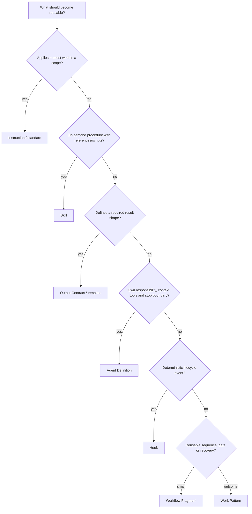

# Enterprise Capability Catalog Preparation Journey

## 1. Product decision

The enterprise catalog is not prepared by opening separate forms for agents, skills, instructions, hooks, MCP servers, rules, and workflows. It is established as a governed capability supply chain that answers:

> **What reusable delivery capabilities does the enterprise need, which ones already exist, which are safe and effective, and where can they be applied?**

The end-to-end journey is:

```mermaid
flowchart LR
    Charter["Define catalog purpose and policy"] --> Inventory["Discover internal and external assets"]
    Inventory --> Classify["Classify the correct capability type"]
    Classify --> Normalize["Normalize to canonical contracts"]
    Normalize --> Consolidate["Deduplicate and define extension families"]
    Consolidate --> Trust["Quarantine, inspect and constrain"]
    Trust --> Evaluate["Test behavior, security and compatibility"]
    Evaluate --> Curate["Curate enterprise base revisions"]
    Curate --> Publish["Publish approved catalog release"]
    Publish --> Bind["Extend and bind to teams/repositories"]
    Bind --> Observe["Observe use, touchpoints, outcomes and drift"]
    Observe --> Improve["Upgrade, replace, deprecate or revoke"]
    Improve --> Curate
```



This journey prepares the reusable foundation later consumed by Repository Delivery Profiles and Delivery Harnesses.

## 2. Catalog boundary

The **Enterprise Capability Catalog** is the governed content and lifecycle projected through the Capability Exchange. The Exchange is the user experience; Git and registry services provide source, package, indexing, and distribution infrastructure.

The catalog includes:

| Capability kind | Enterprise example |
|---|---|
| Agent Definition | Requirements Analyst, Architecture Challenger, Implementation Agent, Evidence Synthesizer |
| Skill | Requirements decomposition, Spring Boot migration, accessibility verification |
| Instruction / Standard | API conventions, documentation expectations, repository operating guidance |
| Rule / Mandate | forbidden production access, required provenance, protected release control |
| Output Contract / Template | requirements specification, architecture decision, UX behavior contract |
| Context Product / Recipe | engineering standards, product domain, architecture corpus, repository context assembly |
| MCP Server / Tool / Provider Adapter | Jira, Confluence, GitHub, Backstage, Bedrock, Foundry IQ, Sentry |
| Hook | pre-tool policy check, post-edit formatter, secret scan, stop-time evidence check |
| Test / Eval Pack | agent selection, tool trajectory, output quality, security, performance, accessibility |
| Workflow Fragment | clarify ambiguity, challenge architecture, unit-proof repair loop |
| Work Pattern | clarify story, implement bounded change, verify web experience |
| Delivery Harness Template | enterprise standard change, regulated change, incident repair |
| Model / Environment Profile | approved coding model, isolated worktree, CI verification, staging release |
| Repository Pattern | supported service skeleton, build/test/CI conventions |

The catalog does not make every prompt, file, test case, or temporary task parameter a first-class enterprise asset. An item belongs in the catalog when it is intended for governed reuse, needs independent ownership/versioning, affects authority or evidence, or has a lifecycle beyond one run.

## 3. Human responsibility

The existing three AI-SDLC actors remain sufficient:

| Actor | Catalog responsibility |
|---|---|
| AI Delivery Steward | operates catalog preparation, source onboarding, normalization, testing, curation, publication, compatibility, and lifecycle |
| Architect | accepts consequential architecture standards, integration patterns, trust boundaries, and extension contracts |
| Intent Owner | validates domain meaning, requirements/UX output contracts, intended outcomes, and value measures |

People with security, platform, QA, legal, or domain expertise may contribute evidence under one of these hats. The portal does not require separate navigation personas to represent every specialist lens.

## 4. Enterprise-catalog entry experience

### First establishment

During platform establishment, the Steward enters **Prepare enterprise catalog** after identity, source systems, runtimes, trust policy, and initial repository scope are known.

```text
Prepare the reusable capabilities for your pilot

Target: Payment API standard-change journey
Runtimes: Codex + Claude Code
Sources found: 8 repositories · 3 runtime homes · 2 approved public sources
Coverage needed: context, requirements, architecture, implementation,
                 unit proof, verification, release and learning

[Discover existing capabilities]  [Start from enterprise seed pack]
```

The user starts from a pilot outcome and coverage need, not an empty catalog grid.

### Ongoing entry

After establishment, the user enters through:

- **Exchange → Catalog coverage** to improve the enterprise foundation;
- **Contribute capability** for a specific reusable outcome;
- a missing capability inside a Delivery Harness;
- a repository discovery finding;
- an upstream update, vulnerability, incident, or compatibility alert; or
- a successful run that suggests extracting a reusable capability.

## 5. Stage 1 — Define the Catalog Charter

### Input

- Pilot use cases and repository classes
- Supported runtimes and environments
- Enterprise mandates, data classes, and risk posture
- Existing engineering standards and developer tooling
- Required four-loop outcomes

### Process

The Steward defines:

- catalog scope and deliberately unsupported areas;
- capability kinds and canonical schema versions;
- ownership and publisher requirements;
- enterprise, team, repository, and task scopes;
- promotion tiers and decision rights;
- external-source allow/deny/approval policy;
- minimum evidence by capability risk class;
- runtime support tiers;
- extension and override rules;
- retention, audit, telemetry, support, and revocation expectations; and
- pilot success and catalog quality measures.

### Output

- Versioned `CatalogCharter`
- Capability taxonomy
- Promotion and trust policy
- Runtime support matrix
- Initial coverage target

The charter prevents the catalog from becoming a miscellaneous collection of downloaded Markdown files.

## 6. Stage 2 — Discover and inventory supply

### Internal sources

- Enterprise, team, and repository Git repositories
- `AGENTS.md`, `CLAUDE.md`, steering, custom instructions, rules, skills, agents, hooks, commands, and MCP configuration
- Existing Backstage templates, TechDocs, architecture standards, and repository patterns
- CI/CD actions, scanners, test frameworks, and environment configuration
- Existing Bedrock, Foundry IQ/Azure AI Search, Copilot Spaces, and Context Products
- Successful task workflows, agent traces, and reusable artifacts

### External sources

- Approved Git repositories such as GSD Core
- `skills.sh` and compatible skill sources
- Agent Registry providers and curated marketplaces
- Vendor examples and documented runtime templates
- Later, only when needed: npm, PyPI, OCI, A2A, managed/cloud agent registries

### Discovery behavior

Discovery is metadata-first and non-executing. The platform records:

- source, publisher, revision, digest, license, and observed date;
- file/package layout and declared capability;
- scripts, binaries, dependencies, network destinations, and tool declarations;
- supported runtimes and required environment;
- apparent duplicates and variants;
- likely owner and repositories already using it;
- instruction and execution surfaces; and
- candidate risk class.

### Output

A **Candidate Inventory**. Discovery does not install, approve, expose to agents, or grant execution authority.

## 7. Stage 3 — Classify the correct reusable primitive

Many existing “agents” are actually instructions, skills, templates, checks, or workflow fragments. Normalization begins by deciding what the asset really is.



Additional decisions:

- External live operation or data retrieval → MCP Tool or Provider Adapter
- Non-bypassable organizational restriction → Mandate
- Task transition condition → Gate
- Scenarios, fixtures, graders, thresholds → Test/Eval Pack
- Runtime/model/sandbox configuration → Model or Environment Profile
- Curated, governed knowledge → Context Product

### Split and combine rules

- Split one oversized agent when independent skills, output contracts, tools, or controls need separate ownership or reuse.
- Combine duplicate prompts when they express the same responsibility and differ only by repository bindings.
- Preserve a specialized agent when its tool boundary, context, model, stop conditions, or evaluation genuinely differ.
- Do not convert deterministic policy into agent prose.
- Do not embed a large knowledge corpus inside instructions or an agent definition.

### Output

A **Classification Decision** for each candidate, including split/merge mapping and rationale.

## 8. Stage 4 — Normalize canonical contracts

The portal parses vendor-specific files and creates one or more draft canonical revisions without discarding the original source.

Every normalized revision receives:

- Stable enterprise URN, kind, name, description, semantic tags, and owner
- Publisher, source, license, revision, digest, and provenance
- Purpose, supported outcomes, scope, and non-goals
- Input/output and context contracts
- Dependencies and compatible capability versions
- Runtime/environment compatibility and unsupported semantics
- Tools, data, permissions, side effects, credentials, and network behavior
- Instructions, scripts, references, assets, templates, and generated projections
- Stop, failure, escalation, fallback, and recovery behavior
- Test/eval requirement and evidence links
- Support tier, lifecycle, deprecation, and revocation metadata

The original file remains visible beside the normalized semantic view and proposed transformation. A human accepts splitting, merging, semantic interpretation, or unsupported-field handling.

## 9. Stage 5 — Consolidate and create extension families

The system clusters candidates by semantic capability, not only filename or embedding similarity.

The curation view compares:

- responsibility and intended outcome;
- input/output contracts;
- instructions and output templates;
- skills and tools;
- authority, data, network, and side effects;
- runtime support;
- test evidence and known failures;
- actual repository adoption; and
- owner/support status.

The Steward decides:

- choose one enterprise base;
- merge useful behavior into a new base;
- keep distinct capabilities because their contracts differ;
- create a team or technology extension;
- preserve a repository-only variant;
- deprecate or reject duplicates; or
- defer because evidence is insufficient.

```text
Enterprise base revision
  → domain/team extension
    → technology/repository extension and bindings
      → task parameters
```

The base declares intentional extension points. Extensions store semantic differences, not full copies, and cannot weaken mandates or broaden authority without approval.

### Output

- Capability families
- Base/extension lineage
- Duplicate disposition record
- Consumer and migration map

## 10. Stage 6 — Quarantine and trust review

All newly imported external assets and untrusted internal assets enter quarantine. Internal origin is evidence of custody, not proof of safety.

### Static and structural inspection

- Schema, packaging, source, signature, digest, license, and ownership
- Nested instructions, imports, references, scripts, hooks, binaries, and dependencies
- Secrets and credentials
- Obfuscation, unsafe commands, destructive behavior, bypass instructions, and exfiltration paths
- MCP endpoints, tool schemas, side-effect claims, and network destinations
- Dependency vulnerabilities and SBOM where applicable
- Conflicting or scope-escalating instructions
- Runtime loader and precedence behavior

### Trust classes

| Class | Example | Required lane |
|---|---|---|
| Guidance-only | concise instruction with no scripts or tools | instruction scope/conflict review plus adherence tests |
| Content-bearing | template, references, examples, Context Recipe | provenance, sensitivity, injection and output-contract review |
| Executable | skill script, hook, custom tool, package | static analysis, SBOM, sandbox, command/network/file tests |
| Connected | MCP server, remote knowledge provider, remote agent | identity, authorization, data, egress, side effects, revocation and audit tests |
| Orchestrating | agent, Work Pattern, Delivery Harness | delegated authority, trajectory, failure, human decision and evidence tests |

### Output

- Reject
- Remediate
- Sandbox-only
- Constrained approval
- Team approval
- Enterprise approval candidate

Nothing in quarantine is available to ordinary Delivery Harness resolution.

## 11. Stage 7 — Test and evaluate by capability kind

Tests are based on capability semantics, not one generic “agent score.”

| Capability | Required evaluation examples |
|---|---|
| Instruction / Standard | scope selection, conflicts, adherence, ambiguity, context cost, non-interference |
| Skill | trigger precision/recall, procedure correctness, output quality, script behavior, missing dependency, malicious input |
| Output Contract | completeness, schema, traceability, conditional sections, good/poor/adversarial fixtures |
| Agent | selection, input sufficiency, context use, tool trajectory, permissions, output contract, stop/escalation, recovery |
| Context Product / Recipe | relevance, grounding, citation, ACL isolation, freshness, conflict, prompt injection, provider failure |
| MCP Server / Tool | schema, auth, least privilege, read/write distinction, side effects, rate/timeout, revocation, audit |
| Hook | event matching, deterministic behavior, exit codes, blocking semantics, timeout, concurrency, failure mode |
| Rule / Mandate | exact match, false allow/deny, precedence, bypass resistance, exception behavior |
| Workflow Fragment / Work Pattern | path coverage, inputs/outputs, retries, compensation, failure return, decision owner, evidence continuity |
| Delivery Harness Template | representative end-to-end journeys, runtime projections, authority, human-touchpoint forecast, recovery, value learning |
| Model / Environment Profile | availability, region/data policy, budget, fallback, sandbox and secret behavior |

Evaluation cohorts include:

- normal expected cases;
- ambiguous/incomplete input;
- negative and boundary cases;
- conflicting context;
- prompt/instruction injection;
- permission denial and missing credential;
- unavailable dependency/provider;
- timeout, retry exhaustion, and cancellation;
- runtime-version incompatibility; and
- historical defects and incidents.

### Output

An immutable **Capability Evaluation Dossier** with fixtures, results, limitations, supported runtime range, effective restrictions, approver, and expiry/retest policy.

## 12. Stage 8 — Curate the enterprise seed catalog

The first release should be small but complete enough to support one four-loop repository journey.

### Minimum enterprise seed family

#### Context and Intent

- Context Assembly Agent and repository Context Recipe
- Requirements Agent, requirement skill, and Requirements Output Contract
- UX/behavior and architecture Output Contracts
- Architecture Agent/Challenger
- Jira, Confluence, Backstage, Git, and selected knowledge-provider bindings

#### Implementation

- Workflow Composer / Execution Orchestrator
- Repository scout/planner
- Implementation Agent
- Unit-test skill/agent and repository build/test bindings
- Change review agent/skill

#### Verification

- Evidence Synthesizer
- Integration/contract verification
- Security and one risk-relevant non-functional verifier
- Test-data and evidence packs

#### Value and learning

- Readiness/release pattern
- Observability/value bindings
- Learning Curator

#### Controls and runtime

- Enterprise instructions and non-bypassable mandates
- Baseline hooks and permission profiles
- Model and environment profiles
- One standard four-loop Work Pattern and Delivery Harness Template
- Runtime compiler support and golden fixtures for the two pilot runtimes

This is a coherent seed pack, not a demand to create hundreds of specialist agents before a pilot.

### Coverage review

Coverage is visualized across meaningful dimensions:

- four-loop outcome and work type;
- repository language/technology;
- runtime and tested version;
- risk/data/environment class;
- capability maturity and evidence freshness;
- owner/support tier; and
- pilot repository demand.

An empty cell represents a delivery limitation or backlog item. It does not automatically justify another agent; the missing primitive may be a skill, rule, hook, connector, test pack, or output contract.

## 13. Stage 9 — Promotion and catalog release

### Lifecycle

```text
Discovered
→ Quarantined
→ Draft normalized
→ Evaluating
→ Sandbox approved
→ Team approved
→ Enterprise approved
→ Restricted / Deprecated / Revoked
→ Retired
```

### Promotion decision

The Steward sees one dossier containing:

- purpose and classification;
- source/provenance/license;
- semantic and source diff;
- ownership/support;
- permissions, tools, data, execution and egress;
- dependencies and transitive risk;
- runtime compatibility and projection preview;
- evaluation evidence and known limitations;
- base/extension lineage;
- proposed consumer scope;
- monitoring, expiry, revocation, and migration plan; and
- exact consequences of approve, constrain, reject, or request changes.

Approval publishes an immutable revision into approved internal supply and updates the Exchange projection. Publishing never grants a repository or agent permission to use it; authorization occurs during repository binding and Execution Blueprint resolution.

### Catalog release

The enterprise may publish a tested catalog release or compatibility baseline, for example:

```text
Enterprise Delivery Catalog 2026.08
- canonical schema: 1.0
- supported runtimes: Codex 0.x, Claude Code 2.x
- seed capability family: 42 revisions
- standard harness template: 1
- restricted capabilities: 3
- known coverage gaps: performance testing, mobile UX verification
```

Repositories pin exact capability revisions or an approved catalog baseline plus explicit overrides. They do not float to the latest upstream revision.

## 14. Stage 10 — Extend and bind to repositories

When a repository is activated:

1. The portal resolves applicable enterprise and team base capabilities.
2. It discovers repository-local assets and conventions.
3. It proposes reuse, extension, conflict resolution, or replacement.
4. The Steward creates repository overlays and bindings.
5. Runtime compilers generate native files and a lockfile.
6. A repository pull request exposes semantic and generated diffs.
7. Repository tests verify the effective Delivery Harness.
8. The Repository Delivery Profile records the accepted catalog lineage.

Repository-specific requirements, examples, commands, tests, context, and tighter permissions remain with the repository. Improvements with wider value can be proposed back to the team or enterprise base through a separate promotion decision.

## 15. Stage 11 — Operate, learn, and maintain

The catalog accumulates evidence from real work:

- selection, use, success, failure, latency, cost, and token/resource behavior;
- runtime/version compatibility and projection drift;
- tool denials, exceptions, incidents, vulnerabilities, and revocations;
- human touchpoints by reason and workflow node;
- output-contract completeness and downstream rework;
- repository adoption and abandoned/duplicated extensions;
- verification and post-release defect correlation; and
- business/value outcomes where attribution is appropriate.

### Learning routes

- Repeated clarification → instruction, Context Product, output contract, or requirements skill proposal
- Repeated agent correction → agent, skill, example, model, or routing proposal
- Repeated permission request → binding, policy, hook, or agent-tool-scope proposal
- Verification dispute → test data, grader, test pack, environment, or evidence-contract proposal
- Runtime drift → adapter/compiler update and consumer migration
- Poor reuse → taxonomy, search, classification, documentation, or base-family correction
- Incident/vulnerability → constrain, revoke, replace, and blast-radius workflow

No observation silently changes an approved capability. It creates a candidate revision, reruns the required evaluation lane, and follows promotion.

## 16. Catalog-preparation workspace

The experience is one decision-oriented workspace, not a multi-module administration suite.

```text
┌──────────────────────────────────────────────────────────────────────┐
│ Prepare enterprise catalog · Pilot: Payment API · Draft release 4 │
├─────────────────────┬────────────────────────────────────────────────┤
│ Coverage map        │ Current curation decision                    │
│ Context      6/7    │ 12 Requirements-agent variants detected      │
│ Intent       8/9    │                                              │
│ Implement    9/10   │ Suggested: enterprise base + 3 extensions    │
│ Verify       5/8    │ Source diff · contracts · authority · usage   │
│ Value        3/6    │ Evidence · runtime compatibility · consumers │
│                     │                                              │
│ Intake queue        │ [Merge] [Keep distinct] [Extend] [Reject]    │
│ 18 quarantined      │                                              │
│ 7 need owners       │ Evaluation gaps and downstream consequence   │
└─────────────────────┴────────────────────────────────────────────────┘
```

Primary focus modes:

- **Coverage** — what the pilot/enterprise can and cannot perform
- **Inventory** — discovered candidates grouped into semantic families
- **Curation decision** — classify, split, merge, choose base, or extend
- **Trust and evaluation** — evidence and remediation for one revision/family
- **Release** — exact baseline, gaps, consumers, and rollout decision

These are stages and lenses over one catalog-preparation journey, not permanent top-level menus.

## 17. Key failure and recovery behavior

| Failure | Product response |
|---|---|
| Asset has no owner | block enterprise promotion; allow assignment or repository-only classification |
| License/provenance unclear | remain quarantined; request evidence or reject |
| Malicious/unsafe instruction | reject or remediate in internal fork with explicit divergence |
| Script/tool requests broad authority | constrain sandbox/tool envelope or reject |
| Duplicate agents disagree | expose contract/authority differences and require curation decision |
| Runtime projection drops a control | fail compatibility closed; do not publish for that runtime |
| Evaluation is flaky | mark evidence disputed; repair cohort/grader before promotion |
| Upstream releases new version | create a new candidate; never update approved revision automatically |
| Approved asset becomes vulnerable | restrict/revoke, identify consumers, provide replacement/migration |
| Repository edits generated projection | detect drift; reconcile source, overlay, or generated file explicitly |
| Base update breaks extension | keep pinned version active; open impact/migration workflow |

## 18. Initial implementation slices

### Slice A — Catalog Charter and Candidate Inventory

- Define canonical kinds and minimum metadata
- Connect internal Git and one external Git/skills source
- Discover Markdown/config assets without execution
- Produce semantic clusters and ownership gaps

### Slice B — Normalize and curate one capability family

- Requirements Agent variants
- Requirements skill
- Requirements Output Contract
- Enterprise base plus one repository extension

### Slice C — Trust and evaluation pipeline

- Guidance-only skill lane
- Executable hook lane
- Connected MCP lane
- Orchestrating agent/Work Pattern lane

### Slice D — Seed catalog release

- Minimum four-loop seed family
- Catalog coverage map
- Promotion dossier and immutable revisions
- Codex and Claude Code compatibility baseline

### Slice E — Repository consumption and learning

- Bind seed catalog to one Repository Delivery Profile
- Create one Delivery Harness
- Execute representative ticket
- Capture human touchpoints and outcomes
- Propose one catalog improvement and one controlled upgrade

## 19. Acceptance criteria

The enterprise catalog is ready for its pilot only when users can answer:

- What delivery outcomes does the catalog support and where are the gaps?
- Where did every capability come from, who owns it, and what exact revision is approved?
- Why is this item an agent rather than a skill, instruction, contract, hook, or Work Pattern?
- Which base and extension family does it belong to?
- What tools, data, code, network, credentials, and side effects can it reach?
- Which evaluation proves expected and prohibited behavior?
- Which runtimes and versions preserve its semantics?
- Which capabilities are sandbox-only, constrained, deprecated, or revoked?
- Which repositories consume each revision and how would a change affect them?
- How do real runs and human touchpoints create governed improvement proposals?

If the platform can only show a searchable grid of agent and skill cards, the enterprise catalog has not been prepared. It has merely indexed files.
