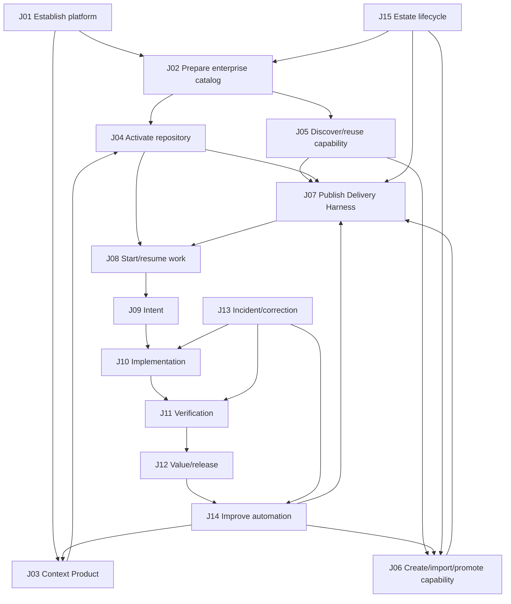

# Master User Journey Inventory

## 1. Counting rule

The product has **15 primary user journeys**.

A primary journey has:

- a recognizable user goal and entry trigger;
- a meaningful beginning and completion state;
- one accountable human actor;
- a durable output, decision, or changed platform state; and
- value even when considered independently of a particular screen.

The count does not treat every asset kind, workflow stage, approval dialog, connector, test type, or CRUD action as a separate journey. Those are subjourneys or interaction patterns reused across the 16 journeys.

## 2. Journey families

| Family | Primary journeys | Purpose |
|---|---:|---|
| Establish the foundation | 4 | make the enterprise, knowledge, and repository ready |
| Prepare reusable delivery capabilities | 3 | discover, create, govern, and compose reusable assets |
| Deliver trusted change | 5 | move a ticket/outcome through the four AI-SDLC loops |
| Intervene and improve | 2 | handle incidents and improve automation; human decisions are a shared workflow across all journeys |
| Govern the estate | 1 | manage the live enterprise capability/runtime estate |
| **Total** | **15** | |

## 3. The 15 primary journeys

### Family A — Establish the foundation

| ID | Journey | Primary actor | Entry | Completion / durable output |
|---|---|---|---|---|
| J01 | Establish the AI-SDLC platform | AI Delivery Steward | no approved Platform Blueprint or material platform change | approved Platform Blueprint and readiness dossier |
| J02 | Prepare the enterprise capability catalog | AI Delivery Steward | pilot coverage need, catalog gap, or catalog re-baseline | approved catalog release with base families, evidence, compatibility, and gaps |
| J03 | Build or connect a Context Product | Intent Owner / Steward | missing domain/repository knowledge or existing external knowledge base | approved Context Product, provider bindings, Context Recipes, and retrieval policy |
| J04 | Activate a repository | AI Delivery Steward | first repository use or material repository change | accepted Repository Delivery Profile with context readiness and runtime bindings |

### Family B — Prepare reusable delivery capabilities

| ID | Journey | Primary actor | Entry | Completion / durable output |
|---|---|---|---|---|
| J05 | Discover, compare, and reuse a capability | AI Delivery Steward | missing capability in repository/harness/work | selected approved revision or documented reuse-versus-create decision |
| J06 | Create, import, test, and promote a capability | AI Delivery Steward | contribution, external source, local asset, or successful ad-hoc procedure | immutable approved/restricted capability revision and evaluation dossier |
| J07 | Compose, test, and publish a Delivery Harness | AI Delivery Steward | repository work class lacks a suitable harness or needs an extension | named Delivery Harness revision, simulation evidence, runtime projections, and lock |

### Family C — Deliver trusted change

| ID | Journey | Primary actor | Entry | Completion / durable output |
|---|---|---|---|---|
| J08 | Start or resume repository work | AI Delivery Steward | repository selection, Jira assignment/deep link, active package, or new outcome | selected working context, work item, harness, and opened/resumed Trusted Change Package |
| J09 | Qualify and approve Intent | Intent Owner + Architect | selected work item or unresolved quality demand | accepted Intent Contract, AI-ready backlog, architecture/UX decisions, Context Pack, proof direction |
| J10 | Implement a bounded change | AI Delivery Steward | accepted Intent Contract and Execution Blueprint | Candidate Change Package with code, unit proof, trajectory, and receipts |
| J11 | Verify fitness and evidence | AI Delivery Steward | Candidate Change Package | Verification Dossier, claim-to-evidence coverage, repair route, and readiness decision |
| J12 | Release, realize value, and close/continue | AI Delivery Steward + Intent Owner | verified change and authorized release scope | release record, outcome observations, value decision, and learning proposals |

### Family D — Intervene and improve

| ID | Journey | Primary actor | Entry | Completion / durable output |
|---|---|---|---|---|
| J13 | Respond to an incident or corrective signal | AI Delivery Steward | incident, regression, vulnerability, failed release, support signal, or monitoring anomaly | contained/corrected change, RCA evidence, regression assets, and linked Trusted Change Package |
| J14 | Review touchpoints and improve context/harness automation | AI Delivery Steward | repeated human involvement, waiting, rework, or low autonomous completion | evaluated proposal for Context Product, capability, Delivery Harness, or policy revision |

### Family E — Govern the estate

| ID | Journey | Primary actor | Entry | Completion / durable output |
|---|---|---|---|---|
| J15 | Govern capability and runtime estate lifecycle | AI Delivery Steward | ownership gap, excessive authority, drift, vulnerability, cost, failure, deprecation, or upgrade | restrict, recertify, migrate, replace, revoke, deprecate, retire, or assign-owner action |

## 4. Journey dependency map



The arrows express common dependencies, not required navigation. A Jira deep link can enter J08 directly because J01–J07 have already produced reusable platform state.

## 5. What is not counted as another primary journey

These are reusable subjourneys embedded in one or more primary journeys:

- Authenticate or reauthorize a connector
- Connect Bedrock, Foundry IQ/Azure AI Search, Jira, Confluence, GitHub, or Backstage
- Select a model or environment profile
- Create a branch/worktree
- Compile runtime configuration
- Review a manifest or generated-file diff
- Run a test, scan, hook, evaluation, or simulation
- Approve, reject, constrain, request changes, defer, or waive with expiry
- Create or update a pull request
- Provision a skill, agent, MCP, or hook into a repository
- Resolve a source conflict or stale Context Pack
- Retry, pause, resume, cancel, compensate, or roll back
- View an agent trajectory, tool receipt, or evidence item
- Assign ownership or support tier

These interactions need rigorous contracts, but promoting each into navigation would reproduce the fragmented portal the product is intended to avoid.

## 6. Surface ownership

| Surface | Journeys primarily hosted |
|---|---|
| Platform establishment workspace | J01, initial J02 and J03 |
| Work and Repository Work Home | J04, J08 and entry to J07 |
| Capability Workbench | J09–J15 |
| Exchange | J02, J05, J06 and reusable output from J15 |
| Estate | J01 maintenance and J15 |

J07 begins contextually from a repository or missing capability and can draw from Exchange without becoming a global Workflow Builder destination.

Human approval, exception, takeover, and request-for-contribution behavior is a shared workflow rendered wherever a blocked decision occurs. It is not a global Approvals application, although Work may aggregate decisions requiring the current user's attention.

## 7. Journey variants, not new journeys

### J03 variants

- Build a new internal Context Product
- Connect an existing Bedrock Knowledge Base
- Connect Foundry IQ/Azure AI Search
- Connect Copilot Spaces or an internal provider
- Update a stale or incomplete Context Product

### J06 variants

- Create from conversation
- Import from Git or `skills.sh`
- Normalize a repository-local agent or skill
- Extract from a successful run
- Extend an enterprise/team base
- Remediate and repromote a restricted capability

### J08 variants

- Select repository, then ticket
- Enter from Jira and infer repository
- Enter from GitHub/Backstage/IDE/CLI
- Describe blank work in an established repository
- Resume an active Trusted Change Package
- Begin product/system-scoped Intent work before repository selection

### J09 variants

- Requirements clarification
- User journey and UX behavior design
- Architecture and integration design
- Backlog preparation
- Proof and value-signal design

### J10–J11 variants

- Feature implementation
- Refactoring or modernization
- Migration
- Documentation/catalog change
- Security remediation
- Unit, integration, contract, UI, accessibility, security, performance, resilience, or policy verification

### J13 variants

- Production incident
- Failed release/regression
- Vulnerability or policy finding
- Support escalation
- CI/test failure with broader learning value

## 8. Journey completion versus loop completion

The four loops create five daily-delivery journeys rather than one giant journey:

- J08 establishes the working object and selects how work will be delivered.
- J09 accepts intent.
- J10 produces a bounded candidate change.
- J11 produces evidence and readiness.
- J12 releases, observes, and realizes value.

Together they form the main end-to-end story-delivery journey. They remain separately countable because each has a distinct accountable decision, durable output, failure return, and potential pause measured in hours or days.

## 9. Release interpretation

The total product map contains 15 primary journeys. This does not mean building 15 independent applications or 15 first-release navigation items.

For the first coherent pilot, the experience must prove the connected backbone:

```text
J01 Platform foundation
→ J02 seed catalog
→ J03 context
→ J04 repository activation
→ J07 Delivery Harness
→ J08 start work
→ J09 Intent
→ J10 Implementation
→ J11 Verification
→ J12 Value/release
```

J05 and J06 must exist at least as contextual paths when the harness encounters a catalog gap. The shared human-decision workflow is mandatory across the backbone. J13–J15 can deepen after the first backbone works, although basic incident, learning, revocation, and ownership behavior cannot be absent from the architecture.

## 10. Success test for the inventory

The count is stable when:

- adding a new asset type does not automatically add a journey;
- adding a new runtime or connector creates a variant/adapter, not another journey;
- the four loops remain causally connected through one Trusted Change Package;
- first-time establishment and everyday delivery are distinguishable;
- consumer, contributor, and governor goals are all represented;
- context, repository, capability, human decision, learning, and estate lifecycles are covered; and
- no journey exists solely to justify a navigation item or CRUD screen.
